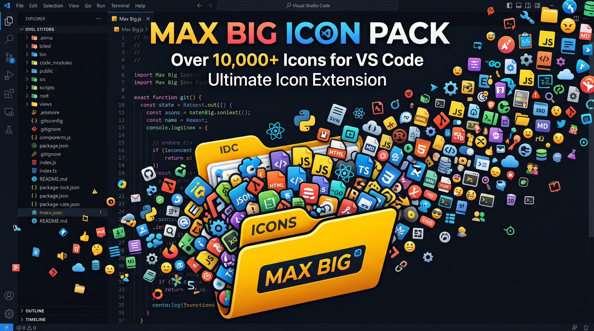

<!-- markdownlint-disable -->

<p align="center">
  
</p>

<h1 align="center">🎨 Max Big Icon Pack</h1>

<p align="center"><b>O Maior pacote de ícones definitivo e de alta performance para o Visual Studio Code</b></p>

<p align="center">
  
  
  
</p>

<br />

O **Max Big Icon Pack** é o tema de ícones mais completo e visualmente deslumbrante para o Visual Studio Code. Ele une a elegância minimalista do consagrado *Material Icon Theme* a uma curadoria monumental de **mais de 12.000 ícones de desenvolvimento** extraídos dos **100 melhores pacotes de ícones da KDE Store**.

Projetado especificamente para desenvolvedores modernos, o **Max Big Icon Pack** traz reconhecimento e suporte estético imediato a linguagens de programação, frameworks e estruturas de pastas complexas do ecossistema de desenvolvimento de software moderno.

---

👉 **[Clique aqui para ver a Lista Completa de Ícones Suportados (Tabela de Mapeamento)](SUPPORTED_ICONS.md)**

---

## 🔥 Por que escolher o Max Big Icon Pack?

* 💎 **Biblioteca Gigante (+12.000 ícones)**: Identificação precisa de quase qualquer tecnologia, extensão de arquivo ou framework que você utilizar.
* ⚡ **Performance Impecável**: Passou por uma limpeza cirúrgica de **8.605 ícones inúteis** de sistema operacional (como status de bateria, bluetooth, wifi, etc.) para garantir um carregamento ultrarrápido do VS Code sem pesar na sua máquina.
* 📂 **Mapeamento Avançado de Pastas**: Suporte visual nativo para diretórios modernos e específicos de arquiteturas web (incluindo pastas como `Http`, `stubs`, `Ai`, `workflows`, `whatsapp`, `factories`, `Popovers`, `.adonisjs`, `Inertia`, entre dezenas de outras).
* 🎛️ **Customização Total**: Controle cores, saturação, opacidade e crie associações personalizadas com facilidade.
* 📚 **[Tabela Completa de Ícones](SUPPORTED_ICONS.md)**: Uma lista pesquisável e com visualização em tempo real de todas as extensões e pastas cobertas pela extensão.

---

## 🛠️ Instalação Rápida

Se você já possui o arquivo `.vsix` gerado, instale via terminal com o comando:

```bash
code --install-extension max-big-icon-pack-1.2.55.vsix
```

### Como Ativar
1. Abra a Paleta de Comandos (`Ctrl+Shift+P` no Windows/Linux ou `Cmd+Shift+P` no macOS).
2. Digite **`Preferences: File Icon Theme`**.
3. Selecione **`Material Icon Theme`** (ou **`Max Big Icon Pack`**) na lista.

---

## ⚙️ Customização no `settings.json`

Deixe o pacote de ícones com a sua cara adicionando estas configurações no seu arquivo de configurações do VS Code:

### 1. Alterar a cor das pastas e arquivos padrão
```json
"material-icon-theme.folders.color": "#4fc3f7",
"material-icon-theme.files.color": "#81c784"
```

### 2. Mudar a opacidade e saturação dos ícones
```json
"material-icon-theme.opacity": 0.9,
"material-icon-theme.saturation": 0.85
```

### 3. Criar associações de arquivos personalizadas
```json
"material-icon-theme.files.associations": {
  "*.sample": "typescript",
  "**.config.json": "json"
}
```

---

## 📚 Fontes e Pacotes de Ícones Utilizados

Para criar a biblioteca visual mais rica possível para desenvolvedores, reunimos elementos gráficos de fontes consagradas e dos **100 maiores pacotes do KDE Store**, incluindo:

* 🌐 **Fontes Primárias**:
  * [Material Design Icons](https://pictogrammers.com/library/mdi/)
  * [Material Symbols (Google)](https://fonts.google.com/icons)

* 🎨 **Top Pacotes de Ícones da KDE Store / Linux Integrados**:
  * **Papirus Icon Theme** (Altamente reconhecido pela clareza e diversidade)
  * **Breeze** (O padrão do KDE Plasma, limpo e profissional)
  * **BeautyLine** (Colorido e moderno com gradientes vibrantes)
  * **Candy Icons** (Estética neon/synthwave ultra moderna)
  * **Zafiro Icons** (Minimalismo com toque de cores pastéis)
  * **Tela Icon Theme** (Design moderno e flat com cantos arredondados)
  * **Kora** (Visual elegante com ótimos contrastes)
  * Entre dezenas de outros pacotes do KDE Store selecionados para garantir ícones detalhados para cada extensão de código.

---

## 🤝 Contribuidores

Agradecemos imensamente a todos que tornaram o projeto possível!

[](https://github.com/material-extensions/vscode-material-icon-theme/graphs/contributors)

*Desenvolvido com carinho para a comunidade por **Johnattas Santana**.*
