<!-- markdownlint-disable -->
# 📚 Ícones de Arquivos (0–9 e A–M) — Max Big Icon Pack

Parte 2 de 3 · [Ícones de Pastas](SUPPORTED_ICONS_FOLDERS.md) · [Ícones de Arquivos N–Z](SUPPORTED_ICONS_FILES_N-Z.md)

---

## 📄 Ícones de Arquivos (0–9 e A–M)

| Visualização | Nome do Ícone | Extensões / Nomes de Arquivo |
| :---: | :--- | :--- |
|  | `010editor` | `.010editor` |
|  | `09BE_EpicGamesLauncher.0` | `.09BE_EpicGamesLauncher.0` |
|  | `0ad` | `.0ad` |
|  | `0cc-famitracker` | `.0cc-famitracker` |
|  | `0xdbe` | `.0xdbe` |
|  | `1` | `.1` |
|  | `1-dark` | `.1-dark` |
|  | `10B4_steam.0` | `.10B4_steam.0` |
|  | `11ty` | `.11ty` |
|  | `11ty_dark` | `.11ty_dark` |
|  | `140-game` | `.140-game` |
|  | `1c` | `.1c` |
|  | `1CD8_rundll32.0` | `.1CD8_rundll32.0` |
|  | `1cedt` | `.1cedt` |
|  | `1cestart` | `.1cestart` |
|  | `1cv8` | `.1cv8` |
|  | `1cv8c` | `.1cv8c` |
|  | `1E64_notepad.0` | `.1E64_notepad.0` |
|  | `1password` | `.1password` |
|  | `2` | `.2` |
|  | `2-dark` | `.2-dark` |
|  | `2048` | `.2048` |
|  | `2048-qt` | `.2048-qt` |
|  | `2064-read-only-memories` | `.2064-read-only-memories` |
|  | `2402_msiexec.0` | `.2402_msiexec.0` |
|  | `256` | `.256` |
|  | `2905_wscript.0` | `.2905_wscript.0` |
|  | `2EF4_wordpad.0` | `.2EF4_wordpad.0` |
|  | `2gis` | `.2gis` |
|  | `3` | `.3` |
|  | `3-dark` | `.3-dark` |
|  | `360logo` | `.360logo` |
|  | `360safeforcnos` | `.360safeforcnos` |
|  | `3d` | `.stl`, `.stp`, `.step`, `.obj`, `.o`, `.ac`, `.dxf`, `.fbx`, `.mesh`, `.mqo`, `.pmd`, `.pmx`, `.skp`, `.vac`, `.vdp`, `.vox`, `.gltf`, `.glb`, `.3ds`, `.dae`, `.ply`, `.wrl`, `.usd`, `.usdz` |
|  | `3D-Coat` | `.3D-Coat` |
|  | `3dchess` | `.3dchess` |
|  | `3depict` | `.3depict` |
| 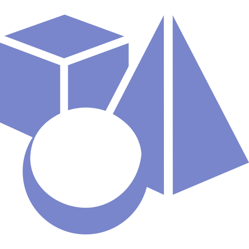 | `3dmodel` | `.3dmodel` |
|  | `3dsmax` | `.3dsmax` |
|  | `4` | `.4` |
|  | `4-dark` | `.4-dark` |
|  | `4137_winhlp32.0` | `.4137_winhlp32.0` |
| 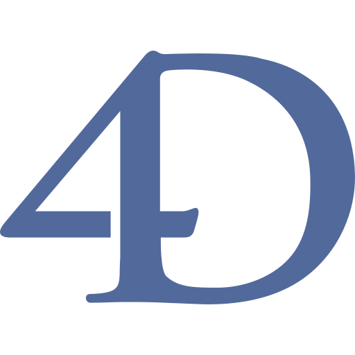 | `4d` | `.4d` |
|  | `4diac-ide` | `.4diac-ide` |
|  | `4digits` | `.4digits` |
|  | `4kslideshowmaker` | `.4kslideshowmaker` |
|  | `4kstogram` | `.4kstogram` |
|  | `4kvideodownloader` | `.4kvideodownloader` |
|  | `4kvideodownloader.png` | `.4kvideodownloader.png` |
|  | `4kvideotomp3` | `.4kvideotomp3` |
|  | `4kyoutubetomp3` | `.4kyoutubetomp3` |
|  | `4Pane` | `.4Pane` |
|  | `4PaneIcon48` | `.4PaneIcon48` |
|  | `5742_rundll32.0` | `.5742_rundll32.0` |
|  | `5961_Defunct_x86.0` | `.5961_Defunct_x86.0` |
|  | `6180-the-moon` | `.6180-the-moon` |
|  | `631F_RobloxStudioLauncherBeta.0` | `.631F_RobloxStudioLauncherBeta.0` |
|  | `63EE_sublime_text.0` | `.63EE_sublime_text.0` |
|  | `67EF_addoninstaller.0` | `.67EF_addoninstaller.0` |
|  | `7-days-to-die` | `.7-days-to-die` |
|  | `7596_iexplore.0` | `.7596_iexplore.0` |
|  | `7765_winebrowser.0` | `.7765_winebrowser.0` |
|  | `7kaa` | `.7kaa` |
|  | `7z` | `7z` |
|  | `7zip` | `.7zip` |
|  | `81F5_winebrowser.0` | `.81F5_winebrowser.0` |
|  | `8bitmmo` | `.8bitmmo` |
|  | `8tracks` | `.8tracks` |
|  | `97C1_wordpad.0` | `.97C1_wordpad.0` |
|  | `9gag` | `.9gag` |
|  | `a-boy-and-his-blob` | `.a-boy-and-his-blob` |
|  | `a-dance-of-fire-and-ice` | `.a-dance-of-fire-and-ice` |
|  | `a-short-hike` | `.a-short-hike` |
|  | `a-story-about-my-uncle` | `.a-story-about-my-uncle` |
|  | `A35F_hh.0` | `.A35F_hh.0` |
|  | `a7800` | `.a7800` |
|  | `a7xpg` | `.a7xpg` |
|  | `aaaaxy` | `.aaaaxy` |
|  | `aafm` | `.aafm` |
|  | `aarddict` | `.aarddict` |
|  | `abakus` | `.abakus` |
| 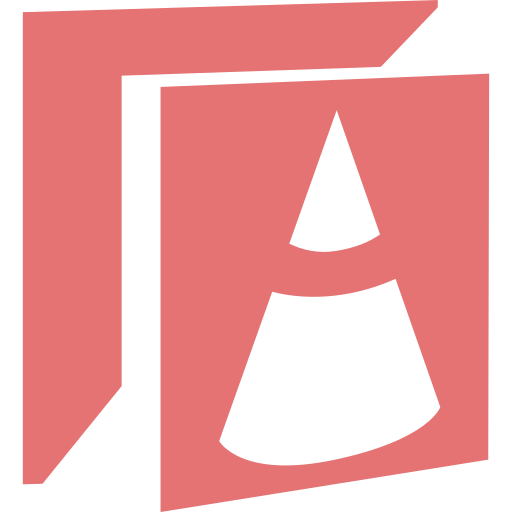 | `abap` | `.abap`, `.acds`, `.asddls` |
|  | `abbaye` | `.abbaye` |
|  | `abc` | `.abc` |
|  | `abe` | `.abe` |
| 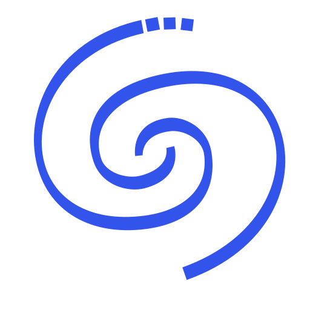 | `abell` | `.abell` |
| 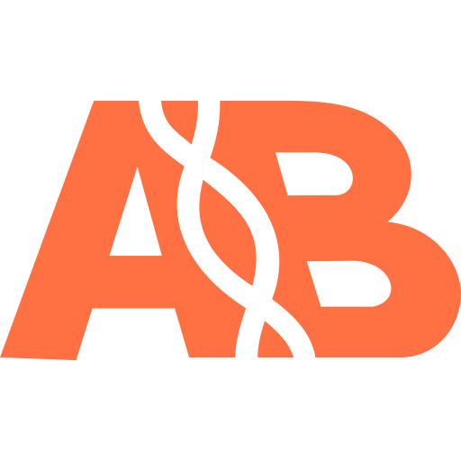 | `abif` | `.abif` |
|  | `abiword` | `.abiword` |
|  | `abiword_48` | `.abiword_48` |
|  | `ableton` | `.ableton` |
|  | `about_kde` | `.about_kde` |
|  | `abricotine` | `.abricotine` |
|  | `abrowser` | `.abrowser` |
|  | `abrt` | `.abrt` |
|  | `abrt-gui` | `.abrt-gui` |
|  | `ac-adapter` | `.ac-adapter` |
|  | `accept_signal` | `.accept_signal` |
|  | `accept_time_event` | `.accept_time_event` |
|  | `accerciser` | `.accerciser` |
|  | `access` | `.access` |
|  | `accessibility` | `.accessibility` |
|  | `accessibility_section` | `.accessibility_section` |
|  | `accessibility-directory` | `.accessibility-directory` |
|  | `accessories_text_editor` | `.accessories_text_editor` |
|  | `accessories-archiver` | `.accessories-archiver` |
|  | `accessories-calculator` | `.accessories-calculator` |
|  | `accessories-camera` | `.accessories-camera` |
|  | `accessories-character-map` | `.accessories-character-map` |
|  | `accessories-clock` | `.accessories-clock` |
|  | `accessories-dictionary` | `.accessories-dictionary` |
|  | `accessories-document-viewer` | `.accessories-document-viewer` |
|  | `accessories-ebook-reader` | `.accessories-ebook-reader` |
|  | `accessories-image-viewer` | `.accessories-image-viewer` |
|  | `accessories-media-converter` | `.accessories-media-converter` |
|  | `accessories-notes` | `.accessories-notes` |
|  | `accessories-painting` | `.accessories-painting` |
|  | `accessories-podcast` | `.accessories-podcast` |
|  | `accessories-safe` | `.accessories-safe` |
|  | `accessories-screenshot` | `.accessories-screenshot` |
|  | `accessories-system-cleaner` | `.accessories-system-cleaner` |
|  | `accessories-text-editor` | `.accessories-text-editor` |
|  | `accessories-thesaurus` | `.accessories-thesaurus` |
|  | `account` | `.account` |
|  | `account-logged-in` | `.account-logged-in` |
|  | `acestream` | `.acestream` |
|  | `Acetino2` | `.Acetino2` |
|  | `acetoneiso` | `.acetoneiso` |
|  | `acidrip` | `.acidrip` |
|  | `acre` | `.acre` |
|  | `acreloaded` | `.acreloaded` |
|  | `acrobat` | `.acrobat` |
|  | `acroread` | `.acroread` |
|  | `act` | `act` |
|  | `action-albumfolder-importdir2` | `.action-albumfolder-importdir2` |
|  | `action-rss_tag` | `.action-rss_tag` |
|  | `action-unavailable` | `.action-unavailable` |
|  | `actiona` | `.actiona` |
|  | `actionaz` | `.actionaz` |
|  | `actionscript` | `.as` |
|  | `activate-breakpoints` | `.activate-breakpoints` |
|  | `activities` | `.activities` |
|  | `activity-fork` | `.activity-fork` |
|  | `activity-log-manager` | `.activity-log-manager` |
|  | `activitywatch` | `.activitywatch` |
|  | `actor` | `.actor` |
|  | `ada` | `.ada`, `.adb`, `.ads`, `.ali` |
|  | `add` | `.add` |
|  | `add-files-to-archive` | `.add-files-to-archive` |
|  | `add-folder-to-archive` | `.add-folder-to-archive` |
|  | `add-placemark` | `.add-placemark` |
|  | `add-subtitle` | `.add-subtitle` |
|  | `address-book-new` | `.address-book-new` |
|  | `addressbook` | `.addressbook` |
|  | `addressbook-details` | `.addressbook-details` |
|  | `adjust-colors` | `.adjust-colors` |
|  | `adjustcol` | `.adjustcol` |
|  | `adjustcurves` | `.adjustcurves` |
|  | `adjusthsl` | `.adjusthsl` |
|  | `adjustlevels` | `.adjustlevels` |
| 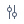 | `adjustrgb` | `.adjustrgb` |
|  | `adjustrow` | `.adjustrow` |
|  | `ADLplug` | `.ADLplug` |
|  | `administration` | `.administration` |
|  | `adobe-air` | `.adobe-air` |
|  | `adobe-flashplayer` | `.adobe-flashplayer` |
|  | `adobe-illustrator` | `.ai`, `.ait` |
|  | `adobe-illustrator_light` | `.adobe-illustrator_light` |
|  | `adobe-photoshop` | `.psd`, `.psb`, `.psdt` |
|  | `adobe-photoshop_light` | `.adobe-photoshop_light` |
|  | `adobe-reader` | `.adobe-reader` |
|  | `adobe-swc` | `.swc` |
|  | `AdobeAfterEffect` | `.AdobeAfterEffect` |
|  | `AdobeAIR` | `.AdobeAIR` |
|  | `AdobeAnimate` | `.AdobeAnimate` |
|  | `AdobeAudition` | `.AdobeAudition` |
|  | `AdobeBridge` | `.AdobeBridge` |
|  | `AdobeCharacterAnimator` | `.AdobeCharacterAnimator` |
|  | `AdobeDimension` | `.AdobeDimension` |
|  | `AdobeDreamweaver` | `.AdobeDreamweaver` |
|  | `AdobeEdgeAnimate` | `.AdobeEdgeAnimate` |
|  | `AdobeEncore` | `.AdobeEncore` |
|  | `AdobeFirework` | `.AdobeFirework` |
|  | `AdobeFlash` | `.AdobeFlash` |
|  | `AdobeFlashBuilder` | `.AdobeFlashBuilder` |
|  | `adobeflashplugin` | `.adobeflashplugin` |
|  | `AdobeFresco` | `.AdobeFresco` |
|  | `AdobeFuse` | `.AdobeFuse` |
|  | `AdobeIllustrator` | `.AdobeIllustrator` |
|  | `AdobeIncopy` | `.AdobeIncopy` |
|  | `AdobeIndesign` | `.AdobeIndesign` |
|  | `AdobeLightroom` | `.AdobeLightroom` |
|  | `AdobeLightroomClassic` | `.AdobeLightroomClassic` |
|  | `AdobeMediaEncoder` | `.AdobeMediaEncoder` |
|  | `AdobeMediaEncore` | `.AdobeMediaEncore` |
|  | `AdobeMuse` | `.AdobeMuse` |
|  | `AdobePhotoshop` | `.AdobePhotoshop` |
|  | `AdobePrelude` | `.AdobePrelude` |
|  | `AdobePremierePro` | `.AdobePremierePro` |
|  | `AdobePremiereRush` | `.AdobePremiereRush` |
|  | `AdobeReader` | `.AdobeReader` |
|  | `AdobeReader10` | `.AdobeReader10` |
|  | `AdobeReader11` | `.AdobeReader11` |
|  | `AdobeReader12` | `.AdobeReader12` |
|  | `AdobeReader8` | `.AdobeReader8` |
|  | `AdobeReader9` | `.AdobeReader9` |
|  | `AdobeSpeedgrade` | `.AdobeSpeedgrade` |
|  | `AdobeUpdate` | `.AdobeUpdate` |
|  | `AdobeXD` | `.AdobeXD` |
|  | `adonis` | `.adonisrc.json`, `ace` |
|  | `adress-book-new` | `.adress-book-new` |
|  | `advanced-rest-client` | `.advanced-rest-client` |
|  | `advancedmetronome` | `.advancedmetronome` |
|  | `AdvancedPhoto` | `.AdvancedPhoto` |
|  | `adventure_list` | `.adventure_list` |
|  | `adventure-capitalist` | `.adventure-capitalist` |
|  | `adventures-of-shuggy` | `.adventures-of-shuggy` |
|  | `advert-block` | `.advert-block` |
|  | `advpl` | `.prw`, `.prx` |
|  | `advpl-include` | `.ch` |
|  | `advpl-include.clone` | `.advpl-include.clone` |
|  | `advpl-ptm` | `.ptm` |
|  | `advpl-ptm.clone` | `.advpl-ptm.clone` |
|  | `advpl-tlpp` | `.tlpp` |
|  | `advpl-tlpp.clone` | `.advpl-tlpp.clone` |
|  | `ae` | `.ae` |
|  | `aegisub` | `.aegisub` |
|  | `aeskulap` | `.aeskulap` |
|  | `AetherP2P` | `.AetherP2P` |
| 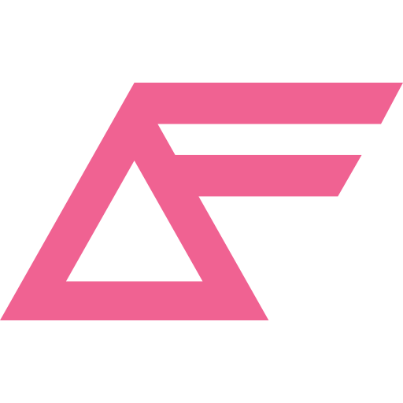 | `affectscript` | `.affectscript` |
| 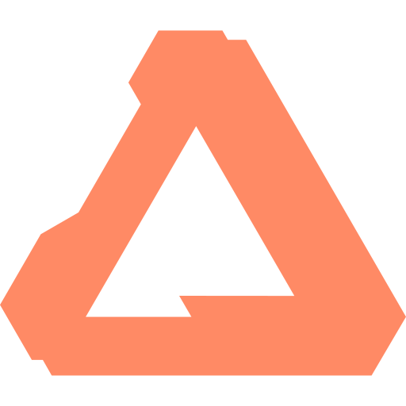 | `affinity` | `.affinity` |
| 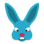 | `afl` | `.afl` |
|  | `agave` | `.agave` |
| 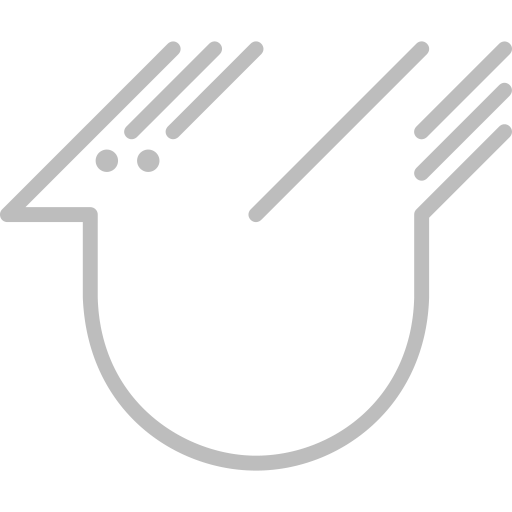 | `agda` | `.agda` |
|  | `age-of-empires-2` | `.age-of-empires-2` |
|  | `agenda` | `.agenda` |
|  | `agent` | `.agent` |
|  | `agentdesktop` | `.agentdesktop` |
|  | `aggregation` | `.aggregation` |
|  | `agordejo` | `.agordejo` |
|  | `ahk` | `ahk` |
|  | `ahk2.clone` | `.ahk2.clone` |
|  | `ai` | `ai` |
|  | `ai-meeting-assistant` | `.ai-meeting-assistant` |
|  | `air` | `.air` |
|  | `aircrack-ng` | `.aircrack-ng` |
|  | `airplane-mode` | `.airplane-mode` |
|  | `airplanemode-off` | `.airplanemode-off` |
|  | `airplanemode-off-dark` | `.airplanemode-off-dark` |
|  | `airplanemode-on` | `.airplanemode-on` |
|  | `airplanemode-on-dark` | `.airplanemode-on-dark` |
|  | `airstrike` | `.airstrike` |
|  | `airtame-application` | `.airtame-application` |
|  | `airvpn` | `.airvpn` |
|  | `airwave-manager` | `.airwave-manager` |
|  | `aisleriot` | `.aisleriot` |
|  | `akeychat` | `.akeychat` |
|  | `akira` | `.akira` |
|  | `akka` | `.akka` |
|  | `akonadi` | `.akonadi` |
|  | `akonadi-phone-home` | `.akonadi-phone-home` |
|  | `akonadiconsole` | `.akonadiconsole` |
|  | `akonaditray` | `.akonaditray` |
|  | `akregator` | `.akregator` |
|  | `akregator_empty` | `.akregator_empty` |
|  | `al` | `.al` |
|  | `alacarte` | `.alacarte` |
| 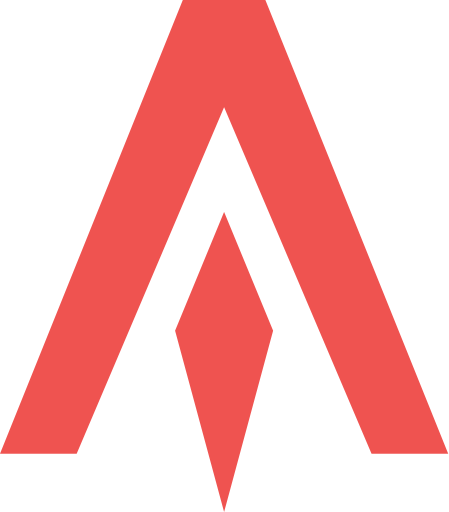 | `alacritty` | `.alacritty` |
|  | `alacritty-simple` | `.alacritty-simple` |
|  | `alan-wake` | `.alan-wake` |
|  | `alarm-clock` | `.alarm-clock` |
|  | `alarm-timer` | `.alarm-timer` |
|  | `albert` | `.albert` |
|  | `albion-online` | `.albion-online` |
|  | `albumfolder-importdir` | `.albumfolder-importdir` |
|  | `albumfolder-importimages` | `.albumfolder-importimages` |
|  | `albumfolder-new` | `.albumfolder-new` |
|  | `albumfolder-properties` | `.albumfolder-properties` |
|  | `albumfolder-user-trash` | `.albumfolder-user-trash` |
|  | `alc` | `.alc` |
|  | `alert` | `.alert` |
| 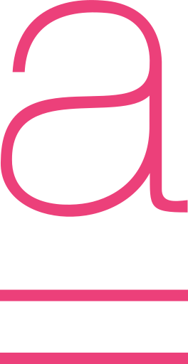 | `alex` | `.alex` |
|  | `alexandra` | `.alexandra` |
|  | `alexignore` | `.alexignore` |
|  | `alfred` | `.alfred` |
|  | `alias` | `.alias` |
|  | `alien-arena` | `.alien-arena` |
|  | `alien-isolation` | `.alien-isolation` |
|  | `alien-swarm` | `.alien-swarm` |
|  | `alien-swarm-reactive-drop` | `.alien-swarm-reactive-drop` |
|  | `alienarena` | `.alienarena` |
|  | `alienblaster` | `.alienblaster` |
|  | `alienfx` | `.alienfx` |
|  | `alienfx-gtk` | `.alienfx-gtk` |
|  | `all-scroll` | `.all-scroll` |
|  | `allcontributors` | `.allcontributors` |
|  | `allegorithmic-Substance_Alchemist` | `.allegorithmic-Substance_Alchemist` |
|  | `allegorithmic-Substance_B2M` | `.allegorithmic-Substance_B2M` |
|  | `allegorithmic-Substance_Designer` | `.allegorithmic-Substance_Designer` |
|  | `allegorithmic-Substance_Painter` | `.allegorithmic-Substance_Painter` |
|  | `alleyoop` | `.alleyoop` |
|  | `alligator` | `.alligator` |
|  | `allo` | `.allo` |
| 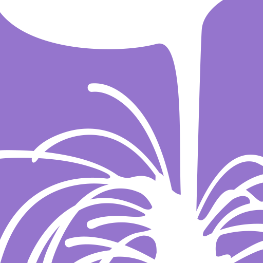 | `alloy` | `alloy` |
|  | `alltomp3` | `.alltomp3` |
|  | `alltray` | `.alltray` |
|  | `allusion` | `.allusion` |
|  | `almanah` | `.almanah` |
|  | `almond` | `.almond` |
|  | `alpine` | `.alpine` |
|  | `alsa-tools` | `.alsa-tools` |
|  | `alsamixergui` | `.alsamixergui` |
|  | `altmediawriter` | `.altmediawriter` |
|  | `altus` | `.altus` |
|  | `altyo` | `.altyo` |
|  | `Alva` | `.Alva` |
|  | `amazon` | `.amazon` |
|  | `amazon-mp3-store-source` | `.amazon-mp3-store-source` |
|  | `amazon-store` | `.amazon-store` |
|  | `Amazon-www.amazon.ca` | `.Amazon-www.amazon.ca` |
|  | `Amazon-www.amazon.cn` | `.Amazon-www.amazon.cn` |
|  | `Amazon-www.amazon.co.uk` | `.Amazon-www.amazon.co.uk` |
|  | `Amazon-www.amazon.com` | `.Amazon-www.amazon.com` |
|  | `Amazon-www.amazon.de` | `.Amazon-www.amazon.de` |
|  | `Amazon-www.amazon.es` | `.Amazon-www.amazon.es` |
|  | `Amazon-www.amazon.fr` | `.Amazon-www.amazon.fr` |
|  | `Amazon-www.amazon.it` | `.Amazon-www.amazon.it` |
|  | `amazonclouddrive` | `.amazonclouddrive` |
|  | `amazonmp3` | `.amazonmp3` |
|  | `amd` | `.amd` |
|  | `amd-ati` | `.amd-ati` |
|  | `amd-ddm-mx` | `.amd-ddm-mx` |
|  | `american-truck-simulator` | `.american-truck-simulator` |
| 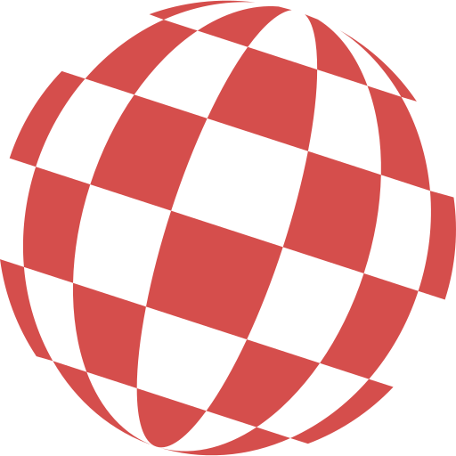 | `amigaos` | `.amigaos` |
|  | `amnesia-a-machine-for-pigs` | `.amnesia-a-machine-for-pigs` |
|  | `amnesia-rebirth` | `.amnesia-rebirth` |
|  | `amnesia-the-dark-descent` | `.amnesia-the-dark-descent` |
|  | `among-us` | `.among-us` |
|  | `amor` | `.amor` |
| 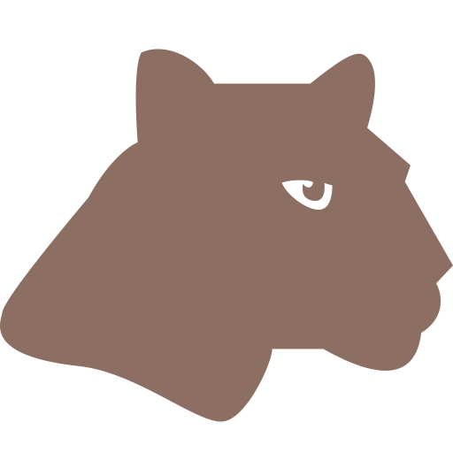 | `ampl` | `.ampl` |
| 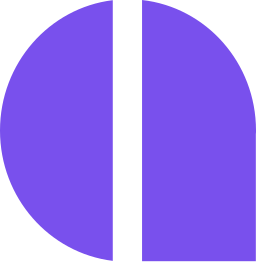 | `amplication` | `.amplication` |
|  | `amplify` | `amplify.yml` |
|  | `amsynth` | `.amsynth` |
|  | `amule` | `.amule` |
| 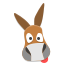 | `amulegui` | `.amulegui` |
| 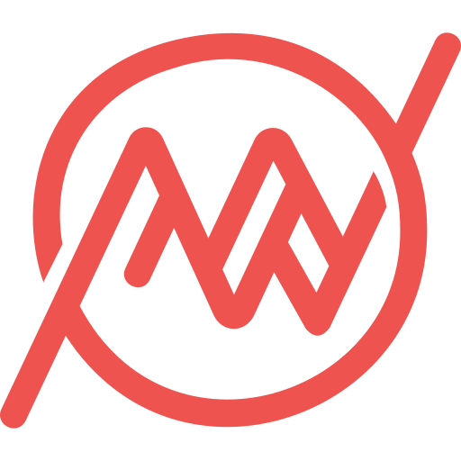 | `amusewiki` | `.amusewiki` |
|  | `anaconda` | `.anaconda` |
|  | `anagramarama` | `.anagramarama` |
|  | `analytica` | `.analytica` |
|  | `anatine` | `.anatine` |
|  | `anatine-indicator` | `.anatine-indicator` |
|  | `anatine-notification` | `.anatine-notification` |
|  | `anbox` | `.anbox` |
|  | `anbox-com-android-vending` | `.anbox-com-android-vending` |
|  | `anchor` | `.anchor` |
|  | `android` | `.apk`, `.smali`, `.dex`, `androidmanifest.xml` |
| 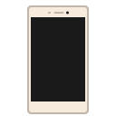 | `android-device` | `.android-device` |
|  | `android-file-transfer` | `.android-file-transfer` |
|  | `android-messages-desktop` | `.android-messages-desktop` |
|  | `android-package-archive` | `.android-package-archive` |
|  | `android-sdk` | `.android-sdk` |
|  | `android-studio` | `.android-studio` |
|  | `android-studio-beta` | `.android-studio-beta` |
|  | `android-studio-canary` | `.android-studio-canary` |
|  | `androidManifest` | `.androidManifest` |
|  | `AndroidMessages` | `.AndroidMessages` |
|  | `androidSmali` | `.androidSmali` |
|  | `androidstudio` | `.androidstudio` |
|  | `androidstudio-preview` | `.androidstudio-preview` |
|  | `angelfish` | `.angelfish` |
| 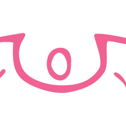 | `angelscript` | `.angelscript` |
|  | `angrysearch` | `.angrysearch` |
|  | `angular` | `.module.ts`, `.module.js`, `.ng-template`, `angular-cli.json`, `.angular-cli.json`, `angular.json`, `ng-package.json` |
|  | `angular-component` | `.component.ts`, `.component.js` |
|  | `angular-component.clone` | `.angular-component.clone` |
|  | `angular-console` | `.angular-console` |
|  | `angular-directive` | `.directive.ts`, `.directive.js` |
|  | `angular-directive.clone` | `.angular-directive.clone` |
|  | `angular-guard` | `.guard.ts`, `.guard.js` |
|  | `angular-guard.clone` | `.angular-guard.clone` |
|  | `angular-interceptor` | `.interceptor.ts`, `.interceptor.js` |
|  | `angular-interceptor.clone` | `.angular-interceptor.clone` |
|  | `angular-pipe` | `.pipe.ts`, `.pipe.js`, `.filter.js` |
|  | `angular-pipe.clone` | `.angular-pipe.clone` |
|  | `angular-resolver` | `.resolver.ts`, `.resolver.js` |
|  | `angular-resolver.clone` | `.angular-resolver.clone` |
|  | `angular-service` | `.service.ts`, `.service.js` |
|  | `angular-service.clone` | `.angular-service.clone` |
|  | `angular2` | `.angular2` |
|  | `angular2component` | `.angular2component` |
|  | `angular2controller` | `.angular2controller` |
|  | `angular2directive` | `.angular2directive` |
|  | `angular2guard` | `.angular2guard` |
|  | `angular2interceptor` | `.angular2interceptor` |
|  | `angular2module` | `.angular2module` |
|  | `angular2pipe` | `.angular2pipe` |
|  | `angular2resolver` | `.angular2resolver` |
|  | `angular2service` | `.angular2service` |
|  | `angularapprouting` | `.angularapprouting` |
|  | `angularCli` | `.angularCli` |
|  | `angularcomponent` | `.angularcomponent` |
|  | `angularcontroller` | `.angularcontroller` |
|  | `angulardirective` | `.angulardirective` |
|  | `angularguard` | `.angularguard` |
|  | `angularinterceptor` | `.angularinterceptor` |
|  | `angularjs` | `.angularjs` |
| 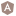 | `angularmodule` | `.angularmodule` |
|  | `angularpipe` | `.angularpipe` |
|  | `angularresolver` | `.angularresolver` |
|  | `angularrouting` | `.angularrouting` |
|  | `angularservice` | `.angularservice` |
|  | `angulartailwind` | `.angulartailwind` |
|  | `animal` | `.animal` |
| 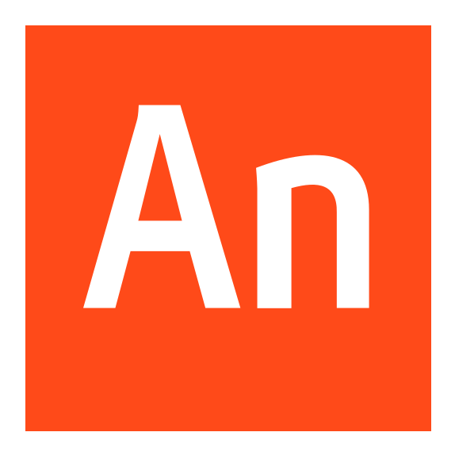 | `animate` | `.animate` |
|  | `animation-stage` | `.animation-stage` |
| 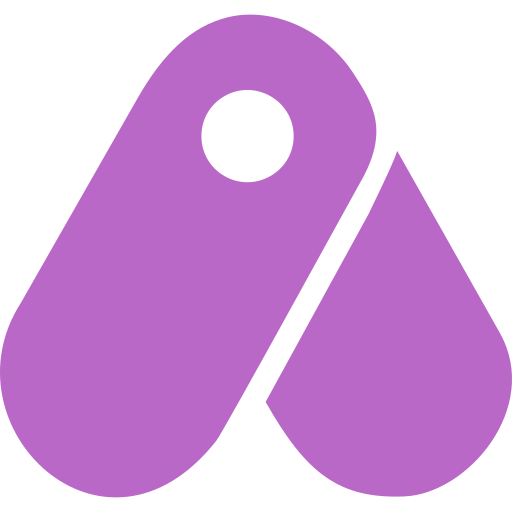 | `animestudio` | `.animestudio` |
|  | `anjuta` | `.anjuta` |
|  | `anjuta_icon` | `.anjuta_icon` |
|  | `anjuta6` | `.anjuta6` |
|  | `ankama-launcher` | `.ankama-launcher` |
|  | `anki` | `.anki` |
|  | `annas-quest` | `.annas-quest` |
|  | `anoise` | `.anoise` |
|  | `another-redis-desktop-manager` | `.another-redis-desktop-manager` |
| 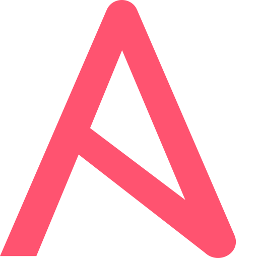 | `ansible` | `.ansible` |
| 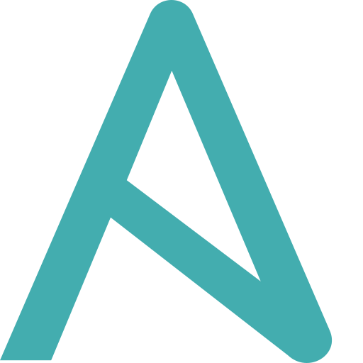 | `ansiblefiles` | `.ansiblefiles` |
|  | `answer` | `.answer` |
|  | `answer-correct` | `.answer-correct` |
|  | `ant` | `.ant` |
|  | `ant-downloader` | `.ant-downloader` |
|  | `antidote` | `.antidote` |
|  | `antimicro` | `.antimicro` |
|  | `antimicro-panel` | `.antimicro-panel` |
|  | `antimicrox` | `.antimicrox` |
|  | `antivignetting` | `.antivignetting` |
|  | `antlers` | `.antlers` |
| 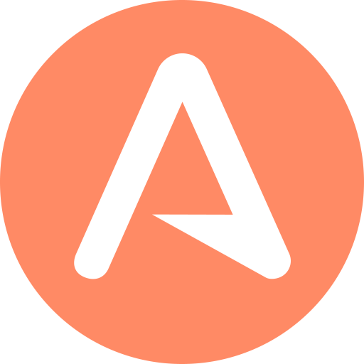 | `antlr` | `.g4` |
| 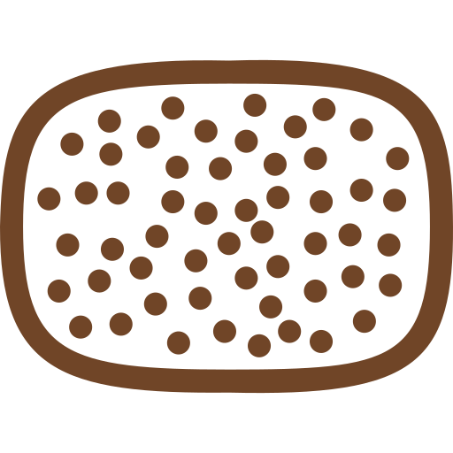 | `antwar` | `.antwar` |
|  | `any` | `.any` |
|  | `anydesk` | `.anydesk` |
|  | `anytype` | `.anytype` |
|  | `ao-app` | `.ao-app` |
|  | `ao-app-tray` | `.ao-app-tray` |
|  | `aoi` | `.aoi` |
|  | `apache` | `.apache` |
|  | `apache-directory-studio` | `.apache-directory-studio` |
|  | `apache-netbeans` | `.apache-netbeans` |
|  | `apacheconf` | `.apacheconf` |
|  | `apacheconf2` | `.apacheconf2` |
|  | `apachedirectorystudio` | `.apachedirectorystudio` |
|  | `aperture-desk-job` | `.aperture-desk-job` |
|  | `apex` | `.apex` |
| 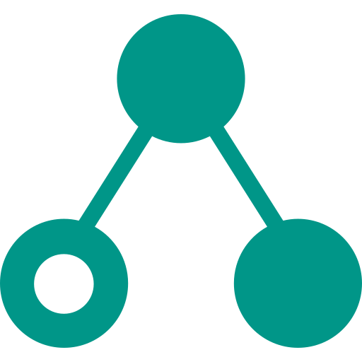 | `apib` | `apib` |
|  | `apiblueprint` | `.apib`, `.apiblueprint` |
| 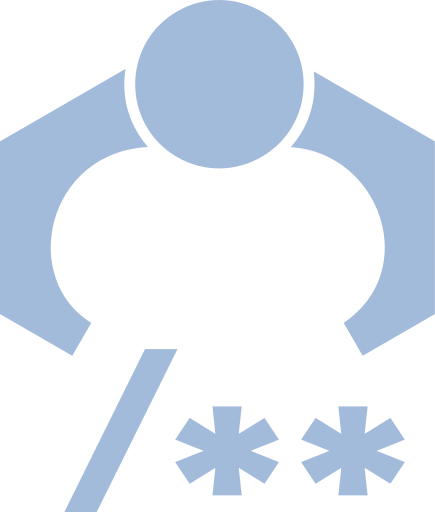 | `apiextractor` | `.apiextractor` |
|  | `apifox` | `.apifox` |
|  | `apk` | `apk` |
|  | `apk-editor-studio` | `.apk-editor-studio` |
|  | `apk-icon-editor` | `.apk-icon-editor` |
|  | `apktool` | `.apktool` |
| 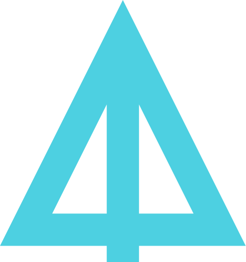 | `apl` | `.apl` |
| 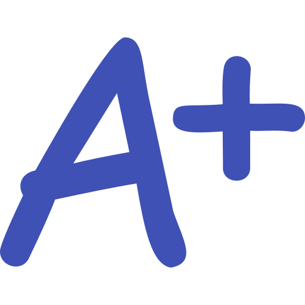 | `aplus` | `.aplus` |
|  | `apm` | `.apm` |
|  | `apm_dark` | `.apm_dark` |
| 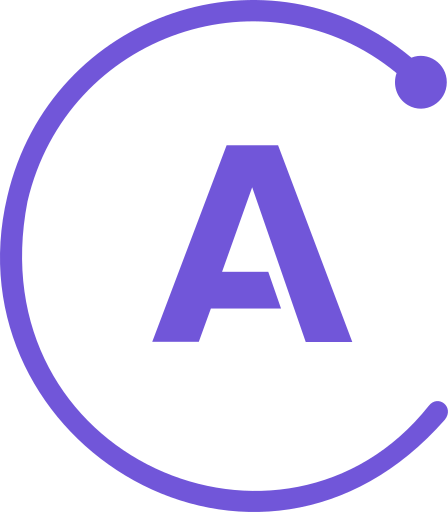 | `apollo` | `apollo.config.js` |
|  | `apollo-studio` | `.apollo-studio` |
|  | `app` | `.app` |
|  | `app-launcher` | `.app-launcher` |
|  | `app-outlet` | `.app-outlet` |
| 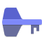 | `app.authpass.AuthPass` | `.app.authpass.AuthPass` |
|  | `app.bluebubbles.BlueBubbles` | `.app.bluebubbles.BlueBubbles` |
|  | `app.drey.Dialect` | `.app.drey.Dialect` |
|  | `app.drey.EarTag` | `.app.drey.EarTag` |
|  | `app.drey.PaperPlane` | `.app.drey.PaperPlane` |
|  | `app.drey.Warp` | `.app.drey.Warp` |
|  | `app.getclipboard.Clipboard` | `.app.getclipboard.Clipboard` |
|  | `app.gummi.gummi` | `.app.gummi.gummi` |
|  | `app.lith.Lith` | `.app.lith.Lith` |
|  | `app.midterm.MidtermDesktop` | `.app.midterm.MidtermDesktop` |
|  | `app.organicmaps.desktop` | `.app.organicmaps.desktop` |
|  | `app.rambox.ramboxce` | `.app.rambox.ramboxce` |
|  | `app.ravenreader` | `.app.ravenreader` |
|  | `app.rednotebook.RedNotebook` | `.app.rednotebook.RedNotebook` |
|  | `app.riftshare.RiftShare` | `.app.riftshare.RiftShare` |
|  | `app.web.kdocs` | `.app.web.kdocs` |
|  | `app.web.qq.docs` | `.app.web.qq.docs` |
|  | `app.xemu.xemu` | `.app.xemu.xemu` |
|  | `app.ytmdesktop.ytmdesktop` | `.app.ytmdesktop.ytmdesktop` |
|  | `app.zen_browser.zen` | `.app.zen_browser.zen` |
|  | `apparmor_view_profile` | `.apparmor_view_profile` |
| 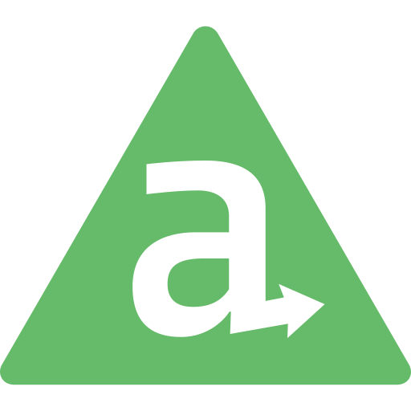 | `appcelerator` | `.appcelerator` |
|  | `appcode` | `.appcode` |
|  | `apper` | `.apper` |
|  | `appgrid` | `.appgrid` |
|  | `AppImage` | `.AppImage` |
|  | `appimagekit_irix` | `.appimagekit_irix` |
|  | `appimagekit-1password` | `.appimagekit-1password` |
|  | `appimagekit-aaaaxy` | `.appimagekit-aaaaxy` |
|  | `appimagekit-advanced-rest-client` | `.appimagekit-advanced-rest-client` |
|  | `appimagekit-allusion` | `.appimagekit-allusion` |
|  | `appimagekit-altus` | `.appimagekit-altus` |
|  | `appimagekit-Alva` | `.appimagekit-Alva` |
|  | `appimagekit-android-file-transfer` | `.appimagekit-android-file-transfer` |
|  | `appimagekit-android-messages-desktop` | `.appimagekit-android-messages-desktop` |
|  | `appimagekit-another-redis-desktop-manager` | `.appimagekit-another-redis-desktop-manager` |
|  | `appimagekit-ant-downloader` | `.appimagekit-ant-downloader` |
|  | `appimagekit-app-outlet` | `.appimagekit-app-outlet` |
|  | `appimagekit-AppImage` | `.appimagekit-AppImage` |
|  | `appimagekit-aranym` | `.appimagekit-aranym` |
|  | `appimagekit-archipelago` | `.appimagekit-archipelago` |
|  | `appimagekit-ark-desktop-wallet` | `.appimagekit-ark-desktop-wallet` |
|  | `appimagekit-athens` | `.appimagekit-athens` |
|  | `appimagekit-atomic` | `.appimagekit-atomic` |
|  | `appimagekit-audacium` | `.appimagekit-audacium` |
|  | `appimagekit-augur` | `.appimagekit-augur` |
|  | `appimagekit-auryo` | `.appimagekit-auryo` |
|  | `appimagekit-autoremesher` | `.appimagekit-autoremesher` |
|  | `appimagekit-avocado` | `.appimagekit-avocado` |
|  | `appimagekit-azpainter` | `.appimagekit-azpainter` |
|  | `appimagekit-baiji-manga-viewer` | `.appimagekit-baiji-manga-viewer` |
|  | `appimagekit-balena-etcher-electron` | `.appimagekit-balena-etcher-electron` |
|  | `appimagekit-bazecor` | `.appimagekit-bazecor` |
|  | `appimagekit-beaker-browser` | `.appimagekit-beaker-browser` |
|  | `appimagekit-beekeeper-studio` | `.appimagekit-beekeeper-studio` |
|  | `appimagekit-bitshares2-light` | `.appimagekit-bitshares2-light` |
|  | `appimagekit-bitwarden` | `.appimagekit-bitwarden` |
|  | `appimagekit-Black_Chocobo` | `.appimagekit-Black_Chocobo` |
|  | `appimagekit-bloomrpc` | `.appimagekit-bloomrpc` |
|  | `appimagekit-brackets-electron` | `.appimagekit-brackets-electron` |
|  | `appimagekit-buka` | `.appimagekit-buka` |
|  | `appimagekit-cacher` | `.appimagekit-cacher` |
|  | `appimagekit-caprine` | `.appimagekit-caprine` |
|  | `appimagekit-chiaki` | `.appimagekit-chiaki` |
|  | `appimagekit-clickup-desktop` | `.appimagekit-clickup-desktop` |
|  | `appimagekit-clipgrab` | `.appimagekit-clipgrab` |
|  | `appimagekit-colobot` | `.appimagekit-colobot` |
|  | `appimagekit-colon` | `.appimagekit-colon` |
|  | `appimagekit-colorpicker` | `.appimagekit-colorpicker` |
|  | `appimagekit-com.github.coslyk.MoonPlayer` | `.appimagekit-com.github.coslyk.MoonPlayer` |
|  | `appimagekit-conky-logomark-violet` | `.appimagekit-conky-logomark-violet` |
|  | `appimagekit-cool-retro-term` | `.appimagekit-cool-retro-term` |
|  | `appimagekit-cozydrive` | `.appimagekit-cozydrive` |
|  | `appimagekit-cpod` | `.appimagekit-cpod` |
|  | `appimagekit-cryptr` | `.appimagekit-cryptr` |
|  | `appimagekit-cura-icon` | `.appimagekit-cura-icon` |
|  | `appimagekit-cutepeaks` | `.appimagekit-cutepeaks` |
|  | `appimagekit-cutter` | `.appimagekit-cutter` |
|  | `appimagekit-Cyan` | `.appimagekit-Cyan` |
|  | `appimagekit-de.rwth_aachen.ient.YUView` | `.appimagekit-de.rwth_aachen.ient.YUView` |
|  | `appimagekit-delir` | `.appimagekit-delir` |
|  | `appimagekit-deltachat-desktop` | `.appimagekit-deltachat-desktop` |
|  | `appimagekit-deskreen` | `.appimagekit-deskreen` |
|  | `appimagekit-devhub` | `.appimagekit-devhub` |
|  | `appimagekit-diffuse` | `.appimagekit-diffuse` |
|  | `appimagekit-dmanager` | `.appimagekit-dmanager` |
|  | `appimagekit-dockstation` | `.appimagekit-dockstation` |
|  | `appimagekit-doki-doki-mod-manager` | `.appimagekit-doki-doki-mod-manager` |
|  | `appimagekit-dopamine` | `.appimagekit-dopamine` |
|  | `appimagekit-downline` | `.appimagekit-downline` |
|  | `appimagekit-draw.io` | `.appimagekit-draw.io` |
|  | `appimagekit-drawpile` | `.appimagekit-drawpile` |
|  | `appimagekit-Dstroy2` | `.appimagekit-Dstroy2` |
|  | `appimagekit-duckstation-qt` | `.appimagekit-duckstation-qt` |
|  | `appimagekit-duckstation-sdl` | `.appimagekit-duckstation-sdl` |
|  | `appimagekit-duskplayer` | `.appimagekit-duskplayer` |
|  | `appimagekit-dust3d` | `.appimagekit-dust3d` |
|  | `appimagekit-edex-ui` | `.appimagekit-edex-ui` |
|  | `appimagekit-electorrent` | `.appimagekit-electorrent` |
|  | `appimagekit-electron-cash` | `.appimagekit-electron-cash` |
|  | `appimagekit-electrum-axe` | `.appimagekit-electrum-axe` |
|  | `appimagekit-emacs` | `.appimagekit-emacs` |
|  | `appimagekit-encryptpad` | `.appimagekit-encryptpad` |
|  | `appimagekit-enve` | `.appimagekit-enve` |
|  | `appimagekit-expandrive` | `.appimagekit-expandrive` |
|  | `appimagekit-ferdi` | `.appimagekit-ferdi` |
|  | `appimagekit-ff-password-exporter` | `.appimagekit-ff-password-exporter` |
|  | `appimagekit-filmulator-gui` | `.appimagekit-filmulator-gui` |
|  | `appimagekit-fluent-reader` | `.appimagekit-fluent-reader` |
|  | `appimagekit-fontbase` | `.appimagekit-fontbase` |
|  | `appimagekit-franz` | `.appimagekit-franz` |
|  | `appimagekit-Freeter` | `.appimagekit-Freeter` |
|  | `appimagekit-FreeTexturePacker` | `.appimagekit-FreeTexturePacker` |
|  | `appimagekit-freezer` | `.appimagekit-freezer` |
|  | `appimagekit-friture` | `.appimagekit-friture` |
|  | `appimagekit-fspy` | `.appimagekit-fspy` |
|  | `appimagekit-gdlauncher` | `.appimagekit-gdlauncher` |
|  | `appimagekit-gifcurry` | `.appimagekit-gifcurry` |
|  | `appimagekit-gisto` | `.appimagekit-gisto` |
|  | `appimagekit-github-desktop` | `.appimagekit-github-desktop` |
|  | `appimagekit-gitify` | `.appimagekit-gitify` |
|  | `appimagekit-gitqlient` | `.appimagekit-gitqlient` |
|  | `appimagekit-glyphr-studio-desktop` | `.appimagekit-glyphr-studio-desktop` |
|  | `appimagekit-gmail-desktop` | `.appimagekit-gmail-desktop` |
|  | `appimagekit-google-tasks-desktop` | `.appimagekit-google-tasks-desktop` |
|  | `appimagekit-gqrx` | `.appimagekit-gqrx` |
|  | `appimagekit-gravit-designer` | `.appimagekit-gravit-designer` |
|  | `appimagekit-guiscrcpy` | `.appimagekit-guiscrcpy` |
|  | `appimagekit-guitar` | `.appimagekit-guitar` |
|  | `appimagekit-heroic` | `.appimagekit-heroic` |
|  | `appimagekit-hotspot` | `.appimagekit-hotspot` |
|  | `appimagekit-hw-probe` | `.appimagekit-hw-probe` |
|  | `appimagekit-hyper` | `.appimagekit-hyper` |
|  | `appimagekit-info.beyondallreason.bar` | `.appimagekit-info.beyondallreason.bar` |
|  | `appimagekit-internxt-drive` | `.appimagekit-internxt-drive` |
|  | `appimagekit-invesalius` | `.appimagekit-invesalius` |
|  | `appimagekit-io.github.divverent.aaaaxy` | `.appimagekit-io.github.divverent.aaaaxy` |
|  | `appimagekit-irccloud-desktop` | `.appimagekit-irccloud-desktop` |
|  | `appimagekit-Jellyamp` | `.appimagekit-Jellyamp` |
|  | `appimagekit-jitsi-meet` | `.appimagekit-jitsi-meet` |
|  | `appimagekit-joplin` | `.appimagekit-joplin` |
|  | `appimagekit-jubler` | `.appimagekit-jubler` |
|  | `appimagekit-junior_install_icon` | `.appimagekit-junior_install_icon` |
|  | `appimagekit-kahla` | `.appimagekit-kahla` |
|  | `appimagekit-kaku` | `.appimagekit-kaku` |
|  | `appimagekit-kawanime` | `.appimagekit-kawanime` |
|  | `appimagekit-KittehPlayer` | `.appimagekit-KittehPlayer` |
|  | `appimagekit-kitty` | `.appimagekit-kitty` |
|  | `appimagekit-knowte` | `.appimagekit-knowte` |
|  | `appimagekit-ksnip` | `.appimagekit-ksnip` |
|  | `appimagekit-kuro` | `.appimagekit-kuro` |
|  | `appimagekit-laigter` | `.appimagekit-laigter` |
|  | `appimagekit-ledger-live-desktop` | `.appimagekit-ledger-live-desktop` |
|  | `appimagekit-leocad` | `.appimagekit-leocad` |
|  | `appimagekit-leonflix` | `.appimagekit-leonflix` |
|  | `appimagekit-librewolf` | `.appimagekit-librewolf` |
|  | `appimagekit-Lightcord` | `.appimagekit-Lightcord` |
|  | `appimagekit-listen.moe-desktop-app` | `.appimagekit-listen.moe-desktop-app` |
|  | `appimagekit-littleweeb` | `.appimagekit-littleweeb` |
|  | `appimagekit-love` | `.appimagekit-love` |
|  | `appimagekit-lunarclient` | `.appimagekit-lunarclient` |
|  | `appimagekit-makagiga` | `.appimagekit-makagiga` |
|  | `appimagekit-mandelbulber2` | `.appimagekit-mandelbulber2` |
|  | `appimagekit-mediaconch` | `.appimagekit-mediaconch` |
|  | `appimagekit-MediaElch` | `.appimagekit-MediaElch` |
|  | `appimagekit-mellowplayer` | `.appimagekit-mellowplayer` |
|  | `appimagekit-memento` | `.appimagekit-memento` |
|  | `appimagekit-meshlab` | `.appimagekit-meshlab` |
|  | `appimagekit-midterm` | `.appimagekit-midterm` |
|  | `appimagekit-mikutter` | `.appimagekit-mikutter` |
|  | `appimagekit-minetime` | `.appimagekit-minetime` |
|  | `appimagekit-moderndeck` | `.appimagekit-moderndeck` |
|  | `appimagekit-moonlight` | `.appimagekit-moonlight` |
|  | `appimagekit-mosaic` | `.appimagekit-mosaic` |
|  | `appimagekit-motrix` | `.appimagekit-motrix` |
|  | `appimagekit-mscore-portable` | `.appimagekit-mscore-portable` |
|  | `appimagekit-museeks` | `.appimagekit-museeks` |
|  | `appimagekit-mystiq` | `.appimagekit-mystiq` |
|  | `appimagekit-negibox` | `.appimagekit-negibox` |
|  | `appimagekit-nighthawk` | `.appimagekit-nighthawk` |
|  | `appimagekit-nostlan` | `.appimagekit-nostlan` |
|  | `appimagekit-notable` | `.appimagekit-notable` |
|  | `appimagekit-notesnook` | `.appimagekit-notesnook` |
|  | `appimagekit-nuclear` | `.appimagekit-nuclear` |
|  | `appimagekit-obsidian` | `.appimagekit-obsidian` |
|  | `appimagekit-odio` | `.appimagekit-odio` |
|  | `appimagekit-OpenRGB` | `.appimagekit-OpenRGB` |
|  | `appimagekit-openxcom` | `.appimagekit-openxcom` |
|  | `appimagekit-org.cryptomator.Cryptomator` | `.appimagekit-org.cryptomator.Cryptomator` |
| 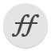 | `appimagekit-org.fontforge.FontForge` | `.appimagekit-org.fontforge.FontForge` |
|  | `appimagekit-org.freac.freac` | `.appimagekit-org.freac.freac` |
|  | `appimagekit-org.keepassxc.KeePassXC` | `.appimagekit-org.keepassxc.KeePassXC` |
|  | `appimagekit-org.olivevideoeditor.Olive` | `.appimagekit-org.olivevideoeditor.Olive` |
|  | `appimagekit-org.wezfurlong.wezterm` | `.appimagekit-org.wezfurlong.wezterm` |
|  | `appimagekit-papagayong` | `.appimagekit-papagayong` |
|  | `appimagekit-pcloud` | `.appimagekit-pcloud` |
|  | `appimagekit-PCSX2` | `.appimagekit-PCSX2` |
|  | `appimagekit-picturama` | `.appimagekit-picturama` |
|  | `appimagekit-pioneer_install_icon` | `.appimagekit-pioneer_install_icon` |
|  | `appimagekit-Play` | `.appimagekit-Play` |
|  | `appimagekit-plexamp` | `.appimagekit-plexamp` |
|  | `appimagekit-pling-store` | `.appimagekit-pling-store` |
|  | `appimagekit-pocket-casts-linux` | `.appimagekit-pocket-casts-linux` |
|  | `appimagekit-poddr` | `.appimagekit-poddr` |
|  | `appimagekit-premid` | `.appimagekit-premid` |
|  | `appimagekit-protonmail-desktop-unofficial` | `.appimagekit-protonmail-desktop-unofficial` |
|  | `appimagekit-pulse-sms` | `.appimagekit-pulse-sms` |
|  | `appimagekit-QMPlay2` | `.appimagekit-QMPlay2` |
|  | `appimagekit-qnapi` | `.appimagekit-qnapi` |
|  | `appimagekit-qtox` | `.appimagekit-qtox` |
|  | `appimagekit-qv2ray` | `.appimagekit-qv2ray` |
|  | `appimagekit-radicle-upstream` | `.appimagekit-radicle-upstream` |
|  | `appimagekit-rambox` | `.appimagekit-rambox` |
|  | `appimagekit-raven-reader` | `.appimagekit-raven-reader` |
|  | `appimagekit-rclone-browser` | `.appimagekit-rclone-browser` |
|  | `appimagekit-rclonetray` | `.appimagekit-rclonetray` |
|  | `appimagekit-retroarch` | `.appimagekit-retroarch` |
|  | `appimagekit-retroshare` | `.appimagekit-retroshare` |
|  | `appimagekit-Ripcord_Icon` | `.appimagekit-Ripcord_Icon` |
|  | `appimagekit-rpcs3` | `.appimagekit-rpcs3` |
|  | `appimagekit-sc-controller` | `.appimagekit-sc-controller` |
|  | `appimagekit-seamly2d` | `.appimagekit-seamly2d` |
|  | `appimagekit-sengi` | `.appimagekit-sengi` |
|  | `appimagekit-servez` | `.appimagekit-servez` |
|  | `appimagekit-session-desktop` | `.appimagekit-session-desktop` |
|  | `appimagekit-shadow` | `.appimagekit-shadow` |
|  | `appimagekit-shadow-beta` | `.appimagekit-shadow-beta` |
|  | `appimagekit-shadow-dev` | `.appimagekit-shadow-dev` |
|  | `appimagekit-shadow-preprod` | `.appimagekit-shadow-preprod` |
|  | `appimagekit-shadow-testing` | `.appimagekit-shadow-testing` |
|  | `appimagekit-sharik` | `.appimagekit-sharik` |
|  | `appimagekit-smplayer` | `.appimagekit-smplayer` |
|  | `appimagekit-somiibo` | `.appimagekit-somiibo` |
|  | `appimagekit-stacer` | `.appimagekit-stacer` |
|  | `appimagekit-standard-notes` | `.appimagekit-standard-notes` |
|  | `appimagekit-stretchly` | `.appimagekit-stretchly` |
|  | `appimagekit-substance` | `.appimagekit-substance` |
|  | `appimagekit-superpaper` | `.appimagekit-superpaper` |
|  | `appimagekit-supertux2` | `.appimagekit-supertux2` |
|  | `appimagekit-synfigstudio` | `.appimagekit-synfigstudio` |
|  | `appimagekit-tandem` | `.appimagekit-tandem` |
|  | `appimagekit-tc` | `.appimagekit-tc` |
|  | `appimagekit-teams-for-linux` | `.appimagekit-teams-for-linux` |
|  | `appimagekit-thorium` | `.appimagekit-thorium` |
|  | `appimagekit-torrenttools` | `.appimagekit-torrenttools` |
|  | `appimagekit-trinity-desktop` | `.appimagekit-trinity-desktop` |
|  | `appimagekit-turbowarp-desktop` | `.appimagekit-turbowarp-desktop` |
|  | `appimagekit-tutanota-desktop` | `.appimagekit-tutanota-desktop` |
|  | `appimagekit-tweet-tray` | `.appimagekit-tweet-tray` |
|  | `appimagekit-unityhub` | `.appimagekit-unityhub` |
|  | `appimagekit-videomass` | `.appimagekit-videomass` |
|  | `appimagekit-vieb` | `.appimagekit-vieb` |
|  | `appimagekit-viper-browser` | `.appimagekit-viper-browser` |
|  | `appimagekit-vitomu` | `.appimagekit-vitomu` |
|  | `appimagekit-vnote` | `.appimagekit-vnote` |
|  | `appimagekit-webamp-desktop` | `.appimagekit-webamp-desktop` |
|  | `appimagekit-webcamoid` | `.appimagekit-webcamoid` |
|  | `appimagekit-wewechat` | `.appimagekit-wewechat` |
|  | `appimagekit-wine-launcher` | `.appimagekit-wine-launcher` |
|  | `appimagekit-wire-desktop` | `.appimagekit-wire-desktop` |
|  | `appimagekit-workflowy` | `.appimagekit-workflowy` |
|  | `appimagekit-xnviewmp` | `.appimagekit-xnviewmp` |
|  | `appimagekit-yaradio-yamusic` | `.appimagekit-yaradio-yamusic` |
|  | `appimagekit-youtube-dl-gui` | `.appimagekit-youtube-dl-gui` |
|  | `appimagekit-youtube-music` | `.appimagekit-youtube-music` |
|  | `appimagekit-youtube-music-desktop-app` | `.appimagekit-youtube-music-desktop-app` |
|  | `appimagekit-yuna` | `.appimagekit-yuna` |
|  | `appimagekit-zettlr` | `.appimagekit-zettlr` |
|  | `appimagekit-zmninjapro` | `.appimagekit-zmninjapro` |
|  | `appimagekit-zoho-mail-desktop` | `.appimagekit-zoho-mail-desktop` |
|  | `AppImageLauncher` | `.AppImageLauncher` |
|  | `apple-music` | `.apple-music` |
|  | `applescript` | `.applescript`, `.ipa` |
|  | `applet_lockkeys` | `.applet_lockkeys` |
|  | `applets-screenshooter` | `.applets-screenshooter` |
|  | `applets-template` | `.applets-template` |
|  | `application-7zip` | `application-7zip` |
|  | `application-acad` | `.acad` |
|  | `application-afdesigner` | `.afdesigner` |
|  | `application-apk` | `application-apk` |
|  | `application-archive` | `.archive` |
|  | `application-archive-blank` | `.archive-blank` |
|  | `application-archive-zip` | `.archive-zip` |
|  | `application-atom+xml` | `.atom+xml` |
|  | `application-autocad_dwg` | `.autocad_dwg` |
|  | `application-bitwig-clip` | `.bitwig-clip` |
|  | `application-bitwig-device` | `.bitwig-device` |
|  | `application-bitwig-preset` | `.bitwig-preset` |
|  | `application-bitwig-project` | `.bitwig-project` |
|  | `application-bitwig-project-folder` | `.bitwig-project-folder` |
|  | `application-bitwig-template` | `.bitwig-template` |
|  | `application-cbor` | `.cbor` |
|  | `application-certificate` | `.certificate` |
|  | `application-clariscad` | `.clariscad` |
|  | `application-community` | `.community` |
|  | `application-dart` | `application-dart` |
|  | `application-database` | `.database` |
|  | `application-default-icon` | `.default-icon` |
|  | `application-dicom` | `.dicom` |
|  | `application-drawing` | `.drawing` |
|  | `application-dwg` | `.dwg` |
|  | `application-dxf` | `application-dxf` |
|  | `application-epub+zip` | `.epub+zip` |
|  | `application-excel` | `.excel` |
|  | `application-exit` | `.exit` |
| 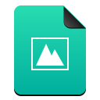 | `application-ffDiaporama` | `.ffDiaporama` |
|  | `application-fits` | `.fits` |
|  | `application-font-woff` | `.font-woff` |
|  | `application-geo+json` | `.geo+json` |
|  | `application-gml+xml` | `.gml+xml` |
|  | `application-gnunet-directory` | `.gnunet-directory` |
|  | `application-gpx` | `.gpx` |
|  | `application-gpx+xml` | `.gpx+xml` |
|  | `application-gvdesign` | `.gvdesign` |
|  | `application-gzip` | `application-gzip` |
|  | `application-hwpx` | `.hwpx` |
|  | `application-illustrator` | `.illustrator` |
|  | `application-images` | `.images` |
|  | `application-install` | `application-install` |
|  | `application-java` | `application-java` |
|  | `application-javascript` | `.javascript` |
|  | `application-json` | `application-json` |
|  | `application-ld+json` | `.ld+json` |
|  | `application-loc+xml` | `.loc+xml` |
|  | `application-m3u` | `application-m3u` |
|  | `application-mac-binhex40` | `.mac-binhex40` |
|  | `application-mathematica` | `.mathematica` |
|  | `application-mathematicaplayer` | `.mathematicaplayer` |
|  | `application-mathml+xml` | `.mathml+xml` |
|  | `application-mbox` | `application-mbox` |
|  | `application-menu` | `.menu` |
|  | `application-metalink+xml` | `.metalink+xml` |
|  | `application-metalink4+xml` | `.metalink4+xml` |
|  | `application-mimearchive` | `.mimearchive` |
|  | `application-msexcel` | `.msexcel` |
|  | `application-msonenote` | `.msonenote` |
|  | `application-msoutlook` | `.msoutlook` |
|  | `application-mspowerpoint` | `.mspowerpoint` |
|  | `application-msword` | `.msword` |
|  | `application-msword-template` | `.msword-template` |
|  | `application-octet-stream` | `.octet-stream` |
|  | `application-odf` | `.odf` |
|  | `application-oebps-package+xml` | `.oebps-package+xml` |
|  | `application-ogg` | `application-ogg` |
|  | `application-owl+xml` | `.owl+xml` |
|  | `application-pdf` | `application-pdf` |
|  | `application-pgp` | `.pgp` |
|  | `application-pgp-encrypted` | `.pgp-encrypted` |
|  | `application-pgp-keys` | `.pgp-keys` |
|  | `application-pgp-signature` | `.pgp-signature` |
|  | `application-photoshop` | `.photoshop` |
|  | `application-pkcs10` | `.pkcs10` |
|  | `application-pkcs12` | `.pkcs12` |
|  | `application-pkcs7-mime` | `.pkcs7-mime` |
|  | `application-pkcs7-signature` | `.pkcs7-signature` |
|  | `application-pkcs7.mime` | `.pkcs7.mime` |
|  | `application-pkcs7.signature` | `.pkcs7.signature` |
|  | `application-pkcs8` | `.pkcs8` |
|  | `application-pkcs8+pem` | `.pkcs8+pem` |
|  | `application-pkix-cerl` | `.pkix-cerl` |
|  | `application-pkix-cert` | `.pkix-cert` |
|  | `application-pkix-cert+pem` | `.pkix-cert+pem` |
|  | `application-pkix-crl` | `.pkix-crl` |
|  | `application-pkix-pkipath` | `.pkix-pkipath` |
|  | `application-postscript` | `.postscript` |
|  | `application-ram` | `.ram` |
|  | `application-rdata` | `.rdata` |
|  | `application-rdf+xml` | `.rdf+xml` |
|  | `application-relaxng` | `.relaxng` |
|  | `application-rnote` | `.rnote` |
|  | `application-rss` | `.rss` |
|  | `application-rss_xml` | `.rss_xml` |
|  | `application-rss+xml` | `.rss+xml` |
|  | `application-rtf` | `application-rtf` |
|  | `application-rtf-rtl` | `.rtf-rtl` |
|  | `application-running` | `.running` |
|  | `application-scribus` | `.scribus` |
|  | `application-shorten` | `.shorten` |
|  | `application-slf+xml` | `.slf+xml` |
|  | `application-sql` | `application-sql` |
|  | `application-sweethome3d` | `.sweethome3d` |
|  | `application-sxw` | `.sxw` |
|  | `application-tcx+xml` | `.tcx+xml` |
|  | `application-text` | `.text` |
|  | `application-toml` | `application-toml` |
|  | `application-url` | `application-url` |
|  | `application-vidiot` | `.vidiot` |
|  | `application-vnd-google-earth-kml` | `.vnd-google-earth-kml` |
|  | `application-vnd.adobe.flash.movie` | `.vnd.adobe.flash.movie` |
|  | `application-vnd.afdesigner` | `.vnd.afdesigner` |
|  | `application-vnd.affinity-designer` | `.vnd.affinity-designer` |
|  | `application-vnd.amazon.mobi8-ebook` | `.vnd.amazon.mobi8-ebook` |
|  | `application-vnd.android.package-archive` | `.vnd.android.package-archive` |
|  | `application-vnd.ant.fit` | `.vnd.ant.fit` |
|  | `application-vnd.appimage` | `.vnd.appimage` |
|  | `application-vnd.apple.mpegurl` | `.vnd.apple.mpegurl` |
|  | `application-vnd.apple.pkpass` | `.vnd.apple.pkpass` |
|  | `application-vnd.chess-pgn` | `.vnd.chess-pgn` |
|  | `application-vnd.coffeescript` | `.vnd.coffeescript` |
|  | `application-vnd.comicbook-rar` | `.vnd.comicbook-rar` |
|  | `application-vnd.comicbook+zip` | `.vnd.comicbook+zip` |
|  | `application-vnd.debian.binary-package` | `.vnd.debian.binary-package` |
|  | `application-vnd.efi.img` | `.vnd.efi.img` |
|  | `application-vnd.efi.iso` | `.vnd.efi.iso` |
|  | `application-vnd.excalidraw+json` | `.vnd.excalidraw+json` |
|  | `application-vnd.fai.igc` | `.vnd.fai.igc` |
|  | `application-vnd.fastcopy-disk-image` | `.vnd.fastcopy-disk-image` |
|  | `application-vnd.flatpak` | `.vnd.flatpak` |
|  | `application-vnd.flatpak.ref` | `.vnd.flatpak.ref` |
|  | `application-vnd.flatpak.repo` | `.vnd.flatpak.repo` |
|  | `application-vnd.geo+json` | `.vnd.geo+json` |
|  | `application-vnd.google-apps.document` | `.vnd.google-apps.document` |
|  | `application-vnd.google-apps.drawing` | `.vnd.google-apps.drawing` |
|  | `application-vnd.google-apps.form` | `.vnd.google-apps.form` |
|  | `application-vnd.google-apps.fusiontable` | `.vnd.google-apps.fusiontable` |
|  | `application-vnd.google-apps.map` | `.vnd.google-apps.map` |
|  | `application-vnd.google-apps.presentation` | `.vnd.google-apps.presentation` |
|  | `application-vnd.google-apps.script` | `.vnd.google-apps.script` |
|  | `application-vnd.google-apps.site` | `.vnd.google-apps.site` |
|  | `application-vnd.google-apps.spreadsheet` | `.vnd.google-apps.spreadsheet` |
|  | `application-vnd.google-earth.kml` | `.vnd.google-earth.kml` |
|  | `application-vnd.google-earth.kml+xml` | `.vnd.google-earth.kml+xml` |
|  | `application-vnd.google-earth.kmz` | `.vnd.google-earth.kmz` |
|  | `application-vnd.gvdesign` | `.vnd.gvdesign` |
|  | `application-vnd.iccprofile` | `.vnd.iccprofile` |
|  | `application-vnd.insync.link.drive.doc` | `.vnd.insync.link.drive.doc` |
|  | `application-vnd.insync.link.drive.draw` | `.vnd.insync.link.drive.draw` |
|  | `application-vnd.insync.link.drive.form` | `.vnd.insync.link.drive.form` |
|  | `application-vnd.insync.link.drive.link` | `.vnd.insync.link.drive.link` |
|  | `application-vnd.insync.link.drive.note` | `.vnd.insync.link.drive.note` |
|  | `application-vnd.insync.link.drive.script` | `.vnd.insync.link.drive.script` |
|  | `application-vnd.insync.link.drive.sheet` | `.vnd.insync.link.drive.sheet` |
|  | `application-vnd.insync.link.drive.slides` | `.vnd.insync.link.drive.slides` |
|  | `application-vnd.insync.link.drive.table` | `.vnd.insync.link.drive.table` |
|  | `application-vnd.jgraph.mxfile` | `.vnd.jgraph.mxfile` |
|  | `application-vnd.kde.bluedevil-sendfile` | `.vnd.kde.bluedevil-sendfile` |
|  | `application-vnd.kde.fontspackage` | `.vnd.kde.fontspackage` |
|  | `application-vnd.kde.kleopatra.keygroup` | `.vnd.kde.kleopatra.keygroup` |
|  | `application-vnd.kde.kphotoalbum-import` | `.vnd.kde.kphotoalbum-import` |
|  | `application-vnd.kde.kxmlguirc` | `.vnd.kde.kxmlguirc` |
|  | `application-vnd.kde.okular-archive` | `.vnd.kde.okular-archive` |
|  | `application-vnd.ms-access` | `.vnd.ms-access` |
|  | `application-vnd.ms-asf` | `.vnd.ms-asf` |
|  | `application-vnd.ms-cab-compressed` | `.vnd.ms-cab-compressed` |
|  | `application-vnd.ms-database` | `.vnd.ms-database` |
|  | `application-vnd.ms-excel` | `.vnd.ms-excel` |
|  | `application-vnd.ms-excel.addin.macroenabled.12` | `.vnd.ms-excel.addin.macroenabled.12` |
|  | `application-vnd.ms-excel.sheet.binary.macroenabled.12` | `.vnd.ms-excel.sheet.binary.macroenabled.12` |
|  | `application-vnd.ms-excel.sheet.macroenabled.12` | `.vnd.ms-excel.sheet.macroenabled.12` |
|  | `application-vnd.ms-excel.template.macroenabled.12` | `.vnd.ms-excel.template.macroenabled.12` |
|  | `application-vnd.ms-htmlhelp` | `.vnd.ms-htmlhelp` |
|  | `application-vnd.ms-infopath` | `.vnd.ms-infopath` |
|  | `application-vnd.ms-powerpoint` | `.vnd.ms-powerpoint` |
|  | `application-vnd.ms-powerpoint.addin.macroenabled.12` | `.vnd.ms-powerpoint.addin.macroenabled.12` |
|  | `application-vnd.ms-powerpoint.presentation.macroenabled.12` | `.vnd.ms-powerpoint.presentation.macroenabled.12` |
|  | `application-vnd.ms-powerpoint.slide.macroenabled.12` | `.vnd.ms-powerpoint.slide.macroenabled.12` |
|  | `application-vnd.ms-powerpoint.slideshow.macroenabled.12` | `.vnd.ms-powerpoint.slideshow.macroenabled.12` |
|  | `application-vnd.ms-powerpoint.template.macroenabled.12` | `.vnd.ms-powerpoint.template.macroenabled.12` |
|  | `application-vnd.ms-project` | `.vnd.ms-project` |
|  | `application-vnd.ms-publisher` | `.vnd.ms-publisher` |
|  | `application-vnd.ms-tnef` | `.vnd.ms-tnef` |
|  | `application-vnd.ms-visio.drawing.main+xml` | `.vnd.ms-visio.drawing.main+xml` |
|  | `application-vnd.ms-word` | `.vnd.ms-word` |
|  | `application-vnd.ms-word.document.macroenabled.12` | `.vnd.ms-word.document.macroenabled.12` |
|  | `application-vnd.ms-word.template.macroenabled.12` | `.vnd.ms-word.template.macroenabled.12` |
|  | `application-vnd.ms-wpl` | `.vnd.ms-wpl` |
|  | `application-vnd.msa-disk-image` | `.vnd.msa-disk-image` |
|  | `application-vnd.mysql-workbench-model` | `.vnd.mysql-workbench-model` |
|  | `application-vnd.nintendo.snes.rom` | `.vnd.nintendo.snes.rom` |
|  | `application-vnd.nmea.nmea` | `.vnd.nmea.nmea` |
|  | `application-vnd.nokia.qt.qmakeprofile` | `.vnd.nokia.qt.qmakeprofile` |
|  | `application-vnd.nokia.xml.qt.resource` | `.vnd.nokia.xml.qt.resource` |
|  | `application-vnd.oasis.opendocument.chart` | `.vnd.oasis.opendocument.chart` |
|  | `application-vnd.oasis.opendocument.database` | `.vnd.oasis.opendocument.database` |
|  | `application-vnd.oasis.opendocument.draw.template` | `.vnd.oasis.opendocument.draw.template` |
|  | `application-vnd.oasis.opendocument.drawing` | `.vnd.oasis.opendocument.drawing` |
|  | `application-vnd.oasis.opendocument.drawing-template` | `.vnd.oasis.opendocument.drawing-template` |
|  | `application-vnd.oasis.opendocument.drawing.template` | `.vnd.oasis.opendocument.drawing.template` |
|  | `application-vnd.oasis.opendocument.formula` | `.vnd.oasis.opendocument.formula` |
|  | `application-vnd.oasis.opendocument.formula-template` | `.vnd.oasis.opendocument.formula-template` |
|  | `application-vnd.oasis.opendocument.graphics` | `.vnd.oasis.opendocument.graphics` |
|  | `application-vnd.oasis.opendocument.graphics-template` | `.vnd.oasis.opendocument.graphics-template` |
|  | `application-vnd.oasis.opendocument.image` | `.vnd.oasis.opendocument.image` |
|  | `application-vnd.oasis.opendocument.presentation` | `.vnd.oasis.opendocument.presentation` |
|  | `application-vnd.oasis.opendocument.presentation-template` | `.vnd.oasis.opendocument.presentation-template` |
|  | `application-vnd.oasis.opendocument.spreadsheet` | `.vnd.oasis.opendocument.spreadsheet` |
|  | `application-vnd.oasis.opendocument.spreadsheet-template` | `.vnd.oasis.opendocument.spreadsheet-template` |
|  | `application-vnd.oasis.opendocument.text` | `.vnd.oasis.opendocument.text` |
|  | `application-vnd.oasis.opendocument.text-master` | `.vnd.oasis.opendocument.text-master` |
|  | `application-vnd.oasis.opendocument.text-rtl` | `.vnd.oasis.opendocument.text-rtl` |
|  | `application-vnd.oasis.opendocument.text-template` | `.vnd.oasis.opendocument.text-template` |
|  | `application-vnd.oasis.opendocument.text-templatec` | `.vnd.oasis.opendocument.text-templatec` |
|  | `application-vnd.oasis.opendocument.text-web` | `.vnd.oasis.opendocument.text-web` |
|  | `application-vnd.oasis.opendocument.web-template` | `.vnd.oasis.opendocument.web-template` |
|  | `application-vnd.openofficeorg.extension` | `.vnd.openofficeorg.extension` |
|  | `application-vnd.openxmlformats-officedocument.presentationml.presentation` | `.vnd.openxmlformats-officedocument.presentationml.presentation` |
|  | `application-vnd.openxmlformats-officedocument.presentationml.slideshow` | `.vnd.openxmlformats-officedocument.presentationml.slideshow` |
|  | `application-vnd.openxmlformats-officedocument.presentationml.template` | `.vnd.openxmlformats-officedocument.presentationml.template` |
|  | `application-vnd.openxmlformats-officedocument.spreadsheetml.sheet` | `.vnd.openxmlformats-officedocument.spreadsheetml.sheet` |
|  | `application-vnd.openxmlformats-officedocument.wordprocessingml.document` | `.vnd.openxmlformats-officedocument.wordprocessingml.document` |
|  | `application-vnd.oziexplorer.plt` | `.vnd.oziexplorer.plt` |
|  | `application-vnd.oziexplorer.rte` | `.vnd.oziexplorer.rte` |
|  | `application-vnd.oziexplorer.wpt` | `.vnd.oziexplorer.wpt` |
|  | `application-vnd.palm` | `.vnd.palm` |
|  | `application-vnd.rar` | `.vnd.rar` |
|  | `application-vnd.recordare.musicxml` | `.vnd.recordare.musicxml` |
|  | `application-vnd.recordare.musicxml+xml` | `.vnd.recordare.musicxml+xml` |
|  | `application-vnd.rmaps.sqlite` | `.vnd.rmaps.sqlite` |
|  | `application-vnd.rn-realmedia` | `.vnd.rn-realmedia` |
|  | `application-vnd.scribus` | `.vnd.scribus` |
|  | `application-vnd.snap` | `.vnd.snap` |
|  | `application-vnd.sqlite3` | `.vnd.sqlite3` |
|  | `application-vnd.squashfs` | `.vnd.squashfs` |
|  | `application-vnd.stardivision.cal` | `.vnd.stardivision.cal` |
|  | `application-vnd.stardivision.calc` | `.vnd.stardivision.calc` |
|  | `application-vnd.stardivision.draw` | `.vnd.stardivision.draw` |
|  | `application-vnd.stardivision.mail` | `.vnd.stardivision.mail` |
|  | `application-vnd.stardivision.math` | `.vnd.stardivision.math` |
|  | `application-vnd.sun.xml.base` | `.vnd.sun.xml.base` |
|  | `application-vnd.sun.xml.calc` | `.vnd.sun.xml.calc` |
|  | `application-vnd.sun.xml.calc.template` | `.vnd.sun.xml.calc.template` |
|  | `application-vnd.sun.xml.draw` | `.vnd.sun.xml.draw` |
|  | `application-vnd.sun.xml.draw.template` | `.vnd.sun.xml.draw.template` |
|  | `application-vnd.sun.xml.impress` | `.vnd.sun.xml.impress` |
|  | `application-vnd.sun.xml.impress.png` | `.vnd.sun.xml.impress.png` |
|  | `application-vnd.sun.xml.impress.template` | `.vnd.sun.xml.impress.template` |
|  | `application-vnd.sun.xml.math` | `.vnd.sun.xml.math` |
|  | `application-vnd.sun.xml.wordperfect` | `.vnd.sun.xml.wordperfect` |
|  | `application-vnd.sun.xml.writer` | `.vnd.sun.xml.writer` |
|  | `application-vnd.sun.xml.writer-global` | `.vnd.sun.xml.writer-global` |
|  | `application-vnd.sun.xml.writer-rtl` | `.vnd.sun.xml.writer-rtl` |
|  | `application-vnd.sun.xml.writer-template` | `.vnd.sun.xml.writer-template` |
|  | `application-vnd.sun.xml.writer.global` | `.vnd.sun.xml.writer.global` |
|  | `application-vnd.sun.xml.writer.png` | `.vnd.sun.xml.writer.png` |
|  | `application-vnd.sun.xml.writer.template` | `.vnd.sun.xml.writer.template` |
|  | `application-vnd.tcpdump.pcap` | `.vnd.tcpdump.pcap` |
|  | `application-vnd.visio` | `.vnd.visio` |
|  | `application-vnd.wap.wmlc` | `.vnd.wap.wmlc` |
|  | `application-vnd.wap.xhtml+xml` | `.vnd.wap.xhtml+xml` |
|  | `application-vnd.wolfram.cdf` | `.vnd.wolfram.cdf` |
|  | `application-vnd.wolfram.mathematica.package` | `.vnd.wolfram.mathematica.package` |
|  | `application-vnd.wolfram.nb` | `.vnd.wolfram.nb` |
|  | `application-vnd.wolfram.player` | `.vnd.wolfram.player` |
|  | `application-vnd.wolfram.wl` | `.vnd.wolfram.wl` |
|  | `application-vnd.wolfram.wls` | `.vnd.wolfram.wls` |
|  | `application-vnd.wordperfect` | `.vnd.wordperfect` |
|  | `application-vnd.wordperfect-rtl` | `.vnd.wordperfect-rtl` |
|  | `application-vnd.xdgapp` | `.vnd.xdgapp` |
|  | `application-vnd.zip` | `.vnd.zip` |
|  | `application-wasm` | `application-wasm` |
|  | `application-winhlp` | `.winhlp` |
|  | `application-wps-office.doc` | `.wps-office.doc` |
|  | `application-wps-office.docx` | `.wps-office.docx` |
|  | `application-wps-office.dot` | `.wps-office.dot` |
|  | `application-wps-office.dotx` | `.wps-office.dotx` |
|  | `application-wps-office.dps` | `.wps-office.dps` |
|  | `application-wps-office.et` | `.wps-office.et` |
|  | `application-wps-office.pot` | `.wps-office.pot` |
|  | `application-wps-office.potx` | `.wps-office.potx` |
|  | `application-wps-office.ppt` | `.wps-office.ppt` |
|  | `application-wps-office.pptx` | `.wps-office.pptx` |
|  | `application-wps-office.wps` | `.wps-office.wps` |
|  | `application-wps-office.wpt` | `.wps-office.wpt` |
|  | `application-wps-office.xls` | `.wps-office.xls` |
|  | `application-wps-office.xlsx` | `.wps-office.xlsx` |
|  | `application-wps-office.xlt` | `.wps-office.xlt` |
|  | `application-wps-office.xltx` | `.wps-office.xltx` |
|  | `application-x-5view` | `.5view` |
|  | `application-x-7z-ace` | `.7z-ace` |
|  | `application-x-7z-arj` | `.7z-arj` |
|  | `application-x-7z-compressed` | `.7z-compressed` |
|  | `application-x-7z-compressed-tar` | `.7z-compressed-tar` |
|  | `application-x-7zip` | `application-x-7zip` |
|  | `application-x-abiword` | `application-x-abiword` |
|  | `application-x-acad` | `application-x-acad` |
|  | `application-x-accountwizard-package` | `.accountwizard-package` |
|  | `application-x-ace` | `application-x-ace` |
|  | `application-x-addon` | `.addon` |
|  | `application-x-adf` | `.adf` |
|  | `application-x-alpm-package` | `.alpm-package` |
|  | `application-x-amiga-disk-format` | `.amiga-disk-format` |
|  | `application-x-aoi` | `application-x-aoi` |
|  | `application-x-aportisdoc` | `.aportisdoc` |
|  | `application-x-appimage` | `application-x-appimage` |
|  | `application-x-apple-diskimage` | `.apple-diskimage` |
|  | `application-x-applix-spreadsheet` | `.applix-spreadsheet` |
|  | `application-x-applix-word` | `.applix-word` |
|  | `application-x-ar` | `.ar` |
|  | `application-x-arc` | `.arc` |
|  | `application-x-archive` | `application-x-archive` |
|  | `application-x-ardour` | `.ardour` |
|  | `application-x-arj` | `application-x-arj` |
|  | `application-x-asar` | `.asar` |
|  | `application-x-asp` | `application-x-asp` |
|  | `application-x-atari-2600-rom` | `.atari-2600-rom` |
|  | `application-x-atari-7800-rom` | `.atari-7800-rom` |
|  | `application-x-atari-lynx-rom` | `.atari-lynx-rom` |
|  | `application-x-audacity-project` | `.audacity-project` |
|  | `application-x-autocad` | `.autocad` |
|  | `application-x-awk` | `application-x-awk` |
|  | `application-x-bat` | `application-x-bat` |
|  | `application-x-bin` | `application-x-bin` |
|  | `application-x-bittorrent` | `.bittorrent` |
|  | `application-x-blender` | `.blender` |
|  | `application-x-bps-patch` | `.bps-patch` |
|  | `application-x-bsdiff` | `.bsdiff` |
|  | `application-x-bzdvi` | `.bzdvi` |
|  | `application-x-bzip` | `.bzip` |
|  | `application-x-bzip-compressed` | `.bzip-compressed` |
|  | `application-x-bzip-compressed-tar` | `.bzip-compressed-tar` |
|  | `application-x-bzip2-compressed-tar` | `.bzip2-compressed-tar` |
|  | `application-x-bzpdf` | `.bzpdf` |
|  | `application-x-bzpostscript` | `.bzpostscript` |
|  | `application-x-cabri` | `.cabri` |
|  | `application-x-cb7` | `.cb7` |
|  | `application-x-cba` | `.cba` |
|  | `application-x-cbr` | `.cbr` |
|  | `application-x-cbt` | `.cbt` |
|  | `application-x-cbz` | `.cbz` |
|  | `application-x-ccf-container` | `.ccf-container` |
|  | `application-x-cd-image` | `.cd-image` |
|  | `application-x-cda` | `application-x-cda` |
|  | `application-x-chemtool` | `.chemtool` |
|  | `application-x-chm` | `.chm` |
|  | `application-x-class-file` | `.class-file` |
|  | `application-x-cmakecache` | `.cmakecache` |
|  | `application-x-codeblocks` | `.codeblocks` |
|  | `application-x-codeblocks-workspace` | `.codeblocks-workspace` |
|  | `application-x-codelite-project` | `.codelite-project` |
|  | `application-x-codelite-workspace` | `.codelite-workspace` |
|  | `application-x-compress` | `.compress` |
| 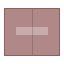 | `application-x-compress-tar` | `.compress-tar` |
|  | `application-x-compressed` | `.compressed` |
|  | `application-x-compressed-iso` | `.compressed-iso` |
|  | `application-x-compressed-tar` | `.compressed-tar` |
|  | `application-x-compressed-zip` | `.compressed-zip` |
|  | `application-x-core` | `.core` |
|  | `application-x-cpio` | `application-x-cpio` |
|  | `application-x-cson` | `application-x-cson` |
|  | `application-x-csproj` | `application-x-csproj` |
|  | `application-x-cue` | `application-x-cue` |
|  | `application-x-dbf` | `application-x-dbf` |
|  | `application-x-dbm` | `.dbm` |
|  | `application-x-ddf` | `.ddf` |
|  | `application-x-deb` | `application-x-deb` |
|  | `application-x-deepinclone-dim` | `.deepinclone-dim` |
|  | `application-x-designer` | `.designer` |
|  | `application-x-desktop` | `.desktop` |
| 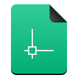 | `application-x-dgn` | `.dgn` |
|  | `application-x-dia-diagram` | `.dia-diagram` |
|  | `application-x-dia-shape` | `.dia-shape` |
|  | `application-x-dlc-container` | `.dlc-container` |
|  | `application-x-dreamcast-rom` | `.dreamcast-rom` |
|  | `application-x-drgeo` | `.drgeo` |
|  | `application-x-dvi` | `.dvi` |
|  | `application-x-dwg` | `application-x-dwg` |
|  | `application-x-e-theme` | `.e-theme` |
|  | `application-x-egon` | `.egon` |
|  | `application-x-emerald-theme` | `.emerald-theme` |
|  | `application-x-eqonomize` | `.eqonomize` |
|  | `application-x-etherpeek` | `.etherpeek` |
|  | `application-x-excel` | `application-x-excel` |
|  | `application-x-executable` | `.executable` |
|  | `application-x-executable-script` | `.executable-script` |
|  | `application-x-extension-eml` | `.extension-eml` |
|  | `application-x-extension-fcstd` | `.extension-fcstd` |
|  | `application-x-extension-html` | `.extension-html` |
|  | `application-x-extension-rss` | `.extension-rss` |
|  | `application-x-fictionbook` | `.fictionbook` |
|  | `application-x-fictionbook+xml` | `.fictionbook+xml` |
|  | `application-x-firmware` | `.firmware` |
|  | `application-x-flash-video` | `.flash-video` |
|  | `application-x-font-afm` | `.afm` |
|  | `application-x-font-bdf` | `.bdf` |
|  | `application-x-font-dos` | `.dos` |
|  | `application-x-font-framemaker` | `.framemaker` |
|  | `application-x-font-libgrx` | `.libgrx` |
|  | `application-x-font-linux-psf` | `.linux-psf` |
|  | `application-x-font-otf` | `application-x-font-otf` |
|  | `application-x-font-pcf` | `.pcf` |
|  | `application-x-font-snf` | `.snf` |
|  | `application-x-font-speedo` | `.speedo` |
|  | `application-x-font-sunos-news` | `.sunos-news` |
|  | `application-x-font-tex` | `.tex` |
|  | `application-x-font-tex-tfm` | `.tex-tfm` |
|  | `application-x-font-ttf` | `application-x-font-ttf` |
|  | `application-x-font-ttx` | `.ttx` |
|  | `application-x-font-type1` | `.type1` |
|  | `application-x-font-vfont` | `.vfont` |
|  | `application-x-fusioncomp` | `.fusioncomp` |
|  | `application-x-gambas3` | `.gambas3` |
|  | `application-x-gambasscript` | `.gambasscript` |
|  | `application-x-gambasserverpage` | `.gambasserverpage` |
|  | `application-x-gameboy-color-rom` | `.gameboy-color-rom` |
|  | `application-x-gameboy-rom` | `.gameboy-rom` |
|  | `application-x-gamecube-rom` | `.gamecube-rom` |
|  | `application-x-gamecube-rom48` | `.gamecube-rom48` |
|  | `application-x-gamegear-rom` | `.gamegear-rom` |
|  | `application-x-gba-rom` | `.gba-rom` |
|  | `application-x-gcstar` | `.gcstar` |
|  | `application-x-gdbm` | `.gdbm` |
|  | `application-x-gdscript` | `.gdscript` |
|  | `application-x-generic` | `.generic` |
|  | `application-x-genesis-32x-rom` | `.genesis-32x-rom` |
|  | `application-x-genesis-rom` | `.genesis-rom` |
|  | `application-x-gettext-translation` | `.gettext-translation` |
|  | `application-x-glabels` | `.glabels` |
|  | `application-x-glade` | `.glade` |
|  | `application-x-gnome-saved-search` | `.gnome-saved-search` |
| 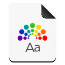 | `application-x-gnome-theme-package` | `.gnome-theme-package` |
|  | `application-x-gnome-theme-package-rtl` | `.gnome-theme-package-rtl` |
|  | `application-x-gnonogram-puzzle` | `.gnonogram-puzzle` |
|  | `application-x-gnumeric` | `.gnumeric` |
|  | `application-x-godot-project` | `.godot-project` |
|  | `application-x-godot-resource` | `.godot-resource` |
|  | `application-x-godot-scene` | `.godot-scene` |
|  | `application-x-godot-shader` | `.godot-shader` |
|  | `application-x-goomod` | `.goomod` |
|  | `application-x-gpx` | `application-x-gpx` |
|  | `application-x-gpx+xml` | `application-x-gpx+xml` |
|  | `application-x-grsync-session` | `.grsync-session` |
|  | `application-x-gtk-builder` | `.gtk-builder` |
|  | `application-x-gtktalog` | `.gtktalog` |
|  | `application-x-gunmeric` | `.gunmeric` |
|  | `application-x-gz-font-linux-psf` | `.gz-font-linux-psf` |
|  | `application-x-gzdvi` | `.gzdvi` |
|  | `application-x-gzip` | `application-x-gzip` |
|  | `application-x-gzpdf` | `.gzpdf` |
|  | `application-x-gzpostscript` | `.gzpostscript` |
|  | `application-x-hda` | `.hda` |
|  | `application-x-hdalc` | `.hdalc` |
|  | `application-x-hdanc` | `.hdanc` |
|  | `application-x-hip` | `.hip` |
|  | `application-x-hiplc` | `.hiplc` |
|  | `application-x-hipnc` | `.hipnc` |
|  | `application-x-homebank` | `.homebank` |
|  | `application-x-hwp` | `.hwp` |
|  | `application-x-hwpx` | `application-x-hwpx` |
|  | `application-x-icq` | `.icq` |
|  | `application-x-iff` | `.iff` |
|  | `application-x-img` | `application-x-img` |
|  | `application-x-ipod-firmware` | `.ipod-firmware` |
|  | `application-x-ips-patch` | `.ips-patch` |
|  | `application-x-iptrace` | `.iptrace` |
|  | `application-x-ipynb+json` | `.ipynb+json` |
|  | `application-x-iso` | `application-x-iso` |
|  | `application-x-iso9660-appimage` | `.iso9660-appimage` |
|  | `application-x-it87` | `.it87` |
|  | `application-x-jar` | `application-x-jar` |
|  | `application-x-java` | `application-x-java` |
|  | `application-x-java-applet` | `.java-applet` |
|  | `application-x-java-archive` | `.java-archive` |
|  | `application-x-java-keystore` | `.java-keystore` |
|  | `application-x-javascript` | `application-x-javascript` |
|  | `application-x-jokosher` | `.jokosher` |
|  | `application-x-k3b` | `.k3b` |
|  | `application-x-kcachegrind` | `.kcachegrind` |
|  | `application-x-kcsrc` | `.kcsrc` |
|  | `application-x-kdenlive` | `.kdenlive` |
|  | `application-x-kdenlivetitle` | `.kdenlivetitle` |
|  | `application-x-keepass` | `.keepass` |
|  | `application-x-keepass2` | `.keepass2` |
|  | `application-x-keepassx` | `.keepassx` |
|  | `application-x-keepassxc` | `.keepassxc` |
|  | `application-x-kexi-connectiondata` | `.kexi-connectiondata` |
|  | `application-x-kexiproject-shortcut` | `.kexiproject-shortcut` |
|  | `application-x-kexiproject-sqlite` | `.kexiproject-sqlite` |
|  | `application-x-kexiproject-sqlite2` | `.kexiproject-sqlite2` |
|  | `application-x-kexiproject-sqlite3` | `.kexiproject-sqlite3` |
|  | `application-x-kformula` | `.kformula` |
|  | `application-x-kgeo` | `.kgeo` |
|  | `application-x-kgetlist` | `.kgetlist` |
|  | `application-x-khtml-adaptor` | `.khtml-adaptor` |
|  | `application-x-kicad-pcb` | `.kicad-pcb` |
|  | `application-x-kicad-project` | `.kicad-project` |
| 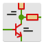 | `application-x-kicad-schematic` | `.kicad-schematic` |
|  | `application-x-kig` | `.kig` |
|  | `application-x-kmplot` | `.kmplot` |
|  | `application-x-kmymoney` | `.kmymoney` |
|  | `application-x-kns` | `.kns` |
|  | `application-x-kodelife-project` | `.kodelife-project` |
|  | `application-x-kolf` | `.kolf` |
|  | `application-x-kommander` | `.kommander` |
|  | `application-x-kontour` | `.kontour` |
|  | `application-x-kontur` | `.kontur` |
|  | `application-x-kopete-emoticons` | `.kopete-emoticons` |
|  | `application-x-kourse` | `.kourse` |
|  | `application-x-kover` | `.kover` |
|  | `application-x-kplato` | `.kplato` |
|  | `application-x-kpresenter` | `.kpresenter` |
|  | `application-x-krita` | `.krita` |
|  | `application-x-krita-assistant` | `.krita-assistant` |
|  | `application-x-krita-paintoppresent` | `.krita-paintoppresent` |
|  | `application-x-kseg` | `.kseg` |
|  | `application-x-ksysguard` | `.ksysguard` |
|  | `application-x-ktheme` | `.ktheme` |
|  | `application-x-kudesigner` | `.kudesigner` |
|  | `application-x-kva` | `.kva` |
|  | `application-x-kvs` | `.kvs` |
|  | `application-x-kvtml` | `.kvtml` |
|  | `application-x-kwallet` | `.kwallet` |
|  | `application-x-kword` | `.kword` |
|  | `application-x-kwordquiz` | `.kwordquiz` |
| 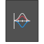 | `application-x-labplot2` | `.labplot2` |
|  | `application-x-lanalyzer` | `.lanalyzer` |
|  | `application-x-lha` | `application-x-lha` |
|  | `application-x-lhz` | `.lhz` |
|  | `application-x-linguist` | `.linguist` |
|  | `application-x-lmms-project` | `.lmms-project` |
|  | `application-x-love-game` | `.love-game` |
|  | `application-x-lyx` | `.lyx` |
|  | `application-x-lz4` | `application-x-lz4` |
|  | `application-x-lz4-compressed-tar` | `.lz4-compressed-tar` |
|  | `application-x-lzip-compressed-tar` | `.lzip-compressed-tar` |
|  | `application-x-lzma` | `application-x-lzma` |
|  | `application-x-lzma-compressed-tar` | `.lzma-compressed-tar` |
|  | `application-x-lzop` | `.lzop` |
|  | `application-x-lzpdf` | `.lzpdf` |
|  | `application-x-m4` | `.m4` |
|  | `application-x-macbinary` | `.macbinary` |
|  | `application-x-maff` | `.maff` |
|  | `application-x-mame-chd` | `.mame-chd` |
|  | `application-x-marble` | `.marble` |
|  | `application-x-mathematica` | `application-x-mathematica` |
|  | `application-x-matroska` | `.matroska` |
|  | `application-x-mif` | `.mif` |
|  | `application-x-mimearchive` | `application-x-mimearchive` |
|  | `application-x-mobi8-ebook` | `.mobi8-ebook` |
|  | `application-x-mobipocket-ebook` | `.mobipocket-ebook` |
|  | `application-x-model` | `.model` |
|  | `application-x-mplayer2` | `.mplayer2` |
|  | `application-x-ms-dos-executable` | `.ms-dos-executable` |
|  | `application-x-ms-shortcut` | `.ms-shortcut` |
|  | `application-x-ms-wim` | `.ms-wim` |
|  | `application-x-msdos-program` | `.msdos-program` |
|  | `application-x-msdownload` | `.msdownload` |
|  | `application-x-msexcel` | `application-x-msexcel` |
|  | `application-x-msi` | `application-x-msi` |
|  | `application-x-mswinurl` | `.mswinurl` |
|  | `application-x-mswrite` | `.mswrite` |
|  | `application-x-msx-rom` | `.msx-rom` |
|  | `application-x-musescore` | `.musescore` |
|  | `application-x-musescore+xml` | `.musescore+xml` |
|  | `application-x-n64-rom` | `.n64-rom` |
|  | `application-x-navi-animation` | `.navi-animation` |
|  | `application-x-neo-geo-pocket-color-rom` | `.neo-geo-pocket-color-rom` |
|  | `application-x-neo-geo-pocket-rom` | `.neo-geo-pocket-rom` |
|  | `application-x-nes-rom` | `.nes-rom` |
|  | `application-x-netinstobserver` | `.netinstobserver` |
|  | `application-x-nettl` | `.nettl` |
|  | `application-x-nintendo-3ds-executable` | `.nintendo-3ds-executable` |
|  | `application-x-nintendo-3ds-rom` | `.nintendo-3ds-rom` |
|  | `application-x-nintendo-ds-rom` | `.nintendo-ds-rom` |
|  | `application-x-nzb` | `.nzb` |
|  | `application-x-object` | `.object` |
|  | `application-x-ole-storage` | `.ole-storage` |
|  | `application-x-openboardview-board` | `.openboardview-board` |
|  | `application-x-openboardview-brd-landrex` | `.openboardview-brd-landrex` |
|  | `application-x-openboardview-brd-r4` | `.openboardview-brd-r4` |
|  | `application-x-openboardview-lst` | `.openboardview-lst` |
|  | `application-x-osm+xml` | `.osm+xml` |
|  | `application-x-pak` | `.pak` |
|  | `application-x-partial-download` | `.partial-download` |
|  | `application-x-patch` | `application-x-patch` |
|  | `application-x-pc-engine-rom` | `.pc-engine-rom` |
|  | `application-x-pcapng` | `.pcapng` |
|  | `application-x-pcbcalculator-project` | `.pcbcalculator-project` |
|  | `application-x-pem-file` | `.pem-file` |
|  | `application-x-pem-key` | `.pem-key` |
|  | `application-x-perl` | `.perl` |
|  | `application-x-phatch` | `.phatch` |
|  | `application-x-php` | `.php` |
|  | `application-x-pkcs12` | `application-x-pkcs12` |
|  | `application-x-pkcs7-certificates` | `.pkcs7-certificates` |
|  | `application-x-planner` | `.planner` |
|  | `application-x-plasma` | `.plasma` |
|  | `application-x-pml18` | `.pml18` |
|  | `application-x-pml18free` | `.pml18free` |
|  | `application-x-powershell` | `.powershell` |
|  | `application-x-prl18` | `.prl18` |
|  | `application-x-prl18free` | `.prl18free` |
|  | `application-x-project` | `application-x-project` |
|  | `application-x-ptoptimizer-script` | `.ptoptimizer-script` |
|  | `application-x-python-bytecode` | `.python-bytecode` |
| 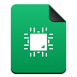 | `application-x-qet-element` | `.qet-element` |
|  | `application-x-qet-project` | `.qet-project` |
|  | `application-x-qtiplot` | `.qtiplot` |
|  | `application-x-quanta` | `.quanta` |
|  | `application-x-quattropro` | `.quattropro` |
|  | `application-x-quemu-disk` | `.quemu-disk` |
|  | `application-x-r-project` | `.r-project` |
|  | `application-x-radcom` | `.radcom` |
|  | `application-x-rar` | `application-x-rar` |
|  | `application-x-rar-compressed` | `.rar-compressed` |
|  | `application-x-raw-disk-image` | `.raw-disk-image` |
|  | `application-x-raw-disk-image-xz-compressed` | `.raw-disk-image-xz-compressed` |
|  | `application-x-raw-floppy-disk-image` | `.raw-floppy-disk-image` |
|  | `application-x-rdata` | `application-x-rdata` |
|  | `application-x-remote-connection` | `.remote-connection` |
|  | `application-x-riff` | `.riff` |
|  | `application-x-root` | `.root` |
|  | `application-x-rosegarden-composition` | `.rosegarden-composition` |
|  | `application-x-rpm` | `application-x-rpm` |
|  | `application-x-rsdf-container` | `.rsdf-container` |
|  | `application-x-ruby` | `.ruby` |
|  | `application-x-sami` | `.sami` |
|  | `application-x-saturn-rom` | `.saturn-rom` |
|  | `application-x-scel` | `.scel` |
|  | `application-x-scribus` | `application-x-scribus` |
|  | `application-x-sega-cd-rom` | `.sega-cd-rom` |
|  | `application-x-sega-pico-rom` | `.sega-pico-rom` |
|  | `application-x-sg1000-rom` | `.sg1000-rom` |
|  | `application-x-shar` | `.shar` |
|  | `application-x-shared-library-la` | `.shared-library-la` |
|  | `application-x-sharedlib` | `.sharedlib` |
|  | `application-x-shellscript` | `.shellscript` |
|  | `application-x-shockwave-flash` | `.shockwave-flash` |
|  | `application-x-siag` | `.siag` |
|  | `application-x-sif` | `.sif` |
|  | `application-x-sin` | `.sin` |
|  | `application-x-sketch` | `application-x-sketch` |
|  | `application-x-skg` | `.skg` |
|  | `application-x-skgc` | `.skgc` |
|  | `application-x-sln` | `application-x-sln` |
|  | `application-x-smb-server` | `.smb-server` |
|  | `application-x-smb-workgroup` | `.smb-workgroup` |
|  | `application-x-sms-rom` | `.sms-rom` |
|  | `application-x-snoop` | `.snoop` |
|  | `application-x-sogouskin` | `.sogouskin` |
|  | `application-x-sony-bbeb` | `.sony-bbeb` |
|  | `application-x-source-rpm` | `.source-rpm` |
|  | `application-x-spectrum` | `.spectrum` |
|  | `application-x-spkac` | `.spkac` |
|  | `application-x-spkac+base64` | `.spkac+base64` |
|  | `application-x-spss-por` | `.spss-por` |
|  | `application-x-spss-sav` | `.spss-sav` |
|  | `application-x-sql` | `application-x-sql` |
|  | `application-x-sqlite2` | `.sqlite2` |
|  | `application-x-sqlite3` | `application-x-sqlite3` |
|  | `application-x-srt` | `application-x-srt` |
|  | `application-x-srtrip` | `.srtrip` |
|  | `application-x-st-disk-image` | `.st-disk-image` |
|  | `application-x-step` | `application-x-step` |
|  | `application-x-stuffit` | `.stuffit` |
|  | `application-x-stx-disk-image` | `.stx-disk-image` |
|  | `application-x-subrip` | `.subrip` |
|  | `application-x-superkaramba` | `.superkaramba` |
|  | `application-x-tar` | `application-x-tar` |
|  | `application-x-tarz` | `.tarz` |
|  | `application-x-tektronix-rf5` | `.tektronix-rf5` |
|  | `application-x-tex-gf` | `.tex-gf` |
|  | `application-x-tex-pk` | `.tex-pk` |
|  | `application-x-texgzdvi` | `.texgzdvi` |
|  | `application-x-tgif` | `.tgif` |
|  | `application-x-theme` | `.theme` |
|  | `application-x-theme-rtl` | `.theme-rtl` |
|  | `application-x-tiled` | `.tiled` |
|  | `application-x-tml18` | `.tml18` |
|  | `application-x-tml18free` | `.tml18free` |
|  | `application-x-trash` | `.trash` |
|  | `application-x-trig` | `.trig` |
|  | `application-x-troff-man` | `.troff-man` |
|  | `application-x-tuberling` | `.tuberling` |
|  | `application-x-turtle` | `.turtle` |
|  | `application-x-tzo` | `.tzo` |
|  | `application-x-uml` | `.uml` |
|  | `application-x-vdi-disk` | `.vdi-disk` |
|  | `application-x-vhd-disk` | `.vhd-disk` |
|  | `application-x-virtual-boy-rom` | `.virtual-boy-rom` |
|  | `application-x-visualnetworks` | `.visualnetworks` |
|  | `application-x-vmdk-disk` | `.vmdk-disk` |
|  | `application-x-vnc` | `.vnc` |
|  | `application-x-vnd.akonadi.calendar` | `.vnd.akonadi.calendar` |
|  | `application-x-vnd.akonadi.calendar.event` | `.vnd.akonadi.calendar.event` |
|  | `application-x-vnd.akonadi.calendar.freebusy` | `.vnd.akonadi.calendar.freebusy` |
|  | `application-x-vnd.akonadi.calendar.journal` | `.vnd.akonadi.calendar.journal` |
|  | `application-x-vnd.akonadi.calendar.todo` | `.vnd.akonadi.calendar.todo` |
|  | `application-x-vnd.akonadi.collection.virtual` | `.vnd.akonadi.collection.virtual` |
|  | `application-x-vnd.akonadi.note` | `.vnd.akonadi.note` |
|  | `application-x-vnd.kde.alarm` | `.vnd.kde.alarm` |
|  | `application-x-vnd.kde.alarm.active` | `.vnd.kde.alarm.active` |
|  | `application-x-vnd.kde.alarm.archived` | `.vnd.kde.alarm.archived` |
|  | `application-x-vnd.kde.alarm.template` | `.vnd.kde.alarm.template` |
|  | `application-x-vnd.kde.contactgroup` | `.vnd.kde.contactgroup` |
|  | `application-x-vnd.kde.kplato` | `.vnd.kde.kplato` |
|  | `application-x-vnd.kde.kplato.work` | `.vnd.kde.kplato.work` |
|  | `application-x-vnd.kde.kugar.mixed` | `.vnd.kde.kugar.mixed` |
|  | `application-x-vnd.kde.notes` | `.vnd.kde.notes` |
|  | `application-x-vnd.kde.plan` | `.vnd.kde.plan` |
|  | `application-x-vnd.kde.plan.work` | `.vnd.kde.plan.work` |
|  | `application-x-wbfs` | `.wbfs` |
|  | `application-x-webarchive` | `.webarchive` |
|  | `application-x-wia` | `.wia` |
|  | `application-x-wii-iso-image` | `.wii-iso-image` |
|  | `application-x-wii-rom` | `.wii-rom` |
|  | `application-x-wii-wad` | `.wii-wad` |
|  | `application-x-windows-themepack` | `.windows-themepack` |
|  | `application-x-wine-extension-cpl` | `.wine-extension-cpl` |
|  | `application-x-wine-extension-inf` | `.wine-extension-inf` |
|  | `application-x-wine-extension-ini` | `.wine-extension-ini` |
|  | `application-x-wine-extension-its` | `.wine-extension-its` |
|  | `application-x-wine-extension-msp` | `.wine-extension-msp` |
|  | `application-x-wine-extension-skb` | `.wine-extension-skb` |
|  | `application-x-wine-extension-skp` | `.wine-extension-skp` |
|  | `application-x-wine-extension-vbs` | `.wine-extension-vbs` |
|  | `application-x-wmf` | `.wmf` |
|  | `application-x-wonderswan-color-rom` | `.wonderswan-color-rom` |
|  | `application-x-wonderswan-rom` | `.wonderswan-rom` |
|  | `application-x-world-of-goo-addin` | `.world-of-goo-addin` |
|  | `application-x-x509-ca-cert` | `.x509-ca-cert` |
|  | `application-x-x509-user-cert` | `.x509-user-cert` |
|  | `application-x-xbel` | `.xbel` |
|  | `application-x-xliff` | `.xliff` |
|  | `application-x-xoj` | `.xoj` |
|  | `application-x-xojpp` | `.xojpp` |
|  | `application-x-xopp` | `.xopp` |
|  | `application-x-xopt` | `.xopt` |
|  | `application-x-xpinstall` | `.xpinstall` |
|  | `application-x-xz` | `application-x-xz` |
|  | `application-x-xz-compressed-tar` | `.xz-compressed-tar` |
|  | `application-x-xz-pkg` | `.xz-pkg` |
|  | `application-x-xzpdf` | `.xzpdf` |
|  | `application-x-yaml` | `.yaml` |
|  | `application-x-yarock` | `.yarock` |
|  | `application-x-zerosize` | `.zerosize` |
|  | `application-x-zip` | `application-x-zip` |
|  | `application-x-zip-compressed-fb2` | `.zip-compressed-fb2` |
|  | `application-x-zoo` | `.zoo` |
|  | `application-x-zoom` | `.zoom` |
|  | `application-x-zstd-compressed-tar` | `.zstd-compressed-tar` |
|  | `application-x.allegorithmic.package+xml` | `..allegorithmic.package+xml` |
|  | `application-x.allegorithmic.spp` | `..allegorithmic.spp` |
|  | `application-x.allegorithmic.substance` | `..allegorithmic.substance` |
|  | `application-x.object` | `..object` |
|  | `application-xhtml+xml` | `.html+xml` |
|  | `application-xliff+xml` | `.liff+xml` |
|  | `application-xmind` | `.mind` |
|  | `application-xml` | `application-xml` |
|  | `application-xml-dtd` | `.ml-dtd` |
|  | `application-xsd` | `.sd` |
|  | `application-xslt+xml` | `.slt+xml` |
|  | `application-xspf+xml` | `.spf+xml` |
|  | `application-yaml` | `application-yaml` |
|  | `application-zip` | `application-zip` |
|  | `application-zlib` | `.zlib` |
|  | `application-zstd` | `application-zstd` |
|  | `applications-accessories` | `.applications-accessories` |
|  | `applications-all` | `.applications-all` |
|  | `applications-chat-panel` | `.applications-chat-panel` |
|  | `applications-development` | `.applications-development` |
|  | `applications-development-translation` | `.applications-development-translation` |
|  | `applications-development-web` | `.applications-development-web` |
|  | `applications-education` | `.applications-education` |
|  | `applications-education-language` | `.applications-education-language` |
|  | `applications-education-mathematics` | `.applications-education-mathematics` |
|  | `applications-education-science` | `.applications-education-science` |
| 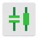 | `applications-electronics` | `.applications-electronics` |
|  | `applications-electronics-Analog` | `.applications-electronics-Analog` |
|  | `applications-electronics-Automation` | `.applications-electronics-Automation` |
|  | `applications-electronics-Digital` | `.applications-electronics-Digital` |
|  | `applications-electronics-Embedded` | `.applications-electronics-Embedded` |
|  | `applications-electronics-SchematicPCB` | `.applications-electronics-SchematicPCB` |
|  | `applications-electronics-Spice` | `.applications-electronics-Spice` |
|  | `applications-email-panel` | `.applications-email-panel` |
|  | `applications-engineering` | `.applications-engineering` |
|  | `applications-featured` | `.applications-featured` |
|  | `applications-fonts` | `.applications-fonts` |
|  | `applications-games` | `.applications-games` |
|  | `applications-graphics` | `.applications-graphics` |
|  | `applications-haskell` | `.applications-haskell` |
|  | `applications-interfacedesign` | `.applications-interfacedesign` |
|  | `applications-internet` | `.applications-internet` |
|  | `applications-java` | `.applications-java` |
|  | `applications-languages` | `.applications-languages` |
|  | `applications-multimedia` | `.applications-multimedia` |
|  | `applications-office` | `.applications-office` |
|  | `applications-other` | `.applications-other` |
|  | `applications-photography` | `.applications-photography` |
|  | `applications-php` | `.applications-php` |
|  | `applications-python` | `.applications-python` |
|  | `applications-science` | `.applications-science` |
|  | `applications-system` | `.applications-system` |
|  | `applications-system-orange` | `.applications-system-orange` |
|  | `applications-utilities` | `.applications-utilities` |
|  | `applications-webapps` | `.applications-webapps` |
|  | `applications-webbrowsers` | `.applications-webbrowsers` |
|  | `applixware` | `.applixware` |
|  | `appointment` | `.appointment` |
|  | `appointment-new` | `.appointment-new` |
|  | `appointment-recurring` | `.appointment-recurring` |
|  | `appointment-reminder` | `.appointment-reminder` |
|  | `appointment-soon` | `.appointment-soon` |
|  | `apport` | `.apport` |
|  | `apport-gtk` | `.apport-gtk` |
|  | `apport-gtk2` | `.apport-gtk2` |
|  | `approved` | `.approved` |
|  | `apps-script` | `.gs` |
|  | `apps.bible.cbol` | `.apps.bible.cbol` |
|  | `apps.cn.360yunpan` | `.apps.cn.360yunpan` |
|  | `apps.cn.com.winrar` | `.apps.cn.com.winrar` |
|  | `apps.cn.emoney` | `.apps.cn.emoney` |
|  | `apps.cn.ibuka` | `.apps.cn.ibuka` |
|  | `apps.cn.kugou.hd` | `.apps.cn.kugou.hd` |
|  | `apps.cn.kuwo.kwmusic` | `.apps.cn.kuwo.kwmusic` |
|  | `apps.co.polarr` | `.apps.co.polarr` |
|  | `apps.com.163.mail.dashi.pc` | `.apps.com.163.mail.dashi.pc` |
|  | `apps.com.2048` | `.apps.com.2048` |
|  | `apps.com.95579.cjsc` | `.apps.com.95579.cjsc` |
|  | `apps.com.aaa-logo` | `.apps.com.aaa-logo` |
|  | `apps.com.aiqiyi` | `.apps.com.aiqiyi` |
|  | `apps.com.airdroid.web` | `.apps.com.airdroid.web` |
|  | `apps.com.asoftmurmur` | `.apps.com.asoftmurmur` |
|  | `apps.com.baidu.cloud` | `.apps.com.baidu.cloud` |
|  | `apps.com.baidu.map` | `.apps.com.baidu.map` |
|  | `apps.com.baidu.music` | `.apps.com.baidu.music` |
|  | `apps.com.baidu.music.pad` | `.apps.com.baidu.music.pad` |
|  | `apps.com.baidu.naotu` | `.apps.com.baidu.naotu` |
|  | `apps.com.baidu.tieba` | `.apps.com.baidu.tieba` |
|  | `apps.com.bigfarm` | `.apps.com.bigfarm` |
|  | `apps.com.cookpad` | `.apps.com.cookpad` |
|  | `apps.com.dayima` | `.apps.com.dayima` |
|  | `apps.com.dingtalk.im` | `.apps.com.dingtalk.im` |
|  | `apps.com.douban.radio` | `.apps.com.douban.radio` |
|  | `apps.com.duokan` | `.apps.com.duokan` |
|  | `apps.com.easymindmap` | `.apps.com.easymindmap` |
|  | `apps.com.evernote` | `.apps.com.evernote` |
|  | `apps.com.gliffy` | `.apps.com.gliffy` |
|  | `apps.com.gokuai` | `.apps.com.gokuai` |
|  | `apps.com.goodgame.empire` | `.apps.com.goodgame.empire` |
|  | `apps.com.google.docs` | `.apps.com.google.docs` |
|  | `apps.com.google.drive` | `.apps.com.google.drive` |
|  | `apps.com.google.hangouts` | `.apps.com.google.hangouts` |
|  | `apps.com.google.mail` | `.apps.com.google.mail` |
|  | `apps.com.google.map` | `.apps.com.google.map` |
|  | `apps.com.hwadzanebook` | `.apps.com.hwadzanebook` |
|  | `apps.com.ibookstar` | `.apps.com.ibookstar` |
|  | `apps.com.instagram` | `.apps.com.instagram` |
|  | `apps.com.issuu` | `.apps.com.issuu` |
|  | `apps.com.kanjian.radio` | `.apps.com.kanjian.radio` |
|  | `apps.com.kugou.music` | `.apps.com.kugou.music` |
|  | `apps.com.letv` | `.apps.com.letv` |
|  | `apps.com.letv.lecloud.disk` | `.apps.com.letv.lecloud.disk` |
|  | `apps.com.meitu` | `.apps.com.meitu` |
|  | `apps.com.microsoft.skydrive` | `.apps.com.microsoft.skydrive` |
|  | `apps.com.mindmup` | `.apps.com.mindmup` |
|  | `apps.com.minefield` | `.apps.com.minefield` |
|  | `apps.com.netease.newsreader` | `.apps.com.netease.newsreader` |
|  | `apps.com.office` | `.apps.com.office` |
|  | `apps.com.onlinego` | `.apps.com.onlinego` |
|  | `apps.com.openapp` | `.apps.com.openapp` |
|  | `apps.com.outlook` | `.apps.com.outlook` |
|  | `apps.com.pacman` | `.apps.com.pacman` |
|  | `apps.com.pixlr` | `.apps.com.pixlr` |
|  | `apps.com.processon` | `.apps.com.processon` |
|  | `apps.com.qianlong` | `.apps.com.qianlong` |
|  | `apps.com.qq.b.eim` | `.apps.com.qq.b.eim` |
|  | `apps.com.qq.im` | `.apps.com.qq.im` |
|  | `apps.com.qq.rtxclient` | `.apps.com.qq.rtxclient` |
|  | `apps.com.qq.xf` | `.apps.com.qq.xf` |
|  | `apps.com.sanguosha` | `.apps.com.sanguosha` |
|  | `apps.com.sina.weibo` | `.apps.com.sina.weibo` |
|  | `apps.com.smallpdf` | `.apps.com.smallpdf` |
|  | `apps.com.smartisan.cloud` | `.apps.com.smartisan.cloud` |
|  | `apps.com.smartsheet` | `.apps.com.smartsheet` |
|  | `apps.com.taobao.aliclient.qianniu` | `.apps.com.taobao.aliclient.qianniu` |
|  | `apps.com.taobao.aliclient.wangwang` | `.apps.com.taobao.aliclient.wangwang` |
|  | `apps.com.tianqitong` | `.apps.com.tianqitong` |
|  | `apps.com.tonghuashun` | `.apps.com.tonghuashun` |
|  | `apps.com.tongyong.xxbox` | `.apps.com.tongyong.xxbox` |
|  | `apps.com.ttpod` | `.apps.com.ttpod` |
|  | `apps.com.undrtone` | `.apps.com.undrtone` |
|  | `apps.com.wechat.web` | `.apps.com.wechat.web` |
|  | `apps.com.wedevote` | `.apps.com.wedevote` |
|  | `apps.com.weiyun` | `.apps.com.weiyun` |
|  | `apps.com.windhd` | `.apps.com.windhd` |
|  | `apps.com.wunderlist` | `.apps.com.wunderlist` |
|  | `apps.com.yidianzixun` | `.apps.com.yidianzixun` |
|  | `apps.com.youdao.hanyu` | `.apps.com.youdao.hanyu` |
|  | `apps.com.youdao.note` | `.apps.com.youdao.note` |
|  | `apps.com.zhihu.daily` | `.apps.com.zhihu.daily` |
|  | `apps.com.zhuishushenqi` | `.apps.com.zhuishushenqi` |
|  | `apps.de.danoeh.antennapod` | `.apps.de.danoeh.antennapod` |
|  | `apps.douban.fm` | `.apps.douban.fm` |
|  | `apps.im.shimo` | `.apps.im.shimo` |
|  | `apps.im.yixin` | `.apps.im.yixin` |
|  | `apps.io.gravit` | `.apps.io.gravit` |
|  | `apps.me.rainforme` | `.apps.me.rainforme` |
|  | `apps.net.hextris` | `.apps.net.hextris` |
|  | `apps.net.kcals` | `.apps.net.kcals` |
|  | `apps.net.skyinc` | `.apps.net.skyinc` |
|  | `apps.org.7-zip` | `.apps.org.7-zip` |
|  | `apps.org.drichard.mindmaps` | `.apps.org.drichard.mindmaps` |
|  | `apps.org.foobar2000` | `.apps.org.foobar2000` |
|  | `apps.org.mozilla.browserquest` | `.apps.org.mozilla.browserquest` |
|  | `appsemble` | `.appsemble` |
|  | `appset` | `.appset` |
|  | `appstore` | `.appstore` |
| 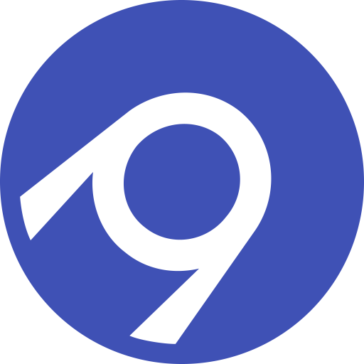 | `appveyor` | `.appveyor.yml`, `appveyor.yml` |
|  | `aptana` | `.aptana` |
|  | `aptana-studio` | `.aptana-studio` |
|  | `aptdaemon-download` | `.aptdaemon-download` |
|  | `aptdaemon-update-cache` | `.aptdaemon-update-cache` |
|  | `aptdaemon-upgrade` | `.aptdaemon-upgrade` |
|  | `aptdaemon-working` | `.aptdaemon-working` |
|  | `aptik-battery-monitor` | `.aptik-battery-monitor` |
|  | `aqualung` | `.aqualung` |
|  | `ar.com.tuxguitar.TuxGuitar` | `.ar.com.tuxguitar.TuxGuitar` |
|  | `ar.xjuan.Cambalache` | `.ar.xjuan.Cambalache` |
| 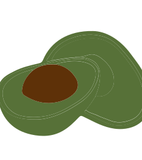 | `arangodb` | `.arangodb` |
| 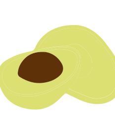 | `arangodb_dark` | `.arangodb_dark` |
|  | `aranym` | `.aranym` |
|  | `aranym-jit` | `.aranym-jit` |
|  | `aranym-mmu` | `.aranym-mmu` |
| 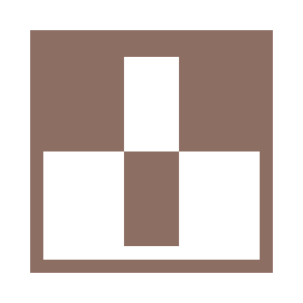 | `arc` | `arc` |
|  | `arca` | `.arca` |
|  | `archipelago` | `.archipelago` |
| 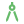 | `architecture` | `architecture.md`, `architecture.rst`, `architecture.txt`, `architecture` |
|  | `archive` | `archive` |
|  | `archive-extract` | `.archive-extract` |
|  | `archive-insert` | `.archive-insert` |
|  | `archive-insert-directory` | `.archive-insert-directory` |
|  | `archive-manager` | `.archive-manager` |
|  | `archive-remove` | `.archive-remove` |
|  | `archive2` | `.archive2` |
|  | `archive3` | `.archive3` |
|  | `archivemanager` | `.archivemanager` |
| 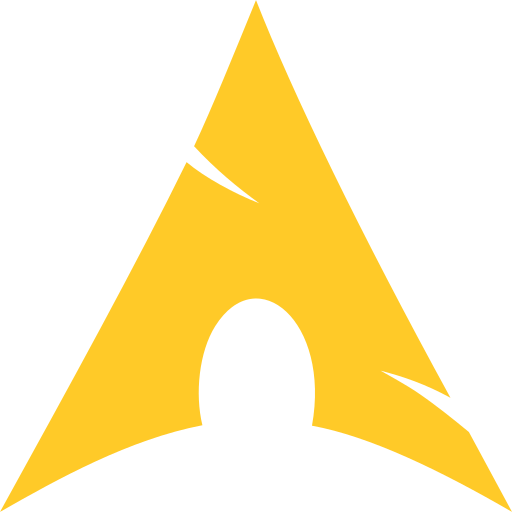 | `archlinux` | `.archlinux` |
|  | `arcolinux-hello` | `.arcolinux-hello` |
|  | `arcolinux-tweak-tool` | `.arcolinux-tweak-tool` |
|  | `ardour` | `ardour` |
|  | `Ardour-Ardour_4.0.0` | `.Ardour-Ardour_4.0.0` |
|  | `Ardour-Ardour_5.12.0` | `.Ardour-Ardour_5.12.0` |
|  | `Ardour-Ardour_6.0.0` | `.Ardour-Ardour_6.0.0` |
|  | `Ardour-Ardour_6.5.0` | `.Ardour-Ardour_6.5.0` |
|  | `Ardour-Ardour_8.0.0` | `.Ardour-Ardour_8.0.0` |
|  | `Ardour-icon_256px` | `.Ardour-icon_256px` |
|  | `ardour2` | `.ardour2` |
|  | `ardour3` | `.ardour3` |
|  | `ardour4` | `.ardour4` |
|  | `ardour5` | `.ardour5` |
|  | `ardour6` | `.ardour6` |
|  | `ardour7` | `.ardour7` |
|  | `ardour8` | `.ardour8` |
| 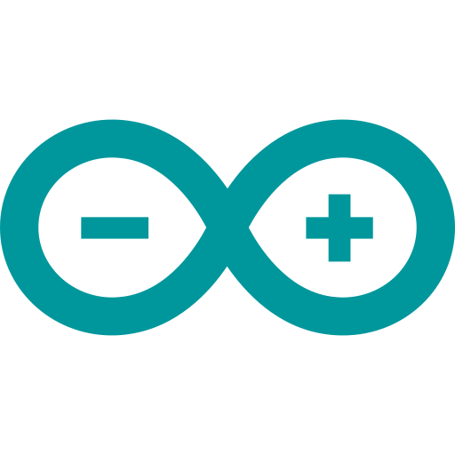 | `arduino` | `.ino` |
|  | `arduino-arduinoide` | `.arduino-arduinoide` |
|  | `arduino-icon-small` | `.arduino-icon-small` |
|  | `arduino-ide` | `.arduino-ide` |
|  | `arend` | `.arend` |
|  | `arendconfig` | `.arendconfig` |
|  | `ares` | `.ares` |
|  | `argouml` | `.argouml` |
|  | `arianna` | `.arianna` |
|  | `ark` | `.ark` |
|  | `ark-desktop-wallet` | `.ark-desktop-wallet` |
|  | `ark-game` | `.ark-game` |
|  | `arkade` | `.arkade` |
|  | `arm` | `.arm` |
|  | `armagetronad` | `.armagetronad` |
|  | `armello` | `.armello` |
|  | `armitage` | `.armitage` |
|  | `arora` | `.arora` |
|  | `around` | `.around` |
|  | `array` | `.array` |
|  | `arrow` | `.arrow` |
|  | `arrow-arrow-down` | `.arrow-arrow-down` |
|  | `arrow-arrow-right` | `.arrow-arrow-right` |
|  | `arrow-arrow-up` | `.arrow-arrow-up` |
|  | `arrow-both` | `.arrow-both` |
|  | `arrow-circle-down` | `.arrow-circle-down` |
|  | `arrow-circle-left` | `.arrow-circle-left` |
|  | `arrow-circle-right` | `.arrow-circle-right` |
|  | `arrow-circle-up` | `.arrow-circle-up` |
|  | `arrow-down` | `.arrow-down` |
|  | `arrow-down-dark` | `.arrow-down-dark` |
|  | `arrow-down-double` | `.arrow-down-double` |
|  | `arrow-left` | `.arrow-left` |
|  | `arrow-left-dark` | `.arrow-left-dark` |
|  | `arrow-left-double` | `.arrow-left-double` |
|  | `arrow-material-down` | `.arrow-material-down` |
|  | `arrow-material-right` | `.arrow-material-right` |
|  | `arrow-material-up` | `.arrow-material-up` |
|  | `arrow-plusminus-down` | `.arrow-plusminus-down` |
|  | `arrow-plusminus-right` | `.arrow-plusminus-right` |
|  | `arrow-plusminus-up` | `.arrow-plusminus-up` |
|  | `arrow-right` | `.arrow-right` |
|  | `arrow-right-dark` | `.arrow-right-dark` |
|  | `arrow-right-double` | `.arrow-right-double` |
|  | `arrow-swap` | `.arrow-swap` |
|  | `arrow-triangle-down` | `.arrow-triangle-down` |
|  | `arrow-triangle-right` | `.arrow-triangle-right` |
|  | `arrow-triangle-up` | `.arrow-triangle-up` |
|  | `arrow-up` | `.arrow-up` |
|  | `arrow-up-dark` | `.arrow-up-dark` |
|  | `arrow-up-double` | `.arrow-up-double` |
|  | `artemanufrij.imageburner` | `.artemanufrij.imageburner` |
|  | `artemanufrij.metronome` | `.artemanufrij.metronome` |
|  | `artemanufrij.playmymusic` | `.artemanufrij.playmymusic` |
|  | `artha` | `.artha` |
|  | `artifact` | `.artifact` |
|  | `artikulate` | `.artikulate` |
|  | `artistictext-tool` | `.artistictext-tool` |
|  | `arts` | `.arts` |
|  | `artsbuilder` | `.artsbuilder` |
|  | `artscontrol` | `.artscontrol` |
|  | `arttext` | `.arttext` |
|  | `as-icon` | `.as-icon` |
|  | `as-powered` | `.as-powered` |
|  | `asbru-cm` | `.asbru-cm` |
|  | `asc-de` | `.asc-de` |
|  | `ascii` | `.ascii` |
|  | `asciidoc` | `.ad`, `.adoc`, `.asciidoc` |
|  | `asciidocfx` | `.asciidocfx` |
|  | `asciiportal` | `.asciiportal` |
|  | `aseprite` | `aseprite` |
|  | `asm` | `asm` |
|  | `asmpure` | `.asmpure` |
|  | `asounder` | `.asounder` |
|  | `asp` | `asp` |
|  | `aspectj` | `.aspectj` |
|  | `aspia_client` | `.aspia_client` |
|  | `aspia_console` | `.aspia_console` |
|  | `assaultcube` | `.assaultcube` |
|  | `assembly` | `.asm`, `.a51`, `.inc`, `.nasm`, `.s`, `.ms`, `.agc`, `.ags`, `.aea`, `.argus`, `.mitigus`, `.binsource` |
|  | `assistant` | `.assistant` |
|  | `assistant-qt4` | `.assistant-qt4` |
|  | `assistant-qt5` | `.assistant-qt5` |
|  | `assistant-qt6` | `.assistant-qt6` |
|  | `assistant5` | `.assistant5` |
|  | `association` | `.association` |
|  | `astah_community` | `.astah_community` |
|  | `astah_gsn` | `.astah_gsn` |
|  | `astah_professional` | `.astah_professional` |
|  | `astah_sysml` | `.astah_sysml` |
|  | `astah_uml` | `.astah_uml` |
|  | `astah_viewer` | `.astah_viewer` |
|  | `astah-community` | `.astah-community` |
|  | `astah-pro` | `.astah-pro` |
|  | `astahc` | `.astahc` |
|  | `astro` | `.astro` |
|  | `astro-config` | `astro.config.js`, `astro.config.mjs`, `astro.config.cjs`, `astro.config.ts`, `astro.config.cts`, `astro.config.mts` |
|  | `astroconfig` | `.astroconfig` |
|  | `astromenace` | `.astromenace` |
|  | `astyle` | `.astylerc` |
|  | `asunder` | `.asunder` |
|  | `asymptote` | `.asymptote` |
|  | `at.priv.toastfreeware.ConfClerk` | `.at.priv.toastfreeware.ConfClerk` |
|  | `atari-vault` | `.atari-vault` |
|  | `atari800` | `.atari800` |
|  | `aterm` | `.aterm` |
|  | `athena` | `.athena` |
|  | `athens` | `.athens` |
|  | `atlantik` | `.atlantik` |
|  | `atlantikdesigner` | `.atlantikdesigner` |
|  | `atlas` | `.atlas` |
|  | `atlauncher` | `.atlauncher` |
|  | `atmosphere` | `.atmosphere` |
|  | `atom` | `.atom` |
|  | `atom_dark` | `.atom_dark` |
|  | `atom-beta` | `.atom-beta` |
|  | `atom-nightly` | `.atom-nightly` |
|  | `atom-rpg` | `.atom-rpg` |
|  | `atomic` | `.atomic` |
|  | `atomix` | `.atomix` |
|  | `atomix-icon` | `.atomix-icon` |
|  | `atoum` | `.atoum` |
|  | `atril` | `.atril` |
|  | `ats` | `.ats` |
|  | `attach-path` | `.attach-path` |
|  | `atunes` | `.atunes` |
|  | `au.edu.uq.esys.escript` | `.au.edu.uq.esys.escript` |
|  | `audacity` | `.audacity` |
|  | `audacity16` | `.audacity16` |
|  | `audacity32` | `.audacity32` |
|  | `audacium` | `.audacium` |
|  | `audex` | `.audex` |
|  | `audience` | `.audience` |
|  | `audio` | `.8svx`, `.aa`, `.aac`, `.aax`, `.ac3`, `.aif`, `.aiff`, `.alac`, `.amr`, `.ape`, `.caf`, `.cda`, `.cdr`, `.dss`, `.ec3`, `.efs`, `.enc`, `.flac`, `.flp`, `.gp`, `.gsm`, `.it`, `.m3u`, `.m3u8`, `.m4a`, `.m4b`, `.m4p`, `.m4r`, `.mid`, `.mka`, `.mmf`, `.mod`, `.mp3`, `.mpc`, `.mscz`, `.mtm`, `.mui`, `.musx`, `.mxl`, `.nsa`, `.opus`, `.pkf`, `.qcp`, `.ra`, `.rf64`, `.rip`, `.sdt`, `.sesx`, `.sf2`, `.stap`, `.tg`, `.voc`, `.vqf`, `.wav`, `.weba`, `.wfp`, `.wma`, `.wpl`, `.wproj`, `.wv` |
|  | `audio2` | `.audio2` |
|  | `audio3` | `.audio3` |
|  | `audiobook` | `.audiobook` |
|  | `audiosurf` | `.audiosurf` |
|  | `audiosurf-2` | `.audiosurf-2` |
|  | `audoban.applet.playbar` | `.audoban.applet.playbar` |
|  | `augeas` | `.augeas` |
|  | `augur` | `.augur` |
|  | `aurees` | `.aurees` |
|  | `aurelia` | `aurelia.json` |
|  | `auryo` | `.auryo` |
|  | `auth-sim` | `.auth-sim` |
|  | `auth-sim-locked` | `.auth-sim-locked` |
|  | `auth-sim-missing` | `.auth-sim-missing` |
|  | `author` | `.author` |
|  | `authors` | `authors.md`, `authors.rst`, `authors.txt`, `authors`, `contributors.md`, `contributors.rst`, `contributors.txt`, `contributors` |
|  | `authpass` | `.authpass` |
|  | `authy` | `.authy` |
|  | `auto` | `.autorc`, `auto.config.js`, `auto.config.ts`, `auto-config.json`, `auto-config.yaml`, `auto-config.yml`, `auto-config.ts`, `auto-config.js` |
|  | `auto_light` | `.auto_light` |
|  | `auto-scale-all` | `.auto-scale-all` |
|  | `auto-scale-x` | `.auto-scale-x` |
|  | `auto-scale-y` | `.auto-scale-y` |
|  | `auto-transition` | `.auto-transition` |
|  | `auto-type` | `.auto-type` |
|  | `autocorrection` | `.autocorrection` |
|  | `autofirma` | `.autofirma` |
|  | `autohotkey` | `.ahk` |
|  | `autoit` | `.au3` |
|  | `autokey` | `.autokey` |
|  | `autokey-gtk` | `.autokey-gtk` |
|  | `autokey-status` | `.autokey-status` |
|  | `autokey-status-error` | `.autokey-status-error` |
|  | `automated-tasks` | `.automated-tasks` |
|  | `automated-tool-reminder` | `.automated-tool-reminder` |
|  | `automator` | `.automator` |
|  | `autopackage-installer` | `.autopackage-installer` |
|  | `autoremesher` | `.autoremesher` |
|  | `ava` | `.ava` |
|  | `avaloniailspy` | `.avaloniailspy` |
|  | `avant-window-navigator` | `.avant-window-navigator` |
|  | `avatar-default` | `.avatar-default` |
|  | `avidemux` | `.avidemux` |
|  | `avidemux_icon` | `.avidemux_icon` |
|  | `avif` | `avif` |
|  | `avimetaedit` | `.avimetaedit` |
|  | `avocado` | `.avocado` |
|  | `avocode` | `.avocode` |
|  | `avocode-app-icon` | `.avocode-app-icon` |
|  | `avogadro-icon` | `.avogadro-icon` |
|  | `avogadro2` | `.avogadro2` |
|  | `avr` | `.avr` |
|  | `avro` | `.avro` |
|  | `awesomebump` | `.awesomebump` |
|  | `awf` | `.awf` |
|  | `awgg` | `.awgg` |
|  | `awk` | `awk` |
|  | `awn-applet` | `.awn-applet` |
|  | `awn-manager` | `.awn-manager` |
|  | `awn-plugins` | `.awn-plugins` |
|  | `awn-settings` | `.awn-settings` |
|  | `awn-window-fallback` | `.awn-window-fallback` |
|  | `aws` | `.aws` |
|  | `ax-applet` | `.ax-applet` |
|  | `ayatana-settings` | `.ayatana-settings` |
|  | `azardi` | `.azardi` |
|  | `azpainter` | `.azpainter` |
|  | `azure` | `.azcli` |
|  | `azure-devops` | `.azure-devops` |
|  | `azure-pipelines` | `.azure-pipelines.yml`, `.azure-pipelines.yaml`, `.azure-pipelines-main.yml`, `.azure-pipelines-main.yaml`, `azure-pipelines.yml`, `azure-pipelines.yaml`, `azure-pipelines-main.yml`, `azure-pipelines-main.yaml` |
|  | `azuredatastudio` | `.azuredatastudio` |
|  | `azurepipelines` | `.azurepipelines` |
|  | `azureus` | `.azureus` |
|  | `baba-is-you` | `.baba-is-you` |
|  | `babe` | `.babe` |
|  | `babel` | `.babelrc`, `.babelrc.json`, `.babelrc.jsonc`, `.babelrc.json5`, `.babelrc.yaml`, `.babelrc.yml`, `.babelrc.toml`, `.babelrc.js`, `.babelrc.mjs`, `.babelrc.cjs`, `.babelrc.ts`, `.babelrc.mts`, `.babelrc.cts`, `.config/babelrc`, `.config/babelrc.json`, `.config/babelrc.jsonc`, `.config/babelrc.json5`, `.config/babelrc.yaml`, `.config/babelrc.yml`, `.config/babelrc.toml`, `.config/babelrc.js`, `.config/babelrc.mjs`, `.config/babelrc.cjs`, `.config/babelrc.ts`, `.config/babelrc.mts`, `.config/babelrc.cts`, `babel.config.json`, `babel.config.jsonc`, `babel.config.json5`, `babel.config.yaml`, `babel.config.yml`, `babel.config.toml`, `babel.config.js`, `babel.config.mjs`, `babel.config.cjs`, `babel.config.ts`, `babel.config.mts`, `babel.config.cts`, `.babel-plugin-macrosrc`, `.babel-plugin-macrosrc.json`, `.babel-plugin-macrosrc.jsonc`, `.babel-plugin-macrosrc.json5`, `.babel-plugin-macrosrc.yaml`, `.babel-plugin-macrosrc.yml`, `.babel-plugin-macrosrc.toml`, `.babel-plugin-macrosrc.js`, `.babel-plugin-macrosrc.mjs`, `.babel-plugin-macrosrc.cjs`, `.babel-plugin-macrosrc.ts`, `.babel-plugin-macrosrc.mts`, `.babel-plugin-macrosrc.cts`, `.config/babel-plugin-macrosrc`, `.config/babel-plugin-macrosrc.json`, `.config/babel-plugin-macrosrc.jsonc`, `.config/babel-plugin-macrosrc.json5`, `.config/babel-plugin-macrosrc.yaml`, `.config/babel-plugin-macrosrc.yml`, `.config/babel-plugin-macrosrc.toml`, `.config/babel-plugin-macrosrc.js`, `.config/babel-plugin-macrosrc.mjs`, `.config/babel-plugin-macrosrc.cjs`, `.config/babel-plugin-macrosrc.ts`, `.config/babel-plugin-macrosrc.mts`, `.config/babel-plugin-macrosrc.cts`, `babel-plugin-macros.config.json`, `babel-plugin-macros.config.jsonc`, `babel-plugin-macros.config.json5`, `babel-plugin-macros.config.yaml`, `babel-plugin-macros.config.yml`, `babel-plugin-macros.config.toml`, `babel-plugin-macros.config.js`, `babel-plugin-macros.config.mjs`, `babel-plugin-macros.config.cjs`, `babel-plugin-macros.config.ts`, `babel-plugin-macros.config.mts`, `babel-plugin-macros.config.cts`, `babel-transform.js` |
|  | `babelconfig` | `.babelconfig` |
|  | `baboon` | `.baboon` |
|  | `back` | `.back` |
|  | `backbone` | `.backbone` |
|  | `backdoor-factory` | `.backdoor-factory` |
|  | `background` | `.background` |
|  | `backgroundtool` | `.backgroundtool` |
|  | `backlite` | `.backlite` |
|  | `backup` | `.backup` |
|  | `bad-marker` | `.bad-marker` |
|  | `bad-signal` | `.bad-signal` |
|  | `bad-signal-lock` | `.bad-signal-lock` |
|  | `badge-small` | `.badge-small` |
|  | `badland` | `.badland` |
|  | `BadlionClient` | `.BadlionClient` |
|  | `baidunetdisk` | `.baidunetdisk` |
|  | `baiji-manga-viewer` | `.baiji-manga-viewer` |
|  | `baka-mplayer` | `.baka-mplayer` |
|  | `baldis-basics` | `.baldis-basics` |
|  | `balena-etcher` | `.balena-etcher` |
|  | `balena-etcher-electron` | `.balena-etcher-electron` |
|  | `ballerina` | `.bal`, `.balx` |
|  | `ballz` | `.ballz` |
|  | `baloo` | `.baloo` |
|  | `balsa` | `.balsa` |
|  | `BambooTracker` | `.BambooTracker` |
|  | `bambustudio` | `.bambustudio` |
|  | `bandcamp` | `.bandcamp` |
|  | `bandit` | `.bandit` |
|  | `banji` | `.banji` |
|  | `banshee` | `.banshee` |
|  | `banshee-1` | `.banshee-1` |
|  | `banshee-panel` | `.banshee-panel` |
|  | `baobab` | `.baobab` |
|  | `bareftp` | `.bareftp` |
|  | `barony` | `.barony` |
|  | `barotrauma` | `.barotrauma` |
|  | `barrier` | `.barrier` |
|  | `Basecamp` | `.Basecamp` |
|  | `basex` | `.basex` |
|  | `bash` | `bash` |
|  | `bashly` | `src/bashly.yaml`, `src/bashly.yml` |
|  | `bashly-hook` | `src/initialize.sh`, `src/before.sh`, `src/after.sh` |
|  | `bashly-settings` | `bashly-settings.yaml`, `bashly-settings.yml` |
|  | `bashly-settings` | `settings.yaml`, `settings.yml` |
|  | `bashly-settings_light.clone` | `.bashly-settings_light.clone` |
|  | `bashly-settings.clone` | `.bashly-settings.clone` |
|  | `bashly-strings` | `src/bashly-strings.yaml`, `src/bashly-strings.yml` |
|  | `bashly-strings_light.clone` | `.bashly-strings_light.clone` |
|  | `bashly-strings.clone` | `.bashly-strings.clone` |
|  | `bashtop` | `.bashtop` |
|  | `basic` | `.basic` |
|  | `basilisk2` | `.basilisk2` |
|  | `basingstoke` | `.basingstoke` |
|  | `basket` | `.basket` |
|  | `bass` | `.bass` |
|  | `bastion` | `.bastion` |
|  | `batmon` | `.batmon` |
|  | `bats` | `.bats` |
|  | `bats_dark` | `.bats_dark` |
|  | `battery_charged` | `.battery_charged` |
|  | `battery_full` | `.battery_full` |
|  | `battery_plugged` | `.battery_plugged` |
|  | `battleblock-theater` | `.battleblock-theater` |
|  | `bauh` | `.bauh` |
|  | `bazaar` | `.bazaar` |
|  | `bazecor` | `.bazecor` |
|  | `bazel` | `.bzl`, `.bazel`, `.bazelignore`, `.bazelrc`, `.bazelversion` |
|  | `bazelconfig` | `.bazelconfig` |
|  | `bazelignore` | `.bazelignore` |
|  | `bbc` | `.bbc` |
|  | `bboxnext` | `.bboxnext` |
|  | `bboxprev` | `.bboxprev` |
|  | `bbx` | `.bbx` |
|  | `bc` | `.bc` |
|  | `bcloud` | `.bcloud` |
|  | `bcompare` | `.bcompare` |
|  | `beagled` | `.beagled` |
|  | `beaker` | `.beaker` |
|  | `beaker-browser` | `.beaker-browser` |
|  | `beaker-stop` | `.beaker-stop` |
|  | `beamerblock` | `.beamerblock` |
|  | `beamerframe` | `.beamerframe` |
|  | `beamng-drive` | `.beamng-drive` |
|  | `bean` | `bean` |
|  | `beancount` | `.beancount`, `.bean` |
|  | `beanfiles` | `.beanfiles` |
|  | `bearychat` | `.bearychat` |
|  | `beast` | `.beast` |
|  | `beat-hazard` | `.beat-hazard` |
|  | `beat-hazard-2` | `.beat-hazard-2` |
|  | `beat-saber` | `.beat-saber` |
|  | `beatbox` | `.beatbox` |
|  | `becalm` | `.becalm` |
|  | `bee-package-manager` | `.bee-package-manager` |
|  | `beekeeper-studio` | `.beekeeper-studio` |
|  | `beeper` | `.beeper` |
|  | `beepertexts` | `.beepertexts` |
|  | `behat` | `.behat` |
|  | `behatconfig` | `.behatconfig` |
|  | `beholder` | `.beholder` |
|  | `beholder-2` | `.beholder-2` |
|  | `bell` | `.bell` |
|  | `bell-dot` | `.bell-dot` |
|  | `bem` | `.bem` |
|  | `bench` | `.bench` |
|  | `bench-js` | `.bench.js`, `.bench.cjs`, `.bench.mjs` |
|  | `bench-jsx` | `.bench.jsx`, `.bench.tsx` |
|  | `bench-ts` | `.bench.ts`, `.bench.cts`, `.bench.mts` |
|  | `bend-path` | `.bend-path` |
|  | `bendy-and-the-ink-machine` | `.bendy-and-the-ink-machine` |
|  | `beneath-a-steel-sky` | `.beneath-a-steel-sky` |
|  | `berksfile` | `.berksfile` |
|  | `berry` | `.berry` |
|  | `beryl-settings` | `.beryl-settings` |
|  | `besiege` | `.besiege` |
|  | `bespoke_icon` | `.bespoke_icon` |
|  | `betaflight-configurator` | `.betaflight-configurator` |
|  | `betterbird` | `.betterbird` |
|  | `beyond-a-steel-sky` | `.beyond-a-steel-sky` |
|  | `beyondallreason` | `.beyondallreason` |
|  | `bfbf` | `.bfbf` |
|  | `bforartists` | `.bforartists` |
|  | `bibletime` | `.bibletime` |
|  | `bibliography` | `.bib` |
|  | `bibtex` | `.bibtex` |
|  | `bibtex-style` | `.bst` |
|  | `bicep` | `.bicep` |
|  | `big-finish-downloader` | `.big-finish-downloader` |
|  | `biglybt` | `.biglybt` |
|  | `bigskip` | `.bigskip` |
|  | `bijiben` | `.bijiben` |
|  | `billard-gl` | `.billard-gl` |
|  | `billig-sweeper` | `.billig-sweeper` |
|  | `biml` | `.biml` |
|  | `binance` | `.binance` |
|  | `binaries` | `.binaries` |
|  | `binariesother` | `.binariesother` |
|  | `binary` | `.binary` |
|  | `binary-ninja` | `.binary-ninja` |
|  | `binaryninja` | `.binaryninja` |
|  | `binder` | `.binder` |
|  | `bingwall` | `.bingwall` |
|  | `bino` | `.bino` |
|  | `bintray` | `.bintray` |
|  | `biome` | `biome.json`, `biome.jsonc`, `.biome.json`, `.biome.jsonc` |
|  | `bioshock-infinite` | `.bioshock-infinite` |
|  | `birdfont` | `.birdfont` |
|  | `birdie` | `.birdie` |
|  | `bison` | `.bison` |
|  | `bisq` | `.bisq` |
|  | `bitbucket` | `bitbucket-pipelines.yaml`, `bitbucket-pipelines.yml` |
|  | `bitcoin` | `.bitcoin` |
|  | `bitcoin-indicator` | `.bitcoin-indicator` |
|  | `bitcoin-qt` | `.bitcoin-qt` |
|  | `bitcoin128` | `.bitcoin128` |
|  | `bithound` | `.bithoundrc` |
|  | `bitmap-to-component` | `.bitmap-to-component` |
|  | `bitmap-trace` | `.bitmap-trace` |
|  | `bitmap2component` | `.bitmap2component` |
|  | `bitshares2-light` | `.bitshares2-light` |
|  | `bittorrent-sync` | `.bittorrent-sync` |
|  | `bitwarden` | `.bitwarden` |
|  | `bitwarden-tray` | `.bitwarden-tray` |
|  | `bitwig-studio` | `.bitwig-studio` |
|  | `bizhawk` | `.bizhawk` |
|  | `Black_Chocobo` | `.Black_Chocobo` |
|  | `black_sum` | `.black_sum` |
|  | `black-mesa` | `.black-mesa` |
|  | `blackmagic-Fusion8` | `.blackmagic-Fusion8` |
|  | `blackmagic-Fusion9` | `.blackmagic-Fusion9` |
|  | `blackmagicraw-player` | `.blackmagicraw-player` |
|  | `blackmagicraw-speedtest` | `.blackmagicraw-speedtest` |
|  | `blade` | `.blade` |
|  | `blank` | `.blank` |
|  | `blank-cd` | `.blank-cd` |
|  | `blanket` | `.blanket` |
|  | `blastem` | `.blastem` |
|  | `bleachbit` | `.bleachbit` |
|  | `blender` | `.blend`, `.blend1`, `.blend2` |
|  | `bless` | `.bless` |
|  | `blink` | `.blink` |
|  | `blink_light` | `.blink_light` |
|  | `blinken` | `.blinken` |
|  | `blitz` | `blitz.config.js`, `blitz.config.ts`, `.blitz.config.compiled.js` |
|  | `blitzbasic` | `.blitzbasic` |
|  | `blivet-gui` | `.blivet-gui` |
|  | `blobAndConquer` | `.blobAndConquer` |
|  | `blobby` | `.blobby` |
|  | `bloboats` | `.bloboats` |
|  | `blobwars` | `.blobwars` |
|  | `blobwarsAttrition` | `.blobwarsAttrition` |
|  | `bloc` | `.bloc` |
|  | `blocfiles` | `.blocfiles` |
|  | `blockbench` | `.blockbench` |
|  | `blockdevice` | `.blockdevice` |
|  | `blockout` | `.blockout` |
|  | `blocks` | `.blocks` |
|  | `blogilo` | `.blogilo` |
|  | `bloomrpc` | `.bloomrpc` |
|  | `blueberry-tray` | `.blueberry-tray` |
|  | `blueclock` | `.blueclock` |
|  | `blueclock32` | `.blueclock32` |
|  | `bluedun` | `.bluedun` |
|  | `bluefish` | `.bluefish` |
|  | `bluefish-icon` | `.bluefish-icon` |
|  | `bluegriffon` | `.bluegriffon` |
|  | `bluej` | `.bluej` |
|  | `bluejeans` | `.bluejeans` |
|  | `bluemail` | `.bluemail` |
|  | `blueman` | `.blueman` |
|  | `blueman-active` | `.blueman-active` |
|  | `blueman-camera` | `.blueman-camera` |
|  | `blueman-cellular` | `.blueman-cellular` |
|  | `blueman-desktop` | `.blueman-desktop` |
|  | `blueman-device` | `.blueman-device` |
|  | `blueman-disabled` | `.blueman-disabled` |
|  | `blueman-handheld` | `.blueman-handheld` |
|  | `blueman-handsfree` | `.blueman-handsfree` |
|  | `blueman-headset` | `.blueman-headset` |
|  | `blueman-keyboard` | `.blueman-keyboard` |
|  | `blueman-laptop` | `.blueman-laptop` |
|  | `blueman-loudspeaker` | `.blueman-loudspeaker` |
|  | `blueman-mouse` | `.blueman-mouse` |
|  | `blueman-plugin` | `.blueman-plugin` |
|  | `blueman-pointing` | `.blueman-pointing` |
|  | `blueman-scanner` | `.blueman-scanner` |
|  | `blueman-send-file` | `.blueman-send-file` |
|  | `blueman-serial` | `.blueman-serial` |
|  | `blueman-server` | `.blueman-server` |
|  | `blueman-smart-phone` | `.blueman-smart-phone` |
|  | `blueman-tray` | `.blueman-tray` |
|  | `blueman-trust` | `.blueman-trust` |
|  | `blueman-untrust` | `.blueman-untrust` |
|  | `blueradio` | `.blueradio` |
|  | `blueradio-48` | `.blueradio-48` |
|  | `bluespec` | `.bluespec` |
|  | `blur` | `.blur` |
|  | `blurfx` | `.blurfx` |
|  | `blurimage` | `.blurimage` |
|  | `blush-blush` | `.blush-blush` |
|  | `bmp` | `bmp` |
|  | `bnf` | `.bnf` |
|  | `boinc` | `.boinc` |
|  | `boinc-manager` | `.boinc-manager` |
|  | `boincmgr` | `.boincmgr` |
|  | `bold` | `.bold` |
|  | `bomber` | `.bomber` |
|  | `bombermaan` | `.bombermaan` |
|  | `bombono-dvd` | `.bombono-dvd` |
|  | `bomi` | `.bomi` |
|  | `bomi-panel` | `.bomi-panel` |
|  | `bonobo-component-browser` | `.bonobo-component-browser` |
|  | `boo` | `.boo` |
|  | `book` | `.book` |
|  | `bookmark` | `.bookmark` |
|  | `bookmark_add` | `.bookmark_add` |
|  | `bookmark-add-folder` | `.bookmark-add-folder` |
|  | `bookmark-edit` | `.bookmark-edit` |
|  | `bookmark-missing` | `.bookmark-missing` |
|  | `bookmark-new` | `.bookmark-new` |
|  | `bookmark-new-list` | `.bookmark-new-list` |
|  | `bookmark-remove` | `.bookmark-remove` |
|  | `bookmark-toolbar` | `.bookmark-toolbar` |
|  | `bookmarks` | `.bookmarks` |
|  | `bookmarks_list_add` | `.bookmarks_list_add` |
|  | `bookmarks-bookmarked` | `.bookmarks-bookmarked` |
|  | `bookmarks-organize` | `.bookmarks-organize` |
|  | `bookreader` | `.bookreader` |
|  | `bookworm` | `.bookworm` |
|  | `bool-op` | `.bool-op` |
|  | `boomaga` | `.boomaga` |
|  | `boostnote` | `.boostnote` |
|  | `boot` | `.boot` |
|  | `booth` | `.booth` |
|  | `bootloader` | `.bootloader` |
|  | `bootqt` | `.bootqt` |
|  | `bootstrap` | `.bootstrap` |
|  | `bootstrap-studio` | `.bootstrap-studio` |
|  | `bootstraprc` | `.bootstraprc` |
|  | `borderlands` | `.borderlands` |
|  | `borderlands-2` | `.borderlands-2` |
|  | `borderlands-the-pre-sequel` | `.borderlands-the-pre-sequel` |
|  | `borderpainter` | `.borderpainter` |
|  | `bordertool` | `.bordertool` |
|  | `boringignore` | `.boringignore` |
|  | `bors` | `.bors` |
|  | `bosque` | `.bosque` |
|  | `bossa` | `.bossa` |
|  | `boswars` | `.boswars` |
|  | `both-bad-signal` | `.both-bad-signal` |
|  | `both-bad-signal-lock` | `.both-bad-signal-lock` |
|  | `both-good-signal` | `.both-good-signal` |
|  | `both-good-signal-lock` | `.both-good-signal-lock` |
|  | `both-high-signal` | `.both-high-signal` |
|  | `both-high-signal-lock` | `.both-high-signal-lock` |
|  | `both-low-signal` | `.both-low-signal` |
|  | `both-low-signal-lock` | `.both-low-signal-lock` |
|  | `bottles_notepad` | `.bottles_notepad` |
|  | `bottles_wine` | `.bottles_wine` |
|  | `bottles_wine-uninstaller` | `.bottles_wine-uninstaller` |
|  | `bottles_wine-winecfg` | `.bottles_wine-winecfg` |
|  | `bottles_wine-winefile` | `.bottles_wine-winefile` |
|  | `bottles_wine-winetricks` | `.bottles_wine-winetricks` |
|  | `bottles_winetricks` | `.bottles_winetricks` |
|  | `bottom` | `.bottom` |
|  | `bottom_left_corner` | `.bottom_left_corner` |
|  | `bottom_right_corner` | `.bottom_right_corner` |
|  | `bottom_side` | `.bottom_side` |
|  | `bounding-box` | `.bounding-box` |
|  | `boundingbox_bottom` | `.boundingbox_bottom` |
|  | `boundingbox_bottom_left` | `.boundingbox_bottom_left` |
|  | `boundingbox_bottom_right` | `.boundingbox_bottom_right` |
|  | `boundingbox_center` | `.boundingbox_center` |
|  | `boundingbox_left` | `.boundingbox_left` |
|  | `boundingbox_right` | `.boundingbox_right` |
|  | `boundingbox_top` | `.boundingbox_top` |
|  | `boundingbox_top_left` | `.boundingbox_top_left` |
|  | `boundingbox_top_right` | `.boundingbox_top_right` |
|  | `bovo` | `.bovo` |
|  | `bower` | `.bowerrc`, `bower.json` |
|  | `bowerfile` | `.bowerfile` |
|  | `box` | `.box` |
|  | `boxbuddy-rs` | `.boxbuddy-rs` |
|  | `boxes` | `.boxes` |
|  | `boxy-svg` | `.boxy-svg` |
|  | `bpython` | `.bpython` |
|  | `bpytop` | `.bpytop` |
|  | `bqm-add` | `.bqm-add` |
|  | `bqm-addqueue` | `.bqm-addqueue` |
|  | `bqm-commit` | `.bqm-commit` |
|  | `bqm-diff` | `.bqm-diff` |
|  | `bqm-remove` | `.bqm-remove` |
|  | `bqm-rmqueue` | `.bqm-rmqueue` |
|  | `bqm-update` | `.bqm-update` |
|  | `br.gov.cti.invesalius` | `.br.gov.cti.invesalius` |
|  | `bracket` | `.bracket` |
|  | `bracket-dot` | `.bracket-dot` |
|  | `bracket-error` | `.bracket-error` |
|  | `brackets` | `.brackets` |
|  | `brackets-electron` | `.brackets-electron` |
|  | `braindump` | `.braindump` |
|  | `brainfuck` | `.b`, `.bf` |
|  | `brakeman` | `.brakeman` |
|  | `branch` | `.branch` |
|  | `brave` | `.brave` |
|  | `brave-abnfpfhjmipcnaibcolbacfhgfcmjjbn-Default` | `.brave-abnfpfhjmipcnaibcolbacfhgfcmjjbn-Default` |
|  | `brave-aghbiahbpaijignceidepookljebhfak-Default` | `.brave-aghbiahbpaijignceidepookljebhfak-Default` |
|  | `brave-agimnkijcaahngcdmfeangaknmldooml-Default` | `.brave-agimnkijcaahngcdmfeangaknmldooml-Default` |
|  | `brave-ahiigpfcghkbjfcibpojancebdfjmoop-Default` | `.brave-ahiigpfcghkbjfcibpojancebdfjmoop-Default` |
|  | `brave-akpamiohjfcnimfljfndmaldlcfphjmp-Default` | `.brave-akpamiohjfcnimfljfndmaldlcfphjmp-Default` |
|  | `brave-apdfllckaahabafndbhieahigkjlhalf-Default` | `.brave-apdfllckaahabafndbhieahigkjlhalf-Default` |
|  | `brave-beta` | `.brave-beta` |
|  | `brave-bgjohebimpjdhhocbknplfelpmdhifhd-Default` | `.brave-bgjohebimpjdhhocbknplfelpmdhifhd-Default` |
|  | `brave-bgkodfmeijboinjdegggmkbkjfiagaan-Default` | `.brave-bgkodfmeijboinjdegggmkbkjfiagaan-Default` |
|  | `brave-bikioccmkafdpakkkcpdbppfkghcmihk-Default` | `.brave-bikioccmkafdpakkkcpdbppfkghcmihk-Default` |
|  | `brave-bin` | `.brave-bin` |
|  | `brave-bllmngcdibgbgjnginpehneeofhbmdjm-Default` | `.brave-bllmngcdibgbgjnginpehneeofhbmdjm-Default` |
|  | `brave-blpcfgokakmgnkcojhhkbfbldkacnbeo-Default` | `.brave-blpcfgokakmgnkcojhhkbfbldkacnbeo-Default` |
|  | `brave-bnbaboaihhkjoaolfnfoablhllahjnee-Default` | `.brave-bnbaboaihhkjoaolfnfoablhllahjnee-Default` |
|  | `brave-bommmmpbplimfmebiadkflfgbgejahgm-Default` | `.brave-bommmmpbplimfmebiadkflfgbgejahgm-Default` |
|  | `brave-browser` | `.brave-browser` |
|  | `brave-browser-beta` | `.brave-browser-beta` |
|  | `brave-browser-dev` | `.brave-browser-dev` |
|  | `brave-browser-nightly` | `.brave-browser-nightly` |
|  | `brave-chcecgcbjkilfgeccdhoeaillkophnhg-Default` | `.brave-chcecgcbjkilfgeccdhoeaillkophnhg-Default` |
|  | `brave-cinhimbnkkaeohfgghhklpknlkffjgod-Default` | `.brave-cinhimbnkkaeohfgghhklpknlkffjgod-Default` |
|  | `brave-cjanmonomjogheabiocdamfpknlpdehm-Default` | `.brave-cjanmonomjogheabiocdamfpknlpdehm-Default` |
|  | `brave-clhhggbfdinjmjhajaheehoeibfljjno-Default` | `.brave-clhhggbfdinjmjhajaheehoeibfljjno-Default` |
|  | `brave-cmkncekebbebpfilplodngbpllndjkfo-Default` | `.brave-cmkncekebbebpfilplodngbpllndjkfo-Default` |
|  | `brave-cnlnpjpkobmmbdnpbdceplbemhibbhll-Default` | `.brave-cnlnpjpkobmmbdnpbdceplbemhibbhll-Default` |
|  | `brave-cnmnfnkedfekfidgojcdmndbcipagogc-Default` | `.brave-cnmnfnkedfekfidgojcdmndbcipagogc-Default` |
|  | `brave-damddgdogmdhjjbgpfpgmkdgdgjhohef-Default` | `.brave-damddgdogmdhjjbgpfpgmkdgdgjhohef-Default` |
|  | `brave-defekohaofmambflfpfoojkmfdpcbgko-Default` | `.brave-defekohaofmambflfpfoojkmfdpcbgko-Default` |
|  | `brave-desktop` | `.brave-desktop` |
|  | `brave-desktop-dev` | `.brave-desktop-dev` |
|  | `brave-dev` | `.brave-dev` |
|  | `brave-eelgndlbgohgbfkmhamljdkkdpejnemo-Default` | `.brave-eelgndlbgohgbfkmhamljdkkdpejnemo-Default` |
|  | `brave-egmafekfmcnknbdlbfbhafbllplmjlhn-Default` | `.brave-egmafekfmcnknbdlbfbhafbllplmjlhn-Default` |
|  | `brave-eigpmdhekjlgjgcppnanaanbdmnlnagl-Default` | `.brave-eigpmdhekjlgjgcppnanaanbdmnlnagl-Default` |
|  | `brave-eikjhbkpemdappjfcmdeeeamdpkgabmk-Default` | `.brave-eikjhbkpemdappjfcmdeeeamdpkgabmk-Default` |
|  | `brave-eilembjdkfgodjkcjnpgpaenohkicgjd-Default` | `.brave-eilembjdkfgodjkcjnpgpaenohkicgjd-Default` |
|  | `brave-ejidjjhkpiempkbhmpbfngldlkglhimk-Default` | `.brave-ejidjjhkpiempkbhmpbfngldlkglhimk-Default` |
|  | `brave-fahmaaghhglfmonjliepjlchgpgfmobi-Default` | `.brave-fahmaaghhglfmonjliepjlchgpgfmobi-Default` |
|  | `brave-faolnafnngnfdaknnbpnkhgohbobgegn-Default` | `.brave-faolnafnngnfdaknnbpnkhgohbobgegn-Default` |
|  | `brave-felcaaldnbdncclmgdcncolpebgiejap-Default` | `.brave-felcaaldnbdncclmgdcncolpebgiejap-Default` |
|  | `brave-fmgjjmmmlfnkbppncabfkddbjimcfncm-Default` | `.brave-fmgjjmmmlfnkbppncabfkddbjimcfncm-Default` |
|  | `brave-gjmanaihpgjcijokbimnamcdndkffigp-Default` | `.brave-gjmanaihpgjcijokbimnamcdndkffigp-Default` |
|  | `brave-hadgilakbfohcfcgfbioeeehgpkopaga-Default` | `.brave-hadgilakbfohcfcgfbioeeehgpkopaga-Default` |
|  | `brave-hejiihbkifllpgdfndalmghiodgkefan-Default` | `.brave-hejiihbkifllpgdfndalmghiodgkefan-Default` |
|  | `brave-hnpfjngllnobngcgfapefoaidbinmjnm-Default` | `.brave-hnpfjngllnobngcgfapefoaidbinmjnm-Default` |
|  | `brave-ibblmnobmgdmpoeblocemifbpglakpoi-Default` | `.brave-ibblmnobmgdmpoeblocemifbpglakpoi-Default` |
|  | `brave-icppfcnhkcmnfdhfhphakoifcfokfdhg-Default` | `.brave-icppfcnhkcmnfdhfhphakoifcfokfdhg-Default` |
|  | `brave-ieailfmhaghpphfffooibmlghaeopach-Default` | `.brave-ieailfmhaghpphfffooibmlghaeopach-Default` |
|  | `brave-ighkikkfkalojiibipjigpccggljgdff-Default` | `.brave-ighkikkfkalojiibipjigpccggljgdff-Default` |
|  | `brave-ikllmbphdgkmdfmmlohklnceeccfoppn-Default` | `.brave-ikllmbphdgkmdfmmlohklnceeccfoppn-Default` |
|  | `brave-jgeocpdicgmkeemopbanhokmhcgcflmi-Default` | `.brave-jgeocpdicgmkeemopbanhokmhcgcflmi-Default` |
|  | `brave-jknmpnbgkaekopldbncmggaejjamkemn-Default` | `.brave-jknmpnbgkaekopldbncmggaejjamkemn-Default` |
|  | `brave-jneocipojkkahfcibhjaiilegofacenn-Default` | `.brave-jneocipojkkahfcibhjaiilegofacenn-Default` |
|  | `brave-kippjfofjhjlffjecoapiogbkgbpmgej-Default` | `.brave-kippjfofjhjlffjecoapiogbkgbpmgej-Default` |
|  | `brave-kjgfgldnnfoeklkmfkjfagphfepbbdan-Default` | `.brave-kjgfgldnnfoeklkmfkjfagphfepbbdan-Default` |
|  | `brave-lainlkmlgipednloilifbppmhdocjbda-Default` | `.brave-lainlkmlgipednloilifbppmhdocjbda-Default` |
|  | `brave-lgnggepjiihbfdbedefdhcffnmhcahbm-Default` | `.brave-lgnggepjiihbfdbedefdhcffnmhcahbm-Default` |
|  | `brave-ljcdbnjegamehjigdeiajddkhpihajpk-Default` | `.brave-ljcdbnjegamehjigdeiajddkhpihajpk-Default` |
|  | `brave-majiogicmcnmdhhlgmkahaleckhjbmlk-Default` | `.brave-majiogicmcnmdhhlgmkahaleckhjbmlk-Default` |
|  | `brave-mdpkiolbdkhdjpekfbkbmhigcaggjagi-Default` | `.brave-mdpkiolbdkhdjpekfbkbmhigcaggjagi-Default` |
|  | `brave-mmfbcljfglbokpmkimbfghdkjmjhdgbg-Default` | `.brave-mmfbcljfglbokpmkimbfghdkjmjhdgbg-Default` |
|  | `brave-mnhkaebcjjhencmpkapnbdaogjamfbcj-Default` | `.brave-mnhkaebcjjhencmpkapnbdaogjamfbcj-Default` |
|  | `brave-ncmjhecbjeaamljdfahankockkkdmedg-Default` | `.brave-ncmjhecbjeaamljdfahankockkkdmedg-Default` |
|  | `brave-nightly` | `.brave-nightly` |
|  | `brave-nlalbmkafgmoifbeooblidblkmlhhpnc-Default` | `.brave-nlalbmkafgmoifbeooblidblkmlhhpnc-Default` |
|  | `brave-ocdlmjhbenodhlknglojajgokahchlkk-Default` | `.brave-ocdlmjhbenodhlknglojajgokahchlkk-Default` |
|  | `brave-onhfoihkhodaeblmangmjjgfpfehnlkm-Default` | `.brave-onhfoihkhodaeblmangmjjgfpfehnlkm-Default` |
|  | `brave-oooiobdokpcfdlahlmcddobejikcmkfo-Default` | `.brave-oooiobdokpcfdlahlmcddobejikcmkfo-Default` |
|  | `brave-pdagghjnpkeagmlbilmjmclfhjeaapaa-Default` | `.brave-pdagghjnpkeagmlbilmjmclfhjeaapaa-Default` |
|  | `brave-pjkljhegncpnkpknbcohdijeoejaedia-Default` | `.brave-pjkljhegncpnkpknbcohdijeoejaedia-Default` |
|  | `brave-pmcngklofgngifnoceehmchjlildnhkj-Default` | `.brave-pmcngklofgngifnoceehmchjlildnhkj-Default` |
|  | `brave-pnghkaloolpocgfpndmjfbhpjffdmdii-Default` | `.brave-pnghkaloolpocgfpndmjfbhpjffdmdii-Default` |
|  | `breadcrumb-separator` | `.breadcrumb-separator` |
|  | `breakpoints-remove-all` | `.breakpoints-remove-all` |
|  | `breeze-settings` | `.breeze-settings` |
|  | `brew` | `.brew` |
|  | `bridge-constructor` | `.bridge-constructor` |
|  | `bridge-constructor-medieval` | `.bridge-constructor-medieval` |
|  | `bridge-constructor-playground` | `.bridge-constructor-playground` |
|  | `bridge-constructor-portal` | `.bridge-constructor-portal` |
|  | `bridge-constructor-stunts` | `.bridge-constructor-stunts` |
|  | `briefcase` | `.briefcase` |
|  | `brightness` | `.brightness` |
|  | `Brightness-` | `.Brightness-` |
|  | `Brightness--dark` | `.Brightness--dark` |
|  | `brightness-high` | `.brightness-high` |
|  | `brightness-low` | `.brightness-low` |
|  | `brightness-systray` | `.brightness-systray` |
|  | `Brightness+` | `.Brightness+` |
|  | `Brightness+-dark` | `.Brightness+-dark` |
|  | `brightnesssettings` | `.brightnesssettings` |
|  | `brightside` | `.brightside` |
|  | `bro` | `.bro` |
|  | `broadcast` | `.broadcast` |
|  | `broccoli` | `.broccoli` |
|  | `broforce` | `.broforce` |
|  | `broken-age` | `.broken-age` |
|  | `broken-sword` | `.broken-sword` |
|  | `brosix` | `.brosix` |
|  | `brotli` | `brotli` |
|  | `browser` | `.browser` |
|  | `browser-cookies` | `.browser-cookies` |
|  | `browser-download` | `.browser-download` |
|  | `browser-help` | `.browser-help` |
|  | `browser-tor` | `.browser-tor` |
|  | `browser360-beta` | `.browser360-beta` |
|  | `browserlist` | `browserslist`, `.browserslistrc` |
|  | `browserlist_light` | `.browserlist_light` |
|  | `browsersync` | `.browsersync` |
|  | `brun` | `.brun` |
|  | `brunch` | `.brunch` |
|  | `bruno` | `.bru` |
|  | `brutalchess` | `.brutalchess` |
|  | `bsnes` | `.bsnes` |
|  | `bspline` | `.bspline` |
|  | `bstudio` | `.bstudio` |
|  | `bt` | `.bt` |
|  | `bt-logo` | `.bt-logo` |
|  | `BTM` | `.BTM` |
|  | `btop` | `.btop` |
|  | `btrbkgui` | `.btrbkgui` |
|  | `btrfs-assistant` | `.btrfs-assistant` |
|  | `btsync-gui` | `.btsync-gui` |
|  | `btsync-gui-0` | `.btsync-gui-0` |
|  | `btsync-gui-1` | `.btsync-gui-1` |
|  | `btsync-gui-10` | `.btsync-gui-10` |
|  | `btsync-gui-11` | `.btsync-gui-11` |
|  | `btsync-gui-2` | `.btsync-gui-2` |
|  | `btsync-gui-3` | `.btsync-gui-3` |
|  | `btsync-gui-4` | `.btsync-gui-4` |
|  | `btsync-gui-5` | `.btsync-gui-5` |
|  | `btsync-gui-6` | `.btsync-gui-6` |
|  | `btsync-gui-7` | `.btsync-gui-7` |
|  | `btsync-gui-8` | `.btsync-gui-8` |
|  | `btsync-gui-9` | `.btsync-gui-9` |
|  | `btsync-gui-connecting` | `.btsync-gui-connecting` |
|  | `btsync-gui-disconnected` | `.btsync-gui-disconnected` |
|  | `btsync-gui-gtk` | `.btsync-gui-gtk` |
|  | `btsync-gui-paused` | `.btsync-gui-paused` |
|  | `btsync-user` | `.btsync-user` |
|  | `bubblemail` | `.bubblemail` |
|  | `buck` | `.buckconfig` |
|  | `bucklescript` | `.cmj` |
|  | `budgie-caffeine-cup-empty` | `.budgie-caffeine-cup-empty` |
|  | `budgie-caffeine-cup-full` | `.budgie-caffeine-cup-full` |
|  | `budgiewprviews` | `.budgiewprviews` |
|  | `bug` | `.bug` |
|  | `bug-buddy` | `.bug-buddy` |
|  | `bugdom` | `.bugdom` |
|  | `bugdom-desktopicon` | `.bugdom-desktopicon` |
|  | `buho` | `.buho` |
|  | `builder` | `.builder` |
|  | `buildkite` | `buildkite.yml`, `buildkite.yaml` |
|  | `buka` | `.buka` |
|  | `bulky` | `.bulky` |
|  | `bum` | `.bum` |
|  | `bumblebee` | `.bumblebee` |
|  | `bumblebee-config-gui` | `.bumblebee-config-gui` |
|  | `bumblebee-indicator` | `.bumblebee-indicator` |
|  | `bun` | `bun.lockb`, `bunfig.toml`, `.bun-version`, `bun.lock` |
|  | `bun_dark` | `.bun_dark` |
|  | `bun_light` | `.bun_light` |
|  | `bundle` | `.bundle` |
|  | `bunlock` | `.bunlock` |
|  | `burgerspace` | `.burgerspace` |
|  | `burner` | `.burner` |
|  | `burnfix` | `.burnfix` |
|  | `burp` | `.burp` |
|  | `burpsuite` | `.burpsuite` |
|  | `BurpSuiteCommunity` | `.BurpSuiteCommunity` |
|  | `burst` | `.burst` |
|  | `bus-usb` | `.bus-usb` |
|  | `bustle` | `.bustle` |
|  | `butter` | `.butter` |
|  | `butter-desktop` | `.butter-desktop` |
|  | `buttercup-desktop` | `.buttercup-desktop` |
|  | `button_cancel` | `.button_cancel` |
|  | `bwfmetaedit` | `.bwfmetaedit` |
|  | `bwtonal` | `.bwtonal` |
|  | `byobu` | `.byobu` |
|  | `byond` | `.byond` |
|  | `byzanz` | `.byzanz` |
|  | `bzflag` | `.bzflag` |
|  | `c` | `.c`, `.i`, `.mi` |
|  | `C06E_winhlp32.0` | `.C06E_winhlp32.0` |
|  | `c3` | `.c3` |
|  | `ca._0ldsk00l.Nestopia` | `.ca._0ldsk00l.Nestopia` |
|  | `ca.andyholmes.Valent` | `.ca.andyholmes.Valent` |
|  | `ca.desrt.dconf-editor` | `.ca.desrt.dconf-editor` |
|  | `ca.hamaluik.Timecop` | `.ca.hamaluik.Timecop` |
|  | `ca.littlesvr.asunder` | `.ca.littlesvr.asunder` |
|  | `cab_extract` | `.cab_extract` |
|  | `cab_view` | `.cab_view` |
|  | `cabal` | `.cabal`, `cabal.project`, `cabal.project.freeze`, `cabal.project.local` |
|  | `cabalProject` | `.cabalProject` |
|  | `cacao-oj6` | `.cacao-oj6` |
|  | `cacao-oj7` | `.cacao-oj7` |
|  | `cacao-oj8` | `.cacao-oj8` |
|  | `cacao-oj9` | `.cacao-oj9` |
|  | `cache` | `.cache` |
|  | `cacher` | `.cacher` |
|  | `cad` | `.cad` |
|  | `caddy` | `Caddyfile` |
|  | `cadence` | `.cdc` |
|  | `caffe` | `.caffe` |
|  | `caffe2` | `.caffe2` |
|  | `caffeine` | `.caffeine` |
|  | `caffeine-cup-empty` | `.caffeine-cup-empty` |
|  | `caffeine-cup-full` | `.caffeine-cup-full` |
|  | `caffeine-plus-off` | `.caffeine-plus-off` |
|  | `caffeine-plus-on` | `.caffeine-plus-on` |
|  | `cain` | `.cain` |
|  | `cairo` | `.cairo` |
|  | `cairo-clock` | `.cairo-clock` |
|  | `cairo-dock` | `.cairo-dock` |
|  | `cairo-dock-c` | `.cairo-dock-c` |
|  | `cairo-dock-o` | `.cairo-dock-o` |
|  | `caja-actions` | `.caja-actions` |
|  | `caja-dropbox` | `.caja-dropbox` |
|  | `cake` | `.cake` |
|  | `cakefile` | `.cakefile` |
|  | `cakephp` | `.cakephp` |
|  | `calamares` | `.calamares` |
|  | `calc` | `.calc` |
|  | `calendar` | `.calendar` |
|  | `calendar-blue-31` | `.calendar-blue-31` |
|  | `calendar-go-today` | `.calendar-go-today` |
|  | `calendar-purple-31` | `.calendar-purple-31` |
|  | `calendar-red-31` | `.calendar-red-31` |
|  | `calf` | `.calf` |
|  | `calibre` | `.calibre` |
|  | `calibre-ebook-edit` | `.calibre-ebook-edit` |
|  | `calibre-gui` | `.calibre-gui` |
|  | `calibre-tray` | `.calibre-tray` |
|  | `calibre-viewer` | `.calibre-viewer` |
|  | `california` | `.california` |
|  | `calindori` | `.calindori` |
|  | `call-incoming` | `.call-incoming` |
|  | `call-outgoing` | `.call-outgoing` |
|  | `calligraauthor` | `.calligraauthor` |
|  | `calligradevtools` | `.calligradevtools` |
|  | `calligraflow` | `.calligraflow` |
|  | `calligragemini` | `.calligragemini` |
|  | `calligrakarbon` | `.calligrakarbon` |
|  | `calligrakexi` | `.calligrakexi` |
|  | `calligrakrita` | `.calligrakrita` |
|  | `calligrakrita2` | `.calligrakrita2` |
|  | `calligrakrita3` | `.calligrakrita3` |
|  | `calligraphy` | `.calligraphy` |
|  | `calligraplan` | `.calligraplan` |
|  | `calligraplanner` | `.calligraplanner` |
|  | `calligraplanwork` | `.calligraplanwork` |
|  | `calligrasheets` | `.calligrasheets` |
|  | `calligrastage` | `.calligrastage` |
|  | `calligrawords` | `.calligrawords` |
|  | `callout-shape` | `.callout-shape` |
|  | `callstack-view-icon` | `.callstack-view-icon` |
|  | `calva` | `.calva` |
|  | `calyx` | `.calyx` |
|  | `camorama` | `.camorama` |
|  | `cancel` | `.cancel` |
|  | `candid` | `.candid` |
|  | `caneda` | `.caneda` |
|  | `cantata` | `.cantata` |
|  | `cantata-panel` | `.cantata-panel` |
|  | `cantor` | `.cantor` |
|  | `cap` | `cap` |
|  | `capacitor` | `capacitor.config.json`, `capacitor.config.ts` |
|  | `capnp` | `.capnp` |
|  | `caprice32` | `.caprice32` |
|  | `caprine` | `.caprine` |
|  | `caps-lock-off` | `.caps-lock-off` |
|  | `caps-lock-on` | `.caps-lock-on` |
|  | `caption` | `.caption` |
|  | `car` | `.car` |
|  | `carbon` | `.carbon` |
|  | `cardo` | `.cardo` |
|  | `cards-block` | `.cards-block` |
|  | `caret` | `.caret` |
|  | `cargo` | `.cargo` |
|  | `carla` | `.carla` |
|  | `carla-control` | `.carla-control` |
|  | `carthage` | `.carthage` |
|  | `casc` | `.casc` |
|  | `castle-crashers` | `.castle-crashers` |
|  | `cat.xtec.clic.JClic.jclic` | `.cat.xtec.clic.JClic.jclic` |
|  | `cat.xtec.clic.JClic.jclicauthor` | `.cat.xtec.clic.JClic.jclicauthor` |
|  | `cataclysm-dda` | `.cataclysm-dda` |
|  | `catala` | `.catala` |
|  | `catarina` | `.catarina` |
|  | `category` | `.category` |
|  | `category2parent` | `.category2parent` |
|  | `catfish` | `.catfish` |
|  | `catia` | `.catia` |
|  | `cats-are-liquid` | `.cats-are-liquid` |
|  | `cavalier` | `.cavalier` |
|  | `cave-story` | `.cave-story` |
|  | `caveexpress-icon` | `.caveexpress-icon` |
|  | `cavepacker-icon` | `.cavepacker-icon` |
|  | `cawbird` | `.cawbird` |
|  | `cbx` | `.cbx` |
|  | `cc.arduino.arduinoide` | `.cc.arduino.arduinoide` |
|  | `cc.arduino.IDE2` | `.cc.arduino.IDE2` |
|  | `cc.retroshare.retroshare-gui` | `.cc.retroshare.retroshare-gui` |
|  | `cc3d` | `.cc3d` |
|  | `cc3d_128x128_logo` | `.cc3d_128x128_logo` |
|  | `ccc_large` | `.ccc_large` |
|  | `ccc-large` | `.ccc-large` |
|  | `ccsm` | `.ccsm` |
|  | `cd` | `.cd` |
|  | `cdbaby` | `.cdbaby` |
|  | `cddl` | `.cddl` |
|  | `cdf` | `.cdf` |
|  | `cdogs-sdl` | `.cdogs-sdl` |
|  | `cds` | `.cds` |
|  | `CE93_RobloxPlayerLauncher.0` | `.CE93_RobloxPlayerLauncher.0` |
|  | `celeste` | `.celeste` |
|  | `celestia` | `.celestia` |
|  | `cell` | `.cell` |
|  | `cell_edit` | `.cell_edit` |
|  | `cell_layout` | `.cell_layout` |
|  | `cellNetwork` | `.cellNetwork` |
|  | `cellNetwork-dark` | `.cellNetwork-dark` |
|  | `celluloid` | `.celluloid` |
|  | `cellwriter` | `.cellwriter` |
|  | `cemu` | `.cemu` |
|  | `cen64-qt` | `.cen64-qt` |
|  | `center_ptr` | `.center_ptr` |
|  | `cerebro` | `.cerebro` |
|  | `certificate` | `.cer`, `.cert`, `.crt` |
|  | `certificate-server` | `.certificate-server` |
|  | `certificate-sign-platform` | `.certificate-sign-platform` |
|  | `cervisia` | `.cervisia` |
|  | `cewl` | `.cewl` |
|  | `ceylon` | `.ceylon` |
|  | `cf` | `.cf` |
|  | `cfc` | `cfc` |
|  | `cfw` | `.cfw` |
|  | `cgoban` | `.cgoban` |
|  | `cgoban_32x32` | `.cgoban_32x32` |
|  | `ch.openboard.OpenBoard` | `.ch.openboard.OpenBoard` |
|  | `ch.protonmail.protonmail-bridge` | `.ch.protonmail.protonmail-bridge` |
|  | `ch.protonmail.protonmail-import-export-app` | `.ch.protonmail.protonmail-import-export-app` |
|  | `ch.theologeek.Manuskript` | `.ch.theologeek.Manuskript` |
|  | `ch.tlaun.TL` | `.ch.tlaun.TL` |
|  | `ch.x29a.playitslowly` | `.ch.x29a.playitslowly` |
|  | `chai` | `.chai` |
|  | `chakra-backup` | `.chakra-backup` |
|  | `chameleon` | `.chameleon` |
|  | `changelog` | `changelog`, `changelog.md`, `changelog.rst`, `changelog.txt`, `changes`, `changes.md`, `changes.rst`, `changes.txt` |
|  | `changes-allow` | `.changes-allow` |
|  | `changes-prevent` | `.changes-prevent` |
|  | `channelmixer` | `.channelmixer` |
|  | `chapel` | `.chapel` |
|  | `character-set` | `.character-set` |
|  | `charcoaltool` | `.charcoaltool` |
|  | `charles-proxy` | `.charles-proxy` |
|  | `chart-line` | `.chart-line` |
|  | `chartjs` | `.chartjs` |
|  | `chat.delta.desktop` | `.chat.delta.desktop` |
|  | `chat.revolt.Desktop` | `.chat.revolt.Desktop` |
|  | `chat.revolt.RevoltDesktop` | `.chat.revolt.RevoltDesktop` |
|  | `chat.rocket.RocketChat` | `.chat.rocket.RocketChat` |
|  | `chat.tandem.Client` | `.chat.tandem.Client` |
|  | `chatterino` | `.chatterino` |
|  | `check` | `.check` |
|  | `check_constraint` | `.check_constraint` |
|  | `check-all` | `.check-all` |
|  | `check-filled` | `.check-filled` |
|  | `checkbox` | `.checkbox` |
|  | `checkbox-touch` | `.checkbox-touch` |
|  | `checked-completed` | `.checked-completed` |
|  | `checkers` | `.checkers` |
|  | `checkgmail` | `.checkgmail` |
|  | `checklist` | `.checklist` |
|  | `checkmark` | `.checkmark` |
|  | `checkra1n` | `.checkra1n` |
|  | `cheese` | `.cheese` |
|  | `cheetah` | `.cheetah` |
|  | `chef` | `.chef` |
|  | `chemtool` | `chemtool` |
|  | `cherrytree` | `.cherrytree` |
|  | `chess` | `.pgn`, `.fen` |
|  | `chess_light` | `.chess_light` |
|  | `chessx` | `.chessx` |
|  | `chevron-down` | `.chevron-down` |
|  | `chevron-left` | `.chevron-left` |
|  | `chevron-right` | `.chevron-right` |
|  | `chevron-up` | `.chevron-up` |
|  | `chiaki` | `.chiaki` |
|  | `child-of-light` | `.child-of-light` |
|  | `child2category` | `.child2category` |
|  | `chinese` | `.chinese` |
|  | `chineseime-setting-wizard` | `.chineseime-setting-wizard` |
|  | `chiptune` | `.chiptune` |
|  | `chirp` | `.chirp` |
|  | `chkrootkit` | `.chkrootkit` |
|  | `chmsee` | `.chmsee` |
|  | `chmsee-16x16` | `.chmsee-16x16` |
|  | `chmsee-32x32` | `.chmsee-32x32` |
|  | `chmsee-icon` | `.chmsee-icon` |
|  | `chocolate-doom` | `.chocolate-doom` |
|  | `chocolate-doom-setup` | `.chocolate-doom-setup` |
|  | `chocolatey` | `.chocolatey` |
|  | `choice-rhomb` | `.choice-rhomb` |
|  | `choice-round` | `.choice-round` |
|  | `choqok` | `.choqok` |
|  | `christmas-tree` | `.christmas-tree` |
|  | `chromatic` | `chromatic.config.json` |
|  | `chrome` | `.crx` |
|  | `chrome-abnfpfhjmipcnaibcolbacfhgfcmjjbn-Default` | `.chrome-abnfpfhjmipcnaibcolbacfhgfcmjjbn-Default` |
|  | `chrome-agedgfbdadefbodjkkkcpihgcmibpcff-Default` | `.chrome-agedgfbdadefbodjkkkcpihgcmibpcff-Default` |
|  | `chrome-aghbiahbpaijignceidepookljebhfak-Default` | `.chrome-aghbiahbpaijignceidepookljebhfak-Default` |
|  | `chrome-agimnkijcaahngcdmfeangaknmldooml-Default` | `.chrome-agimnkijcaahngcdmfeangaknmldooml-Default` |
|  | `chrome-ahiigpfcghkbjfcibpojancebdfjmoop-Default` | `.chrome-ahiigpfcghkbjfcibpojancebdfjmoop-Default` |
|  | `chrome-aiahmijlpehemcpleichkcokhegllfjl-Default` | `.chrome-aiahmijlpehemcpleichkcokhegllfjl-Default` |
|  | `chrome-akpamiohjfcnimfljfndmaldlcfphjmp-Default` | `.chrome-akpamiohjfcnimfljfndmaldlcfphjmp-Default` |
|  | `chrome-apdfllckaahabafndbhieahigkjlhalf-Default` | `.chrome-apdfllckaahabafndbhieahigkjlhalf-Default` |
|  | `chrome-app-list` | `.chrome-app-list` |
|  | `chrome-bgdbmehlmdmddlgneophbcddadgknlpm-Profile_1` | `.chrome-bgdbmehlmdmddlgneophbcddadgknlpm-Profile_1` |
|  | `chrome-bgjohebimpjdhhocbknplfelpmdhifhd-Default` | `.chrome-bgjohebimpjdhhocbknplfelpmdhifhd-Default` |
|  | `chrome-bgkodfmeijboinjdegggmkbkjfiagaan-Default` | `.chrome-bgkodfmeijboinjdegggmkbkjfiagaan-Default` |
|  | `chrome-bikioccmkafdpakkkcpdbppfkghcmihk-Default` | `.chrome-bikioccmkafdpakkkcpdbppfkghcmihk-Default` |
|  | `chrome-bllmngcdibgbgjnginpehneeofhbmdjm-Default` | `.chrome-bllmngcdibgbgjnginpehneeofhbmdjm-Default` |
|  | `chrome-blpcfgokakmgnkcojhhkbfbldkacnbeo-Default` | `.chrome-blpcfgokakmgnkcojhhkbfbldkacnbeo-Default` |
|  | `chrome-bnbaboaihhkjoaolfnfoablhllahjnee-Default` | `.chrome-bnbaboaihhkjoaolfnfoablhllahjnee-Default` |
|  | `chrome-boeajhmfdjldchidhphikilcgdacljfm-Default` | `.chrome-boeajhmfdjldchidhphikilcgdacljfm-Default` |
|  | `chrome-bommmmpbplimfmebiadkflfgbgejahgm-Default` | `.chrome-bommmmpbplimfmebiadkflfgbgejahgm-Default` |
|  | `chrome-calculator` | `.chrome-calculator` |
|  | `chrome-chcecgcbjkilfgeccdhoeaillkophnhg-Default` | `.chrome-chcecgcbjkilfgeccdhoeaillkophnhg-Default` |
|  | `chrome-cigolahoahpkfmhoomckiodabnlfdhpp-Default` | `.chrome-cigolahoahpkfmhoomckiodabnlfdhpp-Default` |
|  | `chrome-cinhimbnkkaeohfgghhklpknlkffjgod-Default` | `.chrome-cinhimbnkkaeohfgghhklpknlkffjgod-Default` |
|  | `chrome-ciniambnphakdoflgeamacamhfllbkmo-Default` | `.chrome-ciniambnphakdoflgeamacamhfllbkmo-Default` |
|  | `chrome-cjanmonomjogheabiocdamfpknlpdehm-Default` | `.chrome-cjanmonomjogheabiocdamfpknlpdehm-Default` |
|  | `chrome-clgddkicplcbgjfobecebadodeggpghp-Default` | `.chrome-clgddkicplcbgjfobecebadodeggpghp-Default` |
|  | `chrome-clhhggbfdinjmjhajaheehoeibfljjno-Default` | `.chrome-clhhggbfdinjmjhajaheehoeibfljjno-Default` |
|  | `chrome-close` | `.chrome-close` |
|  | `chrome-cmkncekebbebpfilplodngbpllndjkfo-Default` | `.chrome-cmkncekebbebpfilplodngbpllndjkfo-Default` |
|  | `chrome-cnkjkdjlofllcpbemipjbcpfnglbgieh-Default` | `.chrome-cnkjkdjlofllcpbemipjbcpfnglbgieh-Default` |
|  | `chrome-cnlnpjpkobmmbdnpbdceplbemhibbhll-Default` | `.chrome-cnlnpjpkobmmbdnpbdceplbemhibbhll-Default` |
|  | `chrome-cnmnfnkedfekfidgojcdmndbcipagogc-Default` | `.chrome-cnmnfnkedfekfidgojcdmndbcipagogc-Default` |
|  | `chrome-damddgdogmdhjjbgpfpgmkdgdgjhohef-Default` | `.chrome-damddgdogmdhjjbgpfpgmkdgdgjhohef-Default` |
|  | `chrome-ddfcbhajfcbadieedchpomhocpkhgeke-Default` | `.chrome-ddfcbhajfcbadieedchpomhocpkhgeke-Default` |
|  | `chrome-defekohaofmambflfpfoojkmfdpcbgko-Default` | `.chrome-defekohaofmambflfpfoojkmfdpcbgko-Default` |
|  | `chrome-eelgndlbgohgbfkmhamljdkkdpejnemo-Default` | `.chrome-eelgndlbgohgbfkmhamljdkkdpejnemo-Default` |
|  | `chrome-egmafekfmcnknbdlbfbhafbllplmjlhn-Default` | `.chrome-egmafekfmcnknbdlbfbhafbllplmjlhn-Default` |
|  | `chrome-eifdbcbnlahelniokpkpdlhaocgjdcje-Default` | `.chrome-eifdbcbnlahelniokpkpdlhaocgjdcje-Default` |
|  | `chrome-eigpmdhekjlgjgcppnanaanbdmnlnagl-Default` | `.chrome-eigpmdhekjlgjgcppnanaanbdmnlnagl-Default` |
|  | `chrome-eikjhbkpemdappjfcmdeeeamdpkgabmk-Default` | `.chrome-eikjhbkpemdappjfcmdeeeamdpkgabmk-Default` |
|  | `chrome-eilembjdkfgodjkcjnpgpaenohkicgjd-Default` | `.chrome-eilembjdkfgodjkcjnpgpaenohkicgjd-Default` |
|  | `chrome-ejidjjhkpiempkbhmpbfngldlkglhimk-Default` | `.chrome-ejidjjhkpiempkbhmpbfngldlkglhimk-Default` |
|  | `chrome-ejjicmeblgpmajnghnpcppodonldlgfn-Default` | `.chrome-ejjicmeblgpmajnghnpcppodonldlgfn-Default` |
|  | `chrome-emefpkhgihlhfddcjfghpndaeliajgjj-Default` | `.chrome-emefpkhgihlhfddcjfghpndaeliajgjj-Default` |
|  | `chrome-fahmaaghhglfmonjliepjlchgpgfmobi-Default` | `.chrome-fahmaaghhglfmonjliepjlchgpgfmobi-Default` |
|  | `chrome-faolnafnngnfdaknnbpnkhgohbobgegn-Default` | `.chrome-faolnafnngnfdaknnbpnkhgohbobgegn-Default` |
|  | `chrome-fdmmgilgnpjigdojojpjoooidkmcomcm-Default` | `.chrome-fdmmgilgnpjigdojojpjoooidkmcomcm-Default` |
|  | `chrome-felcaaldnbdncclmgdcncolpebgiejap-Default` | `.chrome-felcaaldnbdncclmgdcncolpebgiejap-Default` |
|  | `chrome-fhbjgbiflinjbdggehcddcbncdddomop-Default` | `.chrome-fhbjgbiflinjbdggehcddcbncdddomop-Default` |
|  | `chrome-fmgjjmmmlfnkbppncabfkddbjimcfncm-Default` | `.chrome-fmgjjmmmlfnkbppncabfkddbjimcfncm-Default` |
|  | `chrome-gcjbnclfkeffmdfdhflnadahgmajfgcm-Default` | `.chrome-gcjbnclfkeffmdfdhflnadahgmajfgcm-Default` |
|  | `chrome-gjmanaihpgjcijokbimnamcdndkffigp-Default` | `.chrome-gjmanaihpgjcijokbimnamcdndkffigp-Default` |
|  | `chrome-hadgilakbfohcfcgfbioeeehgpkopaga-Default` | `.chrome-hadgilakbfohcfcgfbioeeehgpkopaga-Default` |
|  | `chrome-hblpgmjcnlmnencfjcjcjdajdhloioam-Default` | `.chrome-hblpgmjcnlmnencfjcjcjdajdhloioam-Default` |
|  | `chrome-hdokiejnpimakedhajhdlcegeplioahd-Default` | `.chrome-hdokiejnpimakedhajhdlcegeplioahd-Default` |
|  | `chrome-hejiihbkifllpgdfndalmghiodgkefan-Default` | `.chrome-hejiihbkifllpgdfndalmghiodgkefan-Default` |
|  | `chrome-hfhhnacclhffhdffklopdkcgdhifgngh-Default` | `.chrome-hfhhnacclhffhdffklopdkcgdhifgngh-Default` |
|  | `chrome-hnpfjngllnobngcgfapefoaidbinmjnm-Default` | `.chrome-hnpfjngllnobngcgfapefoaidbinmjnm-Default` |
|  | `chrome-https___telegram.org_` | `.chrome-https___telegram.org_` |
|  | `chrome-iabmpiboiopbgfabjmgeedhcmjenhbla-Default` | `.chrome-iabmpiboiopbgfabjmgeedhcmjenhbla-Default` |
|  | `chrome-ibblmnobmgdmpoeblocemifbpglakpoi-Default` | `.chrome-ibblmnobmgdmpoeblocemifbpglakpoi-Default` |
|  | `chrome-icdipabjmbhpdkjaihfjoikhjjeneebd-Default` | `.chrome-icdipabjmbhpdkjaihfjoikhjjeneebd-Default` |
|  | `chrome-icppfcnhkcmnfdhfhphakoifcfokfdhg-Default` | `.chrome-icppfcnhkcmnfdhfhphakoifcfokfdhg-Default` |
|  | `chrome-ieailfmhaghpphfffooibmlghaeopach-Default` | `.chrome-ieailfmhaghpphfffooibmlghaeopach-Default` |
|  | `chrome-ighkikkfkalojiibipjigpccggljgdff-Default` | `.chrome-ighkikkfkalojiibipjigpccggljgdff-Default` |
|  | `chrome-ikllmbphdgkmdfmmlohklnceeccfoppn-Default` | `.chrome-ikllmbphdgkmdfmmlohklnceeccfoppn-Default` |
|  | `chrome-ioekoebejdcmnlefjiknokhhafglcjdl-Default` | `.chrome-ioekoebejdcmnlefjiknokhhafglcjdl-Default` |
|  | `chrome-jcjbnkncddbeomhaacaeokhfnefibpde-Default` | `.chrome-jcjbnkncddbeomhaacaeokhfnefibpde-Default` |
|  | `chrome-jeogkiiogjbmhklcnbgkdcjoioegiknm-Default` | `.chrome-jeogkiiogjbmhklcnbgkdcjoioegiknm-Default` |
|  | `chrome-jgeocpdicgmkeemopbanhokmhcgcflmi-Default` | `.chrome-jgeocpdicgmkeemopbanhokmhcgcflmi-Default` |
|  | `chrome-jknmpnbgkaekopldbncmggaejjamkemn-Default` | `.chrome-jknmpnbgkaekopldbncmggaejjamkemn-Default` |
|  | `chrome-jneocipojkkahfcibhjaiilegofacenn-Default` | `.chrome-jneocipojkkahfcibhjaiilegofacenn-Default` |
|  | `chrome-joodangkbfjnajiiifokapkpmhfnpleo` | `.chrome-joodangkbfjnajiiifokapkpmhfnpleo` |
|  | `chrome-joodangkbfjnajiiifokapkpmhfnpleo-Default` | `.chrome-joodangkbfjnajiiifokapkpmhfnpleo-Default` |
|  | `chrome-kippjfofjhjlffjecoapiogbkgbpmgej-Default` | `.chrome-kippjfofjhjlffjecoapiogbkgbpmgej-Default` |
|  | `chrome-kjgfgldnnfoeklkmfkjfagphfepbbdan-Default` | `.chrome-kjgfgldnnfoeklkmfkjfagphfepbbdan-Default` |
|  | `chrome-kogcfmeennoidocadkgjhnbancebmlbf-Default` | `.chrome-kogcfmeennoidocadkgjhnbancebmlbf-Default` |
|  | `chrome-lainlkmlgipednloilifbppmhdocjbda-Default` | `.chrome-lainlkmlgipednloilifbppmhdocjbda-Default` |
|  | `chrome-lgnggepjiihbfdbedefdhcffnmhcahbm-Default` | `.chrome-lgnggepjiihbfdbedefdhcffnmhcahbm-Default` |
|  | `chrome-ljcdbnjegamehjigdeiajddkhpihajpk-Default` | `.chrome-ljcdbnjegamehjigdeiajddkhpihajpk-Default` |
|  | `chrome-lneaknkopdijkpnocmklfnjbeapigfbh-Default` | `.chrome-lneaknkopdijkpnocmklfnjbeapigfbh-Default` |
|  | `chrome-majiogicmcnmdhhlgmkahaleckhjbmlk-Default` | `.chrome-majiogicmcnmdhhlgmkahaleckhjbmlk-Default` |
|  | `chrome-maximize` | `.chrome-maximize` |
|  | `chrome-mdpkiolbdkhdjpekfbkbmhigcaggjagi-Default` | `.chrome-mdpkiolbdkhdjpekfbkbmhigcaggjagi-Default` |
|  | `chrome-mijlebbfndhelmdpmllgcfadlkankhok-Default` | `.chrome-mijlebbfndhelmdpmllgcfadlkankhok-Default` |
|  | `chrome-minimize` | `.chrome-minimize` |
|  | `chrome-mmfbcljfglbokpmkimbfghdkjmjhdgbg-Default` | `.chrome-mmfbcljfglbokpmkimbfghdkjmjhdgbg-Default` |
|  | `chrome-mnhkaebcjjhencmpkapnbdaogjamfbcj-Default` | `.chrome-mnhkaebcjjhencmpkapnbdaogjamfbcj-Default` |
|  | `chrome-ncliohomlfopnmlfkepkcbnhmeijkhhf-Default` | `.chrome-ncliohomlfopnmlfkepkcbnhmeijkhhf-Default` |
|  | `chrome-ncmjhecbjeaamljdfahankockkkdmedg-Default` | `.chrome-ncmjhecbjeaamljdfahankockkkdmedg-Default` |
|  | `chrome-nlalbmkafgmoifbeooblidblkmlhhpnc-Default` | `.chrome-nlalbmkafgmoifbeooblidblkmlhhpnc-Default` |
|  | `chrome-npfkoakaabdallkcdbpkkhfilkkngakh-Default` | `.chrome-npfkoakaabdallkcdbpkkhfilkkngakh-Default` |
|  | `chrome-ocdlmjhbenodhlknglojajgokahchlkk-Default` | `.chrome-ocdlmjhbenodhlknglojajgokahchlkk-Default` |
|  | `chrome-onhfoihkhodaeblmangmjjgfpfehnlkm-Default` | `.chrome-onhfoihkhodaeblmangmjjgfpfehnlkm-Default` |
|  | `chrome-oooiobdokpcfdlahlmcddobejikcmkfo-Default` | `.chrome-oooiobdokpcfdlahlmcddobejikcmkfo-Default` |
|  | `chrome-pdagghjnpkeagmlbilmjmclfhjeaapaa-Default` | `.chrome-pdagghjnpkeagmlbilmjmclfhjeaapaa-Default` |
|  | `chrome-pfoeakahkgllhkommkfeehmkfcloagkl-Default` | `.chrome-pfoeakahkgllhkommkfeehmkfcloagkl-Default` |
|  | `chrome-pfpeapihoiogbcmdmnibeplnikfnhoge-Default` | `.chrome-pfpeapihoiogbcmdmnibeplnikfnhoge-Default` |
|  | `chrome-pghodfjepegmciihfhdipmimghiakcjf` | `.chrome-pghodfjepegmciihfhdipmimghiakcjf` |
|  | `chrome-pjkljhegncpnkpknbcohdijeoejaedia-Default` | `.chrome-pjkljhegncpnkpknbcohdijeoejaedia-Default` |
|  | `chrome-pmcngklofgngifnoceehmchjlildnhkj-Default` | `.chrome-pmcngklofgngifnoceehmchjlildnhkj-Default` |
|  | `chrome-pnghkaloolpocgfpndmjfbhpjffdmdii-Default` | `.chrome-pnghkaloolpocgfpndmjfbhpjffdmdii-Default` |
|  | `chrome-remote-desktop` | `.chrome-remote-desktop` |
|  | `chrome-restore` | `.chrome-restore` |
|  | `chrome-store` | `.chrome-store` |
|  | `chromium` | `.chromium` |
|  | `chromium-app-list` | `.chromium-app-list` |
|  | `chromium-browser` | `.chromium-browser` |
|  | `chromium-browser-privacy` | `.chromium-browser-privacy` |
|  | `chromium-browser2` | `.chromium-browser2` |
|  | `chromium-bsu` | `.chromium-bsu` |
|  | `chromium-dev` | `.chromium-dev` |
|  | `chromium-freeworld` | `.chromium-freeworld` |
|  | `chronometer` | `.chronometer` |
|  | `chronometer-lap` | `.chronometer-lap` |
|  | `chronometer-pause` | `.chronometer-pause` |
|  | `chronometer-reset` | `.chronometer-reset` |
|  | `chronometer-start` | `.chronometer-start` |
|  | `chuck` | `.chuck` |
|  | `ciano` | `.ciano` |
|  | `cider` | `.cider` |
|  | `cin` | `.cin` |
|  | `cin-multimedia-volume-control` | `.cin-multimedia-volume-control` |
|  | `cine-encoder` | `.cine-encoder` |
|  | `cinelerra` | `.cinelerra` |
|  | `cinelerra-cv` | `.cinelerra-cv` |
|  | `cinelerra-gg` | `.cinelerra-gg` |
|  | `cinelerra-hv` | `.cinelerra-hv` |
|  | `cinema4d` | `.cinema4d` |
|  | `cinnamon-power-manager` | `.cinnamon-power-manager` |
|  | `cinnamon-preferences-color` | `.cinnamon-preferences-color` |
|  | `cinnamon-preferences-desktop-display` | `.cinnamon-preferences-desktop-display` |
|  | `cinnamon-preferences-system-time` | `.cinnamon-preferences-system-time` |
|  | `cinnamon-session-properties` | `.cinnamon-session-properties` |
|  | `cinnamon-virtual-keyboard` | `.cinnamon-virtual-keyboard` |
|  | `cinny` | `.cinny` |
|  | `circle-filled` | `.circle-filled` |
|  | `circle-large-filled` | `.circle-large-filled` |
|  | `circle-large-outline` | `.circle-large-outline` |
|  | `circle-outline` | `.circle-outline` |
|  | `circle-slash` | `.circle-slash` |
|  | `circleci` | `circle.yml` |
|  | `circleci_light` | `.circleci_light` |
|  | `circleciconf` | `.circleciconf` |
|  | `circuit` | `.circuit` |
|  | `circuit-board` | `.circuit-board` |
|  | `circuit2` | `.circuit2` |
|  | `circular-arrow-shape` | `.circular-arrow-shape` |
|  | `cirru` | `.cirru` |
|  | `cisco-anyconnect` | `.cisco-anyconnect` |
|  | `citation` | `citation.cff` |
|  | `cities-skylines` | `.cities-skylines` |
|  | `citra` | `.citra` |
|  | `citrix-receiver` | `.citrix-receiver` |
|  | `civ` | `.civ` |
|  | `civilization-beyond-earth` | `.civilization-beyond-earth` |
|  | `civilization5` | `.civilization5` |
|  | `civilization6` | `.civilization6` |
|  | `ckb-next` | `.ckb-next` |
|  | `ckeditor` | `.ckeditor` |
|  | `clamav` | `.clamav` |
|  | `clamav-gui` | `.clamav-gui` |
|  | `clamtk` | `.clamtk` |
|  | `clanbomber` | `.clanbomber` |
|  | `clangd` | `.clangd` |
|  | `clapper` | `.clapper` |
|  | `clarion` | `.clarion` |
|  | `clash-verge` | `.clash-verge` |
|  | `class` | `class` |
|  | `class-or-package` | `.class-or-package` |
|  | `classic-racers` | `.classic-racers` |
|  | `classicmenu-indicator` | `.classicmenu-indicator` |
|  | `classified-ads` | `.classified-ads` |
|  | `claude` | `CLAUDE.md`, `CLAUDE.local.md` |
|  | `claudia` | `.claudia` |
|  | `claudia-launcher` | `.claudia-launcher` |
|  | `claws-mail` | `.claws-mail` |
|  | `claws-mail-128x128` | `.claws-mail-128x128` |
|  | `claws-mail-32x32` | `.claws-mail-32x32` |
|  | `claws-mail-64x64` | `.claws-mail-64x64` |
|  | `clawsker` | `.clawsker` |
|  | `clean` | `.clean` |
|  | `clear` | `.clear` |
|  | `clear_left` | `.clear_left` |
|  | `clear-all` | `.clear-all` |
|  | `click` | `.click` |
|  | `clickup` | `.clickup` |
|  | `clickup-desktop` | `.clickup-desktop` |
|  | `clight` | `.clight` |
|  | `cline` | `.clinerules` |
|  | `clio` | `.clio` |
|  | `clion` | `.clion` |
|  | `clip` | `clip` |
|  | `clipboard` | `.clipboard` |
|  | `clipboard-dark` | `.clipboard-dark` |
|  | `clipgrab` | `.clipgrab` |
|  | `clipit-trayicon` | `.clipit-trayicon` |
|  | `clipit-trayicon-panel` | `.clipit-trayicon-panel` |
|  | `clipman` | `.clipman` |
|  | `clippy` | `.clippy` |
|  | `clips` | `.clips` |
|  | `clipse` | `.clipse` |
|  | `clock` | `.clock` |
|  | `clock-large` | `.clock-large` |
|  | `clockify` | `.clockify` |
|  | `clocks` | `.clocks` |
|  | `clojure` | `.clj`, `.cljs`, `.cljc` |
|  | `clone` | `.clone` |
|  | `clone-original` | `.clone-original` |
|  | `clonezilla` | `.clonezilla` |
|  | `close` | `.close` |
|  | `close-all` | `.close-all` |
|  | `close-dirty` | `.close-dirty` |
|  | `closuretpl` | `.closuretpl` |
|  | `cloud` | `.cloud` |
|  | `cloud-download` | `.cloud-download` |
|  | `cloud-upload` | `.cloud-upload` |
|  | `cloudfoundry` | `.cfignore` |
|  | `cloudstatus` | `.cloudstatus` |
|  | `clusterssh` | `.clusterssh` |
|  | `clustertruck` | `.clustertruck` |
|  | `cm_briefview` | `.cm_briefview` |
|  | `cm_columnsview` | `.cm_columnsview` |
|  | `cm_copyfullnamestoclip` | `.cm_copyfullnamestoclip` |
|  | `cm_extractfiles` | `.cm_extractfiles` |
|  | `cm_flatview` | `.cm_flatview` |
|  | `cm_markinvert` | `.cm_markinvert` |
|  | `cm_markminus` | `.cm_markminus` |
|  | `cm_markplus` | `.cm_markplus` |
|  | `cm_multirename` | `.cm_multirename` |
|  | `cm_options` | `.cm_options` |
|  | `cm_packfiles` | `.cm_packfiles` |
|  | `cm_refresh` | `.cm_refresh` |
|  | `cm_runterm` | `.cm_runterm` |
|  | `cm_search` | `.cm_search` |
|  | `cm_syncdirs` | `.cm_syncdirs` |
|  | `cm_thumbnailsview` | `.cm_thumbnailsview` |
|  | `cm_viewhistorynext` | `.cm_viewhistorynext` |
|  | `cm_viewhistoryprev` | `.cm_viewhistoryprev` |
|  | `cmake` | `.cmake`, `cmakelists.txt`, `cmakecache.txt`, `CMakePresets.json` |
|  | `cmake-gui` | `.cmake-gui` |
|  | `cmakelists` | `.cmakelists` |
|  | `CMakeSetup` | `.CMakeSetup` |
|  | `CMakeSetup32` | `.CMakeSetup32` |
|  | `cmccwm.mobilemusic` | `.cmccwm.mobilemusic` |
|  | `cml` | `.cml` |
|  | `cmyktool` | `.cmyktool` |
|  | `cn.cj.pe` | `.cn.cj.pe` |
|  | `cn.cntvnews` | `.cn.cntvnews` |
|  | `cn.feishu.deepin` | `.cn.feishu.deepin` |
|  | `cnab` | `.cnab` |
|  | `co.headsetapp.headset` | `.co.headsetapp.headset` |
|  | `coala` | `.coarc`, `.coafile` |
|  | `cobol` | `.cob`, `.cbl` |
|  | `cockatrice` | `.cockatrice` |
|  | `cockos-reaper` | `.cockos-reaper` |
|  | `cocoapods` | `.cocoapods` |
|  | `cocomusic` | `.cocomusic` |
|  | `coconut` | `.coco` |
|  | `codacy` | `.codacy` |
|  | `code` | `.code` |
|  | `code-block` | `.code-block` |
|  | `code-class` | `.code-class` |
|  | `code-climate` | `.codeclimate.yml` |
|  | `code-climate_light` | `.code-climate_light` |
|  | `code-context` | `.code-context` |
|  | `code-function` | `.code-function` |
|  | `code-insiders` | `.code-insiders` |
|  | `code-oss` | `.code-oss` |
|  | `code-typedef` | `.code-typedef` |
|  | `code-variable` | `.code-variable` |
|  | `codeblocks` | `codeblocks` |
|  | `codeclimate` | `.codeclimate` |
|  | `codecov` | `.codecov.yml`, `codecov.yml`, `.codecov.yaml`, `codecov.yaml` |
|  | `codekit` | `.codekit` |
|  | `codelite` | `.codelite` |
|  | `codemeta` | `.codemeta` |
|  | `codemirror` | `.codemirror` |
|  | `codeowners` | `codeowners`, `OWNERS` |
|  | `codeql` | `.codeql` |
|  | `coderabbit` | `.coderabbit` |
|  | `coderabbit-ai` | `.coderabbit.yml`, `.coderabbit.yaml` |
|  | `codes.merritt.adventurelist` | `.codes.merritt.adventurelist` |
|  | `codes.merritt.FeelingFinder` | `.codes.merritt.FeelingFinder` |
|  | `codes.nora.gDiceRoller` | `.codes.nora.gDiceRoller` |
|  | `codesandbox` | `.codesandbox` |
|  | `codesandbox_dark` | `.codesandbox_dark` |
|  | `codeship` | `.codeship` |
|  | `codium` | `.codium` |
|  | `coffee` | `.coffee`, `.cson`, `.iced` |
|  | `coffeelint` | `.coffeelint` |
|  | `coffeelintignore` | `.coffeelintignore` |
|  | `coffeescript` | `.coffeescript` |
|  | `cointop` | `.cointop` |
|  | `col-resize` | `.col-resize` |
|  | `coldfusion` | `.cfml`, `.cfc`, `.lucee`, `.cfm` |
|  | `collapse` | `.collapse` |
|  | `collapse-all` | `.collapse-all` |
|  | `colobot` | `.colobot` |
|  | `colon` | `.colon` |
|  | `color` | `.color` |
|  | `color-calibate` | `.color-calibate` |
|  | `color-fill` | `.color-fill` |
|  | `color-gradient` | `.color-gradient` |
|  | `color-management` | `.color-management` |
|  | `color-mode` | `.color-mode` |
|  | `color-mode-black-white` | `.color-mode-black-white` |
|  | `color-mode-hue-shift-negative` | `.color-mode-hue-shift-negative` |
|  | `color-mode-hue-shift-positive` | `.color-mode-hue-shift-positive` |
|  | `color-mode-invert-image` | `.color-mode-invert-image` |
|  | `color-mode-invert-text` | `.color-mode-invert-text` |
|  | `color-pick` | `.color-pick` |
|  | `color-picker` | `.color-picker` |
|  | `color-picker-black` | `.color-picker-black` |
|  | `color-picker-grey` | `.color-picker-grey` |
|  | `color-picker-white` | `.color-picker-white` |
|  | `color-profile` | `.color-profile` |
|  | `color-select` | `.color-select` |
|  | `coloredpetrinets` | `.cpn`, `.pnml` |
|  | `colorfx` | `.colorfx` |
|  | `colorgrab` | `.colorgrab` |
|  | `colorgrab-dynamic` | `.colorgrab-dynamic` |
|  | `colorhug` | `.colorhug` |
|  | `colorhug-backlight` | `.colorhug-backlight` |
|  | `colorhug-ccmx` | `.colorhug-ccmx` |
|  | `colorhug-flash` | `.colorhug-flash` |
|  | `colorhug-refresh` | `.colorhug-refresh` |
|  | `colorimeter-colorhug` | `.colorimeter-colorhug` |
|  | `colorize` | `.colorize` |
|  | `colorman` | `.colorman` |
|  | `colormanagement` | `.colormanagement` |
|  | `colorneg` | `.colorneg` |
|  | `colorpicker` | `.colorpicker` |
|  | `colors` | `.colors` |
|  | `colors-chromablue` | `.colors-chromablue` |
|  | `colors-chromagreen` | `.colors-chromagreen` |
|  | `colors-chromared` | `.colors-chromared` |
|  | `colors-luma` | `.colors-luma` |
|  | `colorset` | `.colorset` |
|  | `colortone` | `.colortone` |
|  | `colour` | `.colour` |
|  | `com.163.music` | `.com.163.music` |
|  | `com.360.browser-stable` | `.com.360.browser-stable` |
|  | `com.51dzt.deepin` | `.com.51dzt.deepin` |
|  | `com.abagames.noiz2sa` | `.com.abagames.noiz2sa` |
|  | `com.abagames.rRootage` | `.com.abagames.rRootage` |
|  | `com.abisource.AbiWord` | `.com.abisource.AbiWord` |
|  | `com.Adobe.Flash-Player-Projector` | `.com.Adobe.Flash-Player-Projector` |
|  | `com.adobe.Reader` | `.com.adobe.Reader` |
|  | `com.adrienplazas.Metronome` | `.com.adrienplazas.Metronome` |
|  | `com.aipai.deepin` | `.com.aipai.deepin` |
|  | `com.airtame.Client` | `.com.airtame.Client` |
|  | `com.alacritty.Alacritty` | `.com.alacritty.Alacritty` |
|  | `com.albiononline.AlbionOnline` | `.com.albiononline.AlbionOnline` |
|  | `com.alientrap.nexuiz-classic` | `.com.alientrap.nexuiz-classic` |
|  | `com.amazon.Workspaces` | `.com.amazon.Workspaces` |
|  | `com.anydesk.Anydesk` | `.com.anydesk.Anydesk` |
|  | `com.apps.4th` | `.com.apps.4th` |
|  | `com.apps.abiword` | `.com.apps.abiword` |
|  | `com.apps.adagate` | `.com.apps.adagate` |
|  | `com.apps.adaventure` | `.com.apps.adaventure` |
|  | `com.apps.AidosKuneenWallet` | `.com.apps.AidosKuneenWallet` |
|  | `com.apps.alarm-cron` | `.com.apps.alarm-cron` |
|  | `com.apps.Alien` | `.com.apps.Alien` |
|  | `com.apps.alliance` | `.com.apps.alliance` |
|  | `com.apps.almanah` | `.com.apps.almanah` |
|  | `com.apps.altus` | `.com.apps.altus` |
|  | `com.apps.Antares` | `.com.apps.Antares` |
|  | `com.apps.AntiMicroX` | `.com.apps.AntiMicroX` |
|  | `com.apps.AppImageLauncher` | `.com.apps.AppImageLauncher` |
|  | `com.apps.artha` | `.com.apps.artha` |
|  | `com.apps.asarui` | `.com.apps.asarui` |
|  | `com.apps.Asunder` | `.com.apps.Asunder` |
|  | `com.apps.Audacity` | `.com.apps.Audacity` |
|  | `com.apps.Avidemux` | `.com.apps.Avidemux` |
|  | `com.apps.balsa` | `.com.apps.balsa` |
|  | `com.apps.bazaar` | `.com.apps.bazaar` |
|  | `com.apps.bdash` | `.com.apps.bdash` |
|  | `com.apps.bibisco` | `.com.apps.bibisco` |
|  | `com.apps.Billard-gl` | `.com.apps.Billard-gl` |
|  | `com.apps.biloba` | `.com.apps.biloba` |
|  | `com.apps.bino` | `.com.apps.bino` |
|  | `com.apps.birdfont` | `.com.apps.birdfont` |
|  | `com.apps.Blender` | `.com.apps.Blender` |
|  | `com.apps.blockbench` | `.com.apps.blockbench` |
|  | `com.apps.blueproximity` | `.com.apps.blueproximity` |
|  | `com.apps.bookletimposer` | `.com.apps.bookletimposer` |
|  | `com.apps.boswars` | `.com.apps.boswars` |
|  | `com.apps.brainparty` | `.com.apps.brainparty` |
|  | `com.apps.brave` | `.com.apps.brave` |
|  | `com.apps.briquolo` | `.com.apps.briquolo` |
|  | `com.apps.BrogueCE` | `.com.apps.BrogueCE` |
|  | `com.apps.bunqdesktop` | `.com.apps.bunqdesktop` |
|  | `com.apps.butt` | `.com.apps.butt` |
|  | `com.apps.Bygfoot` | `.com.apps.Bygfoot` |
|  | `com.apps.calcoo` | `.com.apps.calcoo` |
|  | `com.apps.caption` | `.com.apps.caption` |
|  | `com.apps.cardpeek` | `.com.apps.cardpeek` |
|  | `com.apps.cdcat` | `.com.apps.cdcat` |
|  | `com.apps.cellwriter` | `.com.apps.cellwriter` |
|  | `com.apps.charmtimetracker` | `.com.apps.charmtimetracker` |
|  | `com.apps.cherrytree` | `.com.apps.cherrytree` |
|  | `com.apps.chewing-editor` | `.com.apps.chewing-editor` |
|  | `com.apps.chinessChess` | `.com.apps.chinessChess` |
|  | `com.apps.chromium` | `.com.apps.chromium` |
|  | `com.apps.chronobreak` | `.com.apps.chronobreak` |
|  | `com.apps.chronocube` | `.com.apps.chronocube` |
|  | `com.apps.Cinema` | `.com.apps.Cinema` |
|  | `com.apps.clipit-trayicon` | `.com.apps.clipit-trayicon` |
|  | `com.apps.CodeLite` | `.com.apps.CodeLite` |
|  | `com.apps.colon` | `.com.apps.colon` |
|  | `com.apps.colorpicker` | `.com.apps.colorpicker` |
|  | `com.apps.computer-butler` | `.com.apps.computer-butler` |
|  | `com.apps.convertall` | `.com.apps.convertall` |
|  | `com.apps.CopyQ` | `.com.apps.CopyQ` |
|  | `com.apps.coursehunt` | `.com.apps.coursehunt` |
|  | `com.apps.cromberg` | `.com.apps.cromberg` |
|  | `com.apps.CrossOver` | `.com.apps.CrossOver` |
|  | `com.apps.crosti` | `.com.apps.crosti` |
|  | `com.apps.cyapass` | `.com.apps.cyapass` |
|  | `com.apps.dangen` | `.com.apps.dangen` |
|  | `com.apps.darkradiant` | `.com.apps.darkradiant` |
|  | `com.apps.dconf-editor` | `.com.apps.dconf-editor` |
|  | `com.apps.debugtron` | `.com.apps.debugtron` |
|  | `com.apps.deckmaster` | `.com.apps.deckmaster` |
|  | `com.apps.Deskfiler` | `.com.apps.Deskfiler` |
|  | `com.apps.desktop-clock` | `.com.apps.desktop-clock` |
|  | `com.apps.DeSmuME` | `.com.apps.DeSmuME` |
|  | `com.apps.devhelp` | `.com.apps.devhelp` |
|  | `com.apps.dgedit` | `.com.apps.dgedit` |
|  | `com.apps.dia` | `.com.apps.dia` |
|  | `com.apps.disks` | `.com.apps.disks` |
|  | `com.apps.DnToolContainer` | `.com.apps.DnToolContainer` |
|  | `com.apps.dogehouse` | `.com.apps.dogehouse` |
|  | `com.apps.Domination` | `.com.apps.Domination` |
|  | `com.apps.doublecmd-gtk` | `.com.apps.doublecmd-gtk` |
|  | `com.apps.downline` | `.com.apps.downline` |
|  | `com.apps.Drawing` | `.com.apps.Drawing` |
|  | `com.apps.drawio-desktop` | `.com.apps.drawio-desktop` |
|  | `com.apps.drumkv1` | `.com.apps.drumkv1` |
|  | `com.apps.DVAnalyzer` | `.com.apps.DVAnalyzer` |
|  | `com.apps.e-tools` | `.com.apps.e-tools` |
|  | `com.apps.easychem` | `.com.apps.easychem` |
|  | `com.apps.easytag` | `.com.apps.easytag` |
|  | `com.apps.ebview` | `.com.apps.ebview` |
|  | `com.apps.EKOsoundeditor` | `.com.apps.EKOsoundeditor` |
|  | `com.apps.elcalc` | `.com.apps.elcalc` |
|  | `com.apps.ElectroCRUD` | `.com.apps.ElectroCRUD` |
|  | `com.apps.elements` | `.com.apps.elements` |
|  | `com.apps.encryptpad` | `.com.apps.encryptpad` |
|  | `com.apps.engauge-digitizer` | `.com.apps.engauge-digitizer` |
|  | `com.apps.Entangle` | `.com.apps.Entangle` |
|  | `com.apps.EqualX` | `.com.apps.EqualX` |
|  | `com.apps.Eric` | `.com.apps.Eric` |
|  | `com.apps.eternallands` | `.com.apps.eternallands` |
|  | `com.apps.Etoys` | `.com.apps.Etoys` |
|  | `com.apps.Evolution` | `.com.apps.Evolution` |
|  | `com.apps.ExeQT` | `.com.apps.ExeQT` |
|  | `com.apps.ExifCleaner` | `.com.apps.ExifCleaner` |
|  | `com.apps.F-CRM` | `.com.apps.F-CRM` |
|  | `com.apps.FFaudioConverter` | `.com.apps.FFaudioConverter` |
|  | `com.apps.filelight` | `.com.apps.filelight` |
|  | `com.apps.firefox` | `.com.apps.firefox` |
|  | `com.apps.fivefix` | `.com.apps.fivefix` |
|  | `com.apps.fiveormore` | `.com.apps.fiveormore` |
|  | `com.apps.Flacon` | `.com.apps.Flacon` |
|  | `com.apps.flameshot` | `.com.apps.flameshot` |
|  | `com.apps.flawesome` | `.com.apps.flawesome` |
|  | `com.apps.foxtrotgps` | `.com.apps.foxtrotgps` |
|  | `com.apps.freedv` | `.com.apps.freedv` |
|  | `com.apps.freelook` | `.com.apps.freelook` |
|  | `com.apps.freeman` | `.com.apps.freeman` |
|  | `com.apps.FreeMat` | `.com.apps.FreeMat` |
|  | `com.apps.FreeMind` | `.com.apps.FreeMind` |
|  | `com.apps.FromScratch` | `.com.apps.FromScratch` |
|  | `com.apps.fyre` | `.com.apps.fyre` |
|  | `com.apps.gabedit` | `.com.apps.gabedit` |
|  | `com.apps.gaucho` | `.com.apps.gaucho` |
|  | `com.apps.Gcolor` | `.com.apps.Gcolor` |
|  | `com.apps.geary` | `.com.apps.geary` |
|  | `com.apps.Geeqie` | `.com.apps.Geeqie` |
|  | `com.apps.Genius` | `.com.apps.Genius` |
|  | `com.apps.geomview` | `.com.apps.geomview` |
|  | `com.apps.Gifcurry` | `.com.apps.Gifcurry` |
|  | `com.apps.Git-it` | `.com.apps.Git-it` |
|  | `com.apps.GitEye` | `.com.apps.GitEye` |
|  | `com.apps.GithubDesktop` | `.com.apps.GithubDesktop` |
|  | `com.apps.gl` | `.com.apps.gl` |
|  | `com.apps.Glnemo2` | `.com.apps.Glnemo2` |
|  | `com.apps.Glom` | `.com.apps.Glom` |
|  | `com.apps.gmtp` | `.com.apps.gmtp` |
|  | `com.apps.gmusicbrowser` | `.com.apps.gmusicbrowser` |
|  | `com.apps.Gnaural` | `.com.apps.Gnaural` |
|  | `com.apps.gnome-dictionary` | `.com.apps.gnome-dictionary` |
|  | `com.apps.GnuCash` | `.com.apps.GnuCash` |
|  | `com.apps.Gpredict` | `.com.apps.Gpredict` |
|  | `com.apps.gqrx` | `.com.apps.gqrx` |
|  | `com.apps.GrafX2` | `.com.apps.GrafX2` |
|  | `com.apps.graviton` | `.com.apps.graviton` |
|  | `com.apps.Gromacs` | `.com.apps.Gromacs` |
|  | `com.apps.gscan2pdf` | `.com.apps.gscan2pdf` |
|  | `com.apps.GSmartControl` | `.com.apps.GSmartControl` |
|  | `com.apps.gsubs` | `.com.apps.gsubs` |
|  | `com.apps.gThumb` | `.com.apps.gThumb` |
|  | `com.apps.Guake` | `.com.apps.Guake` |
|  | `com.apps.guvcview` | `.com.apps.guvcview` |
|  | `com.apps.Gview` | `.com.apps.Gview` |
|  | `com.apps.gwyddion` | `.com.apps.gwyddion` |
|  | `com.apps.HakuNeko` | `.com.apps.HakuNeko` |
|  | `com.apps.HandBrake` | `.com.apps.HandBrake` |
|  | `com.apps.HardInfo` | `.com.apps.HardInfo` |
|  | `com.apps.hbbatchbeast` | `.com.apps.hbbatchbeast` |
|  | `com.apps.headset` | `.com.apps.headset` |
|  | `com.apps.hitori` | `.com.apps.hitori` |
|  | `com.apps.http-toolkit` | `.com.apps.http-toolkit` |
|  | `com.apps.icebreaker` | `.com.apps.icebreaker` |
|  | `com.apps.icons-font-desktop` | `.com.apps.icons-font-desktop` |
|  | `com.apps.ieaseMusic` | `.com.apps.ieaseMusic` |
|  | `com.apps.Imagination` | `.com.apps.Imagination` |
|  | `com.apps.ImEditor` | `.com.apps.ImEditor` |
|  | `com.apps.IOZone` | `.com.apps.IOZone` |
|  | `com.apps.iptux` | `.com.apps.iptux` |
|  | `com.apps.iQPuzzle` | `.com.apps.iQPuzzle` |
|  | `com.apps.italc-management-console` | `.com.apps.italc-management-console` |
|  | `com.apps.jag` | `.com.apps.jag` |
|  | `com.apps.james` | `.com.apps.james` |
|  | `com.apps.jester` | `.com.apps.jester` |
|  | `com.apps.JFTP` | `.com.apps.JFTP` |
|  | `com.apps.joe` | `.com.apps.joe` |
|  | `com.apps.Joplin` | `.com.apps.Joplin` |
|  | `com.apps.juffed` | `.com.apps.juffed` |
|  | `com.apps.jukeboks` | `.com.apps.jukeboks` |
|  | `com.apps.Kadu` | `.com.apps.Kadu` |
|  | `com.apps.kasumi` | `.com.apps.kasumi` |
|  | `com.apps.Katomic` | `.com.apps.Katomic` |
|  | `com.apps.kazam` | `.com.apps.kazam` |
|  | `com.apps.KBruch` | `.com.apps.KBruch` |
|  | `com.apps.KDebugSettings` | `.com.apps.KDebugSettings` |
|  | `com.apps.KDevelop` | `.com.apps.KDevelop` |
|  | `com.apps.KDiff3` | `.com.apps.KDiff3` |
|  | `com.apps.kedacom` | `.com.apps.kedacom` |
|  | `com.apps.KGoldrunner` | `.com.apps.KGoldrunner` |
|  | `com.apps.Kid3` | `.com.apps.Kid3` |
|  | `com.apps.KImageMap` | `.com.apps.KImageMap` |
|  | `com.apps.kitty` | `.com.apps.kitty` |
|  | `com.apps.Kiwix` | `.com.apps.Kiwix` |
|  | `com.apps.KLettres` | `.com.apps.KLettres` |
|  | `com.apps.KLines` | `.com.apps.KLines` |
|  | `com.apps.KMahjongg` | `.com.apps.KMahjongg` |
|  | `com.apps.knowte` | `.com.apps.knowte` |
|  | `com.apps.Kodi` | `.com.apps.Kodi` |
|  | `com.apps.KolourPaint` | `.com.apps.KolourPaint` |
|  | `com.apps.Konquest` | `.com.apps.Konquest` |
|  | `com.apps.Kopete` | `.com.apps.Kopete` |
|  | `com.apps.KopiaUI` | `.com.apps.KopiaUI` |
|  | `com.apps.KTuberling` | `.com.apps.KTuberling` |
|  | `com.apps.kumoworks` | `.com.apps.kumoworks` |
|  | `com.apps.Lagrange` | `.com.apps.Lagrange` |
|  | `com.apps.Laigter` | `.com.apps.Laigter` |
|  | `com.apps.LANShare` | `.com.apps.LANShare` |
|  | `com.apps.last-hit` | `.com.apps.last-hit` |
|  | `com.apps.leafpad` | `.com.apps.leafpad` |
|  | `com.apps.LeafView` | `.com.apps.LeafView` |
|  | `com.apps.lectrote` | `.com.apps.lectrote` |
|  | `com.apps.LibreCAD` | `.com.apps.LibreCAD` |
|  | `com.apps.Linedancer` | `.com.apps.Linedancer` |
|  | `com.apps.lingot` | `.com.apps.lingot` |
|  | `com.apps.LinSSID` | `.com.apps.LinSSID` |
|  | `com.apps.liteide` | `.com.apps.liteide` |
|  | `com.apps.littlenavmap` | `.com.apps.littlenavmap` |
|  | `com.apps.lix` | `.com.apps.lix` |
|  | `com.apps.lmemory` | `.com.apps.lmemory` |
|  | `com.apps.LMMS` | `.com.apps.LMMS` |
|  | `com.apps.Lokalize` | `.com.apps.Lokalize` |
|  | `com.apps.lossless-cut` | `.com.apps.lossless-cut` |
|  | `com.apps.love` | `.com.apps.love` |
|  | `com.apps.LTris` | `.com.apps.LTris` |
|  | `com.apps.lugaru` | `.com.apps.lugaru` |
|  | `com.apps.luola` | `.com.apps.luola` |
|  | `com.apps.Mahjongg` | `.com.apps.Mahjongg` |
|  | `com.apps.mailnag` | `.com.apps.mailnag` |
|  | `com.apps.Mandelbulder2` | `.com.apps.Mandelbulder2` |
|  | `com.apps.manta` | `.com.apps.manta` |
|  | `com.apps.markdown-c3` | `.com.apps.markdown-c3` |
|  | `com.apps.massCode` | `.com.apps.massCode` |
|  | `com.apps.masterPDF` | `.com.apps.masterPDF` |
|  | `com.apps.Mate-utils` | `.com.apps.Mate-utils` |
|  | `com.apps.MComix` | `.com.apps.MComix` |
|  | `com.apps.media-mate` | `.com.apps.media-mate` |
|  | `com.apps.MediaInfo` | `.com.apps.MediaInfo` |
|  | `com.apps.medit` | `.com.apps.medit` |
|  | `com.apps.megaglest` | `.com.apps.megaglest` |
|  | `com.apps.Melodie` | `.com.apps.Melodie` |
|  | `com.apps.meritous` | `.com.apps.meritous` |
|  | `com.apps.Meteo` | `.com.apps.Meteo` |
|  | `com.apps.metrogit` | `.com.apps.metrogit` |
|  | `com.apps.mGBA` | `.com.apps.mGBA` |
|  | `com.apps.mhwaveedit` | `.com.apps.mhwaveedit` |
|  | `com.apps.Micro` | `.com.apps.Micro` |
|  | `com.apps.MicroPad` | `.com.apps.MicroPad` |
|  | `com.apps.microsoft-edge-dev` | `.com.apps.microsoft-edge-dev` |
|  | `com.apps.mines` | `.com.apps.mines` |
|  | `com.apps.mini-diary` | `.com.apps.mini-diary` |
|  | `com.apps.mixxx` | `.com.apps.mixxx` |
|  | `com.apps.mki3dgame` | `.com.apps.mki3dgame` |
|  | `com.apps.MKVToolNix` | `.com.apps.MKVToolNix` |
|  | `com.apps.Mm3d` | `.com.apps.Mm3d` |
|  | `com.apps.ModernDeck` | `.com.apps.ModernDeck` |
|  | `com.apps.MoonPlayer` | `.com.apps.MoonPlayer` |
|  | `com.apps.morris` | `.com.apps.morris` |
|  | `com.apps.Mr.Dclutterer` | `.com.apps.Mr.Dclutterer` |
|  | `com.apps.MrCode` | `.com.apps.MrCode` |
|  | `com.apps.mrpaint` | `.com.apps.mrpaint` |
|  | `com.apps.muCommander` | `.com.apps.muCommander` |
|  | `com.apps.multiple-file-manager` | `.com.apps.multiple-file-manager` |
|  | `com.apps.museeks` | `.com.apps.museeks` |
|  | `com.apps.music-kitten` | `.com.apps.music-kitten` |
|  | `com.apps.my-folder-online` | `.com.apps.my-folder-online` |
|  | `com.apps.MyPaint` | `.com.apps.MyPaint` |
|  | `com.apps.naev` | `.com.apps.naev` |
|  | `com.apps.Nagstamon` | `.com.apps.Nagstamon` |
|  | `com.apps.Neofetch` | `.com.apps.Neofetch` |
|  | `com.apps.nertivia` | `.com.apps.nertivia` |
|  | `com.apps.net.rpdev.OpenTodoList` | `.com.apps.net.rpdev.OpenTodoList` |
|  | `com.apps.net.sourceforge.gmanedit` | `.com.apps.net.sourceforge.gmanedit` |
|  | `com.apps.NeuCalculator` | `.com.apps.NeuCalculator` |
|  | `com.apps.Neverball` | `.com.apps.Neverball` |
|  | `com.apps.Nibbles` | `.com.apps.Nibbles` |
|  | `com.apps.nikwi` | `.com.apps.nikwi` |
|  | `com.apps.noblenote` | `.com.apps.noblenote` |
|  | `com.apps.noiz2sa` | `.com.apps.noiz2sa` |
|  | `com.apps.notable` | `.com.apps.notable` |
|  | `com.apps.noty` | `.com.apps.noty` |
|  | `com.apps.Onboard` | `.com.apps.Onboard` |
|  | `com.apps.one-left` | `.com.apps.one-left` |
|  | `com.apps.OneNote` | `.com.apps.OneNote` |
|  | `com.apps.open-log-viewer` | `.com.apps.open-log-viewer` |
|  | `com.apps.opencomic` | `.com.apps.opencomic` |
|  | `com.apps.OpenDrive` | `.com.apps.OpenDrive` |
|  | `com.apps.org.gtkhash.gtkhash` | `.com.apps.org.gtkhash.gtkhash` |
|  | `com.apps.osu` | `.com.apps.osu` |
|  | `com.apps.padloc` | `.com.apps.padloc` |
|  | `com.apps.padthv1` | `.com.apps.padthv1` |
|  | `com.apps.PanWriter` | `.com.apps.PanWriter` |
|  | `com.apps.Parlatype` | `.com.apps.Parlatype` |
|  | `com.apps.passky` | `.com.apps.passky` |
|  | `com.apps.pathogen` | `.com.apps.pathogen` |
|  | `com.apps.PCB` | `.com.apps.PCB` |
|  | `com.apps.Peacock` | `.com.apps.Peacock` |
|  | `com.apps.peg-e` | `.com.apps.peg-e` |
|  | `com.apps.pegsolitaire` | `.com.apps.pegsolitaire` |
|  | `com.apps.Pencil2D` | `.com.apps.Pencil2D` |
|  | `com.apps.Pendulums` | `.com.apps.Pendulums` |
|  | `com.apps.penguin-command` | `.com.apps.penguin-command` |
|  | `com.apps.pennywise` | `.com.apps.pennywise` |
|  | `com.apps.photocollage` | `.com.apps.photocollage` |
|  | `com.apps.phreshplayer` | `.com.apps.phreshplayer` |
|  | `com.apps.Picturama` | `.com.apps.Picturama` |
|  | `com.apps.pile` | `.com.apps.pile` |
|  | `com.apps.pilemd` | `.com.apps.pilemd` |
|  | `com.apps.Pinta` | `.com.apps.Pinta` |
|  | `com.apps.piskel` | `.com.apps.piskel` |
|  | `com.apps.Planes` | `.com.apps.Planes` |
|  | `com.apps.playlist` | `.com.apps.playlist` |
|  | `com.apps.Plover` | `.com.apps.Plover` |
|  | `com.apps.Podium` | `.com.apps.Podium` |
|  | `com.apps.Polo` | `.com.apps.Polo` |
|  | `com.apps.pomodoro-logger` | `.com.apps.pomodoro-logger` |
|  | `com.apps.Popsicle` | `.com.apps.Popsicle` |
|  | `com.apps.PreVue` | `.com.apps.PreVue` |
|  | `com.apps.projectM` | `.com.apps.projectM` |
|  | `com.apps.Protoman` | `.com.apps.Protoman` |
|  | `com.apps.protracker` | `.com.apps.protracker` |
|  | `com.apps.pullp` | `.com.apps.pullp` |
|  | `com.apps.PuTTY` | `.com.apps.PuTTY` |
|  | `com.apps.pyprompter` | `.com.apps.pyprompter` |
|  | `com.apps.Pyscanfcs` | `.com.apps.Pyscanfcs` |
|  | `com.apps.Pythoncad` | `.com.apps.Pythoncad` |
|  | `com.apps.QCTools` | `.com.apps.QCTools` |
|  | `com.apps.qikQR` | `.com.apps.qikQR` |
|  | `com.apps.QNapi` | `.com.apps.QNapi` |
|  | `com.apps.Qsampler` | `.com.apps.Qsampler` |
|  | `com.apps.QtAV` | `.com.apps.QtAV` |
|  | `com.apps.qTox` | `.com.apps.qTox` |
|  | `com.apps.qtperf` | `.com.apps.qtperf` |
|  | `com.apps.qtractor` | `.com.apps.qtractor` |
|  | `com.apps.QtSmbstatus-Light` | `.com.apps.QtSmbstatus-Light` |
|  | `com.apps.qutemol` | `.com.apps.qutemol` |
|  | `com.apps.qwinff` | `.com.apps.qwinff` |
|  | `com.apps.qxw` | `.com.apps.qxw` |
|  | `com.apps.RabbitVCS` | `.com.apps.RabbitVCS` |
|  | `com.apps.RadioMoonFM` | `.com.apps.RadioMoonFM` |
|  | `com.apps.Rainbow-Board` | `.com.apps.Rainbow-Board` |
|  | `com.apps.RatsonTheBoat` | `.com.apps.RatsonTheBoat` |
|  | `com.apps.RawTherapee` | `.com.apps.RawTherapee` |
|  | `com.apps.recoll` | `.com.apps.recoll` |
|  | `com.apps.regexxer` | `.com.apps.regexxer` |
|  | `com.apps.Robocode` | `.com.apps.Robocode` |
|  | `com.apps.Ruqola` | `.com.apps.Ruqola` |
|  | `com.apps.seapig` | `.com.apps.seapig` |
|  | `com.apps.SetColors` | `.com.apps.SetColors` |
|  | `com.apps.sharedmind` | `.com.apps.sharedmind` |
|  | `com.apps.shelxle` | `.com.apps.shelxle` |
|  | `com.apps.simon` | `.com.apps.simon` |
|  | `com.apps.simplenote` | `.com.apps.simplenote` |
|  | `com.apps.skrifa` | `.com.apps.skrifa` |
|  | `com.apps.smartholdem` | `.com.apps.smartholdem` |
|  | `com.apps.smokerstopper` | `.com.apps.smokerstopper` |
|  | `com.apps.snipcommand` | `.com.apps.snipcommand` |
|  | `com.apps.snippetstore` | `.com.apps.snippetstore` |
|  | `com.apps.soundkonverter` | `.com.apps.soundkonverter` |
|  | `com.apps.Spacebar` | `.com.apps.Spacebar` |
|  | `com.apps.SpiderAdmin` | `.com.apps.SpiderAdmin` |
|  | `com.apps.stacker` | `.com.apps.stacker` |
|  | `com.apps.standard-notes` | `.com.apps.standard-notes` |
|  | `com.apps.stretchly` | `.com.apps.stretchly` |
|  | `com.apps.StuntCarRemake` | `.com.apps.StuntCarRemake` |
|  | `com.apps.subtitler` | `.com.apps.subtitler` |
|  | `com.apps.Sultan` | `.com.apps.Sultan` |
|  | `com.apps.SuperTuxCart` | `.com.apps.SuperTuxCart` |
|  | `com.apps.swatchbooker` | `.com.apps.swatchbooker` |
|  | `com.apps.Synphonium` | `.com.apps.Synphonium` |
|  | `com.apps.Tagflow` | `.com.apps.Tagflow` |
|  | `com.apps.tch-filector` | `.com.apps.tch-filector` |
|  | `com.apps.tcl` | `.com.apps.tcl` |
|  | `com.apps.terraintool` | `.com.apps.terraintool` |
|  | `com.apps.Tess` | `.com.apps.Tess` |
|  | `com.apps.tetgen` | `.com.apps.tetgen` |
|  | `com.apps.texstudio` | `.com.apps.texstudio` |
|  | `com.apps.TextureLab` | `.com.apps.TextureLab` |
|  | `com.apps.threema` | `.com.apps.threema` |
|  | `com.apps.tkgate` | `.com.apps.tkgate` |
|  | `com.apps.tockler` | `.com.apps.tockler` |
|  | `com.apps.todometer` | `.com.apps.todometer` |
|  | `com.apps.Transmageddon` | `.com.apps.Transmageddon` |
|  | `com.apps.tribler` | `.com.apps.tribler` |
|  | `com.apps.trico` | `.com.apps.trico` |
|  | `com.apps.trilium` | `.com.apps.trilium` |
|  | `com.apps.ttth` | `.com.apps.ttth` |
|  | `com.apps.tunepack` | `.com.apps.tunepack` |
|  | `com.apps.Tuner` | `.com.apps.Tuner` |
|  | `com.apps.tunnelx` | `.com.apps.tunnelx` |
|  | `com.apps.tutka` | `.com.apps.tutka` |
|  | `com.apps.tutti-quanti-shelf` | `.com.apps.tutti-quanti-shelf` |
|  | `com.apps.tuxcmd` | `.com.apps.tuxcmd` |
|  | `com.apps.txtreader` | `.com.apps.txtreader` |
|  | `com.apps.unicopedia-plus` | `.com.apps.unicopedia-plus` |
|  | `com.apps.unlimited-clipboard` | `.com.apps.unlimited-clipboard` |
|  | `com.apps.Unreel` | `.com.apps.Unreel` |
|  | `com.apps.Utilso` | `.com.apps.Utilso` |
|  | `com.apps.vagalume` | `.com.apps.vagalume` |
|  | `com.apps.VideoCut` | `.com.apps.VideoCut` |
|  | `com.apps.visual-family-tree` | `.com.apps.visual-family-tree` |
|  | `com.apps.vpv` | `.com.apps.vpv` |
|  | `com.apps.vue-calc` | `.com.apps.vue-calc` |
|  | `com.apps.Wallhaven` | `.com.apps.Wallhaven` |
|  | `com.apps.Warzone2100` | `.com.apps.Warzone2100` |
|  | `com.apps.Waterfox` | `.com.apps.Waterfox` |
|  | `com.apps.wavbreaker` | `.com.apps.wavbreaker` |
|  | `com.apps.wdos` | `.com.apps.wdos` |
|  | `com.apps.webcatalog` | `.com.apps.webcatalog` |
|  | `com.apps.WebPlotDigitizer` | `.com.apps.WebPlotDigitizer` |
|  | `com.apps.webtorrent` | `.com.apps.webtorrent` |
|  | `com.apps.WizQTClient` | `.com.apps.WizQTClient` |
|  | `com.apps.wonderpen` | `.com.apps.wonderpen` |
|  | `com.apps.wxHexEditor` | `.com.apps.wxHexEditor` |
|  | `com.apps.xarchiver` | `.com.apps.xarchiver` |
|  | `com.apps.xcas` | `.com.apps.xcas` |
|  | `com.apps.xfburn` | `.com.apps.xfburn` |
|  | `com.apps.xgalaga` | `.com.apps.xgalaga` |
|  | `com.apps.XnViewMP` | `.com.apps.XnViewMP` |
|  | `com.apps.Xournal` | `.com.apps.Xournal` |
|  | `com.apps.Xpad` | `.com.apps.Xpad` |
|  | `com.apps.Xpdf` | `.com.apps.Xpdf` |
|  | `com.apps.yad-icon-browser` | `.com.apps.yad-icon-browser` |
|  | `com.apps.Yakuake` | `.com.apps.Yakuake` |
|  | `com.apps.yana` | `.com.apps.yana` |
|  | `com.apps.ytdx` | `.com.apps.ytdx` |
|  | `com.apps.yukino` | `.com.apps.yukino` |
|  | `com.apps.zazu` | `.com.apps.zazu` |
|  | `com.apps.zonote` | `.com.apps.zonote` |
|  | `com.apps.zulip` | `.com.apps.zulip` |
|  | `com.atlauncher.ATLauncher` | `.com.atlauncher.ATLauncher` |
|  | `com.authy.Authy` | `.com.authy.Authy` |
|  | `com.avocode.Avocode` | `.com.avocode.Avocode` |
|  | `com.axosoft.GitKraken` | `.com.axosoft.GitKraken` |
|  | `com.azuredatastudio` | `.com.azuredatastudio` |
|  | `com.baidu.NetDisk` | `.com.baidu.NetDisk` |
|  | `com.beakerbrowser.Beaker` | `.com.beakerbrowser.Beaker` |
|  | `com.belmoussaoui.Authenticator` | `.com.belmoussaoui.Authenticator` |
|  | `com.belmoussaoui.Decoder` | `.com.belmoussaoui.Decoder` |
|  | `com.belmoussaoui.Obfuscate` | `.com.belmoussaoui.Obfuscate` |
|  | `com.belmoussaoui.ReadItLater` | `.com.belmoussaoui.ReadItLater` |
|  | `com.biglybt.BiglyBT` | `.com.biglybt.BiglyBT` |
|  | `com.bitstower.Markets` | `.com.bitstower.Markets` |
|  | `com.bitwarden.Bitwarden` | `.com.bitwarden.Bitwarden` |
|  | `com.bitwarden.BitwardenDesktop` | `.com.bitwarden.BitwardenDesktop` |
|  | `com.bitwarden.desktop` | `.com.bitwarden.desktop` |
|  | `com.bitwig.BitwigStudio` | `.com.bitwig.BitwigStudio` |
|  | `com.bixense.PasswordCalculator` | `.com.bixense.PasswordCalculator` |
|  | `com.bladecoder.adventure-editor` | `.com.bladecoder.adventure-editor` |
|  | `com.borgbase.Vorta` | `.com.borgbase.Vorta` |
|  | `com.boxy_svg.BoxySVG` | `.com.boxy_svg.BoxySVG` |
|  | `com.brave.Browser` | `.com.brave.Browser` |
|  | `com.brosix.Brosix` | `.com.brosix.Brosix` |
|  | `com.browser.softedge` | `.com.browser.softedge` |
|  | `com.bxabi.bumblebee-indicator` | `.com.bxabi.bumblebee-indicator` |
|  | `com.calibre_ebook.calibre` | `.com.calibre_ebook.calibre` |
|  | `com.calibre_ebook.calibre_gui` | `.com.calibre_ebook.calibre_gui` |
|  | `com.calibre_ebook.calibre.ebook_edit` | `.com.calibre_ebook.calibre.ebook_edit` |
|  | `com.calibre_ebook.calibre.ebook_viewer` | `.com.calibre_ebook.calibre.ebook_viewer` |
|  | `com.calibre_ebook.calibre.ebook-edit` | `.com.calibre_ebook.calibre.ebook-edit` |
|  | `com.calibre_ebook.calibre.ebook-viewer` | `.com.calibre_ebook.calibre.ebook-viewer` |
|  | `com.calibre_ebook.calibre.lrfviewer` | `.com.calibre_ebook.calibre.lrfviewer` |
|  | `com.carpeludum.KegaFusion` | `.com.carpeludum.KegaFusion` |
|  | `com.cctalk.deepin` | `.com.cctalk.deepin` |
|  | `com.cctv.yangshipin.app.androidp` | `.com.cctv.yangshipin.app.androidp` |
|  | `com.chaozh.iReaderFree` | `.com.chaozh.iReaderFree` |
|  | `com.chatterino.chatterino` | `.com.chatterino.chatterino` |
|  | `com.chez.GrafX2` | `.com.chez.GrafX2` |
|  | `com.corifeus.onenote` | `.com.corifeus.onenote` |
|  | `com.cubic.autohome` | `.com.cubic.autohome` |
|  | `com.cuperino.qprompt` | `.com.cuperino.qprompt` |
|  | `com.cyberbotics.Webots` | `.com.cyberbotics.Webots` |
|  | `com.dec05eba.gpu_screen_recorder` | `.com.dec05eba.gpu_screen_recorder` |
|  | `com.deepin.Calculator` | `.com.deepin.Calculator` |
|  | `com.deepin.Calendar` | `.com.deepin.Calendar` |
|  | `com.deepin.gomoku` | `.com.deepin.gomoku` |
|  | `com.deepin.ImageViewer` | `.com.deepin.ImageViewer` |
|  | `com.deepin.lianliankan` | `.com.deepin.lianliankan` |
|  | `com.deepin.Movies` | `.com.deepin.Movies` |
|  | `com.deepin.Music` | `.com.deepin.Music` |
|  | `com.deepin.Picker` | `.com.deepin.Picker` |
|  | `com.deepin.ScreenRecorder` | `.com.deepin.ScreenRecorder` |
|  | `com.deepin.ScreenShot` | `.com.deepin.ScreenShot` |
|  | `com.deepin.VoiceRecorder` | `.com.deepin.VoiceRecorder` |
|  | `com.dhsdevelopments.Climaxima` | `.com.dhsdevelopments.Climaxima` |
|  | `com.dingtalk.deepin` | `.com.dingtalk.deepin` |
|  | `com.discordapp.Discord` | `.com.discordapp.Discord` |
|  | `com.discordapp.DiscordCanary` | `.com.discordapp.DiscordCanary` |
|  | `com.discordapp.DiscordPTB` | `.com.discordapp.DiscordPTB` |
|  | `com.dosbox_x.DOSBox-X` | `.com.dosbox_x.DOSBox-X` |
|  | `com.dosbox.DOSBox` | `.com.dosbox.DOSBox` |
|  | `com.dropbox.Client` | `.com.dropbox.Client` |
|  | `com.duowan.kiwi` | `.com.duowan.kiwi` |
|  | `com.dzh365.deepin` | `.com.dzh365.deepin` |
|  | `com.eastmoney.emdesk.deepin` | `.com.eastmoney.emdesk.deepin` |
|  | `com.eduke32.EDuke32` | `.com.eduke32.EDuke32` |
|  | `com.elboulangero.Goodvibes` | `.com.elboulangero.Goodvibes` |
|  | `com.elsevier.MendeleyDesktop` | `.com.elsevier.MendeleyDesktop` |
|  | `com.endlessm.HatchPreviewer` | `.com.endlessm.HatchPreviewer` |
|  | `com.endlessm.photos` | `.com.endlessm.photos` |
|  | `com.endlessnetwork.aqueducts` | `.com.endlessnetwork.aqueducts` |
|  | `com.endlessnetwork.dragonsapprentice` | `.com.endlessnetwork.dragonsapprentice` |
|  | `com.endlessnetwork.fablemaker` | `.com.endlessnetwork.fablemaker` |
|  | `com.endlessnetwork.frogsquash` | `.com.endlessnetwork.frogsquash` |
|  | `com.endlessnetwork.missilemath` | `.com.endlessnetwork.missilemath` |
|  | `com.endlessnetwork.tankwarriors` | `.com.endlessnetwork.tankwarriors` |
|  | `com.etlegacy.ETLegacy` | `.com.etlegacy.ETLegacy` |
|  | `com.evernote.deepin` | `.com.evernote.deepin` |
|  | `com.exok.Celeste64` | `.com.exok.Celeste64` |
|  | `com.expidusos.calculator` | `.com.expidusos.calculator` |
|  | `com.expidusos.file_manager` | `.com.expidusos.file_manager` |
|  | `com.feaneron.Boatswain` | `.com.feaneron.Boatswain` |
|  | `com.felipekinoshita.Wildcard` | `.com.felipekinoshita.Wildcard` |
|  | `com.flashforge.FlashPrint` | `.com.flashforge.FlashPrint` |
|  | `com.foxmail.deepin` | `.com.foxmail.deepin` |
|  | `com.frac_tion.teleport` | `.com.frac_tion.teleport` |
|  | `com.freepiano.deepin` | `.com.freepiano.deepin` |
|  | `com.frogatto.Frogatto` | `.com.frogatto.Frogatto` |
|  | `com.fyralabs.Accelerator` | `.com.fyralabs.Accelerator` |
|  | `com.fyralabs.Aqui` | `.com.fyralabs.Aqui` |
|  | `com.fyralabs.Fusebox` | `.com.fyralabs.Fusebox` |
|  | `com.fyralabs.Kairos` | `.com.fyralabs.Kairos` |
|  | `com.fyralabs.Modi` | `.com.fyralabs.Modi` |
|  | `com.fyralabs.Nixie` | `.com.fyralabs.Nixie` |
|  | `com.fyralabs.Victrola` | `.com.fyralabs.Victrola` |
|  | `com.georgefb.haruna` | `.com.georgefb.haruna` |
|  | `com.georgefb.mangareader` | `.com.georgefb.mangareader` |
|  | `com.georgefb.quickaccess` | `.com.georgefb.quickaccess` |
|  | `com.getferdi.Ferdi` | `.com.getferdi.Ferdi` |
|  | `com.getmailspring.Mailspring` | `.com.getmailspring.Mailspring` |
|  | `com.getpostman.Postman` | `.com.getpostman.Postman` |
|  | `com.gexperts.Terminix` | `.com.gexperts.Terminix` |
|  | `com.gexperts.Tilix` | `.com.gexperts.Tilix` |
|  | `com.gigitux.gtkwhats` | `.com.gigitux.gtkwhats` |
|  | `com.gigitux.youp` | `.com.gigitux.youp` |
|  | `com.gitee.gmg137.NeteaseCloudMusicGtk4` | `.com.gitee.gmg137.NeteaseCloudMusicGtk4` |
|  | `com.github._4lex4.ScanTailor-Advanced` | `.com.github._4lex4.ScanTailor-Advanced` |
|  | `com.github.ADBeveridge.Raider` | `.com.github.ADBeveridge.Raider` |
|  | `com.github.afrantzis.Bless` | `.com.github.afrantzis.Bless` |
|  | `com.github.aggalex.wineglass` | `.com.github.aggalex.wineglass` |
|  | `com.github.aharotias2.parapara` | `.com.github.aharotias2.parapara` |
|  | `com.github.ahrm.sioyek` | `.com.github.ahrm.sioyek` |
|  | `com.github.aimproxy.dotfonts` | `.com.github.aimproxy.dotfonts` |
|  | `com.github.akiraux.akira` | `.com.github.akiraux.akira` |
|  | `com.github.alainm23.byte` | `.com.github.alainm23.byte` |
|  | `com.github.alainm23.planner` | `.com.github.alainm23.planner` |
|  | `com.github.alcadica.develop` | `.com.github.alcadica.develop` |
|  | `com.github.alcinnz.odysseus` | `.com.github.alcinnz.odysseus` |
|  | `com.github.alecaddd.sequeler` | `.com.github.alecaddd.sequeler` |
|  | `com.github.alecaddd.taxi` | `.com.github.alecaddd.taxi` |
|  | `com.github.aleksandar-stefanovic.urmsimulator` | `.com.github.aleksandar-stefanovic.urmsimulator` |
|  | `com.github.alexhuntley.Plots` | `.com.github.alexhuntley.Plots` |
|  | `com.github.alexkdeveloper.desktop-files-creator` | `.com.github.alexkdeveloper.desktop-files-creator` |
|  | `com.github.alexkdeveloper.forgetpass` | `.com.github.alexkdeveloper.forgetpass` |
|  | `com.github.alexkdeveloper.radio` | `.com.github.alexkdeveloper.radio` |
|  | `com.github.alexkdeveloper.somafm` | `.com.github.alexkdeveloper.somafm` |
|  | `com.github.allen-b1.news` | `.com.github.allen-b1.news` |
|  | `com.github.alonsoenrique.quotes` | `.com.github.alonsoenrique.quotes` |
|  | `com.github.AmatCoder.mednaffe` | `.com.github.AmatCoder.mednaffe` |
|  | `com.github.amikha1lov.RecApp` | `.com.github.amikha1lov.RecApp` |
|  | `com.github.Anuken.Mindustry` | `.com.github.Anuken.Mindustry` |
|  | `com.github.appadeia.Taigo` | `.com.github.appadeia.Taigo` |
|  | `com.github.arminstraub.krop` | `.com.github.arminstraub.krop` |
|  | `com.github.arshubham.cipher` | `.com.github.arshubham.cipher` |
|  | `com.github.artemanufrij.findfileconflicts` | `.com.github.artemanufrij.findfileconflicts` |
|  | `com.github.artemanufrij.graphui` | `.com.github.artemanufrij.graphui` |
|  | `com.github.artemanufrij.hashit` | `.com.github.artemanufrij.hashit` |
|  | `com.github.artemanufrij.imageburner` | `.com.github.artemanufrij.imageburner` |
|  | `com.github.artemanufrij.metronome` | `.com.github.artemanufrij.metronome` |
|  | `com.github.artemanufrij.playmymusic` | `.com.github.artemanufrij.playmymusic` |
|  | `com.github.artemanufrij.playmyvideos` | `.com.github.artemanufrij.playmyvideos` |
|  | `com.github.artemanufrij.regextester` | `.com.github.artemanufrij.regextester` |
|  | `com.github.artemanufrij.screencast` | `.com.github.artemanufrij.screencast` |
|  | `com.github.artemanufrij.showmypictures` | `.com.github.artemanufrij.showmypictures` |
|  | `com.github.artemanufrij.translit` | `.com.github.artemanufrij.translit` |
|  | `com.github.artemanufrij.webpin` | `.com.github.artemanufrij.webpin` |
|  | `com.github.avojak.iridium` | `.com.github.avojak.iridium` |
|  | `com.github.babluboy.bookworm` | `.com.github.babluboy.bookworm` |
|  | `com.github.babluboy.nutty` | `.com.github.babluboy.nutty` |
|  | `com.github.bartzaalberg.alias` | `.com.github.bartzaalberg.alias` |
|  | `com.github.bartzaalberg.bookmark-manager` | `.com.github.bartzaalberg.bookmark-manager` |
|  | `com.github.bartzaalberg.lottery` | `.com.github.bartzaalberg.lottery` |
|  | `com.github.bartzaalberg.php-tester` | `.com.github.bartzaalberg.php-tester` |
|  | `com.github.bartzaalberg.snaptastic` | `.com.github.bartzaalberg.snaptastic` |
|  | `com.github.basjam.valacompiler` | `.com.github.basjam.valacompiler` |
|  | `com.github.bcedu.museic` | `.com.github.bcedu.museic` |
|  | `com.github.bcedu.shutdownscheduler` | `.com.github.bcedu.shutdownscheduler` |
|  | `com.github.bcedu.valasimplehttpserver` | `.com.github.bcedu.valasimplehttpserver` |
|  | `com.github.benini.scid` | `.com.github.benini.scid` |
|  | `com.github.bharatkalluri.gifup` | `.com.github.bharatkalluri.gifup` |
|  | `com.github.bilelmoussaoui.Authenticator` | `.com.github.bilelmoussaoui.Authenticator` |
|  | `com.github.birros.WebArchives` | `.com.github.birros.WebArchives` |
|  | `com.github.bitseater.weather` | `.com.github.bitseater.weather` |
|  | `com.github.bleakgrey.tootle` | `.com.github.bleakgrey.tootle` |
|  | `com.github.bleakgrey.transporter` | `.com.github.bleakgrey.transporter` |
|  | `com.github.Bleuzen.FFaudioConverter` | `.com.github.Bleuzen.FFaudioConverter` |
|  | `com.github.bluesabre.darkbar` | `.com.github.bluesabre.darkbar` |
|  | `com.github.brandonlujan.exchange` | `.com.github.brandonlujan.exchange` |
|  | `com.github.buddhi1980.mandelbulber2` | `.com.github.buddhi1980.mandelbulber2` |
|  | `com.github.calo001.fondo` | `.com.github.calo001.fondo` |
|  | `com.github.calo001.luna` | `.com.github.calo001.luna` |
|  | `com.github.candiedoperation.ordne` | `.com.github.candiedoperation.ordne` |
|  | `com.github.cassidyjames.clairvoyant` | `.com.github.cassidyjames.clairvoyant` |
|  | `com.github.cassidyjames.dippi` | `.com.github.cassidyjames.dippi` |
|  | `com.github.cassidyjames.ephemeral` | `.com.github.cassidyjames.ephemeral` |
|  | `com.github.cassidyjames.ideogram` | `.com.github.cassidyjames.ideogram` |
|  | `com.github.cassidyjames.palette` | `.com.github.cassidyjames.palette` |
|  | `com.github.cassidyjames.principles` | `.com.github.cassidyjames.principles` |
|  | `com.github.chasinglogic.tardis` | `.com.github.chasinglogic.tardis` |
|  | `com.github.childishgiant.mixer` | `.com.github.childishgiant.mixer` |
|  | `com.github.christophernugent.locksmith` | `.com.github.christophernugent.locksmith` |
|  | `com.github.cjfloss.envelope` | `.com.github.cjfloss.envelope` |
|  | `com.github.coralynnmay.goodvibesapp` | `.com.github.coralynnmay.goodvibesapp` |
|  | `com.github.corna.Vivado` | `.com.github.corna.Vivado` |
|  | `com.github.coslyk.MoonPlayer` | `.com.github.coslyk.MoonPlayer` |
|  | `com.github.cryptowyrm.copypastegrab` | `.com.github.cryptowyrm.copypastegrab` |
|  | `com.github.d4nj1.tlpui` | `.com.github.d4nj1.tlpui` |
|  | `com.github.dahenson.agenda` | `.com.github.dahenson.agenda` |
|  | `com.github.dail8859.NotepadNext` | `.com.github.dail8859.NotepadNext` |
|  | `com.github.danrabbit.harvey` | `.com.github.danrabbit.harvey` |
|  | `com.github.danrabbit.lookbook` | `.com.github.danrabbit.lookbook` |
|  | `com.github.danrabbit.nimbus` | `.com.github.danrabbit.nimbus` |
|  | `com.github.davetheunsub.clamtk` | `.com.github.davetheunsub.clamtk` |
|  | `com.github.davidmhewitt.clipped` | `.com.github.davidmhewitt.clipped` |
|  | `com.github.davidmhewitt.torrential` | `.com.github.davidmhewitt.torrential` |
|  | `com.github.dbhowell.peeq` | `.com.github.dbhowell.peeq` |
|  | `com.github.debauchee.barrier` | `.com.github.debauchee.barrier` |
|  | `com.github.densify` | `.com.github.densify` |
|  | `com.github.diegoivanme.plano` | `.com.github.diegoivanme.plano` |
|  | `com.github.djaler.formatter` | `.com.github.djaler.formatter` |
|  | `com.github.donadigo.appeditor` | `.com.github.donadigo.appeditor` |
|  | `com.github.donadigo.eddy` | `.com.github.donadigo.eddy` |
|  | `com.github.dynobo.normcap` | `.com.github.dynobo.normcap` |
|  | `com.github.efdos.mupengui` | `.com.github.efdos.mupengui` |
|  | `com.github.elfenware.badger` | `.com.github.elfenware.badger` |
|  | `com.github.elfenware.obliviate` | `.com.github.elfenware.obliviate` |
|  | `com.github.Eloston.ungoogled-chromium` | `.com.github.Eloston.ungoogled-chromium` |
|  | `com.github.Eloston.UngoogledChromium` | `.com.github.Eloston.UngoogledChromium` |
|  | `com.github.emmanueltouzery.hotwire` | `.com.github.emmanueltouzery.hotwire` |
|  | `com.github.eneshecan.WhatsAppForLinux` | `.com.github.eneshecan.WhatsAppForLinux` |
|  | `com.github.eudaldgr.elements` | `.com.github.eudaldgr.elements` |
|  | `com.github.fabiocolacio.marker` | `.com.github.fabiocolacio.marker` |
|  | `com.github.falkTX.Cadence` | `.com.github.falkTX.Cadence` |
|  | `com.github.falkTX.Cadtarina` | `.com.github.falkTX.Cadtarina` |
|  | `com.github.falkTX.Carla` | `.com.github.falkTX.Carla` |
|  | `com.github.falkTX.Catarina` | `.com.github.falkTX.Catarina` |
|  | `com.github.falkTX.Catia` | `.com.github.falkTX.Catia` |
|  | `com.github.falkTX.Claudia` | `.com.github.falkTX.Claudia` |
|  | `com.github.finefindus.eyedropper` | `.com.github.finefindus.eyedropper` |
|  | `com.github.Flacon` | `.com.github.Flacon` |
|  | `com.github.flxzt.rnote` | `.com.github.flxzt.rnote` |
|  | `com.github.fontmatrix.Fontmatrix` | `.com.github.fontmatrix.Fontmatrix` |
|  | `com.github.fries1234.ncsa-mosaic` | `.com.github.fries1234.ncsa-mosaic` |
|  | `com.github.fwbuilder` | `.com.github.fwbuilder` |
|  | `com.github.gabutakut.gabutdm` | `.com.github.gabutakut.gabutdm` |
|  | `com.github.geigi.cozy` | `.com.github.geigi.cozy` |
|  | `com.github.georgekap1an.chores` | `.com.github.georgekap1an.chores` |
|  | `com.github.gi_lom.dialect` | `.com.github.gi_lom.dialect` |
|  | `com.github.gijsgoudzwaard.image-optimizer` | `.com.github.gijsgoudzwaard.image-optimizer` |
|  | `com.github.git_cola.git-cola` | `.com.github.git_cola.git-cola` |
|  | `com.github.gmg137.netease-cloud-music-gtk` | `.com.github.gmg137.netease-cloud-music-gtk` |
|  | `com.github.GradienceTeam.Gradience` | `.com.github.GradienceTeam.Gradience` |
|  | `com.github.halfmexican.Mingle` | `.com.github.halfmexican.Mingle` |
|  | `com.github.hannesschulze.optimizer` | `.com.github.hannesschulze.optimizer` |
|  | `com.github.harisvsulaiman.pushy` | `.com.github.harisvsulaiman.pushy` |
|  | `com.github.hezral.inspektor` | `.com.github.hezral.inspektor` |
|  | `com.github.hluk.copyq` | `.com.github.hluk.copyq` |
|  | `com.github.hugolabe.Wike` | `.com.github.hugolabe.Wike` |
|  | `com.github.huluti.Coulr` | `.com.github.huluti.Coulr` |
|  | `com.github.huluti.Curtail` | `.com.github.huluti.Curtail` |
|  | `com.github.HypatiaProject.hypatia` | `.com.github.HypatiaProject.hypatia` |
|  | `com.github.iortcw.iortcw` | `.com.github.iortcw.iortcw` |
|  | `com.github.IsmaelMartinez.teams_for_linux` | `.com.github.IsmaelMartinez.teams_for_linux` |
|  | `com.github.iwalton3.jellyfin-media-player` | `.com.github.iwalton3.jellyfin-media-player` |
|  | `com.github.iwalton3.jellyfin-mpv-shim` | `.com.github.iwalton3.jellyfin-mpv-shim` |
|  | `com.github.JannikHv.Gydl` | `.com.github.JannikHv.Gydl` |
|  | `com.github.jeremypw.gnonograms` | `.com.github.jeremypw.gnonograms` |
|  | `com.github.jeremyvaartjes.comgen` | `.com.github.jeremyvaartjes.comgen` |
|  | `com.github.jeromerobert.pdfarranger` | `.com.github.jeromerobert.pdfarranger` |
|  | `com.github.jkotra.eovpn` | `.com.github.jkotra.eovpn` |
|  | `com.github.jmoerman.go-for-it` | `.com.github.jmoerman.go-for-it` |
|  | `com.github.jms55.Sandbox` | `.com.github.jms55.Sandbox` |
|  | `com.github.johnfactotum.Foliate` | `.com.github.johnfactotum.Foliate` |
|  | `com.github.johnfactotum.QuickLookup` | `.com.github.johnfactotum.QuickLookup` |
|  | `com.github.Johnn3y.Forklift` | `.com.github.Johnn3y.Forklift` |
|  | `com.github.joseexposito.touche` | `.com.github.joseexposito.touche` |
|  | `com.github.juliagoda.antimicro` | `.com.github.juliagoda.antimicro` |
|  | `com.github.juliagoda.antimicroX` | `.com.github.juliagoda.antimicroX` |
|  | `com.github.junrrein.PDFSlicer` | `.com.github.junrrein.PDFSlicer` |
|  | `com.github.keyilan.swatches` | `.com.github.keyilan.swatches` |
|  | `com.github.kjlaw89.archetype` | `.com.github.kjlaw89.archetype` |
|  | `com.github.kjlaw89.webwatcher` | `.com.github.kjlaw89.webwatcher` |
|  | `com.github.kmal-kenneth.monilet` | `.com.github.kmal-kenneth.monilet` |
|  | `com.github.kmwallio.thiefmd` | `.com.github.kmwallio.thiefmd` |
|  | `com.github.KRTirtho.Spotube` | `.com.github.KRTirtho.Spotube` |
|  | `com.github.labyrinth_team.labyrinth` | `.com.github.labyrinth_team.labyrinth` |
|  | `com.github.lachhebo.Gabtag` | `.com.github.lachhebo.Gabtag` |
|  | `com.github.lafydev.animage` | `.com.github.lafydev.animage` |
|  | `com.github.lainsce.aesop` | `.com.github.lainsce.aesop` |
|  | `com.github.lainsce.beemy` | `.com.github.lainsce.beemy` |
|  | `com.github.lainsce.coin` | `.com.github.lainsce.coin` |
|  | `com.github.lainsce.notejot` | `.com.github.lainsce.notejot` |
|  | `com.github.lainsce.palaura` | `.com.github.lainsce.palaura` |
|  | `com.github.lainsce.timetable` | `.com.github.lainsce.timetable` |
|  | `com.github.lainsce.yishu` | `.com.github.lainsce.yishu` |
|  | `com.github.libresprite.LibreSprite` | `.com.github.libresprite.LibreSprite` |
|  | `com.github.liferooter.textpieces` | `.com.github.liferooter.textpieces` |
|  | `com.github.linuxhubit.catfacts` | `.com.github.linuxhubit.catfacts` |
|  | `com.github.linuxhubit.gitscover` | `.com.github.linuxhubit.gitscover` |
|  | `com.github.linuxhubit.ppaextender` | `.com.github.linuxhubit.ppaextender` |
|  | `com.github.linuxhubit.shouldidoit` | `.com.github.linuxhubit.shouldidoit` |
|  | `com.github.louis77.tuner` | `.com.github.louis77.tuner` |
|  | `com.github.lpereira.hardinfo` | `.com.github.lpereira.hardinfo` |
|  | `com.github.luizaugustomm.tomato` | `.com.github.luizaugustomm.tomato` |
|  | `com.github.lxgr_linux.pokete` | `.com.github.lxgr_linux.pokete` |
|  | `com.github.makhber.Makhber` | `.com.github.makhber.Makhber` |
|  | `com.github.manexim.insomnia` | `.com.github.manexim.insomnia` |
|  | `com.github.manexim.typewriter` | `.com.github.manexim.typewriter` |
|  | `com.github.maoschanz.drawing` | `.com.github.maoschanz.drawing` |
|  | `com.github.maoschanz.DynamicWallpaperEditor` | `.com.github.maoschanz.DynamicWallpaperEditor` |
|  | `com.github.marbetschar.time-limit` | `.com.github.marbetschar.time-limit` |
|  | `com.github.marhkb.Pods` | `.com.github.marhkb.Pods` |
|  | `com.github.marinm.songrec` | `.com.github.marinm.songrec` |
|  | `com.github.marktext.marktext` | `.com.github.marktext.marktext` |
|  | `com.github.matfantinel.moneta` | `.com.github.matfantinel.moneta` |
|  | `com.github.Matoking.protontricks` | `.com.github.Matoking.protontricks` |
|  | `com.github.matzipan.envoyer` | `.com.github.matzipan.envoyer` |
|  | `com.github.mdh34.hackup` | `.com.github.mdh34.hackup` |
|  | `com.github.mdh34.quickdocs` | `.com.github.mdh34.quickdocs` |
|  | `com.github.melix99.telegrand` | `.com.github.melix99.telegrand` |
|  | `com.github.mgropp.PdfJumbler` | `.com.github.mgropp.PdfJumbler` |
|  | `com.github.micahflee.torbrowser-launcher` | `.com.github.micahflee.torbrowser-launcher` |
|  | `com.github.miguelmota.Cointop` | `.com.github.miguelmota.Cointop` |
|  | `com.github.mirkobrombin.bottles` | `.com.github.mirkobrombin.bottles` |
|  | `com.github.mirkobrombin.football` | `.com.github.mirkobrombin.football` |
|  | `com.github.mohelm97.screenrecorder` | `.com.github.mohelm97.screenrecorder` |
|  | `com.github.mrvladus.List` | `.com.github.mrvladus.List` |
|  | `com.github.mubitosh.qrshare` | `.com.github.mubitosh.qrshare` |
|  | `com.github.muriloventuroso.easyssh` | `.com.github.muriloventuroso.easyssh` |
|  | `com.github.muriloventuroso.givemelyrics` | `.com.github.muriloventuroso.givemelyrics` |
|  | `com.github.Murmele.Gittyup` | `.com.github.Murmele.Gittyup` |
|  | `com.github.naaando.lyrics` | `.com.github.naaando.lyrics` |
|  | `com.github.naaando.rush` | `.com.github.naaando.rush` |
|  | `com.github.najepaliya.kleaner` | `.com.github.najepaliya.kleaner` |
|  | `com.github.needle-and-thread.vocal` | `.com.github.needle-and-thread.vocal` |
|  | `com.github.needleandthread.vocal` | `.com.github.needleandthread.vocal` |
|  | `com.github.neithern.g4music` | `.com.github.neithern.g4music` |
|  | `com.github.nick92.tranqil` | `.com.github.nick92.tranqil` |
|  | `com.github.nrittsti.NTag` | `.com.github.nrittsti.NTag` |
|  | `com.github.ojubaorg.Othman` | `.com.github.ojubaorg.Othman` |
|  | `com.github.onoffice` | `.com.github.onoffice` |
|  | `com.github.opentyrian.OpenTyrian` | `.com.github.opentyrian.OpenTyrian` |
|  | `com.github.optyfr.JRomManager` | `.com.github.optyfr.JRomManager` |
|  | `com.github.padjis.ghistory` | `.com.github.padjis.ghistory` |
|  | `com.github.panosx2.brightness` | `.com.github.panosx2.brightness` |
|  | `com.github.paolostivanin.OTPClient` | `.com.github.paolostivanin.OTPClient` |
|  | `com.github.parnold_x.nasc` | `.com.github.parnold_x.nasc` |
|  | `com.github.parnold-x.nasc` | `.com.github.parnold-x.nasc` |
|  | `com.github.parnold-x.sudoku` | `.com.github.parnold-x.sudoku` |
|  | `com.github.parnold-x.timer` | `.com.github.parnold-x.timer` |
|  | `com.github.persepolisdm.persepolis` | `.com.github.persepolisdm.persepolis` |
|  | `com.github.peteruithoven.resizer` | `.com.github.peteruithoven.resizer` |
|  | `com.github.phase1geo.annotator` | `.com.github.phase1geo.annotator` |
|  | `com.github.phase1geo.journaler` | `.com.github.phase1geo.journaler` |
|  | `com.github.phase1geo.minder` | `.com.github.phase1geo.minder` |
|  | `com.github.phase1geo.outliner` | `.com.github.phase1geo.outliner` |
|  | `com.github.philip_scott.notes-up` | `.com.github.philip_scott.notes-up` |
|  | `com.github.philip_scott.spice-up` | `.com.github.philip_scott.spice-up` |
|  | `com.github.philip-scott.notes-up` | `.com.github.philip-scott.notes-up` |
|  | `com.github.philip-scott.spice-up` | `.com.github.philip-scott.spice-up` |
|  | `com.github.philip-scott.wallpaperize` | `.com.github.philip-scott.wallpaperize` |
|  | `com.github.PintaProject.Pinta` | `.com.github.PintaProject.Pinta` |
|  | `com.github.plugarut.pwned-checker` | `.com.github.plugarut.pwned-checker` |
|  | `com.github.PopoutApps.popout3d` | `.com.github.PopoutApps.popout3d` |
|  | `com.github.qarmin.czkawka` | `.com.github.qarmin.czkawka` |
|  | `com.github.qarmin.szyszka` | `.com.github.qarmin.szyszka` |
|  | `com.github.quaternion` | `.com.github.quaternion` |
|  | `com.github.Qv2ray` | `.com.github.Qv2ray` |
|  | `com.github.rafostar.Clapper` | `.com.github.rafostar.Clapper` |
|  | `com.github.rajkumaar23.badgie` | `.com.github.rajkumaar23.badgie` |
|  | `com.github.ransome1.sleek` | `.com.github.ransome1.sleek` |
|  | `com.github.rapidfingers.translator` | `.com.github.rapidfingers.translator` |
|  | `com.github.realmazharhussain.GdmSettings` | `.com.github.realmazharhussain.GdmSettings` |
|  | `com.github.reds.LogisimEvolution` | `.com.github.reds.LogisimEvolution` |
|  | `com.github.rickybas.date-countdown` | `.com.github.rickybas.date-countdown` |
|  | `com.github.rkoesters.xkcd-gtk` | `.com.github.rkoesters.xkcd-gtk` |
|  | `com.github.robertsanseries.ciano` | `.com.github.robertsanseries.ciano` |
|  | `com.github.robertsanseries.karim` | `.com.github.robertsanseries.karim` |
|  | `com.github.ronnydo.colorpicker` | `.com.github.ronnydo.colorpicker` |
|  | `com.github.ronnydo.wammer` | `.com.github.ronnydo.wammer` |
|  | `com.github.Rosalie241.RMG` | `.com.github.Rosalie241.RMG` |
|  | `com.github.rssguard` | `.com.github.rssguard` |
|  | `com.github.ryanakca.slingshot` | `.com.github.ryanakca.slingshot` |
|  | `com.github.ryonakano.atlas` | `.com.github.ryonakano.atlas` |
|  | `com.github.ryonakano.konbucase` | `.com.github.ryonakano.konbucase` |
|  | `com.github.ryonakano.louper` | `.com.github.ryonakano.louper` |
|  | `com.github.ryonakano.reco` | `.com.github.ryonakano.reco` |
|  | `com.github.sakya.corechess` | `.com.github.sakya.corechess` |
|  | `com.github.santileortiz.iconoscope` | `.com.github.santileortiz.iconoscope` |
|  | `com.github.sdv43.whaler` | `.com.github.sdv43.whaler` |
|  | `com.github.sgpthomas.hourglass` | `.com.github.sgpthomas.hourglass` |
|  | `com.github.sixpounder.GameOfLife` | `.com.github.sixpounder.GameOfLife` |
|  | `com.github.skylot.jadx` | `.com.github.skylot.jadx` |
|  | `com.github.spheras.desktopfolder` | `.com.github.spheras.desktopfolder` |
|  | `com.github.sqlitebrowser.sqlitebrowser` | `.com.github.sqlitebrowser.sqlitebrowser` |
|  | `com.github.stsdc.monitor` | `.com.github.stsdc.monitor` |
|  | `com.github.subhadeepjasu.enigma` | `.com.github.subhadeepjasu.enigma` |
|  | `com.github.subhadeepjasu.ensembles` | `.com.github.subhadeepjasu.ensembles` |
|  | `com.github.subhadeepjasu.pebbles` | `.com.github.subhadeepjasu.pebbles` |
|  | `com.github.taiko2k.avvie` | `.com.github.taiko2k.avvie` |
|  | `com.github.taiko2k.tauonmb` | `.com.github.taiko2k.tauonmb` |
|  | `com.github.tchx84.Flatseal` | `.com.github.tchx84.Flatseal` |
|  | `com.github.thejambi.dayjournal` | `.com.github.thejambi.dayjournal` |
|  | `com.github.thejambi.psnotes` | `.com.github.thejambi.psnotes` |
|  | `com.github.themix_project.Oomox` | `.com.github.themix_project.Oomox` |
|  | `com.github.thezbyg.gpick` | `.com.github.thezbyg.gpick` |
|  | `com.github.timecraft.js-test` | `.com.github.timecraft.js-test` |
|  | `com.github.timecraft.notifier` | `.com.github.timecraft.notifier` |
|  | `com.github.tkashkin.boiler` | `.com.github.tkashkin.boiler` |
|  | `com.github.tkashkin.gamehub` | `.com.github.tkashkin.gamehub` |
|  | `com.github.tomatoers.tomato` | `.com.github.tomatoers.tomato` |
|  | `com.github.torikulhabib.mindi` | `.com.github.torikulhabib.mindi` |
|  | `com.github.torikulhabib.nino` | `.com.github.torikulhabib.nino` |
|  | `com.github.treagod.spectator` | `.com.github.treagod.spectator` |
|  | `com.github.tsujan.Kvantum` | `.com.github.tsujan.Kvantum` |
|  | `com.github.unrud.djpdf` | `.com.github.unrud.djpdf` |
|  | `com.github.unrud.RemoteTouchpad` | `.com.github.unrud.RemoteTouchpad` |
|  | `com.github.unrud.VideoDownloader` | `.com.github.unrud.VideoDownloader` |
|  | `com.github.vikdevelop.googlemaps` | `.com.github.vikdevelop.googlemaps` |
|  | `com.github.vikdevelop.timer` | `.com.github.vikdevelop.timer` |
|  | `com.github.vkohaupt.vokoscreenNG` | `.com.github.vkohaupt.vokoscreenNG` |
|  | `com.github.vladimiry.ElectronMail` | `.com.github.vladimiry.ElectronMail` |
|  | `com.github.weclaw1.ImageRoll` | `.com.github.weclaw1.ImageRoll` |
|  | `com.github.WhatsApp-For-Linux` | `.com.github.WhatsApp-For-Linux` |
|  | `com.github.wjaguar.mtpaint` | `.com.github.wjaguar.mtpaint` |
|  | `com.github.wwmm.easyeffects` | `.com.github.wwmm.easyeffects` |
|  | `com.github.wwmm.pulseeffects` | `.com.github.wwmm.pulseeffects` |
|  | `com.github.xournalpp.xournalpp` | `.com.github.xournalpp.xournalpp` |
|  | `com.github.z.Cumulonimbus` | `.com.github.z.Cumulonimbus` |
|  | `com.github.zadam.trilium` | `.com.github.zadam.trilium` |
|  | `com.github.zelikos.rannum` | `.com.github.zelikos.rannum` |
|  | `com.github.zren.commandoutput` | `.com.github.zren.commandoutput` |
|  | `com.github.zren.tiledmenu` | `.com.github.zren.tiledmenu` |
|  | `com.github.zren.todolist` | `.com.github.zren.todolist` |
|  | `com.github.ztefn.haguichi` | `.com.github.ztefn.haguichi` |
|  | `com.github.ztefn.haguichi-connected` | `.com.github.ztefn.haguichi-connected` |
|  | `com.github.ztefn.haguichi-connecting-1` | `.com.github.ztefn.haguichi-connecting-1` |
|  | `com.github.ztefn.haguichi-connecting-2` | `.com.github.ztefn.haguichi-connecting-2` |
|  | `com.github.ztefn.haguichi-connecting-3` | `.com.github.ztefn.haguichi-connecting-3` |
|  | `com.github.ztefn.haguichi-disconnected` | `.com.github.ztefn.haguichi-disconnected` |
|  | `com.gitlab.bitseater.meteo` | `.com.gitlab.bitseater.meteo` |
|  | `com.gitlab.chinstrap.gammastep` | `.com.gitlab.chinstrap.gammastep` |
|  | `com.gitlab.ColinDuquesnoy.MellowPlayer` | `.com.gitlab.ColinDuquesnoy.MellowPlayer` |
|  | `com.gitlab.coringao.cavestory-nx` | `.com.gitlab.coringao.cavestory-nx` |
|  | `com.gitlab.cunidev.Gestures` | `.com.gitlab.cunidev.Gestures` |
|  | `com.gitlab.cutecom.cutecom` | `.com.gitlab.cutecom.cutecom` |
|  | `com.gitlab.davem.ClamTk` | `.com.gitlab.davem.ClamTk` |
|  | `com.gitlab.kendellfab.restscope` | `.com.gitlab.kendellfab.restscope` |
|  | `com.gitlab.miridyan.Mt` | `.com.gitlab.miridyan.Mt` |
|  | `com.gitlab.newsflash` | `.com.gitlab.newsflash` |
|  | `com.gitlab.nvlgit.Balss` | `.com.gitlab.nvlgit.Balss` |
|  | `com.gitlab.tipp10.tipp10` | `.com.gitlab.tipp10.tipp10` |
|  | `com.giuspen.cherrytree` | `.com.giuspen.cherrytree` |
|  | `com.gluonhq.SceneBuilder` | `.com.gluonhq.SceneBuilder` |
|  | `com.gnome.software` | `.com.gnome.software` |
|  | `com.google.AndroidStudio` | `.com.google.AndroidStudio` |
|  | `com.google.AndroidStudio.desktop` | `.com.google.AndroidStudio.desktop` |
|  | `com.google.Chrome` | `.com.google.Chrome` |
|  | `com.google.ChromeDev` | `.com.google.ChromeDev` |
|  | `com.google.Earth` | `.com.google.Earth` |
|  | `com.google.EarthPro` | `.com.google.EarthPro` |
|  | `com.googleplaymusicdesktopplayer.GPMDP` | `.com.googleplaymusicdesktopplayer.GPMDP` |
|  | `com.grangerhub.Tremulous` | `.com.grangerhub.Tremulous` |
|  | `com.hamrick.VueScan` | `.com.hamrick.VueScan` |
|  | `com.helix_editor.Helix` | `.com.helix_editor.Helix` |
|  | `com.heroicgameslauncher.hgl` | `.com.heroicgameslauncher.hgl` |
|  | `com.hexin.plat.android` | `.com.hexin.plat.android` |
|  | `com.homelink.android` | `.com.homelink.android` |
|  | `com.hunterwittenborn.Celeste` | `.com.hunterwittenborn.Celeste` |
|  | `com.icons8.Lunacy` | `.com.icons8.Lunacy` |
|  | `com.identicalsoftware.anagramarama` | `.com.identicalsoftware.anagramarama` |
|  | `com.inklestudios.Inky` | `.com.inklestudios.Inky` |
|  | `com.interversehq.qView` | `.com.interversehq.qView` |
|  | `com.inventwithpython.flippy` | `.com.inventwithpython.flippy` |
|  | `com.iqiyi.deepin` | `.com.iqiyi.deepin` |
|  | `com.irccloud.desktop` | `.com.irccloud.desktop` |
|  | `com.jagex.RuneScape` | `.com.jagex.RuneScape` |
|  | `com.jaquadro.NBTExplorer` | `.com.jaquadro.NBTExplorer` |
|  | `com.jetbrains.CLion` | `.com.jetbrains.CLion` |
|  | `com.jetbrains.DataGrip` | `.com.jetbrains.DataGrip` |
|  | `com.jetbrains.dataspell` | `.com.jetbrains.dataspell` |
|  | `com.Jetbrains.GoLand` | `.com.Jetbrains.GoLand` |
|  | `com.jetbrains.Intellij-Community` | `.com.jetbrains.Intellij-Community` |
|  | `com.jetbrains.IntelliJ-IDEA-Community` | `.com.jetbrains.IntelliJ-IDEA-Community` |
|  | `com.jetbrains.IntelliJ-IDEA-Ultimate` | `.com.jetbrains.IntelliJ-IDEA-Ultimate` |
|  | `com.jetbrains.PhpStorm` | `.com.jetbrains.PhpStorm` |
|  | `com.jetbrains.PyCharm` | `.com.jetbrains.PyCharm` |
|  | `com.jetbrains.PyCharm-Community` | `.com.jetbrains.PyCharm-Community` |
|  | `com.jetbrains.PyCharm-Professional` | `.com.jetbrains.PyCharm-Professional` |
|  | `com.jetbrains.Rider` | `.com.jetbrains.Rider` |
|  | `com.jetbrains.RubyMine` | `.com.jetbrains.RubyMine` |
|  | `com.jetbrains.RustRover` | `.com.jetbrains.RustRover` |
|  | `com.jetbrains.WebStorm` | `.com.jetbrains.WebStorm` |
|  | `com.jgraph.drawio` | `.com.jgraph.drawio` |
|  | `com.jgraph.drawio.desktop` | `.com.jgraph.drawio.desktop` |
|  | `com.jianguoyun.Nutstore` | `.com.jianguoyun.Nutstore` |
|  | `com.jonathankang.Weibird` | `.com.jonathankang.Weibird` |
|  | `com.jpexs.decompiler.flash` | `.com.jpexs.decompiler.flash` |
|  | `com.jvieira.tpt.Metronome` | `.com.jvieira.tpt.Metronome` |
|  | `com.katawa_shoujo.KatawaShoujo` | `.com.katawa_shoujo.KatawaShoujo` |
|  | `com.kindle.deepin` | `.com.kindle.deepin` |
|  | `com.krillbite.ThePlan` | `.com.krillbite.ThePlan` |
|  | `com.ktechpit.whatsie` | `.com.ktechpit.whatsie` |
|  | `com.lakoliu.Furtherance` | `.com.lakoliu.Furtherance` |
|  | `com.leagueoflegends.Client` | `.com.leagueoflegends.Client` |
|  | `com.leinardi.gst` | `.com.leinardi.gst` |
|  | `com.leinardi.gwe` | `.com.leinardi.gwe` |
|  | `com.lettier.gifcurry` | `.com.lettier.gifcurry` |
|  | `com.lettier.movie-monad` | `.com.lettier.movie-monad` |
|  | `com.librehat.yahooweather` | `.com.librehat.yahooweather` |
|  | `com.libretro.RetroArch` | `.com.libretro.RetroArch` |
|  | `com.linuxmint.warpinator` | `.com.linuxmint.warpinator` |
|  | `com.liubowang.photoretouch` | `.com.liubowang.photoretouch` |
|  | `com.locomalito.abbayedesmorts` | `.com.locomalito.abbayedesmorts` |
|  | `com.logseq.Logseq` | `.com.logseq.Logseq` |
|  | `com.lunarclient.LunarClient` | `.com.lunarclient.LunarClient` |
|  | `com.makemkv.MakeMKV` | `.com.makemkv.MakeMKV` |
|  | `com.mardojai.Blanket` | `.com.mardojai.Blanket` |
|  | `com.mastermindzh.tidal-hifi` | `.com.mastermindzh.tidal-hifi` |
|  | `com.mattermost.Desktop` | `.com.mattermost.Desktop` |
|  | `com.mattjakeman.ExtensionManager` | `.com.mattjakeman.ExtensionManager` |
|  | `com.meetfranz.Franz` | `.com.meetfranz.Franz` |
|  | `com.meituxiuxiu.deepin` | `.com.meituxiuxiu.deepin` |
|  | `com.microsoft.Edge` | `.com.microsoft.Edge` |
|  | `com.microsoft.Teams` | `.com.microsoft.Teams` |
|  | `com.mitchellh.ghostty` | `.com.mitchellh.ghostty` |
|  | `com.moddb.TotalChaos` | `.com.moddb.TotalChaos` |
|  | `com.modrinth.ModrinthApp` | `.com.modrinth.ModrinthApp` |
|  | `com.mojang.Minecraft` | `.com.mojang.Minecraft` |
|  | `com.mongodb.Compass` | `.com.mongodb.Compass` |
|  | `com.moonlight_stream.Moonlight` | `.com.moonlight_stream.Moonlight` |
|  | `com.musixmatch.Musixmatch` | `.com.musixmatch.Musixmatch` |
|  | `com.navicat.premium` | `.com.navicat.premium` |
|  | `com.neatdecisions.Detwinner` | `.com.neatdecisions.Detwinner` |
|  | `com.netease.cloudmusic` | `.com.netease.cloudmusic` |
|  | `com.nextcloud.desktopclient.nextcloud` | `.com.nextcloud.desktopclient.nextcloud` |
|  | `com.notepadqq.Notepadqq` | `.com.notepadqq.Notepadqq` |
|  | `com.notesnook.Notesnook` | `.com.notesnook.Notesnook` |
|  | `com.obsproject.Studio` | `.com.obsproject.Studio` |
|  | `com.onepassword.OnePassword` | `.com.onepassword.OnePassword` |
|  | `com.onlyoffice.DesktopEditors` | `.com.onlyoffice.DesktopEditors` |
|  | `com.openwall.John` | `.com.openwall.John` |
|  | `com.opera.Opera` | `.com.opera.Opera` |
|  | `com.oppzippy.OpenSCQ30` | `.com.oppzippy.OpenSCQ30` |
|  | `com.orama_interactive.Pixelorama` | `.com.orama_interactive.Pixelorama` |
|  | `com.oray.hsk` | `.com.oray.hsk` |
|  | `com.ozmartians.VidCutter` | `.com.ozmartians.VidCutter` |
|  | `com.parsecgaming.parsec` | `.com.parsecgaming.parsec` |
|  | `com.play0ad.zeroad` | `.com.play0ad.zeroad` |
|  | `com.plexamp.Plexamp` | `.com.plexamp.Plexamp` |
|  | `com.polyphone_soundfonts.polyphone` | `.com.polyphone_soundfonts.polyphone` |
|  | `com.poweriso.PowerISO` | `.com.poweriso.PowerISO` |
|  | `com.protonvpn.ProtonVPN` | `.com.protonvpn.ProtonVPN` |
|  | `com.protonvpn.www` | `.com.protonvpn.www` |
|  | `com.prusa3d.PrusaSlicer` | `.com.prusa3d.PrusaSlicer` |
|  | `com.prusa3d.PrusaSlicer-gcodeviewer` | `.com.prusa3d.PrusaSlicer-gcodeviewer` |
|  | `com.pscs6.deepin` | `.com.pscs6.deepin` |
|  | `com.pypyrev.linuxdcpp` | `.com.pypyrev.linuxdcpp` |
|  | `com.qq.bydr` | `.com.qq.bydr` |
|  | `com.qq.hlddz` | `.com.qq.hlddz` |
|  | `com.qq.im.deepin` | `.com.qq.im.deepin` |
|  | `com.qq.music.deepin` | `.com.qq.music.deepin` |
|  | `com.qq.QQ` | `.com.qq.QQ` |
|  | `com.qq.QQmusic` | `.com.qq.QQmusic` |
|  | `com.qq.sszb` | `.com.qq.sszb` |
|  | `com.qq.video.deepin` | `.com.qq.video.deepin` |
|  | `com.qq.weixin.deepin` | `.com.qq.weixin.deepin` |
|  | `com.qq.weixin.work.deepin` | `.com.qq.weixin.work.deepin` |
|  | `com.qqgame.hlddz` | `.com.qqgame.hlddz` |
|  | `com.quvideo.xiaoying` | `.com.quvideo.xiaoying` |
|  | `com.rafaelmardojai.Blanket` | `.com.rafaelmardojai.Blanket` |
|  | `com.rafaelmardojai.SharePreview` | `.com.rafaelmardojai.SharePreview` |
|  | `com.rafaelmardojai.WebfontKitGenerator` | `.com.rafaelmardojai.WebfontKitGenerator` |
|  | `com.raggesilver.BlackBox` | `.com.raggesilver.BlackBox` |
|  | `com.raggesilver.Proton` | `.com.raggesilver.Proton` |
|  | `com.ranfdev.Geopard` | `.com.ranfdev.Geopard` |
|  | `com.rawtherapee.RawTherapee` | `.com.rawtherapee.RawTherapee` |
|  | `com.realm667.WolfenDoom_Blade_of_Agony` | `.com.realm667.WolfenDoom_Blade_of_Agony` |
|  | `com.redis.RedisInsight` | `.com.redis.RedisInsight` |
|  | `com.retrodev.blastem` | `.com.retrodev.blastem` |
|  | `com.rosegardenmusic.rosegarden` | `.com.rosegardenmusic.rosegarden` |
|  | `com.rstudio.RStudio` | `.com.rstudio.RStudio` |
|  | `com.rtosta.zapzap` | `.com.rtosta.zapzap` |
|  | `com.rustdesk.RustDesk` | `.com.rustdesk.RustDesk` |
|  | `com.saivert.pwvucontrol` | `.com.saivert.pwvucontrol` |
|  | `com.sankuai.meituan` | `.com.sankuai.meituan` |
|  | `com.sayonara_player.Sayonara` | `.com.sayonara_player.Sayonara` |
|  | `com.scoutshonour.Digital` | `.com.scoutshonour.Digital` |
|  | `com.scoutshonour.dtipbijays` | `.com.scoutshonour.dtipbijays` |
|  | `com.seafile.Client` | `.com.seafile.Client` |
|  | `com.shatteredpixel.shatteredpixeldungeon` | `.com.shatteredpixel.shatteredpixeldungeon` |
|  | `com.shineyie.aijianji` | `.com.shineyie.aijianji` |
|  | `com.sigil_ebook.Sigil` | `.com.sigil_ebook.Sigil` |
|  | `com.simplenote.simplenote` | `.com.simplenote.simplenote` |
|  | `com.sindresorhus.Caprine` | `.com.sindresorhus.Caprine` |
|  | `com.skype.Client` | `.com.skype.Client` |
|  | `com.slack.Slack` | `.com.slack.Slack` |
|  | `com.slugchess.SlugChess` | `.com.slugchess.SlugChess` |
|  | `com.snes9x.Snes9x` | `.com.snes9x.Snes9x` |
|  | `com.spotify.Client` | `.com.spotify.Client` |
|  | `com.ss.android.article.video` | `.com.ss.android.article.video` |
|  | `com.steamgriddb.SGDBoop` | `.com.steamgriddb.SGDBoop` |
|  | `com.steamgriddb.steam-rom-manager` | `.com.steamgriddb.steam-rom-manager` |
|  | `com.stepmania.StepMania` | `.com.stepmania.StepMania` |
|  | `com.streetwriters.notesnook` | `.com.streetwriters.notesnook` |
|  | `com.stremio.Service` | `.com.stremio.Service` |
|  | `com.stremio.Stremio` | `.com.stremio.Stremio` |
|  | `com.sublimehq.SublimeText` | `.com.sublimehq.SublimeText` |
|  | `com.sublimemerge.App` | `.com.sublimemerge.App` |
|  | `com.sublimetext.SublimeText3` | `.com.sublimetext.SublimeText3` |
|  | `com.sublimetext.three` | `.com.sublimetext.three` |
|  | `com.sweethome3d.Desktop` | `.com.sweethome3d.Desktop` |
|  | `com.sweethome3d.Sweethome3d` | `.com.sweethome3d.Sweethome3d` |
|  | `com.sweetscape.ZeroOneZeroEditor` | `.com.sweetscape.ZeroOneZeroEditor` |
|  | `com.synology.CloudStationBackup` | `.com.synology.CloudStationBackup` |
|  | `com.synology.SynologyAssistant` | `.com.synology.SynologyAssistant` |
|  | `com.synology.SynologyDrive` | `.com.synology.SynologyDrive` |
|  | `com.syntevo.SmartGit` | `.com.syntevo.SmartGit` |
|  | `com.syntevo.SmartSynchronize` | `.com.syntevo.SmartSynchronize` |
|  | `com.system76.CosmicLauncher` | `.com.system76.CosmicLauncher` |
|  | `com.system76.Popsicle` | `.com.system76.Popsicle` |
|  | `com.szibele.e-juice-calc` | `.com.szibele.e-juice-calc` |
|  | `com.taobao.aliclient.qianniu.deepin` | `.com.taobao.aliclient.qianniu.deepin` |
|  | `com.taobao.movie.android` | `.com.taobao.movie.android` |
|  | `com.taobao.trip` | `.com.taobao.trip` |
|  | `com.taobao.wangwang.deepin` | `.com.taobao.wangwang.deepin` |
|  | `com.tdameritrade.ThinkOrSwim` | `.com.tdameritrade.ThinkOrSwim` |
|  | `com.tdx.deepin` | `.com.tdx.deepin` |
|  | `com.teeworlds.Teeworlds` | `.com.teeworlds.Teeworlds` |
|  | `com.tencent.meeting.deepin` | `.com.tencent.meeting.deepin` |
|  | `com.tencent.WeChat` | `.com.tencent.WeChat` |
|  | `com.tencent.weishi` | `.com.tencent.weishi` |
|  | `com.tencent.wemeet` | `.com.tencent.wemeet` |
|  | `com.termius.Termius` | `.com.termius.Termius` |
|  | `com.thebrokenrail.MCPIReborn` | `.com.thebrokenrail.MCPIReborn` |
|  | `com.ths.deepin` | `.com.ths.deepin` |
|  | `com.ticktick.TickTick` | `.com.ticktick.TickTick` |
|  | `com.todesk` | `.com.todesk` |
|  | `com.todoist.Todoist` | `.com.todoist.Todoist` |
|  | `com.todotxt.sleek` | `.com.todotxt.sleek` |
|  | `com.toggl.TogglDesktop` | `.com.toggl.TogglDesktop` |
|  | `com.tonikelope.MegaBasterd` | `.com.tonikelope.MegaBasterd` |
|  | `com.tracktion.Waveform` | `.com.tracktion.Waveform` |
|  | `com.tutanota.Tutanota` | `.com.tutanota.Tutanota` |
|  | `com.tux4kids.tuxmath` | `.com.tux4kids.tuxmath` |
|  | `com.tux4kids.tuxtype` | `.com.tux4kids.tuxtype` |
|  | `com.ugetdm.uGet` | `.com.ugetdm.uGet` |
|  | `com.ulduzsoft.Birdtray` | `.com.ulduzsoft.Birdtray` |
|  | `com.ulduzsoft.KchmViewer` | `.com.ulduzsoft.KchmViewer` |
|  | `com.ultimaker.cura` | `.com.ultimaker.cura` |
|  | `com.umlet.Umlet` | `.com.umlet.Umlet` |
|  | `com.unity.UnityEditor` | `.com.unity.UnityEditor` |
|  | `com.unity.UnityHub` | `.com.unity.UnityHub` |
|  | `com.unityhub.UnityEditor` | `.com.unityhub.UnityEditor` |
|  | `com.unityhub.UnityHub` | `.com.unityhub.UnityHub` |
|  | `com.uploadedlobster.peek` | `.com.uploadedlobster.peek` |
|  | `com.usebottles.bottles` | `.com.usebottles.bottles` |
|  | `com.usebottles.bottles-program` | `.com.usebottles.bottles-program` |
|  | `com.usebottles.bottles.Devel` | `.com.usebottles.bottles.Devel` |
|  | `com.usebruno.Bruno` | `.com.usebruno.Bruno` |
|  | `com.valvesoftware.Steam` | `.com.valvesoftware.Steam` |
|  | `com.valvesoftware.SteamLink` | `.com.valvesoftware.SteamLink` |
|  | `com.viber.Viber` | `.com.viber.Viber` |
|  | `com.vicr123.the24` | `.com.vicr123.the24` |
|  | `com.vicr123.thefile` | `.com.vicr123.thefile` |
|  | `com.vicr123.theheartbeat` | `.com.vicr123.theheartbeat` |
|  | `com.vicr123.thereel` | `.com.vicr123.thereel` |
|  | `com.vicr123.theshop` | `.com.vicr123.theshop` |
|  | `com.vicr123.theterminal` | `.com.vicr123.theterminal` |
|  | `com.vicr123.theweb` | `.com.vicr123.theweb` |
|  | `com.viewizard.AstroMenace` | `.com.viewizard.AstroMenace` |
|  | `com.vinszent.GnomeTwitch` | `.com.vinszent.GnomeTwitch` |
|  | `com.virustotal.VirusTotalUploader` | `.com.virustotal.VirusTotalUploader` |
|  | `com.visualstudio.code` | `.com.visualstudio.code` |
|  | `com.visualstudio.code-oss` | `.com.visualstudio.code-oss` |
|  | `com.visualstudio.code.insiders` | `.com.visualstudio.code.insiders` |
|  | `com.visualstudio.code.oss` | `.com.visualstudio.code.oss` |
|  | `com.vivaldi.Vivaldi` | `.com.vivaldi.Vivaldi` |
|  | `com.vscodium.codium` | `.com.vscodium.codium` |
|  | `com.vscodium.codium-insiders` | `.com.vscodium.codium-insiders` |
|  | `com.vysp3r.ProtonPlus` | `.com.vysp3r.ProtonPlus` |
|  | `com.vzhd1701.gridplayer` | `.com.vzhd1701.gridplayer` |
|  | `com.weiyun.deepin` | `.com.weiyun.deepin` |
|  | `com.whitemagicsoftware.kmcaster` | `.com.whitemagicsoftware.kmcaster` |
|  | `com.wings3d.WINGS` | `.com.wings3d.WINGS` |
|  | `com.wire.WireDesktop` | `.com.wire.WireDesktop` |
|  | `com.wiz.Note` | `.com.wiz.Note` |
|  | `com.worldoftanks.Client` | `.com.worldoftanks.Client` |
|  | `com.wps.Office.etmain` | `.com.wps.Office.etmain` |
|  | `com.wps.Office.pdfmain` | `.com.wps.Office.pdfmain` |
|  | `com.wps.Office.wppmain` | `.com.wps.Office.wppmain` |
|  | `com.wps.Office.wpsmain` | `.com.wps.Office.wpsmain` |
|  | `com.wps.Office2019.etmain` | `.com.wps.Office2019.etmain` |
|  | `com.wps.Office2019.pdfmain` | `.com.wps.Office2019.pdfmain` |
|  | `com.wps.Office2019.wppmain` | `.com.wps.Office2019.wppmain` |
|  | `com.wps.Office2019.wpsmain` | `.com.wps.Office2019.wpsmain` |
|  | `com.xingin.xhs` | `.com.xingin.xhs` |
|  | `com.xmly.deepin` | `.com.xmly.deepin` |
|  | `com.xnview.XnConvert` | `.com.xnview.XnConvert` |
|  | `com.xnview.XnRetro` | `.com.xnview.XnRetro` |
|  | `com.xnview.XnSketch` | `.com.xnview.XnSketch` |
|  | `com.xnview.XnViewMP` | `.com.xnview.XnViewMP` |
|  | `com.yacreader.YACReader` | `.com.yacreader.YACReader` |
|  | `com.yktoo.ymuse` | `.com.yktoo.ymuse` |
|  | `com.ylsoftware.qmmp.Qmmp` | `.com.ylsoftware.qmmp.Qmmp` |
|  | `com.youdao.dict` | `.com.youdao.dict` |
|  | `com.youdao.note` | `.com.youdao.note` |
|  | `com.youdao.note.deepin` | `.com.youdao.note.deepin` |
|  | `com.youku.deepin` | `.com.youku.deepin` |
|  | `com.yubico.yubioath` | `.com.yubico.yubioath` |
|  | `com.zandronum.Zandronum` | `.com.zandronum.Zandronum` |
|  | `com.zettlr.Zettlr` | `.com.zettlr.Zettlr` |
|  | `com.zulipchat.Zulip` | `.com.zulipchat.Zulip` |
|  | `combine` | `.combine` |
|  | `combined_fragment` | `.combined_fragment` |
|  | `comix` | `.comix` |
|  | `command` | `.command` |
|  | `comment` | `.comment` |
|  | `comment-add` | `.comment-add` |
|  | `comment-discussion` | `.comment-discussion` |
|  | `commitizen` | `.czrc`, `.cz.json`, `.cz.toml`, `.cz.yaml`, `.cz.yml`, `cz.json`, `cz.toml`, `cz.yaml`, `cz.yml` |
|  | `commitlint` | `.commitlintrc`, `.commitlintrc.json`, `.commitlintrc.jsonc`, `.commitlintrc.json5`, `.commitlintrc.yaml`, `.commitlintrc.yml`, `.commitlintrc.toml`, `.commitlintrc.js`, `.commitlintrc.mjs`, `.commitlintrc.cjs`, `.commitlintrc.ts`, `.commitlintrc.mts`, `.commitlintrc.cts`, `.config/commitlintrc`, `.config/commitlintrc.json`, `.config/commitlintrc.jsonc`, `.config/commitlintrc.json5`, `.config/commitlintrc.yaml`, `.config/commitlintrc.yml`, `.config/commitlintrc.toml`, `.config/commitlintrc.js`, `.config/commitlintrc.mjs`, `.config/commitlintrc.cjs`, `.config/commitlintrc.ts`, `.config/commitlintrc.mts`, `.config/commitlintrc.cts`, `commitlint.config.json`, `commitlint.config.jsonc`, `commitlint.config.json5`, `commitlint.config.yaml`, `commitlint.config.yml`, `commitlint.config.toml`, `commitlint.config.js`, `commitlint.config.mjs`, `commitlint.config.cjs`, `commitlint.config.ts`, `commitlint.config.mts`, `commitlint.config.cts`, `.commitlint.yaml`, `.commitlint.yml` |
|  | `commitlintConfig` | `.commitlintConfig` |
|  | `commix` | `.commix` |
|  | `communicator` | `.communicator` |
|  | `company-of-heroes-2` | `.company-of-heroes-2` |
|  | `compare-changes` | `.compare-changes` |
|  | `compass` | `.compass` |
|  | `compass-active` | `.compass-active` |
|  | `compass-dot` | `.compass-dot` |
|  | `compassConfig` | `.compassConfig` |
|  | `compiz` | `.compiz` |
|  | `component` | `.component` |
|  | `composer` | `.composer` |
|  | `composerlock` | `.composerlock` |
|  | `composerphar` | `.composerphar` |
|  | `composite-track-off` | `.composite-track-off` |
|  | `composite-track-on` | `.composite-track-on` |
|  | `composite-track-preview` | `.composite-track-preview` |
|  | `composition` | `.composition` |
|  | `comptext` | `.comptext` |
|  | `compton` | `.compton` |
|  | `comptty` | `.comptty` |
|  | `computer-convertible` | `.computer-convertible` |
|  | `computer-laptop` | `.computer-laptop` |
|  | `computer-log-out` | `.computer-log-out` |
|  | `computer-runprocesscatcher` | `.computer-runprocesscatcher` |
|  | `computer-synergy-active` | `.computer-synergy-active` |
|  | `computer-synergy-active-dark` | `.computer-synergy-active-dark` |
|  | `computer-synergy-disconnect` | `.computer-synergy-disconnect` |
|  | `computer-synergy-disconnect-dark` | `.computer-synergy-disconnect-dark` |
|  | `computer-synergy-off` | `.computer-synergy-off` |
|  | `computer-synergy-off-dark` | `.computer-synergy-off-dark` |
|  | `computerjanitor` | `.computerjanitor` |
|  | `computersettings` | `.computersettings` |
|  | `comsol` | `.comsol` |
|  | `conan` | `.conan` |
|  | `concord` | `.concord` |
|  | `concourse` | `concourse.yml` |
|  | `conda` | `.conda` |
|  | `conduct` | `code_of_conduct.md`, `code_of_conduct.txt`, `code_of_conduct` |
|  | `confclerk` | `.confclerk` |
|  | `config-date` | `.config-date` |
|  | `config-language` | `.config-language` |
|  | `config-users` | `.config-users` |
|  | `configs` | `.configs` |
|  | `configuration` | `.configuration` |
|  | `configuration_section` | `.configuration_section` |
|  | `configurator` | `.configurator` |
|  | `configure` | `.configure` |
|  | `configure_kile` | `.configure_kile` |
|  | `configure_project` | `.configure_project` |
|  | `configure_toolbars` | `.configure_toolbars` |
|  | `configure-debian` | `.configure-debian` |
|  | `configure-shortcuts` | `.configure-shortcuts` |
|  | `configure-toolbars` | `.configure-toolbars` |
|  | `confluence` | `.confluence` |
|  | `conky` | `.conky` |
|  | `conky-logomark-violet` | `.conky-logomark-violet` |
|  | `conky-manager` | `.conky-manager` |
|  | `conky-manager2` | `.conky-manager2` |
|  | `conll` | `.conll` |
|  | `connect_creating` | `.connect_creating` |
|  | `connect_established` | `.connect_established` |
|  | `connect_no` | `.connect_no` |
|  | `connectagram` | `.connectagram` |
|  | `connected` | `.connected` |
|  | `connector-avoid` | `.connector-avoid` |
|  | `connector-ignore` | `.connector-ignore` |
|  | `connector-orthogonal` | `.connector-orthogonal` |
|  | `console` | `.sh`, `.ksh`, `.csh`, `.tcsh`, `.zsh`, `.bash`, `.bat`, `.cmd`, `.awk`, `.fish`, `.exp`, `.nu`, `.xsh`, `commit-msg`, `pre-commit`, `pre-push`, `post-merge` |
|  | `construct-grid` | `.construct-grid` |
|  | `construo` | `.construo` |
|  | `contact` | `.contact` |
|  | `contact-editor` | `.contact-editor` |
|  | `contact-new` | `.contact-new` |
|  | `contacts` | `.contacts` |
|  | `container` | `.devcontainer/devcontainer.json`, `.devcontainer/devcontainer-lock.json` |
|  | `container.clone` | `.container.clone` |
|  | `containerignore` | `containerignore` |
|  | `containment` | `.containment` |
|  | `contenthook` | `.contenthook` |
|  | `contentlayer` | `contentlayer.config.js`, `contentlayer.config.mjs`, `contentlayer.config.cjs`, `contentlayer.config.ts`, `contentlayer.config.mts`, `contentlayer.config.cts` |
|  | `contents` | `.contents` |
|  | `contents2` | `.contents2` |
|  | `context` | `.ctx` |
|  | `context-menu` | `.context-menu` |
|  | `contrast` | `.contrast` |
|  | `contributing` | `contributing.md`, `contributing.rst`, `contributing.txt`, `contributing` |
|  | `control-center2` | `.control-center2` |
|  | `controller` | `.controller.js`, `.controller.ts` |
|  | `converseen` | `.converseen` |
|  | `convert` | `.convert` |
|  | `convertall` | `.convertall` |
|  | `convertall-icon` | `.convertall-icon` |
|  | `cookie` | `.cookie` |
|  | `cookies` | `.cookies` |
|  | `cool-retro-term` | `.cool-retro-term` |
|  | `cool.ldr.lfy` | `.cool.ldr.lfy` |
|  | `coordinate` | `.coordinate` |
|  | `copilot` | `copilot-instructions.md` |
|  | `copilot_light` | `.copilot_light` |
|  | `copy` | `.copy` |
|  | `copy-coordinates` | `.copy-coordinates` |
|  | `copy-error` | `.copy-error` |
|  | `copy-insync` | `.copy-insync` |
|  | `copy-paused` | `.copy-paused` |
|  | `copy-rotate` | `.copy-rotate` |
|  | `copy-sync1` | `.copy-sync1` |
|  | `copy-sync2` | `.copy-sync2` |
|  | `copy-sync3` | `.copy-sync3` |
|  | `copy-sync4` | `.copy-sync4` |
|  | `copy-sync5` | `.copy-sync5` |
|  | `copy-sync6` | `.copy-sync6` |
|  | `copy-sync7` | `.copy-sync7` |
|  | `copy-sync8` | `.copy-sync8` |
|  | `copy-update` | `.copy-update` |
|  | `copyq` | `.copyq` |
|  | `copyq-busy` | `.copyq-busy` |
|  | `copyq-normal` | `.copyq-normal` |
|  | `coq` | `.coq` |
|  | `cordova` | `.cordova` |
|  | `corebird` | `.corebird` |
|  | `corechess` | `.corechess` |
|  | `corectrl` | `.corectrl` |
|  | `corel` | `.corel` |
|  | `corelvector` | `.corelvector` |
|  | `cosmic-settings` | `.cosmic-settings` |
|  | `cosmigo-pro-motion-icon` | `.cosmigo-pro-motion-icon` |
|  | `coveralls` | `.coveralls` |
|  | `coypu` | `.coypu` |
|  | `cozy` | `.cozy` |
|  | `cozydrive` | `.cozydrive` |
|  | `cp` | `cp` |
|  | `cpan` | `.cpan` |
|  | `cpcdocs` | `.cpcdocs` |
|  | `cpod` | `.cpod` |
|  | `cpp` | `.cc`, `.cpp`, `.cxx`, `.c++`, `.cp`, `.mii`, `.ii`, `.cppm` |
|  | `cpu` | `.cpu` |
|  | `cpu-frequency-indicator` | `.cpu-frequency-indicator` |
|  | `cpu-x` | `.cpu-x` |
|  | `cpuinfo` | `.cpuinfo` |
|  | `cqcb.plasma.webslice` | `.cqcb.plasma.webslice` |
|  | `cr_green` | `.cr_green` |
|  | `cr_grey` | `.cr_grey` |
|  | `cr_red` | `.cr_red` |
|  | `cr_yellow` | `.cr_yellow` |
|  | `cr3` | `cr3` |
|  | `crab-game` | `.crab-game` |
|  | `crack-attack` | `.crack-attack` |
|  | `craco` | `.cracorc`, `.cracorc.json`, `.cracorc.jsonc`, `.cracorc.json5`, `.cracorc.yaml`, `.cracorc.yml`, `.cracorc.toml`, `.cracorc.js`, `.cracorc.mjs`, `.cracorc.cjs`, `.cracorc.ts`, `.cracorc.mts`, `.cracorc.cts`, `.config/cracorc`, `.config/cracorc.json`, `.config/cracorc.jsonc`, `.config/cracorc.json5`, `.config/cracorc.yaml`, `.config/cracorc.yml`, `.config/cracorc.toml`, `.config/cracorc.js`, `.config/cracorc.mjs`, `.config/cracorc.cjs`, `.config/cracorc.ts`, `.config/cracorc.mts`, `.config/cracorc.cts`, `craco.config.json`, `craco.config.jsonc`, `craco.config.json5`, `craco.config.yaml`, `craco.config.yml`, `craco.config.toml`, `craco.config.js`, `craco.config.mjs`, `craco.config.cjs`, `craco.config.ts`, `craco.config.mts`, `craco.config.cts` |
|  | `CraftStudio` | `.CraftStudio` |
|  | `crashplan` | `.crashplan` |
|  | `crawl` | `.crawl` |
|  | `crayon-physics-deluxe` | `.crayon-physics-deluxe` |
|  | `createpath` | `.createpath` |
|  | `credentials-preferences` | `.credentials-preferences` |
|  | `credit` | `.credit` |
|  | `credits` | `credits.md`, `credits.rst`, `credits.txt`, `credits` |
|  | `creole` | `.creole` |
|  | `cromite` | `.cromite` |
|  | `cronopete_preferences` | `.cronopete_preferences` |
|  | `cronopete_restore` | `.cronopete_restore` |
|  | `cross-shape` | `.cross-shape` |
|  | `crosshair` | `.crosshair` |
|  | `crosshairs` | `.crosshairs` |
|  | `crossover` | `.crossover` |
|  | `crossstudio` | `.crossstudio` |
|  | `crow-translate` | `.crow-translate` |
|  | `crow-translate-tray` | `.crow-translate-tray` |
|  | `crowdin` | `.crowdin` |
|  | `crqt` | `.crqt` |
|  | `crunchyroll` | `.crunchyroll` |
|  | `crusader-kings-2` | `.crusader-kings-2` |
|  | `crush-crush` | `.crush-crush` |
|  | `cryfs-gui` | `.cryfs-gui` |
|  | `crypt-of-the-necrodancer` | `.crypt-of-the-necrodancer` |
|  | `cryptfolder-closed-light` | `.cryptfolder-closed-light` |
|  | `cryptfolder-indicator` | `.cryptfolder-indicator` |
|  | `cryptfolder-open-light` | `.cryptfolder-open-light` |
|  | `cryptkeeper` | `.cryptkeeper` |
|  | `cryptomator` | `.cryptomator` |
|  | `cryptr` | `.cryptr` |
|  | `crystal` | `.cr`, `.ecr` |
|  | `crystal_light` | `.crystal_light` |
|  | `crystal-picnic` | `.crystal-picnic` |
|  | `cs` | `cs` |
|  | `cs-actions` | `.cs-actions` |
|  | `cs-applets` | `.cs-applets` |
|  | `cs-backgrounds` | `.cs-backgrounds` |
|  | `cs-bluetooth` | `.cs-bluetooth` |
|  | `cs-cat-admin` | `.cs-cat-admin` |
|  | `cs-cat-appearance` | `.cs-cat-appearance` |
|  | `cs-cat-hardware` | `.cs-cat-hardware` |
|  | `cs-cat-prefs` | `.cs-cat-prefs` |
|  | `cs-cat-themes` | `.cs-cat-themes` |
|  | `cs-color` | `.cs-color` |
|  | `cs-date-time` | `.cs-date-time` |
|  | `cs-default-applications` | `.cs-default-applications` |
|  | `cs-desklets` | `.cs-desklets` |
|  | `cs-desktop` | `.cs-desktop` |
|  | `cs-desktop-effects` | `.cs-desktop-effects` |
|  | `cs-details` | `.cs-details` |
|  | `cs-display` | `.cs-display` |
|  | `cs-drivers` | `.cs-drivers` |
|  | `cs-extensions` | `.cs-extensions` |
|  | `cs-firewall` | `.cs-firewall` |
|  | `cs-fonts` | `.cs-fonts` |
|  | `cs-general` | `.cs-general` |
|  | `cs-gesture` | `.cs-gesture` |
|  | `cs-gestures` | `.cs-gestures` |
|  | `cs-input-method` | `.cs-input-method` |
|  | `cs-keyboard` | `.cs-keyboard` |
|  | `cs-language` | `.cs-language` |
|  | `cs-login` | `.cs-login` |
|  | `cs-mouse` | `.cs-mouse` |
|  | `cs-network` | `.cs-network` |
|  | `cs-nightlight` | `.cs-nightlight` |
|  | `cs-notifications` | `.cs-notifications` |
|  | `cs-online-accounts` | `.cs-online-accounts` |
|  | `cs-overview` | `.cs-overview` |
|  | `cs-panel` | `.cs-panel` |
|  | `cs-power` | `.cs-power` |
|  | `cs-printer` | `.cs-printer` |
|  | `cs-privacy` | `.cs-privacy` |
|  | `cs-region` | `.cs-region` |
|  | `cs-retro` | `.cs-retro` |
|  | `cs-screen` | `.cs-screen` |
|  | `cs-screensaver` | `.cs-screensaver` |
|  | `cs-session-properties` | `.cs-session-properties` |
|  | `cs-software-properties` | `.cs-software-properties` |
|  | `cs-sound` | `.cs-sound` |
|  | `cs-sources` | `.cs-sources` |
|  | `cs-startup-programs` | `.cs-startup-programs` |
|  | `cs-tablet` | `.cs-tablet` |
|  | `cs-themes` | `.cs-themes` |
|  | `cs-tiling` | `.cs-tiling` |
|  | `cs-universal-access` | `.cs-universal-access` |
|  | `cs-user` | `.cs-user` |
|  | `cs-user-accounts` | `.cs-user-accounts` |
|  | `cs-windows` | `.cs-windows` |
|  | `cs-workspaces` | `.cs-workspaces` |
|  | `cscz` | `.cscz` |
|  | `csd-a11y-keyboard` | `.csd-a11y-keyboard` |
|  | `csd-a11y-settings` | `.csd-a11y-settings` |
|  | `csd-automount` | `.csd-automount` |
|  | `csd-background` | `.csd-background` |
|  | `csd-clipboard` | `.csd-clipboard` |
|  | `csd-color` | `.csd-color` |
|  | `csd-cursor` | `.csd-cursor` |
|  | `csd-datetime` | `.csd-datetime` |
|  | `csd-housekeeping` | `.csd-housekeeping` |
|  | `csd-keyboard` | `.csd-keyboard` |
|  | `csd-media-keys` | `.csd-media-keys` |
|  | `csd-mouse` | `.csd-mouse` |
|  | `csd-orientation` | `.csd-orientation` |
|  | `csd-power` | `.csd-power` |
|  | `csd-print-notifications` | `.csd-print-notifications` |
|  | `csd-printer` | `.csd-printer` |
|  | `csd-screensaver-proxy` | `.csd-screensaver-proxy` |
|  | `csd-sound` | `.csd-sound` |
|  | `csd-wacom` | `.csd-wacom` |
|  | `csd-xrandr` | `.csd-xrandr` |
|  | `csd-xsettings` | `.csd-xsettings` |
|  | `csgo` | `.csgo` |
|  | `csgo_linux64` | `.csgo_linux64` |
|  | `csharp` | `.cs`, `.csx`, `.csharp` |
|  | `csharpier` | `.csharpier` |
|  | `csharpier_dark` | `.csharpier_dark` |
|  | `csound` | `.csound` |
|  | `csound_dark` | `.csound_dark` |
|  | `cspell` | `.cspell` |
|  | `csproj` | `csproj` |
|  | `css` | `.css` |
|  | `css_dark` | `.css_dark` |
|  | `css-map` | `.css.map` |
|  | `csscomb` | `.csscomb` |
|  | `csslint` | `.csslint` |
|  | `cssmap` | `.cssmap` |
|  | `csv` | `csv` |
|  | `CubicSDR` | `.CubicSDR` |
|  | `cuckoo` | `.cuckoo` |
|  | `cucumber` | `.feature`, `.features` |
|  | `cucumberconfig` | `.cucumberconfig` |
|  | `cuda` | `.cu`, `.cuh` |
|  | `cudatext-512` | `.cudatext-512` |
|  | `cue` | `.cue` |
|  | `cuh` | `cuh` |
|  | `cumulonimbus` | `.cumulonimbus` |
|  | `cumulus` | `.cumulus` |
|  | `cuneiform` | `.cuneiform` |
|  | `cuphead` | `.cuphead` |
|  | `cura-icon` | `.cura-icon` |
|  | `curl` | `.curl` |
|  | `curlew` | `.curlew` |
|  | `currenttrack_pause` | `.currenttrack_pause` |
|  | `currenttrack_play` | `.currenttrack_play` |
|  | `curry` | `.curry` |
|  | `cursor` | `.cursorignore`, `.cursorindexingignore`, `.cursorrules`, `.cursor`, `.cursor.json`, `.cursorrc` |
|  | `cursor_light` | `.cursor_light` |
|  | `cursor-arrow` | `.cursor-arrow` |
|  | `cursor-cross` | `.cursor-cross` |
|  | `curve-connector` | `.curve-connector` |
|  | `curvestitching` | `.curvestitching` |
|  | `custom-toolbox` | `.custom-toolbox` |
|  | `customdesktopmenu` | `.customdesktopmenu` |
|  | `cutechess` | `.cutechess` |
|  | `cutecom` | `.cutecom` |
|  | `cutefish-calculator` | `.cutefish-calculator` |
|  | `cutefish-screenshot` | `.cutefish-screenshot` |
|  | `cutefish-videoplayer` | `.cutefish-videoplayer` |
|  | `cutegram` | `.cutegram` |
|  | `cutemarked` | `.cutemarked` |
|  | `cutemaze` | `.cutemaze` |
|  | `cutemupen` | `.cutemupen` |
|  | `cutentr` | `.cutentr` |
|  | `cutepeaks` | `.cutepeaks` |
|  | `cutter` | `.cutter` |
|  | `cuttlefish` | `.cuttlefish` |
|  | `cuyo` | `.cuyo` |
|  | `cvc-configure` | `.cvc-configure` |
|  | `cvc-connect` | `.cvc-connect` |
|  | `cvc-disconnect` | `.cvc-disconnect` |
|  | `cvc-info` | `.cvc-info` |
|  | `CVnamespace` | `.CVnamespace` |
|  | `cvpcb` | `.cvpcb` |
|  | `cwl` | `.cwl` |
|  | `cx.ring.Ring` | `.cx.ring.Ring` |
|  | `cx.ring.ring-kde` | `.cx.ring.ring-kde` |
|  | `cxmenu-cxoffice-0-crossover` | `.cxmenu-cxoffice-0-crossover` |
|  | `cyan` | `.cyan` |
|  | `cyberpunk-2077` | `.cyberpunk-2077` |
|  | `cycligent` | `.cycligent` |
|  | `cycligent-icon` | `.cycligent-icon` |
|  | `CycligentGitTool` | `.CycligentGitTool` |
|  | `cypress` | `cypress.config.js`, `cypress.config.mjs`, `cypress.config.cjs`, `cypress.config.ts`, `cypress.config.mts`, `cypress.config.cts`, `cypress.json`, `cypress.env.json` |
|  | `cypressfiles` | `.cypressfiles` |
|  | `cython` | `.cython` |
|  | `cz.pervoj.valdo-gtk` | `.cz.pervoj.valdo-gtk` |
|  | `d` | `.d` |
|  | `d-feet` | `.d-feet` |
|  | `d-tracker` | `.d-tracker` |
|  | `D15F_hh.0` | `.D15F_hh.0` |
|  | `D23E_msiexec.0` | `.D23E_msiexec.0` |
|  | `d3` | `.d3` |
|  | `D3EE_SwitchBoard.0` | `.D3EE_SwitchBoard.0` |
|  | `d3lphin` | `.d3lphin` |
|  | `dafny` | `.dafny` |
|  | `daikhan` | `.daikhan` |
|  | `daily-wallpaper` | `.daily-wallpaper` |
|  | `dal` | `.dal` |
|  | `danganronpa` | `.danganronpa` |
|  | `dangerous-golf` | `.dangerous-golf` |
|  | `danmakufu` | `.danmakufu` |
|  | `darcs` | `.darcs` |
|  | `darktable` | `.darktable` |
|  | `dart` | `.dart`, `.pubignore` |
|  | `dart_generated` | `.freezed.dart`, `.g.dart` |
|  | `dartignore` | `.dartignore` |
|  | `darwinia` | `.darwinia` |
|  | `dash` | `.dash` |
|  | `dash-qt` | `.dash-qt` |
|  | `dashboard` | `.dashboard` |
|  | `dashboard-show` | `.dashboard-show` |
|  | `dashed-stroke` | `.dashed-stroke` |
|  | `dassault-systemes.draftsight` | `.dassault-systemes.draftsight` |
|  | `data-error` | `.data-error` |
|  | `data-information` | `.data-information` |
|  | `data-success` | `.data-success` |
|  | `data-warning` | `.data-warning` |
|  | `database` | `.pdb`, `.sql`, `.pks`, `.pkb`, `.accdb`, `.mdb`, `.sqlite`, `.sqlite3`, `.pgsql`, `.postgres`, `.plpgsql`, `.psql`, `.db`, `.db3`, `.dblite`, `.dblite3`, `.debugsymbols`, `.odb`, `.accde`, `.adp`, `.bak`, `.bdb`, `.dbf`, `.fdb`, `.feather`, `.gdb`, `.ibd`, `.mdf`, `.mde`, `.myd`, `.myi`, `.ndf`, `.orc`, `.parquet`, `.sdf`, `.ldf`, `.frm`, `.kdbx` |
|  | `database-change-key` | `.database-change-key` |
|  | `database-index` | `.database-index` |
|  | `database-lock` | `.database-lock` |
|  | `datagrip` | `.datagrip` |
|  | `datamodeler` | `.datamodeler` |
|  | `dataspell` | `.dataspell` |
|  | `datastudio` | `.datastudio` |
|  | `datatype` | `.datatype` |
|  | `dataweave` | `.dataweave` |
|  | `datcord` | `.datcord` |
|  | `datcord256` | `.datcord256` |
|  | `date` | `.date` |
|  | `dates` | `.dates` |
|  | `datespell` | `.datespell` |
|  | `datovka` | `.datovka` |
|  | `davinci-panels` | `.davinci-panels` |
|  | `davinci-resolve` | `.davinci-resolve` |
|  | `davmail` | `.davmail` |
|  | `day-of-the-tentacle-remastered` | `.day-of-the-tentacle-remastered` |
|  | `dayfolder` | `.dayfolder` |
|  | `dayon` | `.dayon` |
|  | `db` | `db` |
|  | `db2` | `.db2` |
|  | `db3` | `db3` |
|  | `dbase` | `.dbase` |
|  | `dbeaver` | `.dbeaver` |
|  | `dbeaver-ce` | `.dbeaver-ce` |
|  | `dbeaver-ee` | `.dbeaver-ee` |
|  | `dblatex` | `.dblatex` |
|  | `dbml` | `.dbml` |
|  | `dbproj` | `.dbproj` |
|  | `dbschema` | `.dbschema` |
|  | `dclock` | `.dclock` |
|  | `dconf-editor` | `.dconf-editor` |
|  | `ddaynormandy` | `.ddaynormandy` |
|  | `ddcopy` | `.ddcopy` |
|  | `ddd` | `.ddd` |
|  | `dde` | `.dde` |
|  | `dde-calendar` | `.dde-calendar` |
|  | `dde-cooperation` | `.dde-cooperation` |
|  | `dde-file-manager` | `.dde-file-manager` |
|  | `dde-introduction` | `.dde-introduction` |
|  | `dde-printer` | `.dde-printer` |
|  | `ddm` | `.ddm` |
|  | `ddnet` | `.ddnet` |
|  | `ddrescue-gui` | `.ddrescue-gui` |
|  | `de.billardgl.Billardgl` | `.de.billardgl.Billardgl` |
|  | `de.blobbyvolley.BlobbyVolley2` | `.de.blobbyvolley.BlobbyVolley2` |
|  | `de.gunibert.Hackgregator` | `.de.gunibert.Hackgregator` |
|  | `de.haeckerfelix.Fragments` | `.de.haeckerfelix.Fragments` |
|  | `de.haeckerfelix.gradio` | `.de.haeckerfelix.gradio` |
|  | `de.haeckerfelix.Shortwave` | `.de.haeckerfelix.Shortwave` |
|  | `de.klayout.KLayout` | `.de.klayout.KLayout` |
|  | `de.lucaswerkmeister.corebird` | `.de.lucaswerkmeister.corebird` |
|  | `de.manuel_kehl.go-for-it` | `.de.manuel_kehl.go-for-it` |
|  | `de.openstreetmap.josm` | `.de.openstreetmap.josm` |
|  | `de.rwth_aachen.ient.YUView` | `.de.rwth_aachen.ient.YUView` |
|  | `de.schmidhuberj.Flare` | `.de.schmidhuberj.Flare` |
|  | `de.schmidhuberj.tubefeeder` | `.de.schmidhuberj.tubefeeder` |
|  | `de.shorsh.discord-screenaudio` | `.de.shorsh.discord-screenaudio` |
|  | `de.swsnr.pictureoftheday` | `.de.swsnr.pictureoftheday` |
|  | `de.unifreiburg.ellipticcurve` | `.de.unifreiburg.ellipticcurve` |
|  | `de.wolfvollprecht.UberWriter` | `.de.wolfvollprecht.UberWriter` |
|  | `dead-cells` | `.dead-cells` |
|  | `dead-island` | `.dead-island` |
|  | `dead-or-alive-6` | `.dead-or-alive-6` |
|  | `deadbeef` | `.deadbeef` |
|  | `deadbeef-panel` | `.deadbeef-panel` |
|  | `deb` | `deb` |
|  | `debian` | `.debian` |
|  | `debian-installer-launcher` | `.debian-installer-launcher` |
|  | `debian-logo` | `.debian-logo` |
|  | `debian-plymouth-manager` | `.debian-plymouth-manager` |
|  | `debian-reference` | `.debian-reference` |
|  | `debian-swirl` | `.debian-swirl` |
|  | `debreate` | `.debreate` |
|  | `debug-all` | `.debug-all` |
|  | `debug-alt` | `.debug-alt` |
|  | `debug-alt-small` | `.debug-alt-small` |
|  | `debug-breakpoint` | `.debug-breakpoint` |
|  | `debug-breakpoint-conditional` | `.debug-breakpoint-conditional` |
|  | `debug-breakpoint-conditional-disabled` | `.debug-breakpoint-conditional-disabled` |
|  | `debug-breakpoint-conditional-unverified` | `.debug-breakpoint-conditional-unverified` |
|  | `debug-breakpoint-data` | `.debug-breakpoint-data` |
|  | `debug-breakpoint-data-disabled` | `.debug-breakpoint-data-disabled` |
|  | `debug-breakpoint-data-unverified` | `.debug-breakpoint-data-unverified` |
|  | `debug-breakpoint-disabled` | `.debug-breakpoint-disabled` |
|  | `debug-breakpoint-function` | `.debug-breakpoint-function` |
|  | `debug-breakpoint-function-disabled` | `.debug-breakpoint-function-disabled` |
|  | `debug-breakpoint-function-unverified` | `.debug-breakpoint-function-unverified` |
|  | `debug-breakpoint-log` | `.debug-breakpoint-log` |
|  | `debug-breakpoint-log-disabled` | `.debug-breakpoint-log-disabled` |
|  | `debug-breakpoint-log-unverified` | `.debug-breakpoint-log-unverified` |
|  | `debug-breakpoint-unsupported` | `.debug-breakpoint-unsupported` |
|  | `debug-breakpoint-unverified` | `.debug-breakpoint-unverified` |
|  | `debug-console` | `.debug-console` |
|  | `debug-console-evaluation-input` | `.debug-console-evaluation-input` |
|  | `debug-console-evaluation-prompt` | `.debug-console-evaluation-prompt` |
|  | `debug-continue` | `.debug-continue` |
|  | `debug-continue-small` | `.debug-continue-small` |
|  | `debug-coverage` | `.debug-coverage` |
|  | `debug-disconnect` | `.debug-disconnect` |
|  | `debug-execute-from-cursor` | `.debug-execute-from-cursor` |
|  | `debug-execute-to-cursor` | `.debug-execute-to-cursor` |
|  | `debug-hint` | `.debug-hint` |
|  | `debug-pause` | `.debug-pause` |
|  | `debug-rerun` | `.debug-rerun` |
|  | `debug-restart` | `.debug-restart` |
|  | `debug-restart-frame` | `.debug-restart-frame` |
|  | `debug-reverse-continue` | `.debug-reverse-continue` |
|  | `debug-run` | `.debug-run` |
|  | `debug-run-cursor` | `.debug-run-cursor` |
|  | `debug-stackframe` | `.debug-stackframe` |
|  | `debug-stackframe-active` | `.debug-stackframe-active` |
|  | `debug-stackframe-focused` | `.debug-stackframe-focused` |
|  | `debug-start` | `.debug-start` |
|  | `debug-step-back` | `.debug-step-back` |
|  | `debug-step-instruction` | `.debug-step-instruction` |
|  | `debug-step-into` | `.debug-step-into` |
|  | `debug-step-into-instruction` | `.debug-step-into-instruction` |
|  | `debug-step-out` | `.debug-step-out` |
|  | `debug-step-over` | `.debug-step-over` |
|  | `debug-stop` | `.debug-stop` |
|  | `decrypted` | `.decrypted` |
|  | `deep-history` | `.deep-history` |
|  | `deepgit-128` | `.deepgit-128` |
|  | `deepin-album` | `.deepin-album` |
|  | `deepin-app-store` | `.deepin-app-store` |
|  | `deepin-appstore` | `.deepin-appstore` |
|  | `deepin-boot-maker` | `.deepin-boot-maker` |
|  | `deepin-browser` | `.deepin-browser` |
|  | `deepin-calculator` | `.deepin-calculator` |
|  | `deepin-calendar` | `.deepin-calendar` |
|  | `deepin-camera` | `.deepin-camera` |
|  | `deepin-clone` | `.deepin-clone` |
|  | `deepin-cloud-configuration` | `.deepin-cloud-configuration` |
|  | `deepin-cloud-print-configurator` | `.deepin-cloud-print-configurator` |
|  | `deepin-cloud-scan-config-helper` | `.deepin-cloud-scan-config-helper` |
|  | `deepin-cloud-scan-configurator` | `.deepin-cloud-scan-configurator` |
|  | `deepin-cloudprint-config-helper` | `.deepin-cloudprint-config-helper` |
|  | `deepin-compressor` | `.deepin-compressor` |
|  | `deepin-contacts` | `.deepin-contacts` |
|  | `deepin-crossover` | `.deepin-crossover` |
|  | `deepin-data-transfer` | `.deepin-data-transfer` |
|  | `deepin-deb-installer` | `.deepin-deb-installer` |
|  | `deepin-defender` | `.deepin-defender` |
|  | `deepin-devicemanager` | `.deepin-devicemanager` |
|  | `deepin-devicemanager-16px` | `.deepin-devicemanager-16px` |
|  | `deepin-diskmanager` | `.deepin-diskmanager` |
|  | `deepin-download` | `.deepin-download` |
|  | `deepin-draw` | `.deepin-draw` |
|  | `deepin-editor` | `.deepin-editor` |
|  | `deepin-emacs` | `.deepin-emacs` |
|  | `deepin-feedback` | `.deepin-feedback` |
|  | `deepin-font-installer` | `.deepin-font-installer` |
|  | `deepin-font-manager` | `.deepin-font-manager` |
|  | `deepin-game-center` | `.deepin-game-center` |
|  | `deepin-graphics-driver-manager` | `.deepin-graphics-driver-manager` |
|  | `deepin-home` | `.deepin-home` |
|  | `deepin-image-viewer` | `.deepin-image-viewer` |
|  | `deepin-installer` | `.deepin-installer` |
|  | `deepin-installer-oem` | `.deepin-installer-oem` |
|  | `deepin-launcher` | `.deepin-launcher` |
|  | `deepin-log-viewer` | `.deepin-log-viewer` |
|  | `deepin-mail` | `.deepin-mail` |
|  | `deepin-manual` | `.deepin-manual` |
|  | `deepin-media-player` | `.deepin-media-player` |
|  | `deepin-movie` | `.deepin-movie` |
|  | `deepin-multitasking-view` | `.deepin-multitasking-view` |
|  | `deepin-music` | `.deepin-music` |
|  | `deepin-music-player` | `.deepin-music-player` |
|  | `deepin-note` | `.deepin-note` |
|  | `deepin-phone-assistant` | `.deepin-phone-assistant` |
|  | `deepin-phone-master` | `.deepin-phone-master` |
|  | `deepin-picker` | `.deepin-picker` |
|  | `deepin-reader` | `.deepin-reader` |
|  | `deepin-remote-assistance` | `.deepin-remote-assistance` |
|  | `deepin-repair` | `.deepin-repair` |
|  | `deepin-repair-tools` | `.deepin-repair-tools` |
|  | `deepin-scanner` | `.deepin-scanner` |
|  | `deepin-screen-recorder` | `.deepin-screen-recorder` |
|  | `deepin-screenrecorder` | `.deepin-screenrecorder` |
|  | `deepin-screenshot` | `.deepin-screenshot` |
|  | `deepin-show-desktop` | `.deepin-show-desktop` |
|  | `deepin-software-center` | `.deepin-software-center` |
|  | `deepin-system-monitor` | `.deepin-system-monitor` |
|  | `deepin-terminal` | `.deepin-terminal` |
|  | `deepin-toggle-desktop` | `.deepin-toggle-desktop` |
|  | `deepin-tooltips` | `.deepin-tooltips` |
|  | `deepin-translator` | `.deepin-translator` |
|  | `deepin-virtualkeyboard` | `.deepin-virtualkeyboard` |
|  | `deepin-virtualkeyboard-dark` | `.deepin-virtualkeyboard-dark` |
|  | `deepin-voice-note` | `.deepin-voice-note` |
|  | `deepin-voice-recorder` | `.deepin-voice-recorder` |
|  | `deepin-wine-assist` | `.deepin-wine-assist` |
|  | `deepin-wine-diag` | `.deepin-wine-diag` |
|  | `deepin.com.baidu.pan` | `.deepin.com.baidu.pan` |
|  | `deepin.com.foxmail` | `.deepin.com.foxmail` |
|  | `deepin.com.qq.im` | `.deepin.com.qq.im` |
|  | `deepin.com.qq.im.light` | `.deepin.com.qq.im.light` |
|  | `deepin.com.qq.office` | `.deepin.com.qq.office` |
|  | `deepin.com.qq.rtx2015` | `.deepin.com.qq.rtx2015` |
|  | `deepin.com.thunderspeed` | `.deepin.com.thunderspeed` |
|  | `deepin.com.wechat` | `.deepin.com.wechat` |
|  | `deepin.com.wechat.devtools` | `.deepin.com.wechat.devtools` |
|  | `deepin.com.weixin.work` | `.deepin.com.weixin.work` |
|  | `deepinwine-360zip` | `.deepinwine-360zip` |
|  | `deepinwine-7zip` | `.deepinwine-7zip` |
|  | `deepinwine-aaalogo` | `.deepinwine-aaalogo` |
|  | `deepinwine-aliwangwang` | `.deepinwine-aliwangwang` |
|  | `deepinwine-aliworkbench` | `.deepinwine-aliworkbench` |
|  | `deepinwine-cjsc` | `.deepinwine-cjsc` |
|  | `deepinwine-foobar2000` | `.deepinwine-foobar2000` |
|  | `deepinwine-hrtx` | `.deepinwine-hrtx` |
|  | `deepinwine-mailmaster` | `.deepinwine-mailmaster` |
|  | `deepinwine-qq` | `.deepinwine-qq` |
|  | `deepinwine-qqdownload` | `.deepinwine-qqdownload` |
|  | `deepinwine-rtx` | `.deepinwine-rtx` |
|  | `deepinwine-winrar` | `.deepinwine-winrar` |
|  | `deepsource` | `.deepsource.toml` |
|  | `deepsource_dark` | `.deepsource_dark` |
|  | `deezer` | `.deezer` |
|  | `default` | `.default` |
|  | `default-application` | `.default-application` |
|  | `default-cut` | `.default-cut` |
|  | `default-fileopen` | `.default-fileopen` |
|  | `default-folder` | `.default-folder` |
|  | `default-folder-documents` | `.default-folder-documents` |
|  | `default-folder-download` | `.default-folder-download` |
|  | `default-folder-move` | `.default-folder-move` |
|  | `default-folder-music` | `.default-folder-music` |
|  | `default-folder-open` | `.default-folder-open` |
|  | `default-folder-pictures` | `.default-folder-pictures` |
|  | `default-folder-publicshare` | `.default-folder-publicshare` |
|  | `default-folder-recent` | `.default-folder-recent` |
|  | `default-folder-saved-search` | `.default-folder-saved-search` |
|  | `default-folder-system` | `.default-folder-system` |
|  | `default-folder-templates` | `.default-folder-templates` |
|  | `default-folder-video` | `.default-folder-video` |
|  | `default-network` | `.default-network` |
|  | `default-user-desktop` | `.default-user-desktop` |
|  | `default-user-home` | `.default-user-home` |
|  | `defcon` | `.defcon` |
|  | `deflemask` | `.deflemask` |
|  | `deja-dup` | `.deja-dup` |
|  | `delete` | `.delete` |
|  | `delete_table` | `.delete_table` |
|  | `delete-comment` | `.delete-comment` |
|  | `delete-table-row` | `.delete-table-row` |
|  | `deletecell` | `.deletecell` |
|  | `delir` | `.delir` |
|  | `delphi` | `.delphi` |
|  | `deltachat` | `.deltachat` |
|  | `deltachat-desktop` | `.deltachat-desktop` |
|  | `deltarune` | `.deltarune` |
|  | `deluge` | `.deluge` |
|  | `deluge-panel` | `.deluge-panel` |
|  | `deluge-torrent` | `.deluge-torrent` |
|  | `dementia` | `.dementia` |
|  | `denemo` | `.denemo` |
|  | `denizen` | `.denizen` |
|  | `denizenscript` | `.dsc` |
|  | `deno` | `deno.json`, `deno.jsonc`, `deno.lock` |
|  | `deno_dark` | `.deno_dark` |
|  | `deno_light` | `.deno_light` |
|  | `denoignore` | `.denoignore` |
|  | `denolock` | `.denolock` |
|  | `denorc` | `.denorc` |
|  | `depcruiser` | `.depcruiser` |
|  | `dependabot` | `dependabot.yml`, `dependabot.yaml` |
|  | `dependencies-update` | `..ncurc.json`, `..ncurc.yml`, `..ncurc.js` |
|  | `dependency` | `.dependency` |
|  | `deps` | `.deps` |
|  | `depth16to8` | `.depth16to8` |
|  | `depth8to16` | `.depth8to16` |
|  | `description` | `.description` |
|  | `designer` | `designer` |
|  | `designer-qt4` | `.designer-qt4` |
|  | `designer-qt5` | `.designer-qt5` |
|  | `designer-qt6` | `.designer-qt6` |
|  | `designer5` | `.designer5` |
|  | `deskbar` | `.deskbar` |
|  | `deskbar-applet` | `.deskbar-applet` |
|  | `deskreen` | `.deskreen` |
|  | `desktop-ai-assistant` | `.desktop-ai-assistant` |
|  | `desktop-download` | `.desktop-download` |
|  | `desktop-effect` | `.desktop-effect` |
|  | `desktop-effects` | `.desktop-effects` |
|  | `desktop-entry-editor` | `.desktop-entry-editor` |
|  | `desktop-environment-gnome` | `.desktop-environment-gnome` |
|  | `desktop-environment-kde` | `.desktop-environment-kde` |
|  | `desktop-environment-lxde` | `.desktop-environment-lxde` |
|  | `desktop-environment-lxqt` | `.desktop-environment-lxqt` |
|  | `desktop-environment-mate` | `.desktop-environment-mate` |
|  | `desktop-environment-tde` | `.desktop-environment-tde` |
|  | `desktop-environment-unity` | `.desktop-environment-unity` |
|  | `desktop-profiler` | `.desktop-profiler` |
|  | `desktopconnected` | `.desktopconnected` |
|  | `desktopdisconnected` | `.desktopdisconnected` |
|  | `desktoptrusted` | `.desktoptrusted` |
|  | `desmume` | `.desmume` |
|  | `desura` | `.desura` |
|  | `detekt` | `.detekt` |
|  | `dev.alextren.Spot` | `.dev.alextren.Spot` |
|  | `dev.ares.ares` | `.dev.ares.ares` |
|  | `dev.atoft.Reactions` | `.dev.atoft.Reactions` |
|  | `dev.aunetx.deezer` | `.dev.aunetx.deezer` |
|  | `dev.boxi.Boxi` | `.dev.boxi.Boxi` |
|  | `dev.bsnes.bsnes` | `.dev.bsnes.bsnes` |
|  | `dev.Cogitri.Health` | `.dev.Cogitri.Health` |
|  | `dev.edfloreshz.Done` | `.dev.edfloreshz.Done` |
|  | `dev.gbstudio.gb-studio` | `.dev.gbstudio.gb-studio` |
|  | `dev.geopjr.Collision` | `.dev.geopjr.Collision` |
|  | `dev.geopjr.Tuba` | `.dev.geopjr.Tuba` |
|  | `dev.k8slens.Lens` | `.dev.k8slens.Lens` |
|  | `dev.lapce.lapce` | `.dev.lapce.lapce` |
|  | `dev.lynith.Speedtest` | `.dev.lynith.Speedtest` |
|  | `dev.mufeed.Wordbook` | `.dev.mufeed.Wordbook` |
|  | `dev.pulsar_edit.Pulsar` | `.dev.pulsar_edit.Pulsar` |
|  | `dev.rzia.minesector` | `.dev.rzia.minesector` |
|  | `dev.schlaubi.Tonbrett` | `.dev.schlaubi.Tonbrett` |
|  | `dev.serebit.Waycheck` | `.dev.serebit.Waycheck` |
|  | `dev.shaduri.GSmartControl` | `.dev.shaduri.GSmartControl` |
|  | `dev.tchx84.Portfolio` | `.dev.tchx84.Portfolio` |
|  | `dev.vencord.Vesktop` | `.dev.vencord.Vesktop` |
|  | `dev.vieb.Vieb` | `.dev.vieb.Vieb` |
|  | `dev.vlinkz.NixosConfEditor` | `.dev.vlinkz.NixosConfEditor` |
|  | `dev.vlinkz.NixSoftwareCenter` | `.dev.vlinkz.NixSoftwareCenter` |
|  | `dev.zed.Zed` | `.dev.zed.Zed` |
|  | `devassistant` | `.devassistant` |
|  | `devcontainer` | `.devcontainer` |
|  | `devdocs` | `.devdocs` |
|  | `devede` | `.devede` |
|  | `devedeng` | `.devedeng` |
|  | `devedeng_icon` | `.devedeng_icon` |
|  | `devhelp` | `.devhelp` |
|  | `devhub` | `.devhub` |
|  | `deviantart` | `.deviantart` |
|  | `device` | `.device` |
|  | `device_cpu` | `.device_cpu` |
|  | `device_mem` | `.device_mem` |
|  | `device_pci` | `.device_pci` |
|  | `device_serial` | `.device_serial` |
|  | `device_usb` | `.device_usb` |
|  | `device-camera` | `.device-camera` |
|  | `device-camera-video` | `.device-camera-video` |
|  | `device-desktop` | `.device-desktop` |
|  | `device-mobile` | `.device-mobile` |
|  | `device-notifier` | `.device-notifier` |
|  | `devicetree` | `.devicetree` |
|  | `devilutionx` | `.devilutionx` |
|  | `dfm_rightview_detail` | `.dfm_rightview_detail` |
|  | `dfrac` | `.dfrac` |
|  | `dgse_logo_128` | `.dgse_logo_128` |
|  | `dhall` | `.dhall`, `.dhallb` |
|  | `dhall_dark` | `.dhall_dark` |
|  | `dhcpcd` | `.dhcpcd` |
|  | `dhewm3` | `.dhewm3` |
|  | `dia` | `.dia` |
|  | `Diablo` | `.Diablo` |
|  | `diablo-2` | `.diablo-2` |
|  | `diag_activity` | `.diag_activity` |
|  | `diag_class` | `.diag_class` |
|  | `diag_component` | `.diag_component` |
|  | `dianara` | `.dianara` |
|  | `Dicomizer` | `.Dicomizer` |
|  | `dict` | `.dict` |
|  | `Dictionary.app` | `.Dictionary.app` |
|  | `DictionaryReader` | `.DictionaryReader` |
|  | `diff` | `.diff` |
|  | `diff_dark` | `.diff_dark` |
|  | `diff-added` | `.diff-added` |
|  | `diff-ignored` | `.diff-ignored` |
|  | `diff-modified` | `.diff-modified` |
|  | `diff-removed` | `.diff-removed` |
|  | `diff-renamed` | `.diff-renamed` |
|  | `diffuse` | `.diffuse` |
|  | `digdag` | `.digdag` |
|  | `digikam` | `.digikam` |
|  | `digital-assets` | `.digital-assets` |
|  | `digitallyimported` | `.digitallyimported` |
|  | `diligent-graphics` | `.diligent-graphics` |
|  | `dillo` | `.dillo` |
|  | `ding` | `.ding` |
|  | `dingtalk` | `.dingtalk` |
|  | `dino` | `.dino` |
|  | `dino-status-away` | `.dino-status-away` |
|  | `dino-status-chat` | `.dino-status-chat` |
|  | `dino-status-dnd` | `.dino-status-dnd` |
|  | `dino-status-online` | `.dino-status-online` |
|  | `dinophp` | `.bubble`, `.html.bubble`, `.php.bubble` |
|  | `diodon` | `.diodon` |
|  | `diodon-panel` | `.diodon-panel` |
|  | `directory` | `.directory` |
|  | `dirsync` | `.dirsync` |
|  | `dirt-rally` | `.dirt-rally` |
|  | `dirt4` | `.dirt4` |
|  | `disabled-audio-input-plugged` | `.disabled-audio-input-plugged` |
|  | `disabled-audio-output-plugged` | `.disabled-audio-output-plugged` |
|  | `disc` | `.iso`, `.vmdk`, `.hdd`, `.qcow`, `.qcow2`, `.qed`, `.dmg` |
|  | `discard` | `.discard` |
|  | `disconnect` | `.disconnect` |
|  | `disconnect_dark` | `.disconnect_dark` |
|  | `disconnect-dark` | `.disconnect-dark` |
|  | `disconnected` | `.disconnected` |
|  | `discord` | `.discord` |
|  | `discord-bin` | `.discord-bin` |
|  | `discord-canary` | `.discord-canary` |
|  | `discord-development` | `.discord-development` |
|  | `discord-ptb` | `.discord-ptb` |
|  | `discord-tray` | `.discord-tray` |
|  | `discrete` | `.discrete` |
|  | `disk-burner` | `.disk-burner` |
|  | `disk-check` | `.disk-check` |
|  | `disk-manager` | `.disk-manager` |
|  | `disk-quota` | `.disk-quota` |
|  | `disk-quota-critical` | `.disk-quota-critical` |
|  | `disk-quota-high` | `.disk-quota-high` |
|  | `disk-quota-low` | `.disk-quota-low` |
|  | `disk-usage-analyzer` | `.disk-usage-analyzer` |
|  | `disk-utility` | `.disk-utility` |
|  | `diskmonitor` | `.diskmonitor` |
|  | `disks` | `.disks` |
|  | `disper` | `.disper` |
|  | `disper-panel` | `.disper-panel` |
|  | `display` | `.display` |
|  | `display-brightness` | `.display-brightness` |
|  | `display-brightness-control` | `.display-brightness-control` |
|  | `display-brightness-control-dark` | `.display-brightness-control-dark` |
|  | `display-capplet` | `.display-capplet` |
|  | `display-im6.q16` | `.display-im6.q16` |
|  | `display.im6` | `.display.im6` |
|  | `displaymathmode` | `.displaymathmode` |
|  | `dissenter-browser` | `.dissenter-browser` |
|  | `dissociatecell` | `.dissociatecell` |
|  | `distccmon-gnome-icon` | `.distccmon-gnome-icon` |
|  | `distortionfx` | `.distortionfx` |
|  | `distribute-graph` | `.distribute-graph` |
|  | `distribute-graph-directed` | `.distribute-graph-directed` |
|  | `distribute-horizontal` | `.distribute-horizontal` |
|  | `distribute-horizontal-baseline` | `.distribute-horizontal-baseline` |
|  | `distribute-horizontal-center` | `.distribute-horizontal-center` |
|  | `distribute-horizontal-equal` | `.distribute-horizontal-equal` |
|  | `distribute-horizontal-gaps` | `.distribute-horizontal-gaps` |
|  | `distribute-horizontal-left` | `.distribute-horizontal-left` |
|  | `distribute-horizontal-margin` | `.distribute-horizontal-margin` |
|  | `distribute-horizontal-node` | `.distribute-horizontal-node` |
|  | `distribute-horizontal-page` | `.distribute-horizontal-page` |
|  | `distribute-horizontal-right` | `.distribute-horizontal-right` |
|  | `distribute-horizontal-x` | `.distribute-horizontal-x` |
|  | `distribute-randomize` | `.distribute-randomize` |
|  | `distribute-remove-overlaps` | `.distribute-remove-overlaps` |
|  | `distribute-unclump` | `.distribute-unclump` |
|  | `distribute-vertical` | `.distribute-vertical` |
|  | `distribute-vertical-baseline` | `.distribute-vertical-baseline` |
|  | `distribute-vertical-bottom` | `.distribute-vertical-bottom` |
|  | `distribute-vertical-center` | `.distribute-vertical-center` |
|  | `distribute-vertical-equal` | `.distribute-vertical-equal` |
|  | `distribute-vertical-gaps` | `.distribute-vertical-gaps` |
|  | `distribute-vertical-margin` | `.distribute-vertical-margin` |
|  | `distribute-vertical-node` | `.distribute-vertical-node` |
|  | `distribute-vertical-page` | `.distribute-vertical-page` |
|  | `distribute-vertical-top` | `.distribute-vertical-top` |
|  | `distribute-vertical-y` | `.distribute-vertical-y` |
|  | `distributor-logo` | `.distributor-logo` |
|  | `distributor-logo-absolute` | `.distributor-logo-absolute` |
|  | `distributor-logo-academix` | `.distributor-logo-academix` |
|  | `distributor-logo-aix` | `.distributor-logo-aix` |
|  | `distributor-logo-alpine` | `.distributor-logo-alpine` |
|  | `distributor-logo-alt-linux` | `.distributor-logo-alt-linux` |
|  | `distributor-logo-android` | `.distributor-logo-android` |
|  | `distributor-logo-antergos` | `.distributor-logo-antergos` |
|  | `distributor-logo-antix` | `.distributor-logo-antix` |
|  | `distributor-logo-archbang` | `.distributor-logo-archbang` |
|  | `distributor-logo-archlabs` | `.distributor-logo-archlabs` |
|  | `distributor-logo-archlinux` | `.distributor-logo-archlinux` |
|  | `distributor-logo-archman` | `.distributor-logo-archman` |
|  | `distributor-logo-arco` | `.distributor-logo-arco` |
|  | `distributor-logo-arcolinux` | `.distributor-logo-arcolinux` |
|  | `distributor-logo-artix` | `.distributor-logo-artix` |
|  | `distributor-logo-aryalinux` | `.distributor-logo-aryalinux` |
|  | `distributor-logo-backbox` | `.distributor-logo-backbox` |
|  | `distributor-logo-blackarch` | `.distributor-logo-blackarch` |
|  | `distributor-logo-bodhi-linux` | `.distributor-logo-bodhi-linux` |
|  | `distributor-logo-budgie` | `.distributor-logo-budgie` |
|  | `distributor-logo-budgie-remix` | `.distributor-logo-budgie-remix` |
|  | `distributor-logo-bunsenlabs` | `.distributor-logo-bunsenlabs` |
|  | `distributor-logo-calculate-linux` | `.distributor-logo-calculate-linux` |
|  | `distributor-logo-centos` | `.distributor-logo-centos` |
|  | `distributor-logo-chakra` | `.distributor-logo-chakra` |
|  | `distributor-logo-condres` | `.distributor-logo-condres` |
|  | `distributor-logo-crux` | `.distributor-logo-crux` |
|  | `distributor-logo-debian` | `.distributor-logo-debian` |
|  | `distributor-logo-deepin` | `.distributor-logo-deepin` |
|  | `distributor-logo-devuan` | `.distributor-logo-devuan` |
|  | `distributor-logo-dragonflybsd` | `.distributor-logo-dragonflybsd` |
|  | `distributor-logo-elementary` | `.distributor-logo-elementary` |
|  | `distributor-logo-endeavouros` | `.distributor-logo-endeavouros` |
|  | `distributor-logo-fedora` | `.distributor-logo-fedora` |
|  | `distributor-logo-freebsd` | `.distributor-logo-freebsd` |
|  | `distributor-logo-freedos` | `.distributor-logo-freedos` |
|  | `distributor-logo-gentoo` | `.distributor-logo-gentoo` |
|  | `distributor-logo-ghostbsd` | `.distributor-logo-ghostbsd` |
|  | `distributor-logo-hyperbola` | `.distributor-logo-hyperbola` |
|  | `distributor-logo-kali` | `.distributor-logo-kali` |
|  | `distributor-logo-kali-linux` | `.distributor-logo-kali-linux` |
|  | `distributor-logo-kaos` | `.distributor-logo-kaos` |
|  | `distributor-logo-knoppix` | `.distributor-logo-knoppix` |
|  | `distributor-logo-korora` | `.distributor-logo-korora` |
|  | `distributor-logo-kubuntu` | `.distributor-logo-kubuntu` |
|  | `distributor-logo-lfs` | `.distributor-logo-lfs` |
|  | `distributor-logo-linux-lite` | `.distributor-logo-linux-lite` |
|  | `distributor-logo-linux-mint` | `.distributor-logo-linux-mint` |
|  | `distributor-logo-lubuntu` | `.distributor-logo-lubuntu` |
|  | `distributor-logo-lxle` | `.distributor-logo-lxle` |
|  | `distributor-logo-mac` | `.distributor-logo-mac` |
|  | `distributor-logo-madlinux` | `.distributor-logo-madlinux` |
|  | `distributor-logo-mageia` | `.distributor-logo-mageia` |
|  | `distributor-logo-manjaro` | `.distributor-logo-manjaro` |
|  | `distributor-logo-midnightbsd` | `.distributor-logo-midnightbsd` |
|  | `distributor-logo-mint` | `.distributor-logo-mint` |
|  | `distributor-logo-ms-dos` | `.distributor-logo-ms-dos` |
|  | `distributor-logo-mx` | `.distributor-logo-mx` |
|  | `distributor-logo-netbsd` | `.distributor-logo-netbsd` |
|  | `distributor-logo-netrunner` | `.distributor-logo-netrunner` |
|  | `distributor-logo-nixos` | `.distributor-logo-nixos` |
|  | `distributor-logo-openbsd` | `.distributor-logo-openbsd` |
|  | `distributor-logo-openmandriva` | `.distributor-logo-openmandriva` |
|  | `distributor-logo-opensuse` | `.distributor-logo-opensuse` |
|  | `distributor-logo-parrot` | `.distributor-logo-parrot` |
|  | `distributor-logo-pclinuxos` | `.distributor-logo-pclinuxos` |
|  | `distributor-logo-peppermint` | `.distributor-logo-peppermint` |
|  | `distributor-logo-pisilinux` | `.distributor-logo-pisilinux` |
|  | `distributor-logo-pop-os` | `.distributor-logo-pop-os` |
|  | `distributor-logo-popos` | `.distributor-logo-popos` |
|  | `distributor-logo-puppy-linux` | `.distributor-logo-puppy-linux` |
|  | `distributor-logo-pureos` | `.distributor-logo-pureos` |
|  | `distributor-logo-q4os-m1` | `.distributor-logo-q4os-m1` |
|  | `distributor-logo-q4os1` | `.distributor-logo-q4os1` |
|  | `distributor-logo-qubes` | `.distributor-logo-qubes` |
|  | `distributor-logo-raspbian` | `.distributor-logo-raspbian` |
|  | `distributor-logo-rhel` | `.distributor-logo-rhel` |
|  | `distributor-logo-rosa` | `.distributor-logo-rosa` |
|  | `distributor-logo-salentos` | `.distributor-logo-salentos` |
|  | `distributor-logo-siduction` | `.distributor-logo-siduction` |
|  | `distributor-logo-simply` | `.distributor-logo-simply` |
|  | `distributor-logo-slackware` | `.distributor-logo-slackware` |
|  | `distributor-logo-smartos` | `.distributor-logo-smartos` |
|  | `distributor-logo-solus` | `.distributor-logo-solus` |
|  | `distributor-logo-steamos` | `.distributor-logo-steamos` |
|  | `distributor-logo-trueos` | `.distributor-logo-trueos` |
|  | `distributor-logo-tuxedo-os` | `.distributor-logo-tuxedo-os` |
|  | `distributor-logo-ubuntu` | `.distributor-logo-ubuntu` |
|  | `distributor-logo-ultimate-edition` | `.distributor-logo-ultimate-edition` |
|  | `distributor-logo-vanilla-os` | `.distributor-logo-vanilla-os` |
|  | `distributor-logo-void` | `.distributor-logo-void` |
|  | `distributor-logo-voyager` | `.distributor-logo-voyager` |
|  | `distributor-logo-windows` | `.distributor-logo-windows` |
|  | `distributor-logo-xubuntu` | `.distributor-logo-xubuntu` |
|  | `distributor-logo-zorin` | `.distributor-logo-zorin` |
|  | `divx` | `.divx` |
|  | `django` | `.djt` |
|  | `djangoconfig` | `.djangoconfig` |
|  | `djv` | `.djv` |
|  | `djvu` | `.djvu` |
|  | `dk.sunsite.foobillard` | `.dk.sunsite.foobillard` |
|  | `dk.tangramgames.mrrescue` | `.dk.tangramgames.mrrescue` |
|  | `dlang` | `.dlang` |
|  | `dll` | `.dll`, `.ilk`, `.so` |
|  | `dmanager` | `.dmanager` |
|  | `dmd-doc` | `.dmd-doc` |
|  | `dnd-mode-off` | `.dnd-mode-off` |
|  | `dnd-mode-off-dark` | `.dnd-mode-off-dark` |
|  | `dnd-mode-on` | `.dnd-mode-on` |
|  | `dnd-mode-on-dark` | `.dnd-mode-on-dark` |
|  | `dnd-move` | `.dnd-move` |
|  | `dnd-no-drop` | `.dnd-no-drop` |
|  | `dnfdragora` | `.dnfdragora` |
|  | `dnieremote` | `.dnieremote` |
|  | `dns` | `.dns` |
|  | `do` | `do` |
|  | `docbook` | `.docbook` |
|  | `docear` | `.docear` |
|  | `dock` | `.dock` |
|  | `dock-control-panel` | `.dock-control-panel` |
|  | `dockbarx` | `.dockbarx` |
|  | `docker` | `.dockerignore`, `.dockerfile`, `.docker-compose.yml`, `.docker-compose.yaml`, `.containerignore`, `.containerfile`, `.compose.yaml`, `.compose.yml`, `dockerfile`, `dockerfile.prod`, `dockerfile.production`, `dockerfile.alpha`, `dockerfile.beta`, `dockerfile.stage`, `dockerfile.staging`, `dockerfile.dev`, `dockerfile.development`, `dockerfile.local`, `dockerfile.test`, `dockerfile.testing`, `dockerfile.ci`, `dockerfile.web`, `dockerfile.windows`, `dockerfile.worker`, `docker-compose.yml`, `docker-compose.override.yml`, `docker-compose.prod.yml`, `docker-compose.production.yml`, `docker-compose.alpha.yml`, `docker-compose.beta.yml`, `docker-compose.stage.yml`, `docker-compose.staging.yml`, `docker-compose.dev.yml`, `docker-compose.development.yml`, `docker-compose.local.yml`, `docker-compose.test.yml`, `docker-compose.testing.yml`, `docker-compose.ci.yml`, `docker-compose.web.yml`, `docker-compose.worker.yml`, `docker-compose.yaml`, `docker-compose.override.yaml`, `docker-compose.prod.yaml`, `docker-compose.production.yaml`, `docker-compose.alpha.yaml`, `docker-compose.beta.yaml`, `docker-compose.stage.yaml`, `docker-compose.staging.yaml`, `docker-compose.dev.yaml`, `docker-compose.development.yaml`, `docker-compose.local.yaml`, `docker-compose.test.yaml`, `docker-compose.testing.yaml`, `docker-compose.ci.yaml`, `docker-compose.web.yaml`, `docker-compose.worker.yaml`, `containerfile`, `containerfile.prod`, `containerfile.production`, `containerfile.alpha`, `containerfile.beta`, `containerfile.stage`, `containerfile.staging`, `containerfile.dev`, `containerfile.development`, `containerfile.local`, `containerfile.test`, `containerfile.testing`, `containerfile.ci`, `containerfile.web`, `containerfile.worker`, `compose.yaml`, `compose.override.yaml`, `compose.prod.yaml`, `compose.production.yaml`, `compose.alpha.yaml`, `compose.beta.yaml`, `compose.stage.yaml`, `compose.staging.yaml`, `compose.dev.yaml`, `compose.development.yaml`, `compose.local.yaml`, `compose.test.yaml`, `compose.testing.yaml`, `compose.ci.yaml`, `compose.web.yaml`, `compose.worker.yaml`, `compose.yml`, `compose.override.yml`, `compose.prod.yml`, `compose.production.yml`, `compose.alpha.yml`, `compose.beta.yml`, `compose.stage.yml`, `compose.staging.yml`, `compose.dev.yml`, `compose.development.yml`, `compose.local.yml`, `compose.test.yml`, `compose.testing.yml`, `compose.ci.yml`, `compose.web.yml`, `compose.worker.yml` |
|  | `docker-desktop` | `.docker-desktop` |
|  | `dockerbake` | `.dockerbake` |
|  | `dockercompose` | `.dockercompose` |
|  | `dockercomposefiles` | `.dockercomposefiles` |
|  | `dockerfiles` | `.dockerfiles` |
|  | `dockerignore` | `dockerignore` |
|  | `dockstation` | `.dockstation` |
|  | `docky` | `.docky` |
|  | `doclets` | `.doclets` |
|  | `docpad` | `.docpad` |
|  | `doctex-installer` | `.ins` |
|  | `doctex.clone` | `.doctex.clone` |
|  | `document` | `.txt` |
|  | `document-cleanup` | `.document-cleanup` |
|  | `document-close` | `.document-close` |
|  | `document-compareleft` | `.document-compareleft` |
|  | `document-compareright` | `.document-compareright` |
|  | `document-decrypt` | `.document-decrypt` |
|  | `document-download` | `.document-download` |
|  | `document-duplicate` | `.document-duplicate` |
|  | `document-edit` | `.document-edit` |
|  | `document-edit-decrypt` | `.document-edit-decrypt` |
|  | `document-edit-decrypt-verify` | `.document-edit-decrypt-verify` |
|  | `document-edit-encrypt` | `.document-edit-encrypt` |
|  | `document-edit-sign` | `.document-edit-sign` |
|  | `document-edit-sign-encrypt` | `.document-edit-sign-encrypt` |
|  | `document-edit-verify` | `.document-edit-verify` |
|  | `document-encrypt` | `.document-encrypt` |
|  | `document-encrypted` | `.document-encrypted` |
|  | `document-equal` | `.document-equal` |
|  | `document-excel` | `.document-excel` |
|  | `document-export` | `.document-export` |
|  | `document-export-ocal` | `.document-export-ocal` |
|  | `document-export-table` | `.document-export-table` |
|  | `document-illustrator` | `.document-illustrator` |
|  | `document-import` | `.document-import` |
|  | `document-import-ocal` | `.document-import-ocal` |
|  | `document-metadata` | `.document-metadata` |
|  | `document-multiple` | `.document-multiple` |
|  | `document-new` | `.document-new` |
|  | `document-new-from-template` | `.document-new-from-template` |
|  | `document-page-setup` | `.document-page-setup` |
|  | `document-photoshop` | `.document-photoshop` |
|  | `document-powerpoint` | `.document-powerpoint` |
|  | `document-preview` | `.document-preview` |
|  | `document-preview-archive` | `.document-preview-archive` |
|  | `document-print` | `.document-print` |
|  | `document-print-direct` | `.document-print-direct` |
|  | `document-print-frame` | `.document-print-frame` |
|  | `document-print-preview` | `.document-print-preview` |
|  | `document-replace` | `.document-replace` |
|  | `document-revert` | `.document-revert` |
|  | `document-revert-rtl` | `.document-revert-rtl` |
|  | `document-rtl` | `.document-rtl` |
|  | `document-scan` | `.document-scan` |
|  | `document-send` | `.document-send` |
|  | `document-share` | `.document-share` |
|  | `document-sign` | `.document-sign` |
|  | `document-single` | `.document-single` |
|  | `document-swap` | `.document-swap` |
|  | `document-unequal` | `.document-unequal` |
|  | `document-viewer` | `.document-viewer` |
|  | `document-word` | `.document-word` |
|  | `documentation` | `.documentation` |
|  | `documentinfo` | `.documentinfo` |
|  | `docusaurus` | `.docusaurus` |
|  | `docz` | `.docz` |
|  | `doczconfig` | `.doczconfig` |
|  | `dods` | `.dods` |
|  | `dog.unix.cantata.Cantata` | `.dog.unix.cantata.Cantata` |
|  | `dogescript` | `.dogescript` |
|  | `dojo` | `.dojo` |
|  | `dojorc` | `.dojorc` |
|  | `doki-doki-literature-club` | `.doki-doki-literature-club` |
|  | `doki-doki-literature-club-plus` | `.doki-doki-literature-club-plus` |
|  | `doki-doki-mod-manager` | `.doki-doki-mod-manager` |
|  | `dolphin` | `.dolphin` |
|  | `dolphin-emu` | `.dolphin-emu` |
|  | `donate` | `.donate` |
|  | `donejs` | `.donejs` |
|  | `dont-starve` | `.dont-starve` |
|  | `dont-starve-together` | `.dont-starve-together` |
|  | `dontknow` | `.dontknow` |
|  | `dooble` | `.dooble` |
|  | `doom` | `.doom` |
|  | `doom-eternal` | `.doom-eternal` |
|  | `doom3` | `.doom3` |
|  | `doomseeker` | `.doomseeker` |
|  | `door-kickers` | `.door-kickers` |
|  | `dopamine` | `.dopamine` |
|  | `dosbox` | `.dosbox` |
|  | `dosbox-ece` | `.dosbox-ece` |
|  | `dosbox-staging` | `.dosbox-staging` |
|  | `dosbox-x` | `.dosbox-x` |
|  | `dota-underlords` | `.dota-underlords` |
|  | `dota2` | `.dota2` |
|  | `dotcover` | `.dotcover` |
|  | `dotjs` | `.def`, `.dot`, `.jst` |
|  | `dotmemory` | `.dotmemory` |
|  | `dotnet` | `.dotnet` |
|  | `dotpeek` | `.dotpeek` |
|  | `dottrace` | `.dottrace` |
|  | `double-action-boogaloo` | `.double-action-boogaloo` |
|  | `doublecmd` | `.doublecmd` |
|  | `down` | `.down` |
|  | `down-arrow` | `.down-arrow` |
|  | `downline` | `.downline` |
|  | `download` | `.download` |
|  | `download-later` | `.download-later` |
|  | `downloader` | `.downloader` |
|  | `downloader-arrow` | `.downloader-arrow` |
|  | `downloading` | `.downloading` |
|  | `doxyfile` | `.doxyfile` |
|  | `doxygen` | `.doxygen` |
|  | `draft` | `.draft` |
|  | `draftsight` | `.draftsight` |
|  | `drag-surface` | `.drag-surface` |
|  | `dragon-ball-online-global` | `.dragon-ball-online-global` |
|  | `dragon-ball-xenoverse` | `.dragon-ball-xenoverse` |
|  | `dragonflybsd` | `.dragonflybsd` |
|  | `dragonframe4` | `.dragonframe4` |
|  | `dragonplayer` | `.dragonplayer` |
|  | `dragula` | `.dragula` |
|  | `drakconf` | `.drakconf` |
|  | `drakmenustyle` | `.drakmenustyle` |
|  | `draksec-mdk` | `.draksec-mdk` |
|  | `drakstats` | `.drakstats` |
|  | `draw` | `.draw` |
|  | `draw-arrow` | `.draw-arrow` |
|  | `draw-arrow-back` | `.draw-arrow-back` |
|  | `draw-arrow-down` | `.draw-arrow-down` |
|  | `draw-arrow-forward` | `.draw-arrow-forward` |
|  | `draw-arrow-up` | `.draw-arrow-up` |
|  | `draw-bezier-curves` | `.draw-bezier-curves` |
|  | `draw-brush` | `.draw-brush` |
|  | `draw-calligraphic` | `.draw-calligraphic` |
|  | `draw-circle` | `.draw-circle` |
|  | `draw-connector` | `.draw-connector` |
|  | `draw-cross` | `.draw-cross` |
|  | `draw-cuboid` | `.draw-cuboid` |
|  | `draw-donut` | `.draw-donut` |
|  | `draw-ellipse` | `.draw-ellipse` |
|  | `draw-ellipse-arc` | `.draw-ellipse-arc` |
|  | `draw-ellipse-chord` | `.draw-ellipse-chord` |
|  | `draw-ellipse-segment` | `.draw-ellipse-segment` |
|  | `draw-ellipse-whole` | `.draw-ellipse-whole` |
|  | `draw-eraser` | `.draw-eraser` |
|  | `draw-eraser-delete-objects` | `.draw-eraser-delete-objects` |
|  | `draw-freehand` | `.draw-freehand` |
|  | `draw-geometry` | `.draw-geometry` |
|  | `draw-geometry-angle-bisector` | `.draw-geometry-angle-bisector` |
|  | `draw-geometry-circle-from-radius` | `.draw-geometry-circle-from-radius` |
|  | `draw-geometry-circle-from-three-points` | `.draw-geometry-circle-from-three-points` |
|  | `draw-geometry-inactive` | `.draw-geometry-inactive` |
|  | `draw-geometry-line-parallel` | `.draw-geometry-line-parallel` |
|  | `draw-geometry-line-perpendicular` | `.draw-geometry-line-perpendicular` |
|  | `draw-geometry-line-segment` | `.draw-geometry-line-segment` |
|  | `draw-geometry-mirror` | `.draw-geometry-mirror` |
|  | `draw-geometry-set-bounding-box` | `.draw-geometry-set-bounding-box` |
|  | `draw-geometry-show-measuring-info` | `.draw-geometry-show-measuring-info` |
|  | `draw-halfcircle1` | `.draw-halfcircle1` |
|  | `draw-halfcircle2` | `.draw-halfcircle2` |
|  | `draw-halfcircle3` | `.draw-halfcircle3` |
|  | `draw-halfcircle4` | `.draw-halfcircle4` |
|  | `draw-highlight` | `.draw-highlight` |
|  | `draw-io` | `.draw-io` |
|  | `draw-line` | `.draw-line` |
|  | `draw-number` | `.draw-number` |
|  | `draw-path` | `.draw-path` |
|  | `draw-polygon` | `.draw-polygon` |
|  | `draw-polygon-star` | `.draw-polygon-star` |
|  | `draw-polyline` | `.draw-polyline` |
|  | `draw-rectangle` | `.draw-rectangle` |
|  | `draw-rectangle-rounded` | `.draw-rectangle-rounded` |
|  | `draw-spiral` | `.draw-spiral` |
|  | `draw-square-inverted-corners` | `.draw-square-inverted-corners` |
|  | `draw-star` | `.draw-star` |
|  | `draw-star-outline` | `.draw-star-outline` |
|  | `draw-text` | `.draw-text` |
|  | `draw-trace-background` | `.draw-trace-background` |
|  | `draw-triangle` | `.draw-triangle` |
|  | `draw-triangle1` | `.draw-triangle1` |
|  | `draw-triangle2` | `.draw-triangle2` |
|  | `draw-triangle3` | `.draw-triangle3` |
|  | `draw-triangle4` | `.draw-triangle4` |
|  | `draw-use-pressure` | `.draw-use-pressure` |
|  | `draw-use-tilt` | `.draw-use-tilt` |
|  | `draw-watercolor` | `.draw-watercolor` |
|  | `draw.io` | `.draw.io` |
|  | `drawing-dwg` | `.drawing-dwg` |
|  | `drawio` | `.drawio`, `.dio` |
|  | `drawpile` | `.drawpile` |
|  | `dreamchess` | `.dreamchess` |
|  | `drgeo` | `drgeo` |
|  | `driconf` | `.driconf` |
|  | `driconf-icon` | `.driconf-icon` |
|  | `drill-search` | `.drill-search` |
|  | `drill-search-gtk` | `.drill-search-gtk` |
|  | `drive` | `.drive` |
|  | `drive-cdrom` | `.drive-cdrom` |
|  | `drive-floppy` | `.drive-floppy` |
|  | `drive-harddisk-48px` | `.drive-harddisk-48px` |
|  | `drive-harddisk-deepin` | `.drive-harddisk-deepin` |
|  | `drive-harddisk-encrypted` | `.drive-harddisk-encrypted` |
|  | `drive-harddisk-ieee1394` | `.drive-harddisk-ieee1394` |
|  | `drive-harddisk-linux` | `.drive-harddisk-linux` |
|  | `drive-harddisk-mac` | `.drive-harddisk-mac` |
|  | `drive-harddisk-root` | `.drive-harddisk-root` |
|  | `drive-harddisk-scsi` | `.drive-harddisk-scsi` |
|  | `drive-harddisk-solidstate` | `.drive-harddisk-solidstate` |
|  | `drive-harddisk-system` | `.drive-harddisk-system` |
|  | `drive-harddisk-usb` | `.drive-harddisk-usb` |
|  | `drive-harddisk-windows` | `.drive-harddisk-windows` |
|  | `drive-mount-failed` | `.drive-mount-failed` |
|  | `drive-multidisk` | `.drive-multidisk` |
|  | `drive-multipartition` | `.drive-multipartition` |
|  | `drive-network` | `.drive-network` |
|  | `drive-nstall-here` | `.drive-nstall-here` |
|  | `drive-partition` | `.drive-partition` |
|  | `drive-removable-media-encrypted` | `.drive-removable-media-encrypted` |
|  | `drive-removable-media-ieee1394` | `.drive-removable-media-ieee1394` |
|  | `drive-removable-media-ieee1394-128px` | `.drive-removable-media-ieee1394-128px` |
|  | `drive-removable-media-ieee1394-64px` | `.drive-removable-media-ieee1394-64px` |
|  | `drive-removable-media-ieee1394x` | `.drive-removable-media-ieee1394x` |
|  | `drive-removable-media-scsi` | `.drive-removable-media-scsi` |
|  | `drive-removable-media-usb` | `.drive-removable-media-usb` |
|  | `drive-removable-media-usb-pendrive` | `.drive-removable-media-usb-pendrive` |
|  | `drive-virtual` | `.drive-virtual` |
|  | `driver-manager` | `.driver-manager` |
|  | `drizzle` | `drizzle.config.ts`, `drizzle.config.dev.ts`, `drizzle.config.prod.ts`, `drizzle.config.js`, `drizzle.config.dev.js`, `drizzle.config.prod.js`, `drizzle.config.json`, `drizzle.config.dev.json`, `drizzle.config.prod.json` |
|  | `drkonqi` | `.drkonqi` |
|  | `droidcam` | `.droidcam` |
|  | `drone` | `.drone.yml`, `.drone.yml` |
|  | `drone_light` | `.drone_light` |
|  | `drools` | `.drools` |
|  | `dropbox` | `.dropbox` |
|  | `dropboxstatus-blank` | `.dropboxstatus-blank` |
|  | `dropboxstatus-busy` | `.dropboxstatus-busy` |
|  | `dropboxstatus-busy2` | `.dropboxstatus-busy2` |
|  | `dropboxstatus-idle` | `.dropboxstatus-idle` |
|  | `dropboxstatus-logo` | `.dropboxstatus-logo` |
|  | `dropboxstatus-x` | `.dropboxstatus-x` |
|  | `drracket` | `.drracket` |
|  | `drupal` | `.drupal` |
|  | `drweb-gui` | `.drweb-gui` |
|  | `ds9` | `.ds9` |
|  | `dsda-doom` | `.dsda-doom` |
|  | `dse` | `.dse` |
|  | `Dstroy2` | `.Dstroy2` |
|  | `dts` | `.dts` |
|  | `dtx` | `.dtx` |
|  | `dtx.clone` | `.dtx.clone` |
|  | `dub` | `.dub` |
|  | `duc` | `.duc`, `duc.fbs` |
|  | `duckduckgo` | `.duckduckgo` |
|  | `duckstation` | `.duckstation` |
|  | `duckstation-qt` | `.duckstation-qt` |
|  | `duckstation-sdl` | `.duckstation-sdl` |
|  | `dukto` | `.dukto` |
|  | `dune` | `dune`, `dune-project`, `dune-workspace`, `dune-workspace.dev` |
|  | `duolingo` | `.duolingo` |
|  | `dupeguru` | `.dupeguru` |
|  | `duplicati` | `.duplicati` |
|  | `dusk` | `.dusk` |
|  | `duskplayer` | `.duskplayer` |
|  | `dust3d` | `.dust3d` |
|  | `dustjs` | `.dustjs` |
|  | `DV_Panels` | `.DV_Panels` |
|  | `DV_Resolve` | `.DV_Resolve` |
|  | `dvanalyzer` | `.dvanalyzer` |
|  | `dvc` | `.dvc` |
|  | `dvd95` | `.dvd95` |
|  | `dvd9548` | `.dvd9548` |
|  | `dvdisaster` | `.dvdisaster` |
|  | `dvdstyler` | `.dvdstyler` |
|  | `dvipdf` | `.dvipdf` |
|  | `dvipng` | `.dvipng` |
|  | `dvips` | `.dvips` |
|  | `dvisearch` | `.dvisearch` |
|  | `dwww-gnome-touristinfo` | `.dwww-gnome-touristinfo` |
|  | `dyalog` | `.dyalog` |
|  | `dying-light` | `.dying-light` |
|  | `dylan` | `.dylan` |
|  | `dylib` | `.dylib` |
|  | `dynalist` | `.dynalist` |
|  | `e` | `.e` |
|  | `e-mail` | `.e-mail` |
|  | `E51E_KakaoTalk.0` | `.E51E_KakaoTalk.0` |
|  | `eagle` | `.eagle` |
|  | `earth` | `.earth` |
|  | `earthly` | `.earthly` |
|  | `earthlyignore` | `.earthlyignore` |
|  | `earthquake` | `.earthquake` |
|  | `eas` | `.eas` |
|  | `ease` | `.ease` |
|  | `easy-ebook-viewer` | `.easy-ebook-viewer` |
|  | `easy-tag` | `.easy-tag` |
|  | `easybuild` | `.easybuild` |
|  | `easyeda` | `.easyeda` |
|  | `easyeffects` | `.easyeffects` |
|  | `easymp3gain` | `.easymp3gain` |
|  | `easystroke` | `.easystroke` |
|  | `easytag` | `.easytag` |
|  | `EasyTAG_icon` | `.EasyTAG_icon` |
|  | `easytags` | `.easytags` |
|  | `eboard` | `.eboard` |
|  | `ebook-edit` | `.ebook-edit` |
|  | `eBook-speaker` | `.eBook-speaker` |
|  | `ec` | `.ec` |
|  | `ECB7_iexplore.0` | `.ECB7_iexplore.0` |
|  | `ecere` | `.ecere` |
|  | `echomixer` | `.echomixer` |
|  | `echonest` | `.echonest` |
|  | `eclipse` | `.eclipse` |
|  | `eclipse-cdt` | `.eclipse-cdt` |
|  | `eclipse-dsl` | `.eclipse-dsl` |
|  | `eclipse-javascript` | `.eclipse-javascript` |
|  | `eclipse-rcp` | `.eclipse-rcp` |
|  | `eclipse-scout` | `.eclipse-scout` |
|  | `eclipse-testing` | `.eclipse-testing` |
|  | `eco` | `.eco` |
|  | `ED2E_EpicGamesLauncher.0` | `.ED2E_EpicGamesLauncher.0` |
|  | `edb` | `edb` |
|  | `edb-debugger` | `.edb-debugger` |
|  | `eddy` | `.eddy` |
|  | `edex-ui` | `.edex-ui` |
|  | `edge` | `.edge` |
|  | `edge-game` | `.edge-game` |
|  | `edile` | `.edile` |
|  | `edit` | `.edit` |
|  | `edit_animation` | `.edit_animation` |
|  | `editclear` | `.editclear` |
|  | `editcopy` | `.editcopy` |
|  | `editcut` | `.editcut` |
|  | `editdelete` | `.editdelete` |
|  | `editimage` | `.editimage` |
|  | `editor` | `.editor` |
|  | `editor-layout` | `.editor-layout` |
|  | `editorconfig` | `.editorconfig`, `.editorconfig-checker.json`, `.ecrc` |
|  | `editpaste` | `.editpaste` |
|  | `editpath` | `.editpath` |
|  | `edittext` | `.edittext` |
|  | `edittrash` | `.edittrash` |
|  | `edrawmax` | `.edrawmax` |
|  | `edu.berkeley.BOINC` | `.edu.berkeley.BOINC` |
|  | `edu.mit.Scratch` | `.edu.mit.Scratch` |
|  | `edu.stanford.Almond` | `.edu.stanford.Almond` |
|  | `edu.stanford.protege` | `.edu.stanford.protege` |
|  | `eduke32` | `.eduke32` |
|  | `eekboard` | `.eekboard` |
|  | `eeschema` | `.eeschema` |
|  | `eeschema-nightly` | `.eeschema-nightly` |
|  | `eeschemanightly` | `.eeschemanightly` |
|  | `egg` | `egg` |
|  | `eiciel` | `.eiciel` |
|  | `eid-viewer` | `.eid-viewer` |
|  | `eiffel` | `.eiffel` |
|  | `eiskaltdcpp` | `.eiskaltdcpp` |
|  | `eiskaltdcpp-qt` | `.eiskaltdcpp-qt` |
|  | `ejs` | `.ejs` |
|  | `ekiga` | `.ekiga` |
|  | `elastic` | `.elastic` |
|  | `elasticconf` | `.elasticconf` |
|  | `Elaunch` | `.Elaunch` |
|  | `electorrent` | `.electorrent` |
|  | `electrip` | `.electrip` |
|  | `electron` | `.electron` |
|  | `electron_xiami` | `.electron_xiami` |
|  | `electron-cash` | `.electron-cash` |
|  | `electron-mail` | `.electron-mail` |
|  | `electron-mail-tray` | `.electron-mail-tray` |
|  | `electron-outlook` | `.electron-outlook` |
|  | `electron10` | `.electron10` |
|  | `electron11` | `.electron11` |
|  | `electron12` | `.electron12` |
|  | `electron13` | `.electron13` |
|  | `electron14` | `.electron14` |
|  | `electron15` | `.electron15` |
|  | `electron16` | `.electron16` |
|  | `electron17` | `.electron17` |
|  | `electron18` | `.electron18` |
|  | `electron19` | `.electron19` |
|  | `electron2` | `.electron2` |
|  | `electron20` | `.electron20` |
|  | `electron21` | `.electron21` |
|  | `electron22` | `.electron22` |
|  | `electron23` | `.electron23` |
|  | `electron24` | `.electron24` |
|  | `electron25` | `.electron25` |
|  | `electron27` | `.electron27` |
|  | `electron3` | `.electron3` |
|  | `electron31` | `.electron31` |
|  | `electron32` | `.electron32` |
|  | `electron33` | `.electron33` |
|  | `electron34` | `.electron34` |
|  | `electron35` | `.electron35` |
|  | `electron4` | `.electron4` |
|  | `electron5` | `.electron5` |
|  | `electron6` | `.electron6` |
|  | `electron7` | `.electron7` |
|  | `electron8` | `.electron8` |
|  | `electron9` | `.electron9` |
|  | `electronasar` | `.electronasar` |
|  | `electronfiles` | `.electronfiles` |
|  | `electronforge` | `.electronforge` |
|  | `electronic-wechat` | `.electronic-wechat` |
|  | `electrum` | `.electrum` |
|  | `electrum-axe` | `.electrum-axe` |
|  | `electrum-dash` | `.electrum-dash` |
|  | `electrum-ltc` | `.electrum-ltc` |
|  | `element` | `.element` |
|  | `element-desktop` | `.element-desktop` |
|  | `element-desktop-bin` | `.element-desktop-bin` |
|  | `element-desktop-nightly` | `.element-desktop-nightly` |
|  | `element-nightly` | `.element-nightly` |
|  | `element4l` | `.element4l` |
|  | `elementary-application-atom+xml` | `.elementary-application-atom+xml` |
|  | `elementary-application-certificate` | `.elementary-application-certificate` |
|  | `elementary-application-epub+zip` | `.elementary-application-epub+zip` |
|  | `elementary-application-illustrator` | `.elementary-application-illustrator` |
|  | `elementary-application-javascript` | `.elementary-application-javascript` |
|  | `elementary-application-msword` | `.elementary-application-msword` |
|  | `elementary-application-octet-stream` | `.elementary-application-octet-stream` |
|  | `elementary-application-pgp` | `.elementary-application-pgp` |
|  | `elementary-application-pgp-encrypted` | `.elementary-application-pgp-encrypted` |
|  | `elementary-application-pgp-keys` | `.elementary-application-pgp-keys` |
|  | `elementary-application-rss+xml` | `.elementary-application-rss+xml` |
|  | `elementary-application-rtf-rtl` | `.elementary-application-rtf-rtl` |
|  | `elementary-application-typescript` | `.elementary-application-typescript` |
|  | `elementary-application-vnd.debian.binary-package` | `.elementary-application-vnd.debian.binary-package` |
|  | `elementary-application-vnd.flatpak` | `.elementary-application-vnd.flatpak` |
|  | `elementary-application-vnd.flatpak.ref` | `.elementary-application-vnd.flatpak.ref` |
|  | `elementary-application-vnd.ms-access` | `.elementary-application-vnd.ms-access` |
|  | `elementary-application-vnd.ms-excel` | `.elementary-application-vnd.ms-excel` |
|  | `elementary-application-vnd.ms-powerpoint` | `.elementary-application-vnd.ms-powerpoint` |
|  | `elementary-application-vnd.ms-powerpoint.presentation.macroEnabled.12` | `.elementary-application-vnd.ms-powerpoint.presentation.macroEnabled.12` |
|  | `elementary-application-vnd.oasis.opendocument.chart` | `.elementary-application-vnd.oasis.opendocument.chart` |
|  | `elementary-application-vnd.oasis.opendocument.database` | `.elementary-application-vnd.oasis.opendocument.database` |
|  | `elementary-application-vnd.oasis.opendocument.drawing` | `.elementary-application-vnd.oasis.opendocument.drawing` |
|  | `elementary-application-vnd.oasis.opendocument.graphics` | `.elementary-application-vnd.oasis.opendocument.graphics` |
|  | `elementary-application-vnd.oasis.opendocument.graphics-template` | `.elementary-application-vnd.oasis.opendocument.graphics-template` |
|  | `elementary-application-vnd.oasis.opendocument.presentation` | `.elementary-application-vnd.oasis.opendocument.presentation` |
|  | `elementary-application-vnd.oasis.opendocument.presentation-rtl` | `.elementary-application-vnd.oasis.opendocument.presentation-rtl` |
|  | `elementary-application-vnd.oasis.opendocument.presentation-template` | `.elementary-application-vnd.oasis.opendocument.presentation-template` |
|  | `elementary-application-vnd.oasis.opendocument.presentation-template-rtl` | `.elementary-application-vnd.oasis.opendocument.presentation-template-rtl` |
|  | `elementary-application-vnd.oasis.opendocument.spreadsheet` | `.elementary-application-vnd.oasis.opendocument.spreadsheet` |
|  | `elementary-application-vnd.oasis.opendocument.spreadsheet-template` | `.elementary-application-vnd.oasis.opendocument.spreadsheet-template` |
|  | `elementary-application-vnd.oasis.opendocument.text` | `.elementary-application-vnd.oasis.opendocument.text` |
|  | `elementary-application-vnd.oasis.opendocument.text-rtl` | `.elementary-application-vnd.oasis.opendocument.text-rtl` |
|  | `elementary-application-vnd.oasis.opendocument.text-template` | `.elementary-application-vnd.oasis.opendocument.text-template` |
|  | `elementary-application-vnd.oasis.opendocument.text-template-rtl` | `.elementary-application-vnd.oasis.opendocument.text-template-rtl` |
|  | `elementary-application-vnd.oasis.opendocument.text-web` | `.elementary-application-vnd.oasis.opendocument.text-web` |
|  | `elementary-application-vnd.openofficeorg.extension` | `.elementary-application-vnd.openofficeorg.extension` |
|  | `elementary-application-vnd.openxmlformats-officedocument.presentationml.presentation` | `.elementary-application-vnd.openxmlformats-officedocument.presentationml.presentation` |
|  | `elementary-application-vnd.openxmlformats-officedocument.presentationml.slideshow` | `.elementary-application-vnd.openxmlformats-officedocument.presentationml.slideshow` |
|  | `elementary-application-vnd.openxmlformats-officedocument.spreadsheetml.sheet` | `.elementary-application-vnd.openxmlformats-officedocument.spreadsheetml.sheet` |
|  | `elementary-application-vnd.openxmlformats-officedocument.wordprocessingml.document` | `.elementary-application-vnd.openxmlformats-officedocument.wordprocessingml.document` |
|  | `elementary-application-vnd.rn-realmedia` | `.elementary-application-vnd.rn-realmedia` |
|  | `elementary-application-vnd.sun.xml.calc` | `.elementary-application-vnd.sun.xml.calc` |
|  | `elementary-application-vnd.sun.xml.draw` | `.elementary-application-vnd.sun.xml.draw` |
|  | `elementary-application-vnd.sun.xml.writer` | `.elementary-application-vnd.sun.xml.writer` |
|  | `elementary-application-vnd.sun.xml.writer-rtl` | `.elementary-application-vnd.sun.xml.writer-rtl` |
|  | `elementary-application-vnd.wordperfect` | `.elementary-application-vnd.wordperfect` |
|  | `elementary-application-vnd.wordperfect-rtl` | `.elementary-application-vnd.wordperfect-rtl` |
|  | `elementary-application-x-addon` | `.elementary-application-x-addon` |
|  | `elementary-application-x-bittorrent` | `.elementary-application-x-bittorrent` |
|  | `elementary-application-x-blender` | `.elementary-application-x-blender` |
|  | `elementary-application-x-cd-image` | `.elementary-application-x-cd-image` |
|  | `elementary-application-x-class-file` | `.elementary-application-x-class-file` |
|  | `elementary-application-x-desktop` | `.elementary-application-x-desktop` |
|  | `elementary-application-x-executable` | `.elementary-application-x-executable` |
|  | `elementary-application-x-firmware` | `.elementary-application-x-firmware` |
|  | `elementary-application-x-generic` | `.elementary-application-x-generic` |
|  | `elementary-application-x-gnome-theme-package` | `.elementary-application-x-gnome-theme-package` |
|  | `elementary-application-x-gnome-theme-package-rtl` | `.elementary-application-x-gnome-theme-package-rtl` |
|  | `elementary-application-x-gnumeric` | `.elementary-application-x-gnumeric` |
|  | `elementary-application-x-java-archive` | `.elementary-application-x-java-archive` |
|  | `elementary-application-x-m4` | `.elementary-application-x-m4` |
|  | `elementary-application-x-matroska` | `.elementary-application-x-matroska` |
|  | `elementary-application-x-ms-dos-executable` | `.elementary-application-x-ms-dos-executable` |
|  | `elementary-application-x-object` | `.elementary-application-x-object` |
|  | `elementary-application-x-partial-download` | `.elementary-application-x-partial-download` |
|  | `elementary-application-x-php` | `.elementary-application-x-php` |
|  | `elementary-application-x-python-bytecode` | `.elementary-application-x-python-bytecode` |
|  | `elementary-application-x-raw-disk-image` | `.elementary-application-x-raw-disk-image` |
|  | `elementary-application-x-ruby` | `.elementary-application-x-ruby` |
|  | `elementary-application-x-sharedlib` | `.elementary-application-x-sharedlib` |
|  | `elementary-application-x-shellscript` | `.elementary-application-x-shellscript` |
|  | `elementary-application-x-subrip` | `.elementary-application-x-subrip` |
|  | `elementary-application-x-theme` | `.elementary-application-x-theme` |
|  | `elementary-application-x-theme-rtl` | `.elementary-application-x-theme-rtl` |
|  | `elementary-application-x-xpinstall` | `.elementary-application-x-xpinstall` |
|  | `elementary-audio-x-mp3-playlist` | `.elementary-audio-x-mp3-playlist` |
|  | `elementary-audio-x-mp3-playlist-rtl` | `.elementary-audio-x-mp3-playlist-rtl` |
|  | `elementary-audio-x-mpegurl` | `.elementary-audio-x-mpegurl` |
|  | `elementary-audio-x-mpegurl-rtl` | `.elementary-audio-x-mpegurl-rtl` |
|  | `elementary-audio-x-playlist` | `.elementary-audio-x-playlist` |
|  | `elementary-audio-x-playlist-rtl` | `.elementary-audio-x-playlist-rtl` |
|  | `elementary-audio-x-scpls` | `.elementary-audio-x-scpls` |
|  | `elementary-audio-x-scpls-rtl` | `.elementary-audio-x-scpls-rtl` |
|  | `elementary-base-executable` | `.elementary-base-executable` |
|  | `elementary-base-generic` | `.elementary-base-generic` |
|  | `elementary-base-package` | `.elementary-base-package` |
|  | `elementary-binary` | `.elementary-binary` |
|  | `elementary-config` | `.elementary-config` |
|  | `elementary-decoration-template` | `.elementary-decoration-template` |
|  | `elementary-document` | `.elementary-document` |
|  | `elementary-document-rtl` | `.elementary-document-rtl` |
|  | `elementary-empty` | `.elementary-empty` |
|  | `elementary-exec` | `.elementary-exec` |
|  | `elementary-extension` | `.elementary-extension` |
|  | `elementary-image` | `.elementary-image` |
|  | `elementary-image-svg+xml` | `.elementary-image-svg+xml` |
|  | `elementary-image-x-compressed-xcf` | `.elementary-image-x-compressed-xcf` |
|  | `elementary-internet-feed` | `.elementary-internet-feed` |
|  | `elementary-libpeas-plugin` | `.elementary-libpeas-plugin` |
|  | `elementary-media-video` | `.elementary-media-video` |
|  | `elementary-model` | `.elementary-model` |
|  | `elementary-office-contact` | `.elementary-office-contact` |
|  | `elementary-office-database` | `.elementary-office-database` |
|  | `elementary-office-document` | `.elementary-office-document` |
|  | `elementary-office-document-rtl` | `.elementary-office-document-rtl` |
|  | `elementary-office-illustration` | `.elementary-office-illustration` |
|  | `elementary-office-spreadsheet` | `.elementary-office-spreadsheet` |
|  | `elementary-package` | `.elementary-package` |
|  | `elementary-package-x-generic` | `.elementary-package-x-generic` |
|  | `elementary-perf` | `.elementary-perf` |
|  | `elementary-photo` | `.elementary-photo` |
|  | `elementary-test` | `.elementary-test` |
|  | `elementary-text` | `.elementary-text` |
|  | `elementary-text-calendar` | `.elementary-text-calendar` |
|  | `elementary-text-directory` | `.elementary-text-directory` |
|  | `elementary-text-enriched` | `.elementary-text-enriched` |
|  | `elementary-text-enriched-rtl` | `.elementary-text-enriched-rtl` |
|  | `elementary-text-htmlh` | `.elementary-text-htmlh` |
|  | `elementary-text-plain` | `.elementary-text-plain` |
|  | `elementary-text-plain-rtl` | `.elementary-text-plain-rtl` |
|  | `elementary-text-richtext` | `.elementary-text-richtext` |
|  | `elementary-text-richtext-rtl` | `.elementary-text-richtext-rtl` |
|  | `elementary-text-rtl` | `.elementary-text-rtl` |
|  | `elementary-text-spreadsheet` | `.elementary-text-spreadsheet` |
|  | `elementary-text-x-bibtex` | `.elementary-text-x-bibtex` |
|  | `elementary-text-x-c++src` | `.elementary-text-x-c++src` |
|  | `elementary-text-x-chdr` | `.elementary-text-x-chdr` |
|  | `elementary-text-x-csrc` | `.elementary-text-x-csrc` |
|  | `elementary-text-x-generic-rtl` | `.elementary-text-x-generic-rtl` |
|  | `elementary-text-x-generic-template` | `.elementary-text-x-generic-template` |
|  | `elementary-text-x-generic-template-rtl` | `.elementary-text-x-generic-template-rtl` |
|  | `elementary-text-x-gettext-translation` | `.elementary-text-x-gettext-translation` |
|  | `elementary-text-x-gettext-translation-template` | `.elementary-text-x-gettext-translation-template` |
|  | `elementary-text-x-java-source` | `.elementary-text-x-java-source` |
|  | `elementary-text-x-meson` | `.elementary-text-x-meson` |
|  | `elementary-text-x-preview` | `.elementary-text-x-preview` |
|  | `elementary-text-x-python` | `.elementary-text-x-python` |
|  | `elementary-text-x-python3` | `.elementary-text-x-python3` |
|  | `elementary-text-x-script` | `.elementary-text-x-script` |
|  | `elementary-text-x-source` | `.elementary-text-x-source` |
|  | `elementary-text-x-tex` | `.elementary-text-x-tex` |
|  | `elementary-unknown` | `.elementary-unknown` |
|  | `elementary-vcalendar` | `.elementary-vcalendar` |
|  | `elementary-vcard` | `.elementary-vcard` |
|  | `elementary-wordprocessing` | `.elementary-wordprocessing` |
|  | `elementary-wordprocessing-rtl` | `.elementary-wordprocessing-rtl` |
|  | `elementary-www` | `.elementary-www` |
|  | `elementary-x-office-address-book` | `.elementary-x-office-address-book` |
|  | `elementary-x-office-calendar` | `.elementary-x-office-calendar` |
|  | `elementary-x-office-document` | `.elementary-x-office-document` |
|  | `elementary-x-office-document-rtl` | `.elementary-x-office-document-rtl` |
|  | `elementary-x-office-document-template` | `.elementary-x-office-document-template` |
|  | `elementary-x-office-document-template-rtl` | `.elementary-x-office-document-template-rtl` |
|  | `elementary-x-office-drawing` | `.elementary-x-office-drawing` |
|  | `elementary-x-office-drawing-template` | `.elementary-x-office-drawing-template` |
|  | `elementary-x-office-presentation` | `.elementary-x-office-presentation` |
|  | `elementary-x-office-presentation-rtl` | `.elementary-x-office-presentation-rtl` |
|  | `elementary-x-office-presentation-template` | `.elementary-x-office-presentation-template` |
|  | `elementary-x-office-presentation-template-rtl` | `.elementary-x-office-presentation-template-rtl` |
|  | `elementary-x-office-spreadsheet` | `.elementary-x-office-spreadsheet` |
|  | `elementary-x-office-spreadsheet-template` | `.elementary-x-office-spreadsheet-template` |
|  | `elementaryos` | `.elementaryos` |
|  | `elisa` | `.elisa` |
|  | `elixir` | `.ex`, `.exs`, `.eex`, `.leex`, `.heex` |
|  | `ellipse-5pts` | `.ellipse-5pts` |
|  | `ellipse-shape` | `.ellipse-shape` |
|  | `ellipsis` | `.ellipsis` |
|  | `elm` | `.elm` |
|  | `emacs` | `.emacs` |
|  | `emacs-24` | `.emacs-24` |
|  | `emacs-25` | `.emacs-25` |
|  | `emacs-nox` | `.emacs-nox` |
|  | `emacs-snapshot` | `.emacs-snapshot` |
|  | `emacs22` | `.emacs22` |
|  | `emacs23` | `.emacs23` |
|  | `emacs24` | `.emacs24` |
|  | `emacs25` | `.emacs25` |
|  | `emacscask` | `.emacscask` |
|  | `emacslisp` | `.emacslisp` |
|  | `email` | `.edb`, `.eml`, `.emlx`, `.ics`, `.mbox`, `.msg`, `.oft`, `.olm`, `.ost`, `.p7s`, `.pst`, `.rpmsg`, `.tnef`, `.mailmap` |
|  | `email-client` | `.email-client` |
|  | `emakefile` | `.emakefile` |
|  | `ember` | `.ember-cli`, `.ember-cli.js`, `ember-cli-builds.js` |
|  | `embercli` | `.embercli` |
|  | `emberscript` | `.emberscript` |
|  | `emblem-added` | `.emblem-added` |
|  | `emblem-checked` | `.emblem-checked` |
|  | `emblem-default` | `.emblem-default` |
|  | `emblem-downloads` | `.emblem-downloads` |
|  | `emblem-dropbox-syncing` | `.emblem-dropbox-syncing` |
|  | `emblem-dropbox-unsyncable` | `.emblem-dropbox-unsyncable` |
|  | `emblem-dropbox-uptodate` | `.emblem-dropbox-uptodate` |
|  | `emblem-encrypted-locked` | `.emblem-encrypted-locked` |
|  | `emblem-encrypted-unlocked` | `.emblem-encrypted-unlocked` |
|  | `emblem-error` | `.emblem-error` |
|  | `emblem-favorite` | `.emblem-favorite` |
|  | `emblem-generic` | `.emblem-generic` |
|  | `emblem-important` | `.emblem-important` |
|  | `emblem-information` | `.emblem-information` |
|  | `emblem-insync-error` | `.emblem-insync-error` |
|  | `emblem-insync-error-shared` | `.emblem-insync-error-shared` |
|  | `emblem-insync-synced` | `.emblem-insync-synced` |
|  | `emblem-insync-synced-callbacks` | `.emblem-insync-synced-callbacks` |
|  | `emblem-insync-synced-callbacks-active` | `.emblem-insync-synced-callbacks-active` |
|  | `emblem-insync-synced-shared` | `.emblem-insync-synced-shared` |
|  | `emblem-insync-syncing` | `.emblem-insync-syncing` |
|  | `emblem-insync-syncing-shared` | `.emblem-insync-syncing-shared` |
|  | `emblem-link` | `.emblem-link` |
|  | `emblem-locked` | `.emblem-locked` |
|  | `emblem-mail` | `.emblem-mail` |
|  | `emblem-mounted` | `.emblem-mounted` |
|  | `emblem-new` | `.emblem-new` |
|  | `emblem-noread` | `.emblem-noread` |
|  | `emblem-nowrite` | `.emblem-nowrite` |
|  | `emblem-package` | `.emblem-package` |
|  | `emblem-pause` | `.emblem-pause` |
|  | `emblem-people` | `.emblem-people` |
|  | `emblem-question` | `.emblem-question` |
|  | `emblem-rabbitvcs-added` | `.emblem-rabbitvcs-added` |
|  | `emblem-rabbitvcs-calculating` | `.emblem-rabbitvcs-calculating` |
|  | `emblem-rabbitvcs-complicated` | `.emblem-rabbitvcs-complicated` |
|  | `emblem-rabbitvcs-conflicted` | `.emblem-rabbitvcs-conflicted` |
|  | `emblem-rabbitvcs-deleted` | `.emblem-rabbitvcs-deleted` |
|  | `emblem-rabbitvcs-eerror` | `.emblem-rabbitvcs-eerror` |
|  | `emblem-rabbitvcs-ignored` | `.emblem-rabbitvcs-ignored` |
|  | `emblem-rabbitvcs-locked` | `.emblem-rabbitvcs-locked` |
|  | `emblem-rabbitvcs-modified` | `.emblem-rabbitvcs-modified` |
|  | `emblem-rabbitvcs-normal` | `.emblem-rabbitvcs-normal` |
|  | `emblem-rabbitvcs-obstructed` | `.emblem-rabbitvcs-obstructed` |
|  | `emblem-rabbitvcs-read_only` | `.emblem-rabbitvcs-read_only` |
|  | `emblem-rabbitvcs-unversioned` | `.emblem-rabbitvcs-unversioned` |
|  | `emblem-readonly` | `.emblem-readonly` |
|  | `emblem-remove` | `.emblem-remove` |
|  | `emblem-shared` | `.emblem-shared` |
|  | `emblem-success` | `.emblem-success` |
|  | `emblem-synchronizing` | `.emblem-synchronizing` |
|  | `emblem-system` | `.emblem-system` |
|  | `emblem-unavailable` | `.emblem-unavailable` |
|  | `emblem-unlocked` | `.emblem-unlocked` |
|  | `emblem-unmounted` | `.emblem-unmounted` |
|  | `emblem-unread` | `.emblem-unread` |
|  | `emblem-unreadable` | `.emblem-unreadable` |
|  | `emblem-warning` | `.emblem-warning` |
|  | `embosstool` | `.embosstool` |
|  | `embrodery-stitch` | `.embrodery-stitch` |
|  | `emby-server` | `.emby-server` |
|  | `emerald-theme-manager` | `.emerald-theme-manager` |
|  | `emerald-theme-manager-icon` | `.emerald-theme-manager-icon` |
|  | `emerillon` | `.emerillon` |
|  | `emily-is-away` | `.emily-is-away` |
|  | `emily-is-away-too` | `.emily-is-away-too` |
|  | `emph` | `.emph` |
|  | `empty` | `.empty` |
|  | `empty-icon` | `.empty-icon` |
|  | `empty-window` | `.empty-window` |
|  | `emptytrash` | `.emptytrash` |
|  | `emulationstation` | `.emulationstation` |
|  | `emule` | `.emule` |
|  | `encrypted` | `.encrypted` |
|  | `encryptpad` | `.encryptpad` |
|  | `encryptr` | `.encryptr` |
|  | `end_of_life` | `.end_of_life` |
|  | `end_state` | `.end_state` |
|  | `endeavouros` | `.endeavouros` |
|  | `endeavouros-icon` | `.endeavouros-icon` |
|  | `endless-sky` | `.endless-sky` |
|  | `endless-zone` | `.endless-zone` |
|  | `engauge-digitizer` | `.engauge-digitizer` |
|  | `engrampa` | `.engrampa` |
|  | `enhanced_browsing` | `.enhanced_browsing` |
|  | `enjoy-music-player` | `.enjoy-music-player` |
|  | `enpass` | `.enpass` |
|  | `enpass-status` | `.enpass-status` |
|  | `ensembles` | `.ensembles` |
|  | `ensime` | `.ensime` |
|  | `entangle` | `.entangle` |
|  | `ente` | `.ente` |
|  | `ente_auth` | `.ente_auth` |
|  | `enteauth` | `.enteauth` |
|  | `enter-the-gungeon` | `.enter-the-gungeon` |
|  | `enterprise` | `.enterprise` |
|  | `entity` | `.entity` |
|  | `entrance_animations` | `.entrance_animations` |
|  | `entry-clone` | `.entry-clone` |
|  | `entry-delete` | `.entry-delete` |
|  | `entry-edit` | `.entry-edit` |
|  | `entry-new` | `.entry-new` |
|  | `enum` | `.enum` |
|  | `enumerate` | `.enumerate` |
|  | `enve` | `.enve` |
|  | `envelope` | `.envelope` |
|  | `envfiles` | `.envfiles` |
|  | `envs` | `.envs` |
|  | `envy24control` | `.envy24control` |
|  | `eog` | `.eog` |
|  | `eom` | `.eom` |
|  | `epdfview` | `.epdfview` |
|  | `ephoto` | `.ephoto` |
|  | `epic-games` | `.epic-games` |
|  | `epiphany` | `.epiphany` |
|  | `epiphany-bookmarks` | `.epiphany-bookmarks` |
|  | `epiphany-browser` | `.epiphany-browser` |
|  | `epiphany-download` | `.epiphany-download` |
|  | `epiphany-game` | `.epiphany-game` |
|  | `epiphany-gecko` | `.epiphany-gecko` |
|  | `epiphany-icon` | `.epiphany-icon` |
|  | `epiphany-webkit` | `.epiphany-webkit` |
|  | `epsonscan2` | `.epsonscan2` |
|  | `epsxe` | `.epsxe` |
|  | `epub` | `.epub` |
|  | `epulse` | `.epulse` |
|  | `eq` | `.eq` |
|  | `eqonomize` | `eqonomize` |
|  | `equaliser` | `.equaliser` |
|  | `equalizer` | `.equalizer` |
|  | `era` | `.era` |
|  | `eradio` | `.eradio` |
|  | `erb` | `erb` |
|  | `eric` | `.eric` |
|  | `eric6` | `.eric6` |
|  | `ericWeb` | `.ericWeb` |
|  | `ericWeb6` | `.ericWeb6` |
|  | `erlang` | `.erl` |
|  | `errands` | `.errands` |
|  | `error` | `.error` |
|  | `error-small` | `.error-small` |
|  | `errornext` | `.errornext` |
|  | `errorprev` | `.errorprev` |
|  | `esbuild` | `esbuild.js`, `esbuild.mjs`, `esbuild.cjs`, `esbuild.ts`, `esbuild.mts`, `esbuild.cts`, `esbuild.config.js`, `esbuild.config.mjs`, `esbuild.config.cjs`, `esbuild.config.ts`, `esbuild.config.mts`, `esbuild.config.cts`, `esbuild.dev.js`, `esbuild.dev.mjs`, `esbuild.dev.cjs`, `esbuild.dev.ts`, `esbuild.dev.mts`, `esbuild.dev.cts`, `esbuild.stage.js`, `esbuild.stage.mjs`, `esbuild.stage.cjs`, `esbuild.stage.ts`, `esbuild.stage.mts`, `esbuild.stage.cts`, `esbuild.prod.js`, `esbuild.prod.mjs`, `esbuild.prod.cjs`, `esbuild.prod.ts`, `esbuild.prod.mts`, `esbuild.prod.cts`, `esbuild.test.js`, `esbuild.test.mjs`, `esbuild.test.cjs`, `esbuild.test.ts`, `esbuild.test.mts`, `esbuild.test.cts` |
|  | `escan2_app` | `.escan2_app` |
|  | `escape-direction-all` | `.escape-direction-all` |
|  | `escape-direction-down` | `.escape-direction-down` |
|  | `escape-direction-horizontal` | `.escape-direction-horizontal` |
|  | `escape-direction-left` | `.escape-direction-left` |
|  | `escape-direction-right` | `.escape-direction-right` |
|  | `escape-direction-up` | `.escape-direction-up` |
|  | `escape-direction-vertical` | `.escape-direction-vertical` |
|  | `esd` | `esd` |
|  | `esdoc` | `.esdoc` |
|  | `eslint` | `.eslintrc`, `.eslintrc.json`, `.eslintrc.jsonc`, `.eslintrc.json5`, `.eslintrc.yaml`, `.eslintrc.yml`, `.eslintrc.toml`, `.eslintrc.js`, `.eslintrc.mjs`, `.eslintrc.cjs`, `.eslintrc.ts`, `.eslintrc.mts`, `.eslintrc.cts`, `.config/eslintrc`, `.config/eslintrc.json`, `.config/eslintrc.jsonc`, `.config/eslintrc.json5`, `.config/eslintrc.yaml`, `.config/eslintrc.yml`, `.config/eslintrc.toml`, `.config/eslintrc.js`, `.config/eslintrc.mjs`, `.config/eslintrc.cjs`, `.config/eslintrc.ts`, `.config/eslintrc.mts`, `.config/eslintrc.cts`, `eslint.config.json`, `eslint.config.jsonc`, `eslint.config.json5`, `eslint.config.yaml`, `eslint.config.yml`, `eslint.config.toml`, `eslint.config.js`, `eslint.config.mjs`, `eslint.config.cjs`, `eslint.config.ts`, `eslint.config.mts`, `eslint.config.cts`, `.eslintrc-md.js`, `.eslintrc-jsdoc.js`, `.eslintrc.base.json`, `.eslintignore`, `.eslintcache`, `eslint-options.js` |
|  | `eslintcache` | `.eslintcache` |
|  | `eslintconfig` | `.eslintconfig` |
|  | `eslintignore` | `.eslintignore` |
|  | `eslintrules` | `.eslintrules` |
|  | `estmob-sendanywhere` | `.estmob-sendanywhere` |
|  | `etcher` | `.etcher` |
|  | `etcher-electron` | `.etcher-electron` |
|  | `Etermutilities-terminal` | `.Etermutilities-terminal` |
|  | `eternallands` | `.eternallands` |
|  | `etherape` | `.etherape` |
|  | `ethereumwallet` | `.ethereumwallet` |
|  | `etherwall` | `.etherwall` |
|  | `etl` | `.etl` |
|  | `etqw` | `.etqw` |
|  | `etr` | `.etr` |
|  | `ettercap` | `.ettercap` |
|  | `etube` | `.etube` |
|  | `eu.betterbird.Betterbird` | `.eu.betterbird.Betterbird` |
|  | `eu.blumenstingl.martin.keystateplasmoid` | `.eu.blumenstingl.martin.keystateplasmoid` |
|  | `eu.planete_kraus.Tarot` | `.eu.planete_kraus.Tarot` |
|  | `eu.scarpetta.PDFMixTool` | `.eu.scarpetta.PDFMixTool` |
|  | `eu.scarpetta.QtWAW` | `.eu.scarpetta.QtWAW` |
|  | `eu.tiliado.NuvolaAppAmazonCloudPlayer` | `.eu.tiliado.NuvolaAppAmazonCloudPlayer` |
|  | `eu.tiliado.NuvolaAppDeezer` | `.eu.tiliado.NuvolaAppDeezer` |
|  | `eu.tiliado.NuvolaAppGooglePlayMusic` | `.eu.tiliado.NuvolaAppGooglePlayMusic` |
|  | `eu.tiliado.NuvolaAppSpotify` | `.eu.tiliado.NuvolaAppSpotify` |
|  | `eu.tiliado.NuvolaAppTidal` | `.eu.tiliado.NuvolaAppTidal` |
|  | `eu.tiliado.NuvolaAppYoutube` | `.eu.tiliado.NuvolaAppYoutube` |
|  | `eu.tiliado.NuvolaAppYoutubeMusic` | `.eu.tiliado.NuvolaAppYoutubeMusic` |
|  | `eureka` | `.eureka` |
|  | `euro-truck-simulator-2` | `.euro-truck-simulator-2` |
|  | `europa-universalis-IV` | `.europa-universalis-IV` |
|  | `evelauncher` | `.evelauncher` |
|  | `everdo` | `.everdo` |
|  | `evernote` | `.evernote` |
|  | `evernote-client` | `.evernote-client` |
|  | `everpad` | `.everpad` |
|  | `everpad-mono` | `.everpad-mono` |
|  | `eversion` | `.eversion` |
|  | `evince` | `.evince` |
|  | `evnc` | `.evnc` |
|  | `evolution` | `.evolution` |
|  | `evolution-calendar` | `.evolution-calendar` |
|  | `evolution-mail` | `.evolution-mail` |
|  | `evolution-memos` | `.evolution-memos` |
|  | `evolution-tasks` | `.evolution-tasks` |
|  | `evtest-qt` | `.evtest-qt` |
|  | `ex` | `ex` |
|  | `exaile` | `.exaile` |
|  | `exaile-pause` | `.exaile-pause` |
|  | `exaile-play` | `.exaile-play` |
|  | `excalidraw` | `.excalidraw`, `.excalidraw.json`, `.excalidraw.svg`, `.excalidraw.png`, `excalidraw`, `excalidraw.json`, `excalidraw.svg`, `excalidraw.png` |
|  | `excel` | `excel` |
|  | `exception` | `.exception` |
|  | `exchange-positions` | `.exchange-positions` |
|  | `exchange-positions-clockwise` | `.exchange-positions-clockwise` |
|  | `exchange-positions-zorder` | `.exchange-positions-zorder` |
|  | `exclude` | `.exclude` |
|  | `exe` | `.exe`, `.msi` |
|  | `exec` | `.exec` |
|  | `exfalso` | `.exfalso` |
|  | `exifcleaner` | `.exifcleaner` |
|  | `exifinfo` | `.exifinfo` |
|  | `exit` | `exit` |
|  | `exit_animations` | `.exit_animations` |
|  | `exmplayer` | `.exmplayer` |
|  | `exodus` | `.exodus` |
|  | `expand` | `.expand` |
|  | `expand-all` | `.expand-all` |
|  | `expandrive` | `.expandrive` |
|  | `exploit-db` | `.exploit-db` |
|  | `expo` | `.expo` |
|  | `export` | `.export` |
|  | `extension` | `.extension` |
|  | `extension-manager` | `.extension-manager` |
|  | `extensions` | `.extensions` |
|  | `extjs` | `.extjs` |
|  | `extract-archive` | `.extract-archive` |
|  | `extraterm` | `.extraterm` |
|  | `exult` | `.exult` |
|  | `eye` | `.eye` |
|  | `eye-care` | `.eye-care` |
|  | `eye-closed` | `.eye-closed` |
|  | `eye-unwatch` | `.eye-unwatch` |
|  | `eye-watch` | `.eye-watch` |
|  | `eyeshield-off` | `.eyeshield-off` |
|  | `eyeshield-off-dark` | `.eyeshield-off-dark` |
|  | `eyeshield-on` | `.eyeshield-on` |
|  | `eyeshield-on-dark` | `.eyeshield-on-dark` |
|  | `ezame` | `.ezame` |
|  | `EzViewer` | `.EzViewer` |
|  | `f-spot` | `.f-spot` |
|  | `f1-2015` | `.f1-2015` |
|  | `f1-2017` | `.f1-2017` |
|  | `f3d` | `.f3d` |
|  | `F516_VRoidStudio.0` | `.F516_VRoidStudio.0` |
|  | `fabfile` | `.fabfile` |
|  | `fabric` | `.fabric` |
|  | `face-smile` | `.face-smile` |
|  | `face-smile-panel` | `.face-smile-panel` |
|  | `facebook` | `.facebook` |
|  | `facebook-facebook.com` | `.facebook-facebook.com` |
|  | `FacebookMessenger-facebook.com` | `.FacebookMessenger-facebook.com` |
|  | `facebookresource` | `.facebookresource` |
|  | `factor` | `.factor` |
|  | `factorio` | `.factorio` |
|  | `FAHControl` | `.FAHControl` |
|  | `fakefile` | `.fakefile` |
|  | `falcon` | `.falcon` |
|  | `falkon` | `.falkon` |
|  | `fall-guys` | `.fall-guys` |
|  | `FamiStudio` | `.FamiStudio` |
|  | `famitracker` | `.famitracker` |
|  | `fancy` | `.fancy` |
|  | `fantom` | `.fantom` |
|  | `far2l` | `.far2l` |
|  | `fasta` | `.fasta` |
|  | `fastlane` | `fastfile`, `appfile` |
|  | `fastmail` | `.fastmail` |
|  | `fasttracker2` | `.fasttracker2` |
|  | `fauna` | `.fauna` |
|  | `faust` | `.faust` |
|  | `favicon` | `favicon.ico` |
|  | `favicon-download` | `.favicon-download` |
|  | `favorite` | `.favorite` |
|  | `favorites` | `.favorites` |
|  | `FB4C_iexplore.0` | `.FB4C_iexplore.0` |
|  | `fbmessenger` | `.fbmessenger` |
|  | `fbreader` | `.fbreader` |
|  | `fbx` | `fbx` |
|  | `fbzx` | `.fbzx` |
|  | `fceu` | `.fceu` |
|  | `fceux` | `.fceux` |
|  | `fcitx` | `.fcitx` |
|  | `fcitx_ubuntukylin` | `.fcitx_ubuntukylin` |
|  | `fcitx-anthy` | `.fcitx-anthy` |
|  | `fcitx-anthy-dark` | `.fcitx-anthy-dark` |
|  | `fcitx-anthy-panel` | `.fcitx-anthy-panel` |
|  | `fcitx-bopomofo` | `.fcitx-bopomofo` |
|  | `fcitx-bopomofo-dark` | `.fcitx-bopomofo-dark` |
|  | `fcitx-bopomofo-libpinyin` | `.fcitx-bopomofo-libpinyin` |
|  | `fcitx-bopomofo-panel` | `.fcitx-bopomofo-panel` |
|  | `fcitx-cangjie` | `.fcitx-cangjie` |
|  | `fcitx-cangjie-dark` | `.fcitx-cangjie-dark` |
|  | `fcitx-cangjie-panel` | `.fcitx-cangjie-panel` |
|  | `fcitx-chewing` | `.fcitx-chewing` |
|  | `fcitx-chewing-dark` | `.fcitx-chewing-dark` |
|  | `fcitx-chewing-libpinyin` | `.fcitx-chewing-libpinyin` |
|  | `fcitx-chewing-panel` | `.fcitx-chewing-panel` |
|  | `fcitx-chn` | `.fcitx-chn` |
|  | `fcitx-chn-dark` | `.fcitx-chn-dark` |
|  | `fcitx-chttrans-active` | `.fcitx-chttrans-active` |
|  | `fcitx-chttrans-active-dark` | `.fcitx-chttrans-active-dark` |
|  | `fcitx-chttrans-inactive` | `.fcitx-chttrans-inactive` |
|  | `fcitx-chttrans-inactive-dark` | `.fcitx-chttrans-inactive-dark` |
|  | `fcitx-emoji` | `.fcitx-emoji` |
|  | `fcitx-erbi` | `.fcitx-erbi` |
|  | `fcitx-erbi-dark` | `.fcitx-erbi-dark` |
|  | `fcitx-erbi-panel` | `.fcitx-erbi-panel` |
|  | `fcitx-fullwidth-active` | `.fcitx-fullwidth-active` |
|  | `fcitx-fullwidth-active-dark` | `.fcitx-fullwidth-active-dark` |
|  | `fcitx-fullwidth-inactive` | `.fcitx-fullwidth-inactive` |
|  | `fcitx-fullwidth-inactive-dark` | `.fcitx-fullwidth-inactive-dark` |
|  | `fcitx-googlepinyin` | `.fcitx-googlepinyin` |
|  | `fcitx-googlepinyin-dark` | `.fcitx-googlepinyin-dark` |
|  | `fcitx-googlepinyin-panel` | `.fcitx-googlepinyin-panel` |
|  | `fcitx-handwriting-active` | `.fcitx-handwriting-active` |
|  | `fcitx-handwriting-active-dark` | `.fcitx-handwriting-active-dark` |
|  | `fcitx-handwriting-inactive` | `.fcitx-handwriting-inactive` |
|  | `fcitx-handwriting-inactive-dark` | `.fcitx-handwriting-inactive-dark` |
|  | `fcitx-hangul` | `.fcitx-hangul` |
|  | `fcitx-hangul-dark` | `.fcitx-hangul-dark` |
|  | `fcitx-hangul-panel` | `.fcitx-hangul-panel` |
|  | `fcitx-kbd` | `.fcitx-kbd` |
|  | `fcitx-kbd-dark` | `.fcitx-kbd-dark` |
|  | `fcitx-kbd-panel` | `.fcitx-kbd-panel` |
|  | `fcitx-kkc` | `.fcitx-kkc` |
|  | `fcitx-kkc-dark` | `.fcitx-kkc-dark` |
|  | `fcitx-kkc-panel` | `.fcitx-kkc-panel` |
|  | `fcitx-libkkc` | `.fcitx-libkkc` |
|  | `fcitx-libskk` | `.fcitx-libskk` |
|  | `fcitx-mozc` | `.fcitx-mozc` |
|  | `fcitx-mozc-alpha-full` | `.fcitx-mozc-alpha-full` |
|  | `fcitx-mozc-alpha-half` | `.fcitx-mozc-alpha-half` |
|  | `fcitx-mozc-dictionary` | `.fcitx-mozc-dictionary` |
|  | `fcitx-mozc-direct` | `.fcitx-mozc-direct` |
|  | `fcitx-mozc-hiragana` | `.fcitx-mozc-hiragana` |
|  | `fcitx-mozc-katakana-full` | `.fcitx-mozc-katakana-full` |
|  | `fcitx-mozc-katakana-half` | `.fcitx-mozc-katakana-half` |
|  | `fcitx-mozc-properties` | `.fcitx-mozc-properties` |
|  | `fcitx-mozc-tool` | `.fcitx-mozc-tool` |
|  | `fcitx-panel` | `.fcitx-panel` |
|  | `fcitx-pinyin` | `.fcitx-pinyin` |
|  | `fcitx-pinyin-dark` | `.fcitx-pinyin-dark` |
|  | `fcitx-pinyin-libpinyin` | `.fcitx-pinyin-libpinyin` |
|  | `fcitx-pinyin-libpinyin-dark` | `.fcitx-pinyin-libpinyin-dark` |
|  | `fcitx-pinyin-libpinyin-panel` | `.fcitx-pinyin-libpinyin-panel` |
|  | `fcitx-pinyin-panel` | `.fcitx-pinyin-panel` |
|  | `fcitx-punc-active` | `.fcitx-punc-active` |
|  | `fcitx-punc-inactive` | `.fcitx-punc-inactive` |
|  | `fcitx-punc-inactive-dark` | `.fcitx-punc-inactive-dark` |
|  | `fcitx-quanpin` | `.fcitx-quanpin` |
|  | `fcitx-quanpin-libpinyin` | `.fcitx-quanpin-libpinyin` |
|  | `fcitx-remind-active` | `.fcitx-remind-active` |
|  | `fcitx-remind-active-dark` | `.fcitx-remind-active-dark` |
|  | `fcitx-remind-inactive` | `.fcitx-remind-inactive` |
|  | `fcitx-remind-inactive-dark` | `.fcitx-remind-inactive-dark` |
|  | `fcitx-rime` | `.fcitx-rime` |
|  | `fcitx-rime-dark` | `.fcitx-rime-dark` |
|  | `fcitx-rime-deploy` | `.fcitx-rime-deploy` |
|  | `fcitx-rime-deploy-dark` | `.fcitx-rime-deploy-dark` |
|  | `fcitx-rime-panel` | `.fcitx-rime-panel` |
|  | `fcitx-rime-sync` | `.fcitx-rime-sync` |
|  | `fcitx-rime-sync-dark` | `.fcitx-rime-sync-dark` |
|  | `fcitx-sayura` | `.fcitx-sayura` |
|  | `fcitx-sayura-dark` | `.fcitx-sayura-dark` |
|  | `fcitx-sayura-panel` | `.fcitx-sayura-panel` |
|  | `fcitx-setting` | `.fcitx-setting` |
|  | `fcitx-shuangpin` | `.fcitx-shuangpin` |
|  | `fcitx-shuangpin-dark` | `.fcitx-shuangpin-dark` |
|  | `fcitx-shuangpin-libpinyin` | `.fcitx-shuangpin-libpinyin` |
|  | `fcitx-shuangpin-libpinyin-dark` | `.fcitx-shuangpin-libpinyin-dark` |
|  | `fcitx-shuangpin-libpinyin-panel` | `.fcitx-shuangpin-libpinyin-panel` |
|  | `fcitx-shuangpin-panel` | `.fcitx-shuangpin-panel` |
|  | `fcitx-skk` | `.fcitx-skk` |
|  | `fcitx-skk-dark` | `.fcitx-skk-dark` |
|  | `fcitx-skk-panel` | `.fcitx-skk-panel` |
|  | `fcitx-sogoupinyin` | `.fcitx-sogoupinyin` |
|  | `fcitx-sunpinyin` | `.fcitx-sunpinyin` |
|  | `fcitx-sunpinyin-dark` | `.fcitx-sunpinyin-dark` |
|  | `fcitx-sunpinyin-panel` | `.fcitx-sunpinyin-panel` |
|  | `fcitx-unikey` | `.fcitx-unikey` |
|  | `fcitx-unikey-dark` | `.fcitx-unikey-dark` |
|  | `fcitx-unikey-panel` | `.fcitx-unikey-panel` |
|  | `fcitx-vk-active` | `.fcitx-vk-active` |
|  | `fcitx-vk-active-dark` | `.fcitx-vk-active-dark` |
|  | `fcitx-vk-inactive` | `.fcitx-vk-inactive` |
|  | `fcitx-vk-inactive-dark` | `.fcitx-vk-inactive-dark` |
|  | `fcitx-wbpy` | `.fcitx-wbpy` |
|  | `fcitx-wbpy-dark` | `.fcitx-wbpy-dark` |
|  | `fcitx-wubi` | `.fcitx-wubi` |
|  | `fcitx-wubi-dark` | `.fcitx-wubi-dark` |
|  | `fcitx-wubi-panel` | `.fcitx-wubi-panel` |
|  | `fcitx-zhuyin` | `.fcitx-zhuyin` |
|  | `fcitx-zhuyin-dark` | `.fcitx-zhuyin-dark` |
|  | `fcitx-zhuyin-panel` | `.fcitx-zhuyin-panel` |
|  | `fcitx-ziranma` | `.fcitx-ziranma` |
|  | `fcitx-ziranma-dark` | `.fcitx-ziranma-dark` |
|  | `fcitx-ziranma-panel` | `.fcitx-ziranma-panel` |
|  | `FDE2_Bridge.0` | `.FDE2_Bridge.0` |
|  | `fdm` | `.fdm` |
|  | `feather` | `feather` |
|  | `feathernotes` | `.feathernotes` |
|  | `featherpad` | `.featherpad` |
|  | `fedorausb` | `.fedorausb` |
|  | `feed-subscribe` | `.feed-subscribe` |
|  | `feedback` | `.feedback` |
|  | `feedindicator` | `.feedindicator` |
|  | `feedreader` | `.feedreader` |
|  | `feeling_finder` | `.feeling_finder` |
|  | `feh` | `.feh` |
|  | `ferdi` | `.ferdi` |
|  | `ferdium` | `.ferdium` |
|  | `fern-wifi-cracker` | `.fern-wifi-cracker` |
|  | `Fetch-Github-Hosts` | `.Fetch-Github-Hosts` |
|  | `feTile-icon` | `.feTile-icon` |
|  | `fexl` | `.fexl` |
|  | `fez` | `.fez` |
|  | `ff-password-exporter` | `.ff-password-exporter` |
|  | `ffado` | `.ffado` |
|  | `ffdec` | `.ffdec` |
|  | `ffmpeg` | `.ffmpeg` |
|  | `ffmulticonverter` | `.ffmulticonverter` |
|  | `fheroes2` | `.fheroes2` |
|  | `fi.skyjake.Lagrange` | `.fi.skyjake.Lagrange` |
|  | `fiddle` | `.fiddle` |
|  | `fifteenpuzzle` | `.fifteenpuzzle` |
|  | `figma` | `.fig` |
|  | `figma-linux` | `.figma-linux` |
|  | `fiji` | `.fiji` |
|  | `file` | `.file` |
|  | `file-add` | `.file-add` |
|  | `file-binary` | `.file-binary` |
|  | `file-code` | `.file-code` |
|  | `file-directory` | `.file-directory` |
|  | `file-directory-create` | `.file-directory-create` |
|  | `file-manager` | `.file-manager` |
|  | `file-media` | `.file-media` |
|  | `file-pdf` | `.file-pdf` |
|  | `file-roller` | `.file-roller` |
|  | `file-submodule` | `.file-submodule` |
|  | `file-symlink-directory` | `.file-symlink-directory` |
|  | `file-symlink-file` | `.file-symlink-file` |
|  | `file-system-manager` | `.file-system-manager` |
|  | `file-text` | `.file-text` |
|  | `file-zip` | `.file-zip` |
|  | `file-zoom-in` | `.file-zoom-in` |
|  | `file-zoom-out` | `.file-zoom-out` |
|  | `filebot` | `.filebot` |
|  | `filefind` | `.filefind` |
|  | `filegrep` | `.filegrep` |
|  | `filelight` | `.filelight` |
|  | `filemanager-actions` | `.filemanager-actions` |
|  | `filen` | `.filen` |
|  | `filen-desktop` | `.filen-desktop` |
|  | `filename-divider` | `.filename-divider` |
|  | `filename-group-length` | `.filename-group-length` |
|  | `filename-group-tracks` | `.filename-group-tracks` |
|  | `filename-last-played` | `.filename-last-played` |
|  | `filename-moodbar` | `.filename-moodbar` |
|  | `filename-sample-rate` | `.filename-sample-rate` |
|  | `filendesktop` | `.filendesktop` |
|  | `filenew` | `.filenew` |
|  | `fileopen` | `.fileopen` |
|  | `fileprint` | `.fileprint` |
|  | `filequickprint` | `.filequickprint` |
|  | `filerunner` | `.filerunner` |
|  | `files` | `.files` |
|  | `filesave` | `.filesave` |
|  | `filesaveas` | `.filesaveas` |
|  | `filetypes` | `.filetypes` |
|  | `fileview-preview` | `.fileview-preview` |
|  | `filezilla` | `.filezilla` |
|  | `fill-between-many` | `.fill-between-many` |
|  | `fill-between-strokes` | `.fill-between-strokes` |
|  | `fill-color` | `.fill-color` |
|  | `fill-rule-even-odd` | `.fill-rule-even-odd` |
|  | `fill-rule-nonzero` | `.fill-rule-nonzero` |
|  | `filled-xterm_32x32` | `.filled-xterm_32x32` |
|  | `filled-xterm_48x48` | `.filled-xterm_48x48` |
|  | `fillet-chamfer` | `.fillet-chamfer` |
|  | `filmgrain` | `.filmgrain` |
|  | `filmulator-gui` | `.filmulator-gui` |
|  | `filmulator-gui64` | `.filmulator-gui64` |
|  | `filter` | `.filter` |
|  | `filter-active` | `.filter-active` |
|  | `filter-all` | `.filter-all` |
|  | `filter-filled` | `.filter-filled` |
|  | `filter-inactive` | `.filter-inactive` |
|  | `filter-stalled` | `.filter-stalled` |
|  | `final_activity` | `.final_activity` |
|  | `finaldraft` | `.finaldraft` |
|  | `financial-account` | `.financial-account` |
|  | `financial-budget` | `.financial-budget` |
|  | `financial-list` | `.financial-list` |
|  | `financial-payees` | `.financial-payees` |
|  | `financial-schedule` | `.financial-schedule` |
|  | `find` | `.find` |
|  | `find-location` | `.find-location` |
|  | `finder` | `.finder` |
|  | `fingerprint` | `.fingerprint` |
|  | `fingerprint-gui` | `.fingerprint-gui` |
|  | `Finished` | `.Finished` |
|  | `firebase` | `firebase.config.js`, `firebase.json`, `.firebaserc`, `firestore.rules`, `firestore.indexes.json` |
|  | `firebasebolt` | `.firebasebolt` |
|  | `firebaserc` | `.firebaserc` |
|  | `firefox` | `.firefox` |
|  | `firefox-3.0` | `.firefox-3.0` |
|  | `firefox-3.5` | `.firefox-3.5` |
|  | `firefox-4.0` | `.firefox-4.0` |
|  | `firefox-aurora` | `.firefox-aurora` |
|  | `firefox-aurora-icon` | `.firefox-aurora-icon` |
|  | `firefox-beta` | `.firefox-beta` |
|  | `firefox-beta-bin` | `.firefox-beta-bin` |
|  | `firefox-bin` | `.firefox-bin` |
|  | `firefox-default` | `.firefox-default` |
|  | `firefox-dev` | `.firefox-dev` |
|  | `firefox-devedition` | `.firefox-devedition` |
|  | `firefox-developer` | `.firefox-developer` |
|  | `firefox-developer-edition` | `.firefox-developer-edition` |
|  | `firefox-developer-icon` | `.firefox-developer-icon` |
|  | `firefox-esr` | `.firefox-esr` |
|  | `firefox-gtk3` | `.firefox-gtk3` |
|  | `firefox-icon` | `.firefox-icon` |
|  | `firefox-icon-unbranded` | `.firefox-icon-unbranded` |
|  | `firefox-mozilla-build` | `.firefox-mozilla-build` |
|  | `firefox-nightly` | `.firefox-nightly` |
|  | `firefox-nightly-icon` | `.firefox-nightly-icon` |
|  | `firefox-original` | `.firefox-original` |
|  | `firefox-trunk` | `.firefox-trunk` |
|  | `firefox-zh` | `.firefox-zh` |
|  | `firefox3` | `.firefox3` |
|  | `firejail-ui` | `.firejail-ui` |
|  | `firestarter` | `.firestarter` |
|  | `firestore` | `.firestore` |
|  | `firetools` | `.firetools` |
|  | `firewall` | `.firewall` |
|  | `firewall-applet` | `.firewall-applet` |
|  | `firewall-applet-error` | `.firewall-applet-error` |
|  | `firewall-applet-panic` | `.firewall-applet-panic` |
|  | `firewall-applet-shields_up` | `.firewall-applet-shields_up` |
|  | `firewall-config` | `.firewall-config` |
|  | `firewalld` | `.firewalld` |
|  | `firewalled` | `.firewalled` |
|  | `firewatch` | `.firewatch` |
|  | `firmware-manager` | `.firmware-manager` |
|  | `fish` | `fish` |
|  | `fit-page-24` | `.fit-page-24` |
|  | `fit-width-24` | `.fit-width-24` |
|  | `fitbit` | `.fitbit` |
|  | `fitmanual` | `.fitmanual` |
|  | `five-or-more` | `.five-or-more` |
|  | `fjt` | `.fjt` |
|  | `flacon` | `.flacon` |
|  | `flag` | `.flag` |
|  | `flag-black` | `.flag-black` |
|  | `flag-blue` | `.flag-blue` |
|  | `flag-green` | `.flag-green` |
|  | `flag-red` | `.flag-red` |
|  | `flag-yellow` | `.flag-yellow` |
|  | `flame` | `.flame` |
|  | `flamerobin` | `.flamerobin` |
|  | `flameshot` | `.flameshot` |
|  | `flameshot-tray` | `.flameshot-tray` |
|  | `flare` | `.flare` |
|  | `flareget` | `.flareget` |
|  | `flareget-panel` | `.flareget-panel` |
|  | `flash` | `.swf` |
|  | `flash-player-properties` | `.flash-player-properties` |
|  | `FlashCS6` | `.FlashCS6` |
|  | `flashforge` | `.flashforge` |
|  | `flashlight-off` | `.flashlight-off` |
|  | `flashlight-on` | `.flashlight-on` |
|  | `flashplayer` | `.flashplayer` |
|  | `flashplayerproperties` | `.flashplayerproperties` |
|  | `flashplugin-nonfree` | `.flashplugin-nonfree` |
|  | `flask` | `.flask` |
|  | `flatpak-discover` | `.flatpak-discover` |
|  | `flatpak-software` | `.flatpak-software` |
|  | `flatseal` | `.flatseal` |
|  | `flatten` | `.flatten` |
|  | `fleet` | `.fleet` |
|  | `flegita` | `.flegita` |
|  | `fleur` | `.fleur` |
|  | `flickr` | `.flickr` |
|  | `flightgear` | `.flightgear` |
|  | `flightmode-off` | `.flightmode-off` |
|  | `flightmode-on` | `.flightmode-on` |
|  | `flmsg` | `.flmsg` |
|  | `floating-point` | `.floating-point` |
|  | `flock-browser` | `.flock-browser` |
|  | `floobits` | `.floobits` |
|  | `floorp` | `.floorp` |
|  | `florence` | `.florence` |
|  | `flow` | `.flowconfig` |
|  | `flow_dark` | `.flow_dark` |
|  | `flowblade` | `.flowblade` |
|  | `flower-shape` | `.flower-shape` |
|  | `flpsed` | `.flpsed` |
|  | `flri` | `.flri` |
|  | `fluajho` | `.fluajho` |
|  | `fluent-reader` | `.fluent-reader` |
|  | `fluffychat` | `.fluffychat` |
|  | `fluid` | `.fluid` |
|  | `flutter` | `.flutter` |
|  | `flutterlock` | `.flutterlock` |
|  | `flux` | `.flux` |
|  | `fluxgui` | `.fluxgui` |
|  | `fluxgui-light` | `.fluxgui-light` |
|  | `fluxgui-panel` | `.fluxgui-panel` |
|  | `flwrap` | `.flwrap` |
|  | `flycast` | `.flycast` |
|  | `fm-compact` | `.fm-compact` |
|  | `fm-details` | `.fm-details` |
|  | `fm-icons` | `.fm-icons` |
|  | `fm-new` | `.fm-new` |
|  | `fm-thumbs` | `.fm-thumbs` |
|  | `fm.cancel.Ripcord` | `.fm.cancel.Ripcord` |
|  | `fma-config-tool` | `.fma-config-tool` |
|  | `fman` | `.fman` |
|  | `fmit` | `.fmit` |
|  | `focus-legacy-systray` | `.focus-legacy-systray` |
|  | `focus-top-bar` | `.focus-top-bar` |
|  | `focus-windows` | `.focus-windows` |
|  | `focuswriter` | `.focuswriter` |
|  | `fofix` | `.fofix` |
|  | `fold` | `.fold` |
|  | `fold-down` | `.fold-down` |
|  | `fold-up` | `.fold-up` |
|  | `folder` | `.folder` |
|  | `folder_color_default` | `.folder_color_default` |
|  | `folder_color_default_desktop` | `.folder_color_default_desktop` |
|  | `folder_color_default_documents` | `.folder_color_default_documents` |
|  | `folder_color_default_downloads` | `.folder_color_default_downloads` |
|  | `folder_color_default_music` | `.folder_color_default_music` |
|  | `folder_color_default_pictures` | `.folder_color_default_pictures` |
|  | `folder_color_default_public` | `.folder_color_default_public` |
|  | `folder_color_default_templates` | `.folder_color_default_templates` |
|  | `folder_color_default_videos` | `.folder_color_default_videos` |
|  | `folder_color_picker` | `.folder_color_picker` |
|  | `folder_doc_q4os_startmenu` | `.folder_doc_q4os_startmenu` |
|  | `folder_download` | `.folder_download` |
|  | `folder_downloads` | `.folder_downloads` |
|  | `folder_home` | `.folder_home` |
|  | `folder_home2` | `.folder_home2` |
|  | `folder_html` | `.folder_html` |
|  | `folder_images` | `.folder_images` |
|  | `folder_man` | `.folder_man` |
|  | `folder_new` | `.folder_new` |
|  | `folder_open` | `.folder_open` |
|  | `folder_pictures` | `.folder_pictures` |
|  | `folder_tar` | `.folder_tar` |
|  | `folder_wordprocessing` | `.folder_wordprocessing` |
|  | `folders-documents` | `.folders-documents` |
|  | `folders-downloads` | `.folders-downloads` |
|  | `folders-music` | `.folders-music` |
|  | `folders-publicshare` | `.folders-publicshare` |
|  | `folders-videos` | `.folders-videos` |
|  | `foliate` | `.foliate` |
|  | `followmouse` | `.followmouse` |
|  | `fondo` | `.fondo` |
|  | `font` | `.woff`, `.woff2`, `.ttf`, `.eot`, `.suit`, `.otf`, `.bmap`, `.fnt`, `.odttf`, `.ttc`, `.font`, `.fonts`, `.sui`, `.ntf`, `.mrf` |
|  | `font_bitmap` | `.font_bitmap` |
|  | `font_truetype` | `.font_truetype` |
|  | `font_type1` | `.font_type1` |
|  | `font-collection` | `.collection` |
|  | `font-disable` | `.disable` |
|  | `font-enable` | `.enable` |
|  | `font-face` | `.face` |
|  | `font-manager` | `.manager` |
|  | `font-otf` | `font-otf` |
|  | `font-select` | `.select` |
|  | `font-size-down` | `.size-down` |
|  | `font-size-up` | `.size-up` |
|  | `font-ttf` | `font-ttf` |
|  | `font-viewer` | `.viewer` |
|  | `font-woff` | `font-woff` |
|  | `font-woff2` | `font-woff2` |
|  | `font-x-generic` | `font-x-generic` |
|  | `fontbase` | `.fontbase` |
|  | `fontbitmap` | `.fontbitmap` |
|  | `fontforge` | `.fontforge` |
|  | `fontmatrix` | `.fontmatrix` |
|  | `fonts` | `fonts` |
|  | `fonts-package` | `.fonts-package` |
|  | `fontypython` | `.fontypython` |
|  | `foobillardplus` | `.foobillardplus` |
|  | `foobnix` | `.foobnix` |
|  | `food` | `.food` |
|  | `foot` | `.foot` |
|  | `football` | `.football` |
|  | `footnote` | `.footnote` |
|  | `for-the-king` | `.for-the-king` |
|  | `forager` | `.forager` |
|  | `force-recheck` | `.force-recheck` |
|  | `foreign_green` | `.foreign_green` |
|  | `foreign_red` | `.foreign_red` |
|  | `foreignkey_constraint` | `.foreignkey_constraint` |
|  | `fork` | `.fork` |
|  | `forkgram` | `.forkgram` |
|  | `format-add-node` | `.format-add-node` |
|  | `format-align-vertical-bottom` | `.format-align-vertical-bottom` |
|  | `format-align-vertical-center` | `.format-align-vertical-center` |
|  | `format-align-vertical-top` | `.format-align-vertical-top` |
|  | `format-border-set-all` | `.format-border-set-all` |
|  | `format-border-set-bottom` | `.format-border-set-bottom` |
|  | `format-border-set-diagonal-bl-tr` | `.format-border-set-diagonal-bl-tr` |
|  | `format-border-set-diagonal-tl-br` | `.format-border-set-diagonal-tl-br` |
|  | `format-border-set-external` | `.format-border-set-external` |
|  | `format-border-set-internal` | `.format-border-set-internal` |
|  | `format-border-set-internal-horizontal` | `.format-border-set-internal-horizontal` |
|  | `format-border-set-internal-vertical` | `.format-border-set-internal-vertical` |
|  | `format-border-set-left` | `.format-border-set-left` |
|  | `format-border-set-none` | `.format-border-set-none` |
|  | `format-border-set-right` | `.format-border-set-right` |
|  | `format-border-set-top` | `.format-border-set-top` |
|  | `format-border-style` | `.format-border-style` |
|  | `format-break-node` | `.format-break-node` |
|  | `format-connect-node` | `.format-connect-node` |
|  | `format-convert-to-path` | `.format-convert-to-path` |
|  | `format-currency` | `.format-currency` |
|  | `format-disconnect-node` | `.format-disconnect-node` |
|  | `format-fill-color` | `.format-fill-color` |
|  | `format-font-size-less` | `.format-font-size-less` |
|  | `format-font-size-more` | `.format-font-size-more` |
|  | `format-indent-less` | `.format-indent-less` |
|  | `format-indent-more` | `.format-indent-more` |
|  | `format-insert-node` | `.format-insert-node` |
|  | `format-join-node` | `.format-join-node` |
|  | `format-justify-center` | `.format-justify-center` |
|  | `format-justify-fill` | `.format-justify-fill` |
|  | `format-justify-left` | `.format-justify-left` |
|  | `format-justify-right` | `.format-justify-right` |
|  | `format-line-spacing-double` | `.format-line-spacing-double` |
|  | `format-line-spacing-normal` | `.format-line-spacing-normal` |
|  | `format-line-spacing-triple` | `.format-line-spacing-triple` |
|  | `format-list-ordered` | `.format-list-ordered` |
|  | `format-list-unordered` | `.format-list-unordered` |
|  | `format-node-corner` | `.format-node-corner` |
|  | `format-node-curve` | `.format-node-curve` |
|  | `format-node-line` | `.format-node-line` |
|  | `format-node-smooth` | `.format-node-smooth` |
|  | `format-node-symmetric` | `.format-node-symmetric` |
|  | `format-number-percent` | `.format-number-percent` |
|  | `format-precision-less` | `.format-precision-less` |
|  | `format-precision-more` | `.format-precision-more` |
|  | `format-remove-node` | `.format-remove-node` |
|  | `format-segment-curve` | `.format-segment-curve` |
|  | `format-segment-line` | `.format-segment-line` |
|  | `format-stroke-color` | `.format-stroke-color` |
|  | `formkit` | `.formkit` |
|  | `formula` | `.formula` |
|  | `forth` | `.4th`, `.fth`, `.frt` |
|  | `forticlient` | `.forticlient` |
|  | `forticlientsslvpn` | `.forticlientsslvpn` |
|  | `fortran` | `.f`, `.f77`, `.f90`, `.f95`, `.f03`, `.f08` |
|  | `forward` | `.forward` |
|  | `forza-horizon-5` | `.forza-horizon-5` |
|  | `fossa` | `.fossa` |
|  | `fossaignore` | `.fossaignore` |
|  | `fossil` | `.fossil` |
|  | `fountain` | `.fountain` |
|  | `four-in-a-row` | `.four-in-a-row` |
|  | `foursquare` | `.foursquare` |
|  | `foxit-reader` | `.foxit-reader` |
|  | `foxitpdf` | `.foxitpdf` |
|  | `foxitreader` | `.foxitreader` |
|  | `foxmail` | `.foxmail` |
|  | `foxpro` | `.fxp`, `.prg` |
|  | `fqterm` | `.fqterm` |
|  | `fr.fgrabenstaetter.DigitalAssets` | `.fr.fgrabenstaetter.DigitalAssets` |
|  | `fr.free.brouits.qspeakers` | `.fr.free.brouits.qspeakers` |
|  | `fr.free.Homebank` | `.fr.free.Homebank` |
|  | `fr.handbrake.ghb` | `.fr.handbrake.ghb` |
|  | `fr.natron.Natron` | `.fr.natron.Natron` |
|  | `fr.romainvigier.MetadataCleaner` | `.fr.romainvigier.MetadataCleaner` |
|  | `fr.romainvigier.zap` | `.fr.romainvigier.zap` |
|  | `fractal` | `.fractal` |
|  | `fragments` | `.fragments` |
|  | `fran-bow` | `.fran-bow` |
|  | `franca` | `.franca` |
|  | `franz` | `.franz` |
|  | `franz-attention-panel` | `.franz-attention-panel` |
|  | `franz-panel` | `.franz-panel` |
|  | `freac` | `.freac` |
|  | `freealchemist` | `.freealchemist` |
|  | `freecad` | `.freecad` |
|  | `freecad-daily` | `.freecad-daily` |
|  | `freeciv-client` | `.freeciv-client` |
|  | `freeciv-server` | `.freeciv-server` |
|  | `freedesktop` | `.freedesktop` |
|  | `freedm` | `.freedm` |
|  | `freedoko` | `.freedoko` |
|  | `freedoom1` | `.freedoom1` |
|  | `freedoom2` | `.freedoom2` |
|  | `freedos` | `.freedos` |
|  | `freedownloadmanager` | `.freedownloadmanager` |
|  | `freedroid` | `.freedroid` |
|  | `freedroidrpg` | `.freedroidrpg` |
|  | `freefilesync` | `.freefilesync` |
|  | `freegish` | `.freegish` |
|  | `freemarker` | `.ftl` |
|  | `freemat` | `.freemat` |
|  | `freemind` | `.freemind` |
|  | `FreeMindWindowIcon` | `.FreeMindWindowIcon` |
|  | `freeminer` | `.freeminer` |
|  | `freeoffice-planmaker` | `.freeoffice-planmaker` |
|  | `freeoffice-presentations` | `.freeoffice-presentations` |
|  | `freeoffice-textmaker` | `.freeoffice-textmaker` |
|  | `freeorion` | `.freeorion` |
|  | `freeplane` | `.freeplane` |
|  | `freerotation` | `.freerotation` |
|  | `freetennis` | `.freetennis` |
|  | `Freeter` | `.Freeter` |
|  | `FreeTexturePacker` | `.FreeTexturePacker` |
|  | `freetube` | `.freetube` |
|  | `freetube-bin` | `.freetube-bin` |
|  | `freetuxtv` | `.freetuxtv` |
|  | `freezer` | `.freezer` |
|  | `frege` | `.frege` |
|  | `frescobaldi` | `.frescobaldi` |
|  | `fretsonfire` | `.fretsonfire` |
|  | `friture` | `.friture` |
|  | `fritzing` | `.fritzing` |
|  | `fritzing_icon` | `.fritzing_icon` |
|  | `frmt-text-direction-horizontal` | `.frmt-text-direction-horizontal` |
|  | `frmt-text-direction-r2l` | `.frmt-text-direction-r2l` |
|  | `frmt-text-direction-vertical` | `.frmt-text-direction-vertical` |
|  | `frmt-text-direction-vertical-lr` | `.frmt-text-direction-vertical-lr` |
|  | `frogatto` | `.frogatto` |
|  | `frogr` | `.frogr` |
|  | `frostwire` | `.frostwire` |
|  | `frozen-bubble` | `.frozen-bubble` |
|  | `fs-uae` | `.fs-uae` |
|  | `fs-uae-arcade` | `.fs-uae-arcade` |
|  | `fs-uae-launcher` | `.fs-uae-launcher` |
|  | `fsearch` | `.fsearch` |
|  | `fsharp` | `.fs`, `.fsx`, `.fsi`, `.fsproj` |
|  | `fslint_icon` | `.fslint_icon` |
|  | `fsproj` | `fsproj` |
|  | `fspy` | `.fspy` |
|  | `ftb-app` | `.ftb-app` |
|  | `fthtml` | `.fthtml` |
|  | `ftl-faster-than-light` | `.ftl-faster-than-light` |
|  | `ftr` | `.ftr` |
|  | `fuelux` | `.fuelux` |
|  | `full-throttle-remastered` | `.full-throttle-remastered` |
|  | `fun.vnote.app.VNote` | `.fun.vnote.app.VNote` |
|  | `funding` | `.funding` |
|  | `funkin` | `.funkin` |
|  | `funterm` | `.funterm` |
|  | `furiusisomount` | `.furiusisomount` |
|  | `fuse` | `.fuse` |
|  | `fuse-emulator` | `.fuse-emulator` |
|  | `fusebox` | `fuse.js` |
|  | `fusion-icon` | `.fusion-icon` |
|  | `fusion-icon-panel` | `.fusion-icon-panel` |
|  | `futhark` | `.futhark` |
|  | `fwbuilder` | `.fwbuilder` |
|  | `fwknop-gui` | `.fwknop-gui` |
|  | `fwupd` | `.fwupd` |
|  | `fyi.zoey.Boop-GTK` | `.fyi.zoey.Boop-GTK` |
|  | `gabtag` | `.gabtag` |
|  | `gabutdm` | `.gabutdm` |
|  | `gahshomar` | `.gahshomar` |
|  | `gaiksaurus` | `.gaiksaurus` |
|  | `gajim` | `.gajim` |
|  | `galaxy` | `.galaxy` |
|  | `galculator` | `.galculator` |
|  | `galen` | `.galen` |
|  | `galeon` | `.galeon` |
|  | `gallery` | `.gallery` |
|  | `gallery-app` | `.gallery-app` |
|  | `galternatives` | `.galternatives` |
|  | `gambas3` | `gambas3` |
|  | `gambitchess` | `.gambitchess` |
|  | `gambito` | `.gambito` |
|  | `GameConqueror` | `.GameConqueror` |
|  | `gamehub` | `.gamehub` |
|  | `gamejolt` | `.gamejolt` |
|  | `gamemaker` | `.gml`, `.yy`, `.yyp`, `.yyz` |
|  | `GameMakerStudio2` | `.GameMakerStudio2` |
|  | `games-achievements` | `.games-achievements` |
|  | `games-config-background` | `.games-config-background` |
|  | `games-config-board` | `.games-config-board` |
|  | `games-config-custom` | `.games-config-custom` |
|  | `games-config-options` | `.games-config-options` |
|  | `games-config-theme` | `.games-config-theme` |
|  | `games-config-tiles` | `.games-config-tiles` |
|  | `games-difficult` | `.games-difficult` |
|  | `games-endturn` | `.games-endturn` |
|  | `games-highscores` | `.games-highscores` |
|  | `games-hint` | `.games-hint` |
|  | `games-solve` | `.games-solve` |
|  | `GammaRay` | `.GammaRay` |
|  | `gammastep` | `.gammastep` |
|  | `gams` | `.gams` |
|  | `ganttproject` | `.ganttproject` |
|  | `gap` | `.gap` |
|  | `gaphor` | `.gaphor` |
|  | `garden` | `.garden.yml`, `.garden.yaml`, `garden.yml`, `garden.yaml`, `project.garden.yml`, `project.garden.yaml`, `.gardenignore` |
|  | `gargoyle-house` | `.gargoyle-house` |
|  | `garrysmod` | `.garrysmod` |
|  | `garuda-downloader` | `.garuda-downloader` |
|  | `garuda-gamer` | `.garuda-gamer` |
|  | `garuda-network-assistant` | `.garuda-network-assistant` |
|  | `garuda-settings-manager` | `.garuda-settings-manager` |
|  | `garuda-system-maintenance` | `.garuda-system-maintenance` |
|  | `gather` | `.gather` |
|  | `gatsby` | `gatsby-config.js`, `gatsby-config.mjs`, `gatsby-config.ts`, `gatsby-node.js`, `gatsby-node.mjs`, `gatsby-node.ts`, `gatsby-browser.js`, `gatsby-browser.tsx`, `gatsby-ssr.js`, `gatsby-ssr.tsx` |
|  | `gauge` | `.gauge` |
|  | `gauge_dark` | `.gauge_dark` |
|  | `gaupol` | `.gaupol` |
|  | `gb-studio` | `.gb-studio` |
|  | `gbrainy` | `.gbrainy` |
|  | `gcalculator` | `.gcalculator` |
|  | `gcbalculator` | `.gcbalculator` |
|  | `gcleaner` | `.gcleaner` |
|  | `gcode` | `.gcode` |
|  | `gcolor` | `.gcolor` |
|  | `gcolor2` | `.gcolor2` |
|  | `gcolor3` | `.gcolor3` |
|  | `gcompris` | `.gcompris` |
|  | `gcompris-edit` | `.gcompris-edit` |
|  | `gcompris-qt` | `.gcompris-qt` |
|  | `gconf-cleaner` | `.gconf-cleaner` |
|  | `gconf-editor` | `.gconf-editor` |
|  | `gconfeditor` | `.gconfeditor` |
|  | `gcp` | `.gcloudignore` |
|  | `gcr-gnupg` | `.gcr-gnupg` |
|  | `gcr-key` | `.gcr-key` |
|  | `gcr-key-pair` | `.gcr-key-pair` |
|  | `gcr-password` | `.gcr-password` |
|  | `gcrystal` | `.gcrystal` |
|  | `gcstar` | `gcstar` |
|  | `gda-browser-5.0` | `.gda-browser-5.0` |
|  | `gda-control-center` | `.gda-control-center` |
|  | `gda-control-center-6.0` | `.gda-control-center-6.0` |
|  | `gdb` | `gdb` |
|  | `gddccontrol` | `.gddccontrol` |
|  | `gdeb` | `.gdeb` |
|  | `gdebi` | `.gdebi` |
|  | `GDevelop` | `.GDevelop` |
|  | `gdevilspie` | `.gdevilspie` |
|  | `gdiskdump` | `.gdiskdump` |
|  | `gdlauncher` | `.gdlauncher` |
|  | `gdlauncher-appimage` | `.gdlauncher-appimage` |
|  | `gdlauncher-bin` | `.gdlauncher-bin` |
|  | `gdm` | `.gdm` |
|  | `gdm-login-photo` | `.gdm-login-photo` |
|  | `gdm-settings` | `.gdm-settings` |
|  | `gdm-setup` | `.gdm-setup` |
|  | `gdm-xnest` | `.gdm-xnest` |
|  | `gdm2setup` | `.gdm2setup` |
|  | `gdmap` | `.gdmap` |
|  | `gdmap_icon` | `.gdmap_icon` |
|  | `gdmflexiserver` | `.gdmflexiserver` |
|  | `gdmsetup` | `.gdmsetup` |
|  | `gdu-check-disk` | `.gdu-check-disk` |
|  | `gdu-encrypted-lock` | `.gdu-encrypted-lock` |
|  | `geany` | `.geany` |
|  | `geany-build` | `.geany-build` |
|  | `geany-close-all` | `.geany-close-all` |
|  | `geany-save-all` | `.geany-save-all` |
|  | `gear` | `.gear` |
|  | `gear-up` | `.gear-up` |
|  | `gearhead-shape` | `.gearhead-shape` |
|  | `gears` | `.gears` |
|  | `geary` | `.geary` |
|  | `gecrit` | `.gecrit` |
|  | `gedbi` | `.gedbi` |
|  | `gedit` | `.gedit` |
|  | `gedit-icon` | `.gedit-icon` |
|  | `gedit-logo` | `.gedit-logo` |
|  | `gedit-plugin` | `.gedit-plugin` |
|  | `gedit1` | `.gedit1` |
|  | `gedit2` | `.gedit2` |
|  | `geeqie` | `.geeqie` |
|  | `geforcenow` | `.geforcenow` |
|  | `geforcenow-nativefier` | `.geforcenow-nativefier` |
|  | `gelemental` | `.gelemental` |
|  | `gemfile` | `gemfile` |
|  | `gemini` | `.gmi`, `.gemini` |
|  | `gemini-ai` | `.aiexclude`, `GEMINI.md` |
|  | `geminiai` | `.geminiai` |
|  | `gemset` | `.gemset` |
|  | `generalisation` | `.generalisation` |
|  | `generalise` | `.generalise` |
|  | `gens` | `.gens` |
|  | `gens-gs` | `.gens-gs` |
|  | `genshi` | `.genshi` |
|  | `genstat` | `.genstat` |
|  | `gentoo` | `.gentoo` |
|  | `genymotion` | `.genymotion` |
|  | `genymotion-bin` | `.genymotion-bin` |
|  | `genymotion-player` | `.genymotion-player` |
|  | `geogebra` | `.geogebra` |
|  | `geogebra-classic` | `.geogebra-classic` |
|  | `geojson` | `.geojson` |
|  | `geonkick` | `.geonkick` |
|  | `geotrans` | `.geotrans` |
|  | `geotranz` | `.geotranz` |
|  | `gerber-view` | `.gerber-view` |
|  | `gerbera` | `.gerbera` |
|  | `gerbv` | `.gerbv` |
|  | `gerbview` | `.gerbview` |
|  | `gerbview-nightly` | `.gerbview-nightly` |
|  | `gerbviewnightly` | `.gerbviewnightly` |
|  | `gespeaker` | `.gespeaker` |
|  | `get-hot-new-stuff` | `.get-hot-new-stuff` |
|  | `gf` | `.gf` |
|  | `gfeedline` | `.gfeedline` |
|  | `gfie_icon` | `.gfie_icon` |
|  | `gftp` | `.gftp` |
|  | `gg.guilded.Guilded` | `.gg.guilded.Guilded` |
|  | `ghetto-skype` | `.ghetto-skype` |
|  | `ghex` | `.ghex` |
|  | `ghidra` | `.ghidra` |
|  | `ghostscript` | `.ghostscript` |
|  | `ghostwriter` | `.ghostwriter` |
|  | `gif` | `gif` |
|  | `gifcurry` | `.gifcurry` |
|  | `gift` | `.gift` |
|  | `gifup` | `.gifup` |
|  | `giggle` | `.giggle` |
|  | `giggle-branch` | `.giggle-branch` |
|  | `giggle-diff-view` | `.giggle-diff-view` |
|  | `giggle-history-view` | `.giggle-history-view` |
|  | `giggle-remote` | `.giggle-remote` |
|  | `giggle-tag` | `.giggle-tag` |
|  | `gimagereader` | `.gimagereader` |
|  | `gimp` | `.gimp` |
|  | `gimp-2.99` | `.gimp-2.99` |
|  | `ginkgocadx` | `.ginkgocadx` |
|  | `girl` | `.girl` |
|  | `gis-weather` | `.gis-weather` |
|  | `gish` | `.gish` |
|  | `gist` | `.gist` |
|  | `gist-add` | `.gist-add` |
|  | `gist-fork` | `.gist-fork` |
|  | `gist-fork-private` | `.gist-fork-private` |
|  | `gist-private` | `.gist-private` |
|  | `gist-secret` | `.gist-secret` |
|  | `gisto` | `.gisto` |
|  | `git` | `.patch`, `.git`, `.gitignore`, `.gitmessage`, `.gitignore-global`, `.gitignore_global`, `.gitattributes`, `.gitattributes-global`, `.gitattributes_global`, `.gitconfig`, `.gitmodules`, `.gitkeep`, `.keep`, `.gitpreserve`, `.gitinclude`, `.git-blame-ignore`, `.git-blame-ignore-revs`, `.git-for-windows-updater`, `git-history` |
|  | `git-annex` | `.git-annex` |
|  | `git-branch` | `.git-branch` |
|  | `git-branch-create` | `.git-branch-create` |
|  | `git-branch-delete` | `.git-branch-delete` |
|  | `git-cola` | `.git-cola` |
|  | `git-commit` | `.git-commit` |
|  | `git-compare` | `.git-compare` |
|  | `git-dag` | `.git-dag` |
|  | `git-gui` | `.git-gui` |
|  | `git-merge` | `.git-merge` |
|  | `git-pull-request` | `.git-pull-request` |
|  | `git-pull-request-abandoned` | `.git-pull-request-abandoned` |
|  | `git-pull-request-closed` | `.git-pull-request-closed` |
|  | `git-pull-request-create` | `.git-pull-request-create` |
|  | `git-pull-request-draft` | `.git-pull-request-draft` |
|  | `gitahead` | `.gitahead` |
|  | `gitblade` | `.gitblade` |
|  | `gitbook` | `.gitbook` |
|  | `gitbook_dark` | `.gitbook_dark` |
|  | `gitcommit` | `.gitcommit` |
|  | `gitee.ctzjj.aifunwallpaper` | `.gitee.ctzjj.aifunwallpaper` |
|  | `giteye` | `.giteye` |
|  | `gitg` | `.gitg` |
|  | `github` | `.github` |
|  | `github_dark` | `.github_dark` |
|  | `github-action` | `.github-action` |
|  | `github-actions-workflow` | `.github-actions-workflow` |
|  | `github-desktop` | `.github-desktop` |
|  | `github-sponsors` | `.github/FUNDING.yml` |
|  | `githubActions` | `.githubActions` |
|  | `githubCode` | `.githubCode` |
|  | `githubCommit` | `.githubCommit` |
|  | `githubContributing` | `.githubContributing` |
|  | `githubTemplate` | `.githubTemplate` |
|  | `gitify` | `.gitify` |
|  | `gitignore` | `.gitignore` |
|  | `gitk` | `.gitk` |
|  | `gitkraken` | `.gitkraken` |
|  | `gitlab` | `.gitlab-ci.yml` |
|  | `gitmerge` | `.gitmerge` |
|  | `gitpod` | `.gitpod.yml` |
|  | `gitqlient` | `.gitqlient` |
|  | `gitso` | `.gitso` |
|  | `gitter` | `.gitter` |
|  | `gitter-indicator` | `.gitter-indicator` |
|  | `gittyup` | `.gittyup` |
|  | `gjots2` | `.gjots2` |
|  | `gkdebconf` | `.gkdebconf` |
|  | `gkdebconf-icon` | `.gkdebconf-icon` |
|  | `gkrellm` | `.gkrellm` |
|  | `gksu` | `.gksu` |
|  | `gksu-debian` | `.gksu-debian` |
|  | `gksu-root-terminal` | `.gksu-root-terminal` |
|  | `glabels` | `glabels` |
|  | `glabels-3.0` | `.glabels-3.0` |
|  | `glade` | `glade` |
|  | `glade-3` | `.glade-3` |
|  | `gladish` | `.gladish` |
|  | `glchess` | `.glchess` |
|  | `gleam` | `.gleam`, `gleam.toml` |
|  | `glide` | `.glide` |
|  | `glines` | `.glines` |
|  | `glipper` | `.glipper` |
|  | `glippy` | `.glippy` |
|  | `glippy-panel` | `.glippy-panel` |
|  | `glitter` | `.glitter` |
|  | `glob2-icon` | `.glob2-icon` |
|  | `glob2-icon-48x48` | `.glob2-icon-48x48` |
|  | `global-search-dark` | `.global-search-dark` |
|  | `global-search-light` | `.global-search-light` |
|  | `globe` | `.globe` |
|  | `glogg` | `.glogg` |
|  | `glowing-bear` | `.glowing-bear` |
|  | `glrp` | `.glrp` |
|  | `gltf` | `gltf` |
|  | `glViewImage` | `.glViewImage` |
|  | `glxinfo` | `.glxinfo` |
|  | `glyphr-studio-desktop` | `.glyphr-studio-desktop` |
|  | `glyphs` | `.glyphs` |
|  | `gmail` | `.gmail` |
|  | `gmail-desktop` | `.gmail-desktop` |
|  | `GMail-mail.google.com` | `.GMail-mail.google.com` |
|  | `gmail-notify-icon` | `.gmail-notify-icon` |
|  | `gmail-offline` | `.gmail-offline` |
|  | `gmail-plasmoid` | `.gmail-plasmoid` |
|  | `gmail-tray` | `.gmail-tray` |
|  | `gmailwatcher` | `.gmailwatcher` |
|  | `gmameui` | `.gmameui` |
|  | `gmanedit` | `.gmanedit` |
|  | `gmic_qt` | `.gmic_qt` |
|  | `gmod` | `.gmod` |
|  | `gmpc` | `.gmpc` |
|  | `gmplayer-dvb` | `.gmplayer-dvb` |
|  | `gmrun` | `.gmrun` |
|  | `gmsh` | `.gmsh` |
|  | `gmtpicon` | `.gmtpicon` |
|  | `gmusicbrowser` | `.gmusicbrowser` |
|  | `gn` | `.gn` |
|  | `gnac` | `.gnac` |
|  | `gnect` | `.gnect` |
|  | `gnethogs` | `.gnethogs` |
|  | `gngeo` | `.gngeo` |
|  | `gnibbles` | `.gnibbles` |
|  | `gnobots` | `.gnobots` |
|  | `gnobots2` | `.gnobots2` |
|  | `gnochm` | `.gnochm` |
|  | `gnoduino` | `.gnoduino` |
|  | `gnome` | `.gnome` |
|  | `gnome_apps` | `.gnome_apps` |
|  | `gnome-2048` | `.gnome-2048` |
|  | `gnome-about-logo` | `.gnome-about-logo` |
|  | `gnome-abrt` | `.gnome-abrt` |
|  | `gnome-activity-journal` | `.gnome-activity-journal` |
|  | `gnome-aisleriot` | `.gnome-aisleriot` |
|  | `gnome-alsamixer` | `.gnome-alsamixer` |
|  | `gnome-alsamixer-icon` | `.gnome-alsamixer-icon` |
|  | `gnome-app-install` | `.gnome-app-install` |
|  | `gnome-app-install-star` | `.gnome-app-install-star` |
|  | `gnome-appfolders-manager` | `.gnome-appfolders-manager` |
|  | `gnome-applications` | `.gnome-applications` |
|  | `gnome-apt` | `.gnome-apt` |
|  | `gnome-arcade` | `.gnome-arcade` |
|  | `gnome-audio` | `.gnome-audio` |
|  | `gnome-baker` | `.gnome-baker` |
|  | `gnome-balsa` | `.gnome-balsa` |
|  | `gnome-balsa2` | `.gnome-balsa2` |
|  | `gnome-bluetooth` | `.gnome-bluetooth` |
|  | `gnome-books` | `.gnome-books` |
|  | `gnome-boxes` | `.gnome-boxes` |
|  | `gnome-break-timer` | `.gnome-break-timer` |
|  | `gnome-builder` | `.gnome-builder` |
|  | `gnome-calc` | `.gnome-calc` |
|  | `gnome-calculator` | `.gnome-calculator` |
|  | `gnome-calendar` | `.gnome-calendar` |
|  | `Gnome-Camara` | `.Gnome-Camara` |
|  | `gnome-ccdesktop` | `.gnome-ccdesktop` |
|  | `gnome-character-map` | `.gnome-character-map` |
|  | `gnome-characters` | `.gnome-characters` |
|  | `gnome-chess` | `.gnome-chess` |
|  | `gnome-clocks` | `.gnome-clocks` |
|  | `gnome-color-chooser` | `.gnome-color-chooser` |
|  | `gnome-color-manager` | `.gnome-color-manager` |
|  | `gnome-commander` | `.gnome-commander` |
|  | `gnome-contacts` | `.gnome-contacts` |
|  | `gnome-control-center` | `.gnome-control-center` |
|  | `gnome-debian` | `.gnome-debian` |
|  | `gnome-desktop-config` | `.gnome-desktop-config` |
|  | `gnome-desktop-item-edit` | `.gnome-desktop-item-edit` |
|  | `gnome-dev-battery` | `.gnome-dev-battery` |
|  | `gnome-dev-cdrom` | `.gnome-dev-cdrom` |
|  | `gnome-dev-cdrom-audio` | `.gnome-dev-cdrom-audio` |
|  | `gnome-dev-computer` | `.gnome-dev-computer` |
|  | `gnome-dev-disc-cdr` | `.gnome-dev-disc-cdr` |
|  | `gnome-dev-disc-cdrw` | `.gnome-dev-disc-cdrw` |
|  | `gnome-dev-disc-dvdr` | `.gnome-dev-disc-dvdr` |
|  | `gnome-dev-disc-dvdr-plus` | `.gnome-dev-disc-dvdr-plus` |
|  | `gnome-dev-disc-dvdram` | `.gnome-dev-disc-dvdram` |
|  | `gnome-dev-disc-dvdrom` | `.gnome-dev-disc-dvdrom` |
|  | `gnome-dev-disc-dvdrw` | `.gnome-dev-disc-dvdrw` |
|  | `gnome-dev-dvd` | `.gnome-dev-dvd` |
|  | `gnome-dev-ethernet` | `.gnome-dev-ethernet` |
|  | `gnome-dev-floppy` | `.gnome-dev-floppy` |
|  | `gnome-dev-harddisk` | `.gnome-dev-harddisk` |
|  | `gnome-dev-harddisk-1394` | `.gnome-dev-harddisk-1394` |
|  | `gnome-dev-harddisk-usb` | `.gnome-dev-harddisk-usb` |
|  | `gnome-dev-ipod` | `.gnome-dev-ipod` |
|  | `gnome-dev-keyboard` | `.gnome-dev-keyboard` |
|  | `gnome-dev-media-cf` | `.gnome-dev-media-cf` |
|  | `gnome-dev-media-ms` | `.gnome-dev-media-ms` |
|  | `gnome-dev-media-sdmmc` | `.gnome-dev-media-sdmmc` |
|  | `gnome-dev-media-sm` | `.gnome-dev-media-sm` |
|  | `gnome-dev-memory` | `.gnome-dev-memory` |
|  | `gnome-dev-mouse-ball` | `.gnome-dev-mouse-ball` |
|  | `gnome-dev-mouse-optical` | `.gnome-dev-mouse-optical` |
|  | `gnome-dev-network` | `.gnome-dev-network` |
|  | `gnome-dev-printer` | `.gnome-dev-printer` |
|  | `gnome-dev-printer-new` | `.gnome-dev-printer-new` |
|  | `gnome-dev-removable` | `.gnome-dev-removable` |
|  | `gnome-dev-removable-1394` | `.gnome-dev-removable-1394` |
|  | `gnome-dev-removable-usb` | `.gnome-dev-removable-usb` |
|  | `gnome-dev-trash-empty` | `.gnome-dev-trash-empty` |
|  | `gnome-dev-trash-full` | `.gnome-dev-trash-full` |
|  | `gnome-dev-wavelan` | `.gnome-dev-wavelan` |
|  | `gnome-devel` | `.gnome-devel` |
|  | `gnome-device-manager` | `.gnome-device-manager` |
|  | `gnome-dictionary` | `.gnome-dictionary` |
|  | `gnome-disk-utility` | `.gnome-disk-utility` |
|  | `gnome-disks` | `.gnome-disks` |
|  | `gnome-display-panel` | `.gnome-display-panel` |
|  | `gnome-display-properties` | `.gnome-display-properties` |
|  | `gnome-do` | `.gnome-do` |
|  | `gnome-do-panel` | `.gnome-do-panel` |
|  | `gnome-documents` | `.gnome-documents` |
|  | `gnome-dsiplay-properties` | `.gnome-dsiplay-properties` |
|  | `gnome-emacs` | `.gnome-emacs` |
|  | `gnome-encfs-manager` | `.gnome-encfs-manager` |
|  | `gnome-eterm` | `.gnome-eterm` |
|  | `gnome-exe-thumbnailer-generic` | `.gnome-exe-thumbnailer-generic` |
|  | `gnome-exe-thumbnailer-generic-x` | `.gnome-exe-thumbnailer-generic-x` |
|  | `gnome-exe-thumbnailer-template` | `.gnome-exe-thumbnailer-template` |
|  | `gnome-firmware` | `.gnome-firmware` |
|  | `gnome-folder` | `.gnome-folder` |
|  | `gnome-font-viewer` | `.gnome-font-viewer` |
|  | `gnome-freecell` | `.gnome-freecell` |
|  | `gnome-fs-blockdev` | `.gnome-fs-blockdev` |
|  | `gnome-fs-bookmark` | `.gnome-fs-bookmark` |
|  | `gnome-fs-bookmark-missing` | `.gnome-fs-bookmark-missing` |
|  | `gnome-fs-dav` | `.gnome-fs-dav` |
|  | `gnome-fs-desktop` | `.gnome-fs-desktop` |
|  | `gnome-fs-dev` | `.gnome-fs-dev` |
|  | `gnome-fs-directory` | `.gnome-fs-directory` |
|  | `gnome-fs-directory-accept` | `.gnome-fs-directory-accept` |
|  | `gnome-fs-directory-visiting` | `.gnome-fs-directory-visiting` |
|  | `gnome-fs-executable` | `.gnome-fs-executable` |
|  | `gnome-fs-ftp` | `.gnome-fs-ftp` |
|  | `gnome-fs-home` | `.gnome-fs-home` |
|  | `gnome-fs-loading-icon` | `.gnome-fs-loading-icon` |
|  | `gnome-fs-network` | `.gnome-fs-network` |
|  | `gnome-fs-nfs` | `.gnome-fs-nfs` |
|  | `gnome-fs-regular` | `.gnome-fs-regular` |
|  | `gnome-fs-server` | `.gnome-fs-server` |
|  | `gnome-fs-share` | `.gnome-fs-share` |
|  | `gnome-fs-smb` | `.gnome-fs-smb` |
|  | `gnome-fs-ssh` | `.gnome-fs-ssh` |
|  | `gnome-fs-trash-empty` | `.gnome-fs-trash-empty` |
|  | `gnome-fs-trash-empty-accept` | `.gnome-fs-trash-empty-accept` |
|  | `gnome-fs-trash-full` | `.gnome-fs-trash-full` |
|  | `gnome-fs-web` | `.gnome-fs-web` |
|  | `gnome-games` | `.gnome-games` |
|  | `gnome-genius` | `.gnome-genius` |
|  | `gnome-glchess` | `.gnome-glchess` |
|  | `gnome-glines` | `.gnome-glines` |
|  | `gnome-gmail` | `.gnome-gmail` |
|  | `gnome-gmenu` | `.gnome-gmenu` |
|  | `gnome-gnect` | `.gnome-gnect` |
|  | `gnome-gnibbles` | `.gnome-gnibbles` |
|  | `gnome-gnibbless` | `.gnome-gnibbless` |
|  | `gnome-gnumeric` | `.gnome-gnumeric` |
|  | `gnome-health` | `.gnome-health` |
|  | `gnome-hearts` | `.gnome-hearts` |
|  | `gnome-help` | `.gnome-help` |
|  | `gnome-hideseek` | `.gnome-hideseek` |
|  | `gnome-home` | `.gnome-home` |
|  | `gnome-iagno` | `.gnome-iagno` |
|  | `gnome-icon-preview` | `.gnome-icon-preview` |
|  | `gnome-info` | `.gnome-info` |
|  | `gnome-internet` | `.gnome-internet` |
|  | `gnome-internet-radio-locator` | `.gnome-internet-radio-locator` |
|  | `gnome-klotski` | `.gnome-klotski` |
|  | `gnome-latex` | `.gnome-latex` |
|  | `gnome-layout-switcher` | `.gnome-layout-switcher` |
|  | `gnome-ldraw` | `.gnome-ldraw` |
|  | `gnome-lightsoff` | `.gnome-lightsoff` |
|  | `gnome-lockscreen` | `.gnome-lockscreen` |
|  | `gnome-logo-icon` | `.gnome-logo-icon` |
|  | `gnome-logo-icon-transparent` | `.gnome-logo-icon-transparent` |
|  | `gnome-logout` | `.gnome-logout` |
|  | `gnome-logs` | `.gnome-logs` |
|  | `gnome-mahjongg` | `.gnome-mahjongg` |
|  | `gnome-maps` | `.gnome-maps` |
|  | `gnome-mastermind` | `.gnome-mastermind` |
|  | `gnome-menu` | `.gnome-menu` |
|  | `gnome-mime-application-atom+xml` | `.gnome-mime-application-atom+xml` |
|  | `gnome-mime-application-javascript` | `.gnome-mime-application-javascript` |
|  | `gnome-mime-application-magicpoint` | `.gnome-mime-application-magicpoint` |
|  | `gnome-mime-application-msword` | `.gnome-mime-application-msword` |
|  | `gnome-mime-application-ogg` | `.gnome-mime-application-ogg` |
|  | `gnome-mime-application-pdf` | `.gnome-mime-application-pdf` |
|  | `gnome-mime-application-postscript` | `.gnome-mime-application-postscript` |
|  | `gnome-mime-application-rss+xml` | `.gnome-mime-application-rss+xml` |
|  | `gnome-mime-application-rtf` | `.gnome-mime-application-rtf` |
|  | `gnome-mime-application-vnd.lotus-1-2-3` | `.gnome-mime-application-vnd.lotus-1-2-3` |
|  | `gnome-mime-application-vnd.ms-cab-compressed` | `.gnome-mime-application-vnd.ms-cab-compressed` |
|  | `gnome-mime-application-vnd.ms-excel` | `.gnome-mime-application-vnd.ms-excel` |
|  | `gnome-mime-application-vnd.ms-powerpoint` | `.gnome-mime-application-vnd.ms-powerpoint` |
|  | `gnome-mime-application-vnd.oasis.opendocument.formula` | `.gnome-mime-application-vnd.oasis.opendocument.formula` |
|  | `gnome-mime-application-vnd.oasis.opendocument.graphics` | `.gnome-mime-application-vnd.oasis.opendocument.graphics` |
|  | `gnome-mime-application-vnd.oasis.opendocument.image` | `.gnome-mime-application-vnd.oasis.opendocument.image` |
|  | `gnome-mime-application-vnd.oasis.opendocument.presentation` | `.gnome-mime-application-vnd.oasis.opendocument.presentation` |
|  | `gnome-mime-application-vnd.oasis.opendocument.presentation-template` | `.gnome-mime-application-vnd.oasis.opendocument.presentation-template` |
|  | `gnome-mime-application-vnd.oasis.opendocument.spreadsheet` | `.gnome-mime-application-vnd.oasis.opendocument.spreadsheet` |
|  | `gnome-mime-application-vnd.oasis.opendocument.spreadsheet-template` | `.gnome-mime-application-vnd.oasis.opendocument.spreadsheet-template` |
|  | `gnome-mime-application-vnd.oasis.opendocument.text` | `.gnome-mime-application-vnd.oasis.opendocument.text` |
|  | `gnome-mime-application-vnd.oasis.opendocument.text-template` | `.gnome-mime-application-vnd.oasis.opendocument.text-template` |
|  | `gnome-mime-application-vnd.oasis.opendocument.text-web` | `.gnome-mime-application-vnd.oasis.opendocument.text-web` |
|  | `gnome-mime-application-vnd.openxmlformats-officedocument.presentationml.presentation` | `.gnome-mime-application-vnd.openxmlformats-officedocument.presentationml.presentation` |
|  | `gnome-mime-application-vnd.openxmlformats-officedocument.presentationml.slideshow` | `.gnome-mime-application-vnd.openxmlformats-officedocument.presentationml.slideshow` |
|  | `gnome-mime-application-vnd.openxmlformats-officedocument.spreadsheetml.sheet` | `.gnome-mime-application-vnd.openxmlformats-officedocument.spreadsheetml.sheet` |
|  | `gnome-mime-application-vnd.openxmlformats-officedocument.wordprocessingml.document` | `.gnome-mime-application-vnd.openxmlformats-officedocument.wordprocessingml.document` |
|  | `gnome-mime-application-vnd.rn-realmedia` | `.gnome-mime-application-vnd.rn-realmedia` |
|  | `gnome-mime-application-vnd.rn-realmedia-secure` | `.gnome-mime-application-vnd.rn-realmedia-secure` |
|  | `gnome-mime-application-vnd.rn-realmedia-vbr` | `.gnome-mime-application-vnd.rn-realmedia-vbr` |
|  | `gnome-mime-application-vnd.scribus` | `.gnome-mime-application-vnd.scribus` |
|  | `gnome-mime-application-vnd.stardivision.calc` | `.gnome-mime-application-vnd.stardivision.calc` |
|  | `gnome-mime-application-vnd.stardivision.impress` | `.gnome-mime-application-vnd.stardivision.impress` |
|  | `gnome-mime-application-vnd.stardivision.writer` | `.gnome-mime-application-vnd.stardivision.writer` |
|  | `gnome-mime-application-vnd.sun.xml.calc` | `.gnome-mime-application-vnd.sun.xml.calc` |
|  | `gnome-mime-application-vnd.sun.xml.calc.template` | `.gnome-mime-application-vnd.sun.xml.calc.template` |
|  | `gnome-mime-application-vnd.sun.xml.draw` | `.gnome-mime-application-vnd.sun.xml.draw` |
|  | `gnome-mime-application-vnd.sun.xml.draw.template` | `.gnome-mime-application-vnd.sun.xml.draw.template` |
|  | `gnome-mime-application-vnd.sun.xml.impress` | `.gnome-mime-application-vnd.sun.xml.impress` |
|  | `gnome-mime-application-vnd.sun.xml.impress.template` | `.gnome-mime-application-vnd.sun.xml.impress.template` |
|  | `gnome-mime-application-vnd.sun.xml.writer` | `.gnome-mime-application-vnd.sun.xml.writer` |
|  | `gnome-mime-application-vnd.sun.xml.writer.template` | `.gnome-mime-application-vnd.sun.xml.writer.template` |
|  | `gnome-mime-application-vnd.wolfram.cdf` | `.gnome-mime-application-vnd.wolfram.cdf` |
|  | `gnome-mime-application-vnd.wolfram.mathematica.package` | `.gnome-mime-application-vnd.wolfram.mathematica.package` |
|  | `gnome-mime-application-vnd.wolfram.nb` | `.gnome-mime-application-vnd.wolfram.nb` |
|  | `gnome-mime-application-vnd.wolfram.player` | `.gnome-mime-application-vnd.wolfram.player` |
|  | `gnome-mime-application-vnd.wolfram.wl` | `.gnome-mime-application-vnd.wolfram.wl` |
|  | `gnome-mime-application-vnd.wolfram.wls` | `.gnome-mime-application-vnd.wolfram.wls` |
|  | `gnome-mime-application-wordperfect` | `.gnome-mime-application-wordperfect` |
|  | `gnome-mime-application-x-7z-compressed` | `.gnome-mime-application-x-7z-compressed` |
|  | `gnome-mime-application-x-7zip` | `.gnome-mime-application-x-7zip` |
|  | `gnome-mime-application-x-abiword` | `.gnome-mime-application-x-abiword` |
|  | `gnome-mime-application-x-ace` | `.gnome-mime-application-x-ace` |
|  | `gnome-mime-application-x-applix-spreadsheet` | `.gnome-mime-application-x-applix-spreadsheet` |
|  | `gnome-mime-application-x-applix-word` | `.gnome-mime-application-x-applix-word` |
|  | `gnome-mime-application-x-archive` | `.gnome-mime-application-x-archive` |
|  | `gnome-mime-application-x-arj` | `.gnome-mime-application-x-arj` |
|  | `gnome-mime-application-x-bittorrent` | `.gnome-mime-application-x-bittorrent` |
|  | `gnome-mime-application-x-bzip` | `.gnome-mime-application-x-bzip` |
|  | `gnome-mime-application-x-bzip-compressed` | `.gnome-mime-application-x-bzip-compressed` |
|  | `gnome-mime-application-x-bzip-compressed-tar` | `.gnome-mime-application-x-bzip-compressed-tar` |
|  | `gnome-mime-application-x-bzip2-compressed` | `.gnome-mime-application-x-bzip2-compressed` |
|  | `gnome-mime-application-x-class-file` | `.gnome-mime-application-x-class-file` |
|  | `gnome-mime-application-x-compress` | `.gnome-mime-application-x-compress` |
|  | `gnome-mime-application-x-compressed-tar` | `.gnome-mime-application-x-compressed-tar` |
|  | `gnome-mime-application-x-cpio` | `.gnome-mime-application-x-cpio` |
|  | `gnome-mime-application-x-cpio-compress` | `.gnome-mime-application-x-cpio-compress` |
|  | `gnome-mime-application-x-cpio-compressed` | `.gnome-mime-application-x-cpio-compressed` |
|  | `gnome-mime-application-x-deb` | `.gnome-mime-application-x-deb` |
|  | `gnome-mime-application-x-designer` | `.gnome-mime-application-x-designer` |
|  | `gnome-mime-application-x-desktop` | `.gnome-mime-application-x-desktop` |
|  | `gnome-mime-application-x-dvi` | `.gnome-mime-application-x-dvi` |
|  | `gnome-mime-application-x-executable` | `.gnome-mime-application-x-executable` |
|  | `gnome-mime-application-x-font-afm` | `.gnome-mime-application-x-font-afm` |
|  | `gnome-mime-application-x-font-bdf` | `.gnome-mime-application-x-font-bdf` |
|  | `gnome-mime-application-x-font-linux-psf` | `.gnome-mime-application-x-font-linux-psf` |
|  | `gnome-mime-application-x-font-pcf` | `.gnome-mime-application-x-font-pcf` |
|  | `gnome-mime-application-x-font-sunos-news` | `.gnome-mime-application-x-font-sunos-news` |
|  | `gnome-mime-application-x-font-ttf` | `.gnome-mime-application-x-font-ttf` |
|  | `gnome-mime-application-x-glade` | `.gnome-mime-application-x-glade` |
|  | `gnome-mime-application-x-gnome-app-info` | `.gnome-mime-application-x-gnome-app-info` |
|  | `gnome-mime-application-x-gnome-theme-package` | `.gnome-mime-application-x-gnome-theme-package` |
|  | `gnome-mime-application-x-gnumeric` | `.gnome-mime-application-x-gnumeric` |
|  | `gnome-mime-application-x-gzip` | `.gnome-mime-application-x-gzip` |
|  | `gnome-mime-application-x-gzpostscript` | `.gnome-mime-application-x-gzpostscript` |
|  | `gnome-mime-application-x-jar` | `.gnome-mime-application-x-jar` |
|  | `gnome-mime-application-x-java` | `.gnome-mime-application-x-java` |
|  | `gnome-mime-application-x-java-archive` | `.gnome-mime-application-x-java-archive` |
|  | `gnome-mime-application-x-javascript` | `.gnome-mime-application-x-javascript` |
|  | `gnome-mime-application-x-killustrator` | `.gnome-mime-application-x-killustrator` |
|  | `gnome-mime-application-x-kpresenter` | `.gnome-mime-application-x-kpresenter` |
|  | `gnome-mime-application-x-kspread` | `.gnome-mime-application-x-kspread` |
|  | `gnome-mime-application-x-kword` | `.gnome-mime-application-x-kword` |
|  | `gnome-mime-application-x-lha` | `.gnome-mime-application-x-lha` |
|  | `gnome-mime-application-x-lhz` | `.gnome-mime-application-x-lhz` |
|  | `gnome-mime-application-x-lzma` | `.gnome-mime-application-x-lzma` |
|  | `gnome-mime-application-x-lzma-compressed-tar` | `.gnome-mime-application-x-lzma-compressed-tar` |
|  | `gnome-mime-application-x-lzop` | `.gnome-mime-application-x-lzop` |
|  | `gnome-mime-application-x-ms-dos-executable` | `.gnome-mime-application-x-ms-dos-executable` |
|  | `gnome-mime-application-x-nero-disc-image` | `.gnome-mime-application-x-nero-disc-image` |
|  | `gnome-mime-application-x-nero-linux-compilation` | `.gnome-mime-application-x-nero-linux-compilation` |
|  | `gnome-mime-application-x-perl` | `.gnome-mime-application-x-perl` |
|  | `gnome-mime-application-x-php` | `.gnome-mime-application-x-php` |
|  | `gnome-mime-application-x-python-bytecode` | `.gnome-mime-application-x-python-bytecode` |
|  | `gnome-mime-application-x-rar` | `.gnome-mime-application-x-rar` |
|  | `gnome-mime-application-x-referencer` | `.gnome-mime-application-x-referencer` |
|  | `gnome-mime-application-x-remote-connection` | `.gnome-mime-application-x-remote-connection` |
|  | `gnome-mime-application-x-rpm` | `.gnome-mime-application-x-rpm` |
|  | `gnome-mime-application-x-ruby` | `.gnome-mime-application-x-ruby` |
|  | `gnome-mime-application-x-scribus` | `.gnome-mime-application-x-scribus` |
|  | `gnome-mime-application-x-shar` | `.gnome-mime-application-x-shar` |
|  | `gnome-mime-application-x-shellscript` | `.gnome-mime-application-x-shellscript` |
|  | `gnome-mime-application-x-shockwave-flash` | `.gnome-mime-application-x-shockwave-flash` |
|  | `gnome-mime-application-x-stuffit` | `.gnome-mime-application-x-stuffit` |
|  | `gnome-mime-application-x-tar` | `.gnome-mime-application-x-tar` |
|  | `gnome-mime-application-x-tarz` | `.gnome-mime-application-x-tarz` |
|  | `gnome-mime-application-x-tex` | `.gnome-mime-application-x-tex` |
|  | `gnome-mime-application-x-theme` | `.gnome-mime-application-x-theme` |
|  | `gnome-mime-application-x-vnc` | `.gnome-mime-application-x-vnc` |
|  | `gnome-mime-application-x-xopp` | `.gnome-mime-application-x-xopp` |
|  | `gnome-mime-application-x-zip` | `.gnome-mime-application-x-zip` |
|  | `gnome-mime-application-x-zoo` | `.gnome-mime-application-x-zoo` |
|  | `gnome-mime-application-xhtml+xml` | `.gnome-mime-application-xhtml+xml` |
|  | `gnome-mime-application-xml` | `.gnome-mime-application-xml` |
|  | `gnome-mime-application-zip` | `.gnome-mime-application-zip` |
|  | `gnome-mime-audio` | `.gnome-mime-audio` |
|  | `gnome-mime-image` | `.gnome-mime-image` |
|  | `gnome-mime-image-gif` | `.gnome-mime-image-gif` |
|  | `gnome-mime-image-jpeg` | `.gnome-mime-image-jpeg` |
|  | `gnome-mime-image-tiff` | `.gnome-mime-image-tiff` |
|  | `gnome-mime-image-vnd.adobe.photoshop` | `.gnome-mime-image-vnd.adobe.photoshop` |
|  | `gnome-mime-image-x-cmu-raster` | `.gnome-mime-image-x-cmu-raster` |
|  | `gnome-mime-image-x-killustrator` | `.gnome-mime-image-x-killustrator` |
|  | `gnome-mime-image-x-portable-bitmap` | `.gnome-mime-image-x-portable-bitmap` |
|  | `gnome-mime-image-x-psd` | `.gnome-mime-image-x-psd` |
|  | `gnome-mime-image-x-xpixmap` | `.gnome-mime-image-x-xpixmap` |
|  | `gnome-mime-text` | `.gnome-mime-text` |
|  | `gnome-mime-text-css` | `.gnome-mime-text-css` |
|  | `gnome-mime-text-html` | `.gnome-mime-text-html` |
|  | `gnome-mime-text-javascript` | `.gnome-mime-text-javascript` |
|  | `gnome-mime-text-plain` | `.gnome-mime-text-plain` |
|  | `gnome-mime-text-vnd.wap.wml` | `.gnome-mime-text-vnd.wap.wml` |
|  | `gnome-mime-text-x-authors` | `.gnome-mime-text-x-authors` |
|  | `gnome-mime-text-x-c` | `.gnome-mime-text-x-c` |
|  | `gnome-mime-text-x-c++` | `.gnome-mime-text-x-c++` |
|  | `gnome-mime-text-x-c++hdr` | `.gnome-mime-text-x-c++hdr` |
|  | `gnome-mime-text-x-c++src` | `.gnome-mime-text-x-c++src` |
|  | `gnome-mime-text-x-changelog` | `.gnome-mime-text-x-changelog` |
|  | `gnome-mime-text-x-chdr` | `.gnome-mime-text-x-chdr` |
|  | `gnome-mime-text-x-copying` | `.gnome-mime-text-x-copying` |
|  | `gnome-mime-text-x-csh` | `.gnome-mime-text-x-csh` |
|  | `gnome-mime-text-x-csharp` | `.gnome-mime-text-x-csharp` |
|  | `gnome-mime-text-x-csrc` | `.gnome-mime-text-x-csrc` |
|  | `gnome-mime-text-x-gtkrc` | `.gnome-mime-text-x-gtkrc` |
|  | `gnome-mime-text-x-install` | `.gnome-mime-text-x-install` |
|  | `gnome-mime-text-x-java` | `.gnome-mime-text-x-java` |
|  | `gnome-mime-text-x-java-source` | `.gnome-mime-text-x-java-source` |
|  | `gnome-mime-text-x-javascript` | `.gnome-mime-text-x-javascript` |
|  | `gnome-mime-text-x-makefile` | `.gnome-mime-text-x-makefile` |
|  | `gnome-mime-text-x-python` | `.gnome-mime-text-x-python` |
|  | `gnome-mime-text-x-readme` | `.gnome-mime-text-x-readme` |
|  | `gnome-mime-text-x-sh` | `.gnome-mime-text-x-sh` |
|  | `gnome-mime-text-x-source` | `.gnome-mime-text-x-source` |
|  | `gnome-mime-text-x-vcalendar` | `.gnome-mime-text-x-vcalendar` |
|  | `gnome-mime-text-x-vcard` | `.gnome-mime-text-x-vcard` |
|  | `gnome-mime-text-x-zsh` | `.gnome-mime-text-x-zsh` |
|  | `gnome-mime-video` | `.gnome-mime-video` |
|  | `gnome-mime-video-x-ms-asf` | `.gnome-mime-video-x-ms-asf` |
|  | `gnome-mime-video-x-ms-wmv` | `.gnome-mime-video-x-ms-wmv` |
|  | `gnome-mime-x-directory-nfs-server` | `.gnome-mime-x-directory-nfs-server` |
|  | `gnome-mime-x-directory-smb-server` | `.gnome-mime-x-directory-smb-server` |
|  | `gnome-mime-x-directory-smb-share` | `.gnome-mime-x-directory-smb-share` |
|  | `gnome-mime-x-directory-smb-workgroup` | `.gnome-mime-x-directory-smb-workgroup` |
|  | `gnome-mime-x-font-afm` | `.gnome-mime-x-font-afm` |
|  | `gnome-mime-x-install` | `.gnome-mime-x-install` |
|  | `gnome-mines` | `.gnome-mines` |
|  | `gnome-mixer` | `.gnome-mixer` |
|  | `gnome-monitor` | `.gnome-monitor` |
|  | `gnome-mouse` | `.gnome-mouse` |
|  | `gnome-mouse-properties` | `.gnome-mouse-properties` |
|  | `gnome-mplayer` | `.gnome-mplayer` |
|  | `gnome-mplayer-dbg` | `.gnome-mplayer-dbg` |
|  | `gnome-mpv` | `.gnome-mpv` |
|  | `gnome-multi-writer` | `.gnome-multi-writer` |
|  | `gnome-music` | `.gnome-music` |
|  | `gnome-netstatus-0-24` | `.gnome-netstatus-0-24` |
|  | `gnome-netstatus-25-49` | `.gnome-netstatus-25-49` |
|  | `gnome-netstatus-50-74` | `.gnome-netstatus-50-74` |
|  | `gnome-netstatus-75-100` | `.gnome-netstatus-75-100` |
|  | `gnome-netstatus-disconn` | `.gnome-netstatus-disconn` |
|  | `gnome-netstatus-error` | `.gnome-netstatus-error` |
|  | `gnome-netstatus-idle` | `.gnome-netstatus-idle` |
|  | `gnome-netstatus-rx` | `.gnome-netstatus-rx` |
|  | `gnome-netstatus-tx` | `.gnome-netstatus-tx` |
|  | `gnome-netstatus-txrx` | `.gnome-netstatus-txrx` |
|  | `gnome-nettool` | `.gnome-nettool` |
|  | `gnome-nettools` | `.gnome-nettools` |
|  | `gnome-network-displays` | `.gnome-network-displays` |
|  | `gnome-network-properties` | `.gnome-network-properties` |
|  | `gnome-networktool` | `.gnome-networktool` |
|  | `gnome-nibbles` | `.gnome-nibbles` |
|  | `gnome-note` | `.gnome-note` |
|  | `Gnome-Notes` | `.Gnome-Notes` |
|  | `gnome-online-accounts-gtk` | `.gnome-online-accounts-gtk` |
|  | `gnome-oregano` | `.gnome-oregano` |
|  | `gnome-package` | `.gnome-package` |
|  | `gnome-paint` | `.gnome-paint` |
|  | `gnome-panel` | `.gnome-panel` |
|  | `gnome-pdf` | `.gnome-pdf` |
|  | `gnome-phone-manager` | `.gnome-phone-manager` |
|  | `gnome-photos` | `.gnome-photos` |
|  | `gnome-pie` | `.gnome-pie` |
|  | `gnome-planner` | `.gnome-planner` |
|  | `gnome-player` | `.gnome-player` |
|  | `gnome-pomodoro` | `.gnome-pomodoro` |
|  | `gnome-power-manager` | `.gnome-power-manager` |
|  | `gnome-power-statistics` | `.gnome-power-statistics` |
|  | `gnome-ppp` | `.gnome-ppp` |
|  | `gnome-quadrapassel` | `.gnome-quadrapassel` |
|  | `gnome-radio` | `.gnome-radio` |
|  | `gnome-rdp` | `.gnome-rdp` |
|  | `gnome-remote-desktop` | `.gnome-remote-desktop` |
|  | `gnome-robots` | `.gnome-robots` |
|  | `gnome-run` | `.gnome-run` |
|  | `gnome-samegnome` | `.gnome-samegnome` |
|  | `gnome-schedule` | `.gnome-schedule` |
|  | `gnome-screenruler` | `.gnome-screenruler` |
|  | `gnome-screenshot` | `.gnome-screenshot` |
|  | `gnome-search-tool` | `.gnome-search-tool` |
|  | `gnome-searchtool` | `.gnome-searchtool` |
|  | `gnome-session` | `.gnome-session` |
|  | `gnome-session-halt` | `.gnome-session-halt` |
|  | `gnome-session-hebirnate` | `.gnome-session-hebirnate` |
|  | `gnome-session-hibernate` | `.gnome-session-hibernate` |
|  | `gnome-session-properties` | `.gnome-session-properties` |
|  | `gnome-session-suspend` | `.gnome-session-suspend` |
|  | `gnome-set-time` | `.gnome-set-time` |
|  | `gnome-settings` | `.gnome-settings` |
|  | `gnome-settings-accessibility-keyboard` | `.gnome-settings-accessibility-keyboard` |
|  | `gnome-settings-accessibility-technologies` | `.gnome-settings-accessibility-technologies` |
|  | `gnome-settings-background` | `.gnome-settings-background` |
|  | `gnome-settings-default-applications` | `.gnome-settings-default-applications` |
|  | `gnome-settings-font` | `.gnome-settings-font` |
|  | `gnome-settings-keybinding` | `.gnome-settings-keybinding` |
|  | `gnome-settings-keybindings` | `.gnome-settings-keybindings` |
|  | `gnome-settings-mouse` | `.gnome-settings-mouse` |
|  | `gnome-settings-sound` | `.gnome-settings-sound` |
|  | `gnome-settings-theme` | `.gnome-settings-theme` |
|  | `gnome-settings-ui-behavior` | `.gnome-settings-ui-behavior` |
|  | `gnome-shell-extension-prefs` | `.gnome-shell-extension-prefs` |
|  | `gnome-shutdown` | `.gnome-shutdown` |
|  | `gnome-software` | `.gnome-software` |
|  | `gnome-sound-properties` | `.gnome-sound-properties` |
|  | `gnome-sound-recorder` | `.gnome-sound-recorder` |
|  | `gnome-status` | `.gnome-status` |
|  | `gnome-sticky-notes-applet` | `.gnome-sticky-notes-applet` |
|  | `gnome-stock-mail-fwd` | `.gnome-stock-mail-fwd` |
|  | `gnome-stock-mail-new` | `.gnome-stock-mail-new` |
|  | `gnome-stock-mail-rpl` | `.gnome-stock-mail-rpl` |
|  | `gnome-stock-mail-snd` | `.gnome-stock-mail-snd` |
|  | `gnome-stock-trash` | `.gnome-stock-trash` |
|  | `gnome-stock-trash-empty` | `.gnome-stock-trash-empty` |
|  | `gnome-stock-trash-full` | `.gnome-stock-trash-full` |
|  | `gnome-subtitles` | `.gnome-subtitles` |
|  | `gnome-sudoku` | `.gnome-sudoku` |
|  | `gnome-swell-foop` | `.gnome-swell-foop` |
|  | `gnome-system` | `.gnome-system` |
|  | `gnome-system-config` | `.gnome-system-config` |
|  | `gnome-system-log` | `.gnome-system-log` |
|  | `gnome-system-monitor` | `.gnome-system-monitor` |
|  | `gnome-tali` | `.gnome-tali` |
|  | `gnome-taquin` | `.gnome-taquin` |
|  | `gnome-term` | `.gnome-term` |
|  | `gnome-terminal` | `.gnome-terminal` |
|  | `gnome-tetraves` | `.gnome-tetraves` |
|  | `gnome-tetravex` | `.gnome-tetravex` |
|  | `gnome-text-editor` | `.gnome-text-editor` |
|  | `gnome-todo` | `.gnome-todo` |
|  | `gnome-tracker` | `.gnome-tracker` |
|  | `gnome-translate` | `.gnome-translate` |
|  | `gnome-tweak-tool` | `.gnome-tweak-tool` |
|  | `gnome-tweaks` | `.gnome-tweaks` |
|  | `gnome-twitch` | `.gnome-twitch` |
|  | `gnome-twofactorauth` | `.gnome-twofactorauth` |
|  | `gnome-unknown` | `.gnome-unknown` |
|  | `gnome-usage` | `.gnome-usage` |
|  | `gnome-user-share` | `.gnome-user-share` |
|  | `gnome-video-arcade` | `.gnome-video-arcade` |
|  | `gnome-volume-control` | `.gnome-volume-control` |
|  | `gnome-warning` | `.gnome-warning` |
|  | `gnome-weather` | `.gnome-weather` |
|  | `gnome-web` | `.gnome-web` |
|  | `gnome-web-browser` | `.gnome-web-browser` |
|  | `gnome-window-manager` | `.gnome-window-manager` |
|  | `gnome-windows` | `.gnome-windows` |
|  | `gnome-wm` | `.gnome-wm` |
|  | `gnome-word` | `.gnome-word` |
|  | `gnome-xterm` | `.gnome-xterm` |
|  | `gnomebaker` | `.gnomebaker` |
|  | `gnomelightsoff` | `.gnomelightsoff` |
|  | `gnomeradio` | `.gnomeradio` |
|  | `gnomine` | `.gnomine` |
|  | `gnote` | `.gnote` |
|  | `gnote-panel` | `.gnote-panel` |
|  | `gnotes` | `.gnotes` |
|  | `gnotravex` | `.gnotravex` |
|  | `gns3` | `.gns3` |
|  | `gnu` | `gnu` |
|  | `gnubg` | `.gnubg` |
|  | `gnubiff` | `.gnubiff` |
|  | `gnubik` | `.gnubik` |
|  | `gnucash` | `.gnucash` |
|  | `gnucash-icon` | `.gnucash-icon` |
|  | `gnugo` | `.gnugo` |
|  | `gnugo48` | `.gnugo48` |
|  | `gnumeric` | `gnumeric` |
|  | `gnumeric-autofilter` | `.gnumeric-autofilter` |
|  | `gnumeric-autofilter-delete` | `.gnumeric-autofilter-delete` |
|  | `gnumeric-autosum` | `.gnumeric-autosum` |
|  | `gnumeric-brush` | `.gnumeric-brush` |
|  | `gnumeric-bucket` | `.gnumeric-bucket` |
|  | `gnumeric-cells-merge` | `.gnumeric-cells-merge` |
|  | `gnumeric-cells-split` | `.gnumeric-cells-split` |
|  | `gnumeric-column-add` | `.gnumeric-column-add` |
|  | `gnumeric-column-delete` | `.gnumeric-column-delete` |
|  | `gnumeric-column-hide` | `.gnumeric-column-hide` |
|  | `gnumeric-column-size` | `.gnumeric-column-size` |
|  | `gnumeric-column-unhide` | `.gnumeric-column-unhide` |
|  | `gnumeric-comment-add` | `.gnumeric-comment-add` |
|  | `gnumeric-comment-delete` | `.gnumeric-comment-delete` |
|  | `gnumeric-comment-edit` | `.gnumeric-comment-edit` |
|  | `gnumeric-component-insert-shaped` | `.gnumeric-component-insert-shaped` |
|  | `gnumeric-data-slicer` | `.gnumeric-data-slicer` |
|  | `gnumeric-font` | `.gnumeric-font` |
|  | `gnumeric-format-accounting` | `.gnumeric-format-accounting` |
|  | `gnumeric-format-border-all` | `.gnumeric-format-border-all` |
|  | `gnumeric-format-border-bottom` | `.gnumeric-format-border-bottom` |
|  | `gnumeric-format-border-diag` | `.gnumeric-format-border-diag` |
|  | `gnumeric-format-border-double-bottom` | `.gnumeric-format-border-double-bottom` |
|  | `gnumeric-format-border-inside-horiz` | `.gnumeric-format-border-inside-horiz` |
|  | `gnumeric-format-border-left` | `.gnumeric-format-border-left` |
|  | `gnumeric-format-border-none` | `.gnumeric-format-border-none` |
|  | `gnumeric-format-border-outside` | `.gnumeric-format-border-outside` |
|  | `gnumeric-format-border-rev-diag` | `.gnumeric-format-border-rev-diag` |
|  | `gnumeric-format-border-right` | `.gnumeric-format-border-right` |
|  | `gnumeric-format-border-thick-bottom` | `.gnumeric-format-border-thick-bottom` |
|  | `gnumeric-format-border-thick-outside` | `.gnumeric-format-border-thick-outside` |
|  | `gnumeric-format-border-top` | `.gnumeric-format-border-top` |
|  | `gnumeric-format-border-top-n-bottom` | `.gnumeric-format-border-top-n-bottom` |
|  | `gnumeric-format-border-top-n-double-bottom` | `.gnumeric-format-border-top-n-double-bottom` |
|  | `gnumeric-format-border-top-n-thick-bottom` | `.gnumeric-format-border-top-n-thick-bottom` |
|  | `gnumeric-format-halign-distributed` | `.gnumeric-format-halign-distributed` |
|  | `gnumeric-format-percentage` | `.gnumeric-format-percentage` |
|  | `gnumeric-format-precision-decrease` | `.gnumeric-format-precision-decrease` |
|  | `gnumeric-format-precision-increase` | `.gnumeric-format-precision-increase` |
|  | `gnumeric-format-thousand-separator` | `.gnumeric-format-thousand-separator` |
|  | `gnumeric-format-valign-bottom` | `.gnumeric-format-valign-bottom` |
|  | `gnumeric-format-valign-center` | `.gnumeric-format-valign-center` |
|  | `gnumeric-format-valign-distributed` | `.gnumeric-format-valign-distributed` |
|  | `gnumeric-format-valign-justify` | `.gnumeric-format-valign-justify` |
|  | `gnumeric-format-valign-top` | `.gnumeric-format-valign-top` |
|  | `gnumeric-formulaguru` | `.gnumeric-formulaguru` |
|  | `gnumeric-graphguru` | `.gnumeric-graphguru` |
|  | `gnumeric-group` | `.gnumeric-group` |
|  | `gnumeric-link-add` | `.gnumeric-link-add` |
|  | `gnumeric-link-delete` | `.gnumeric-link-delete` |
|  | `gnumeric-link-edit` | `.gnumeric-link-edit` |
|  | `gnumeric-link-email` | `.gnumeric-link-email` |
|  | `gnumeric-link-external` | `.gnumeric-link-external` |
|  | `gnumeric-link-internal` | `.gnumeric-link-internal` |
|  | `gnumeric-link-url` | `.gnumeric-link-url` |
|  | `gnumeric-object-arrow` | `.gnumeric-object-arrow` |
|  | `gnumeric-object-button` | `.gnumeric-object-button` |
|  | `gnumeric-object-checkbox` | `.gnumeric-object-checkbox` |
|  | `gnumeric-object-combo` | `.gnumeric-object-combo` |
|  | `gnumeric-object-ellipse` | `.gnumeric-object-ellipse` |
|  | `gnumeric-object-label` | `.gnumeric-object-label` |
|  | `gnumeric-object-line` | `.gnumeric-object-line` |
|  | `gnumeric-object-list` | `.gnumeric-object-list` |
|  | `gnumeric-object-rectangle` | `.gnumeric-object-rectangle` |
|  | `gnumeric-object-scrollbar` | `.gnumeric-object-scrollbar` |
|  | `gnumeric-object-spinbutton` | `.gnumeric-object-spinbutton` |
|  | `gnumeric-pagesetup-hf-cell` | `.gnumeric-pagesetup-hf-cell` |
|  | `gnumeric-pagesetup-hf-page` | `.gnumeric-pagesetup-hf-page` |
|  | `gnumeric-pagesetup-hf-pages` | `.gnumeric-pagesetup-hf-pages` |
|  | `gnumeric-pagesetup-hf-time` | `.gnumeric-pagesetup-hf-time` |
|  | `gnumeric-pivottable` | `.gnumeric-pivottable` |
|  | `gnumeric-protection-no` | `.gnumeric-protection-no` |
|  | `gnumeric-protection-yes` | `.gnumeric-protection-yes` |
|  | `gnumeric-row-add` | `.gnumeric-row-add` |
|  | `gnumeric-row-delete` | `.gnumeric-row-delete` |
|  | `gnumeric-row-hide` | `.gnumeric-row-hide` |
|  | `gnumeric-row-size` | `.gnumeric-row-size` |
|  | `gnumeric-row-unhide` | `.gnumeric-row-unhide` |
|  | `gnumeric-subscript` | `.gnumeric-subscript` |
|  | `gnumeric-superscript` | `.gnumeric-superscript` |
|  | `gnumeric-ungroup` | `.gnumeric-ungroup` |
|  | `gnumeric-visible` | `.gnumeric-visible` |
|  | `gnunet-fs-gtk` | `.gnunet-fs-gtk` |
|  | `gnupg` | `.gnupg` |
|  | `gnuplot` | `.gnu` |
|  | `gnuradio-grc` | `.gnuradio-grc` |
|  | `gnusim8085` | `.gnusim8085` |
|  | `gnvim` | `.gnvim` |
|  | `go` | `.go` |
|  | `go_gopher` | `.go_gopher` |
|  | `go-mod` | `go.mod`, `go.sum`, `go.work`, `go.work.sum` |
|  | `go-to-file` | `.go-to-file` |
|  | `goa-account` | `.goa-account` |
|  | `goa-account-exchange` | `.goa-account-exchange` |
|  | `goa-account-facebook` | `.goa-account-facebook` |
|  | `goa-account-fedora` | `.goa-account-fedora` |
|  | `goa-account-flickr` | `.goa-account-flickr` |
|  | `goa-account-foursquare` | `.goa-account-foursquare` |
|  | `goa-account-google` | `.goa-account-google` |
|  | `goa-account-lastfm` | `.goa-account-lastfm` |
|  | `goa-account-live` | `.goa-account-live` |
|  | `goa-account-microsoft` | `.goa-account-microsoft` |
|  | `goa-account-msn` | `.goa-account-msn` |
|  | `goa-account-owncloud` | `.goa-account-owncloud` |
|  | `goa-account-pocket` | `.goa-account-pocket` |
|  | `goa-account-telegram` | `.goa-account-telegram` |
|  | `goa-account-todoist` | `.goa-account-todoist` |
|  | `goa-account-twitter` | `.goa-account-twitter` |
|  | `goa-account-ubuntusso` | `.goa-account-ubuntusso` |
|  | `goa-account-yahoo` | `.goa-account-yahoo` |
|  | `goa-panel` | `.goa-panel` |
|  | `gobby-0.5` | `.gobby-0.5` |
|  | `goconfig` | `.goconfig` |
|  | `goctl` | `.goctl` |
|  | `godot` | `.gd` |
|  | `godot-assets` | `.godot`, `.tres`, `.tscn`, `.gdns`, `.gdnlib`, `.gdshader`, `.gdshaderinc`, `.gdextension`, `.gdignore`, `._sc_`, `_sc_` |
|  | `godot-mono` | `.godot-mono` |
|  | `godot-nightly` | `.godot-nightly` |
|  | `godot-nightly-mono` | `.godot-nightly-mono` |
|  | `godot-server` | `.godot-server` |
|  | `godot-server-headless` | `.godot-server-headless` |
|  | `godot-server-headless-mono` | `.godot-server-headless-mono` |
|  | `godot-server-headless-nightly` | `.godot-server-headless-nightly` |
|  | `godot-server-headless-nightly-mono` | `.godot-server-headless-nightly-mono` |
|  | `godot-server-mono` | `.godot-server-mono` |
|  | `godot-server-nightly` | `.godot-server-nightly` |
|  | `godot-server-nightly-mono` | `.godot-server-nightly-mono` |
|  | `gogland` | `.gogland` |
|  | `gohome` | `.gohome` |
|  | `goland` | `.goland` |
|  | `golang` | `.golang` |
|  | `goldendict` | `.goldendict` |
|  | `goldendict-scan-tray` | `.goldendict-scan-tray` |
|  | `goldendict-tray` | `.goldendict-tray` |
|  | `golly` | `.golly` |
|  | `golo` | `.golo` |
|  | `goobox` | `.goobox` |
|  | `good-signal` | `.good-signal` |
|  | `good-signal-lock` | `.good-signal-lock` |
|  | `goodvibes` | `.goodvibes` |
|  | `google` | `google-services.json`, `GoogleService-Info.plist` |
|  | `google-agenda` | `.google-agenda` |
|  | `google-calculator` | `.google-calculator` |
|  | `google-calendar` | `.google-calendar` |
|  | `google-chat` | `.google-chat` |
|  | `google-chat-linux` | `.google-chat-linux` |
|  | `google-chrome` | `.google-chrome` |
|  | `google-chrome-beta` | `.google-chrome-beta` |
|  | `google-chrome-dev` | `.google-chrome-dev` |
|  | `google-chrome-developer-tool` | `.google-chrome-developer-tool` |
|  | `google-chrome-no-notification` | `.google-chrome-no-notification` |
|  | `google-chrome-no-notification-disabled` | `.google-chrome-no-notification-disabled` |
|  | `google-chrome-notification` | `.google-chrome-notification` |
|  | `google-chrome-notification-disabled` | `.google-chrome-notification-disabled` |
|  | `google-chrome-panel` | `.google-chrome-panel` |
|  | `google-chrome-stable` | `.google-chrome-stable` |
|  | `google-chrome-tray` | `.google-chrome-tray` |
|  | `google-chrome-unstable` | `.google-chrome-unstable` |
|  | `google-chrome2` | `.google-chrome2` |
|  | `google-chromium` | `.google-chromium` |
|  | `google-contacts` | `.google-contacts` |
|  | `google-docs` | `.google-docs` |
|  | `google-drive` | `.google-drive` |
|  | `google-earth` | `.google-earth` |
|  | `google-earth-pro` | `.google-earth-pro` |
|  | `google-hangouts-panel` | `.google-hangouts-panel` |
|  | `google-keep` | `.google-keep` |
|  | `google-maps` | `.google-maps` |
|  | `google-meet` | `.google-meet` |
|  | `google-music` | `.google-music` |
|  | `google-music-manager-panel` | `.google-music-manager-panel` |
|  | `google-photos` | `.google-photos` |
|  | `google-play` | `.google-play` |
|  | `google-play-music-desktop-player` | `.google-play-music-desktop-player` |
|  | `google-reader` | `.google-reader` |
|  | `google-slides` | `.google-slides` |
|  | `google-tasks-desktop` | `.google-tasks-desktop` |
|  | `google-translate` | `.google-translate` |
|  | `google-webdesigner` | `.google-webdesigner` |
|  | `googlechrome` | `.googlechrome` |
|  | `googledrive` | `.googledrive` |
|  | `googleearth` | `.googleearth` |
|  | `googleearth-icon` | `.googleearth-icon` |
|  | `googlemusicframe` | `.googlemusicframe` |
|  | `gootool` | `.gootool` |
|  | `goreleaser` | `.goreleaser` |
|  | `gosu` | `.gosu` |
|  | `goTemplate` | `.goTemplate` |
|  | `goterminal` | `.goterminal` |
|  | `gottet` | `.gottet` |
|  | `gourmet` | `.gourmet` |
|  | `goverlay` | `.goverlay` |
|  | `goxel` | `.goxel` |
|  | `gp` | `gp` |
|  | `GP6-icon` | `.GP6-icon` |
|  | `gpa` | `.gpa` |
|  | `gpaint` | `.gpaint` |
|  | `gpaste` | `.gpaste` |
|  | `gpdftext` | `.gpdftext` |
|  | `gpg` | `gpg` |
|  | `GPG-Key4` | `.GPG-Key4` |
|  | `gpgsm` | `.gpgsm` |
|  | `gpick` | `.gpick` |
|  | `gpicview` | `.gpicview` |
|  | `gpk-log` | `.gpk-log` |
|  | `gpk-prefs` | `.gpk-prefs` |
|  | `gpk-repo` | `.gpk-repo` |
|  | `gpk-service-pack` | `.gpk-service-pack` |
|  | `gpm-ac-adapter` | `.gpm-ac-adapter` |
|  | `gpm-battery-000` | `.gpm-battery-000` |
|  | `gpm-battery-000-charging` | `.gpm-battery-000-charging` |
|  | `gpm-battery-020` | `.gpm-battery-020` |
|  | `gpm-battery-020-charging` | `.gpm-battery-020-charging` |
|  | `gpm-battery-040` | `.gpm-battery-040` |
|  | `gpm-battery-040-charging` | `.gpm-battery-040-charging` |
|  | `gpm-battery-060` | `.gpm-battery-060` |
|  | `gpm-battery-060-charging` | `.gpm-battery-060-charging` |
|  | `gpm-battery-080` | `.gpm-battery-080` |
|  | `gpm-battery-080-charging` | `.gpm-battery-080-charging` |
|  | `gpm-battery-100` | `.gpm-battery-100` |
|  | `gpm-battery-100-charging` | `.gpm-battery-100-charging` |
|  | `gpm-battery-charged` | `.gpm-battery-charged` |
|  | `gpm-battery-empty` | `.gpm-battery-empty` |
|  | `gpm-battery-missing` | `.gpm-battery-missing` |
|  | `gpm-brightness-kbd` | `.gpm-brightness-kbd` |
|  | `gpm-brightness-kbd-disabled` | `.gpm-brightness-kbd-disabled` |
|  | `gpm-brightness-kbd-invalid` | `.gpm-brightness-kbd-invalid` |
|  | `gpm-brightness-lcd` | `.gpm-brightness-lcd` |
|  | `gpm-brightness-lcd-disabled` | `.gpm-brightness-lcd-disabled` |
|  | `gpm-brightness-lcd-invalid` | `.gpm-brightness-lcd-invalid` |
|  | `gpm-hibernate` | `.gpm-hibernate` |
|  | `gpm-inhibit` | `.gpm-inhibit` |
|  | `gpm-inhibit-invalid` | `.gpm-inhibit-invalid` |
|  | `gpm-keyboard-000` | `.gpm-keyboard-000` |
|  | `gpm-keyboard-020` | `.gpm-keyboard-020` |
|  | `gpm-keyboard-040` | `.gpm-keyboard-040` |
|  | `gpm-keyboard-060` | `.gpm-keyboard-060` |
|  | `gpm-keyboard-080` | `.gpm-keyboard-080` |
|  | `gpm-keyboard-100` | `.gpm-keyboard-100` |
|  | `gpm-monitor` | `.gpm-monitor` |
|  | `gpm-mouse-000` | `.gpm-mouse-000` |
|  | `gpm-mouse-020` | `.gpm-mouse-020` |
|  | `gpm-mouse-040` | `.gpm-mouse-040` |
|  | `gpm-mouse-060` | `.gpm-mouse-060` |
|  | `gpm-mouse-080` | `.gpm-mouse-080` |
|  | `gpm-mouse-100` | `.gpm-mouse-100` |
|  | `gpm-phone-000` | `.gpm-phone-000` |
|  | `gpm-phone-020` | `.gpm-phone-020` |
|  | `gpm-phone-040` | `.gpm-phone-040` |
|  | `gpm-phone-060` | `.gpm-phone-060` |
|  | `gpm-phone-080` | `.gpm-phone-080` |
|  | `gpm-phone-100` | `.gpm-phone-100` |
|  | `gpm-primary-000` | `.gpm-primary-000` |
|  | `gpm-primary-000-charging` | `.gpm-primary-000-charging` |
|  | `gpm-primary-020` | `.gpm-primary-020` |
|  | `gpm-primary-020-charging` | `.gpm-primary-020-charging` |
|  | `gpm-primary-040` | `.gpm-primary-040` |
|  | `gpm-primary-040-charging` | `.gpm-primary-040-charging` |
|  | `gpm-primary-060` | `.gpm-primary-060` |
|  | `gpm-primary-060-charging` | `.gpm-primary-060-charging` |
|  | `gpm-primary-080` | `.gpm-primary-080` |
|  | `gpm-primary-080-charging` | `.gpm-primary-080-charging` |
|  | `gpm-primary-100` | `.gpm-primary-100` |
|  | `gpm-primary-100-charging` | `.gpm-primary-100-charging` |
|  | `gpm-primary-charged` | `.gpm-primary-charged` |
|  | `gpm-primary-missing` | `.gpm-primary-missing` |
|  | `gpm-ups-000` | `.gpm-ups-000` |
|  | `gpm-ups-000-charging` | `.gpm-ups-000-charging` |
|  | `gpm-ups-020` | `.gpm-ups-020` |
|  | `gpm-ups-020-charging` | `.gpm-ups-020-charging` |
|  | `gpm-ups-040` | `.gpm-ups-040` |
|  | `gpm-ups-040-charging` | `.gpm-ups-040-charging` |
|  | `gpm-ups-060` | `.gpm-ups-060` |
|  | `gpm-ups-060-charging` | `.gpm-ups-060-charging` |
|  | `gpm-ups-080` | `.gpm-ups-080` |
|  | `gpm-ups-080-charging` | `.gpm-ups-080-charging` |
|  | `gpm-ups-100` | `.gpm-ups-100` |
|  | `gpm-ups-100-charging` | `.gpm-ups-100-charging` |
|  | `gpm-ups-charged` | `.gpm-ups-charged` |
|  | `gpm-ups-missing` | `.gpm-ups-missing` |
|  | `gpmdp` | `.gpmdp` |
|  | `gpmdp-tray` | `.gpmdp-tray` |
|  | `gpodder` | `.gpodder` |
|  | `gpodder-adaptive` | `.gpodder-adaptive` |
|  | `gpredict` | `.gpredict` |
|  | `gpredict-icon` | `.gpredict-icon` |
|  | `gprename` | `.gprename` |
|  | `gps` | `.gps` |
|  | `gpsd-logo` | `.gpsd-logo` |
|  | `GPU_Viewer` | `.GPU_Viewer` |
|  | `gpu-screen-recorder` | `.gpu-screen-recorder` |
|  | `gpx-viewer` | `.gpx-viewer` |
|  | `gpxsee` | `.gpxsee` |
|  | `gpxviewer` | `.gpxviewer` |
|  | `gql-codegen` | `.gql-codegen` |
|  | `gqrx` | `.gqrx` |
|  | `grace` | `.grace` |
|  | `gradient` | `.gradient` |
|  | `gradio` | `.gradio` |
|  | `gradle` | `.gradle`, `gradle.properties`, `gradlew`, `gradle-wrapper.properties`, `gradlew.bat` |
|  | `gradlekts` | `.gradlekts` |
|  | `graebert-gmbh.ares-commander` | `.graebert-gmbh.ares-commander` |
|  | `grafana` | `.grafana` |
|  | `grafana-alloy` | `.alloy` |
|  | `grafx2` | `.grafx2` |
|  | `grain` | `.gr` |
|  | `gramps` | `.gramps` |
|  | `gramwallet` | `.gramwallet` |
|  | `granatier` | `.granatier` |
|  | `grand-search-dark` | `.grand-search-dark` |
|  | `grand-search-light` | `.grand-search-light` |
|  | `grandr` | `.grandr` |
|  | `granule` | `.granule` |
|  | `grapejuice` | `.grapejuice` |
|  | `grapejuice-roblox-player` | `.grapejuice-roblox-player` |
|  | `grapejuice-roblox-studio` | `.grapejuice-roblox-studio` |
|  | `grapesjs` | `.grapesjs` |
|  | `graph` | `.graph` |
|  | `graph-left` | `.graph-left` |
|  | `graph-line` | `.graph-line` |
|  | `graph-scatter` | `.graph-scatter` |
|  | `graphcool` | `.graphcool`, `project.graphcool` |
|  | `grapher` | `.grapher` |
|  | `graphics` | `.graphics` |
|  | `graphics-image-editor` | `.graphics-image-editor` |
|  | `graphics-image-viewer` | `.graphics-image-viewer` |
|  | `graphics-viewer-document` | `.graphics-viewer-document` |
|  | `graphql` | `.graphql`, `.gql`, `.graphqlrc`, `.graphqlrc.json`, `.graphqlrc.jsonc`, `.graphqlrc.json5`, `.graphqlrc.yaml`, `.graphqlrc.yml`, `.graphqlrc.toml`, `.graphqlrc.js`, `.graphqlrc.mjs`, `.graphqlrc.cjs`, `.graphqlrc.ts`, `.graphqlrc.mts`, `.graphqlrc.cts`, `.config/graphqlrc`, `.config/graphqlrc.json`, `.config/graphqlrc.jsonc`, `.config/graphqlrc.json5`, `.config/graphqlrc.yaml`, `.config/graphqlrc.yml`, `.config/graphqlrc.toml`, `.config/graphqlrc.js`, `.config/graphqlrc.mjs`, `.config/graphqlrc.cjs`, `.config/graphqlrc.ts`, `.config/graphqlrc.mts`, `.config/graphqlrc.cts`, `graphql.config.json`, `graphql.config.jsonc`, `graphql.config.json5`, `graphql.config.yaml`, `graphql.config.yml`, `graphql.config.toml`, `graphql.config.js`, `graphql.config.mjs`, `graphql.config.cjs`, `graphql.config.ts`, `graphql.config.mts`, `graphql.config.cts`, `.graphqlconfig` |
|  | `graphqlconfig` | `.graphqlconfig` |
|  | `graphviz` | `.graphviz` |
|  | `grass` | `.grass` |
|  | `gravit` | `.gravit` |
|  | `gravit-designer` | `.gravit-designer` |
|  | `greader` | `.greader` |
|  | `great-abelljs` | `.great-abelljs` |
|  | `great-apache` | `.great-apache` |
|  | `great-arduino` | `.great-arduino` |
|  | `great-avalonia` | `.great-avalonia` |
|  | `great-babel` | `.great-babel` |
|  | `great-browserlist` | `.great-browserlist` |
|  | `great-brunch` | `.great-brunch` |
|  | `great-cmake` | `.great-cmake` |
|  | `great-cocos` | `.great-cocos` |
|  | `great-codekit` | `.great-codekit` |
|  | `great-cypress` | `.great-cypress` |
|  | `great-database` | `.great-database` |
|  | `great-database2` | `.great-database2` |
|  | `great-docker` | `.great-docker` |
|  | `great-dotenv` | `.great-dotenv` |
|  | `great-eslint` | `.great-eslint` |
|  | `great-excalidraw` | `.great-excalidraw` |
|  | `great-firebase` | `.great-firebase` |
|  | `great-flowtyped` | `.great-flowtyped` |
|  | `great-font` | `.great-font` |
|  | `great-fortran` | `.great-fortran` |
|  | `great-git` | `.great-git` |
|  | `great-gitlab` | `.great-gitlab` |
|  | `great-godotuid` | `.great-godotuid` |
|  | `great-graphqls` | `.great-graphqls` |
|  | `great-gulp` | `.great-gulp` |
|  | `great-handlebars` | `.great-handlebars` |
|  | `great-harbour` | `.great-harbour` |
|  | `great-haskell` | `.great-haskell` |
|  | `great-haxe` | `.great-haxe` |
|  | `great-html` | `.great-html` |
|  | `great-jest` | `.great-jest` |
|  | `great-karma` | `.great-karma` |
|  | `great-keystone` | `.great-keystone` |
|  | `great-lit` | `.great-lit` |
|  | `great-log` | `.great-log` |
|  | `great-matlab` | `.great-matlab` |
|  | `great-model` | `.great-model` |
|  | `great-mwb` | `.great-mwb` |
|  | `great-nginx` | `.great-nginx` |
|  | `great-npm` | `.great-npm` |
|  | `great-nunjucks` | `.great-nunjucks` |
|  | `great-ocaml` | `.great-ocaml` |
|  | `great-opengl` | `.great-opengl` |
|  | `great-pascalproject` | `.great-pascalproject` |
|  | `great-php` | `.great-php` |
|  | `great-pnpm` | `.great-pnpm` |
|  | `great-postcss` | `.great-postcss` |
|  | `great-prettier` | `.great-prettier` |
|  | `great-prql` | `.great-prql` |
|  | `great-purescript` | `.great-purescript` |
|  | `great-pylite` | `.great-pylite` |
|  | `great-python` | `.great-python` |
|  | `great-react` | `.great-react` |
|  | `great-rollup` | `.great-rollup` |
|  | `great-ruby` | `.great-ruby` |
|  | `great-sentry` | `.great-sentry` |
|  | `great-sequelize` | `.great-sequelize` |
|  | `great-settings` | `.great-settings` |
|  | `great-settings-red` | `.great-settings-red` |
|  | `great-signalstore` | `.great-signalstore` |
|  | `great-singularity` | `.great-singularity` |
|  | `great-slim` | `.great-slim` |
|  | `great-source` | `.great-source` |
|  | `great-storybook` | `.great-storybook` |
|  | `great-stylus` | `.great-stylus` |
|  | `great-svelte` | `.great-svelte` |
|  | `great-tailwind` | `.great-tailwind` |
|  | `great-tarkine` | `.great-tarkine` |
|  | `great-taskfile` | `.great-taskfile` |
|  | `great-tests` | `.great-tests` |
|  | `great-testsjs` | `.great-testsjs` |
|  | `great-turborepo` | `.great-turborepo` |
|  | `great-typst` | `.great-typst` |
|  | `great-unocss` | `.great-unocss` |
|  | `great-valgrind` | `.great-valgrind` |
|  | `great-verilog` | `.great-verilog` |
|  | `great-vim` | `.great-vim` |
|  | `great-visualbasic` | `.great-visualbasic` |
|  | `great-visualstudio` | `.great-visualstudio` |
|  | `great-visualstudiocode` | `.great-visualstudiocode` |
|  | `great-vitest` | `.great-vitest` |
|  | `great-vr` | `.great-vr` |
|  | `great-vue` | `.great-vue` |
|  | `great-webpack` | `.great-webpack` |
|  | `great-word` | `.great-word` |
|  | `great-xi` | `.great-xi` |
|  | `great-yaml` | `.great-yaml` |
|  | `green-recorder` | `.green-recorder` |
|  | `greenfoot` | `.greenfoot` |
|  | `greenkeeper` | `.greenkeeper` |
|  | `gretl` | `.gretl` |
|  | `grid-autosport` | `.grid-autosport` |
|  | `grid-axonometric` | `.grid-axonometric` |
|  | `grid-rectangular` | `.grid-rectangular` |
|  | `gridplayer` | `.gridplayer` |
|  | `gridsome` | `gridsome.config.js`, `gridsome.server.js` |
|  | `grim-fandango-remastered` | `.grim-fandango-remastered` |
|  | `gringotts` | `.gringotts` |
|  | `grip` | `.grip` |
|  | `gripper` | `.gripper` |
|  | `grive` | `.grive` |
|  | `grive-app-ind` | `.grive-app-ind` |
|  | `grive-app-ind-con-1` | `.grive-app-ind-con-1` |
|  | `grive-app-ind-con-2` | `.grive-app-ind-con-2` |
|  | `grive-app-ind-con-3` | `.grive-app-ind-con-3` |
|  | `grive-app-ind-sleep` | `.grive-app-ind-sleep` |
|  | `groove` | `.groove` |
|  | `groovy` | `.groovy` |
|  | `groovyFile` | `.groovyFile` |
|  | `group` | `.group` |
|  | `group-by-ref-type` | `.group-by-ref-type` |
|  | `group-delete` | `.group-delete` |
|  | `group-edit` | `.group-edit` |
|  | `group-new` | `.group-new` |
|  | `grsync` | `.grsync` |
|  | `grsync-restore` | `.grsync-restore` |
|  | `grub-customizer` | `.grub-customizer` |
|  | `grunt` | `gruntfile.js`, `gruntfile.ts`, `gruntfile.cjs`, `gruntfile.cts`, `gruntfile.coffee`, `gruntfile.babel.js`, `gruntfile.babel.ts`, `gruntfile.babel.coffee` |
|  | `gruntfile` | `.gruntfile` |
|  | `gruntfiles` | `.gruntfiles` |
|  | `gscan2pdf` | `.gscan2pdf` |
|  | `gscreenshot` | `.gscreenshot` |
|  | `gsd-xrandr` | `.gsd-xrandr` |
|  | `gsearchtool` | `.gsearchtool` |
|  | `gshutdown` | `.gshutdown` |
|  | `gsm-3g-full` | `.gsm-3g-full` |
|  | `gsm-3g-full-secure` | `.gsm-3g-full-secure` |
|  | `gsm-3g-high` | `.gsm-3g-high` |
|  | `gsm-3g-high-secure` | `.gsm-3g-high-secure` |
|  | `gsm-3g-low` | `.gsm-3g-low` |
|  | `gsm-3g-low-secure` | `.gsm-3g-low-secure` |
|  | `gsm-3g-medium` | `.gsm-3g-medium` |
|  | `gsm-3g-medium-secure` | `.gsm-3g-medium-secure` |
|  | `gsm-3g-none` | `.gsm-3g-none` |
|  | `gsm-3g-none-secure` | `.gsm-3g-none-secure` |
|  | `gsmartcontrol` | `.gsmartcontrol` |
|  | `gsplus` | `.gsplus` |
|  | `gss` | `.gss` |
|  | `gst` | `.gst` |
|  | `gst-debug-viewer` | `.gst-debug-viewer` |
|  | `gstreamer-properties` | `.gstreamer-properties` |
|  | `gta-3` | `.gta-3` |
|  | `gta-5` | `.gta-5` |
|  | `gta-vice-city` | `.gta-vice-city` |
|  | `gtali` | `.gtali` |
|  | `gtg` | `.gtg` |
|  | `gtg-home` | `.gtg-home` |
|  | `gtg-note-new` | `.gtg-note-new` |
|  | `gtg-panel` | `.gtg-panel` |
|  | `gtg-people` | `.gtg-people` |
|  | `gtg-plugin` | `.gtg-plugin` |
|  | `gtg-tag` | `.gtg-tag` |
|  | `gtg-tag-new` | `.gtg-tag-new` |
|  | `gtg-tags-all` | `.gtg-tags-all` |
|  | `gtg-tags-none` | `.gtg-tags-none` |
|  | `gtg-task-dismiss` | `.gtg-task-dismiss` |
|  | `gtg-task-done` | `.gtg-task-done` |
|  | `gtg-task-new` | `.gtg-task-new` |
|  | `gtg-task-undismiss` | `.gtg-task-undismiss` |
|  | `gtg-task-undone` | `.gtg-task-undone` |
|  | `gtg-work` | `.gtg-work` |
|  | `gthumb` | `.gthumb` |
|  | `gtick` | `.gtick` |
|  | `gtimelog` | `.gtimelog` |
|  | `gtk_info` | `.gtk_info` |
|  | `gtk-about` | `.gtk-about` |
|  | `gtk-add` | `.gtk-add` |
|  | `gtk-apply` | `.gtk-apply` |
|  | `gtk-authentication` | `.gtk-authentication` |
|  | `gtk-bold` | `.gtk-bold` |
|  | `gtk-cancel` | `.gtk-cancel` |
|  | `gtk-cdrom` | `.gtk-cdrom` |
|  | `gtk-clear` | `.gtk-clear` |
|  | `gtk-close` | `.gtk-close` |
|  | `gtk-color-picker` | `.gtk-color-picker` |
|  | `gtk-connect` | `.gtk-connect` |
|  | `gtk-convert` | `.gtk-convert` |
|  | `gtk-copy` | `.gtk-copy` |
|  | `gtk-cut` | `.gtk-cut` |
|  | `gtk-delete` | `.gtk-delete` |
|  | `gtk-dialog-authentication` | `.gtk-dialog-authentication` |
|  | `gtk-dialog-authentication-panel` | `.gtk-dialog-authentication-panel` |
|  | `gtk-dialog-info` | `.gtk-dialog-info` |
|  | `gtk-directory` | `.gtk-directory` |
|  | `gtk-disconnect` | `.gtk-disconnect` |
|  | `gtk-dnd-multiple` | `.gtk-dnd-multiple` |
|  | `gtk-edit` | `.gtk-edit` |
|  | `gtk-execute` | `.gtk-execute` |
|  | `gtk-file` | `.gtk-file` |
|  | `gtk-find` | `.gtk-find` |
|  | `gtk-find-and-replace` | `.gtk-find-and-replace` |
|  | `gtk-floppy` | `.gtk-floppy` |
|  | `gtk-fullscreen` | `.gtk-fullscreen` |
|  | `gtk-go-back-ltr` | `.gtk-go-back-ltr` |
|  | `gtk-go-back-rtl` | `.gtk-go-back-rtl` |
|  | `gtk-go-down` | `.gtk-go-down` |
|  | `gtk-go-forward-ltr` | `.gtk-go-forward-ltr` |
|  | `gtk-go-forward-rtl` | `.gtk-go-forward-rtl` |
|  | `gtk-go-up` | `.gtk-go-up` |
|  | `gtk-goto-bottom` | `.gtk-goto-bottom` |
|  | `gtk-goto-first-ltr` | `.gtk-goto-first-ltr` |
|  | `gtk-goto-first-rtl` | `.gtk-goto-first-rtl` |
|  | `gtk-goto-last-ltr` | `.gtk-goto-last-ltr` |
|  | `gtk-goto-last-rtl` | `.gtk-goto-last-rtl` |
|  | `gtk-goto-top` | `.gtk-goto-top` |
|  | `gtk-help` | `.gtk-help` |
|  | `gtk-home` | `.gtk-home` |
|  | `gtk-indent-ltr` | `.gtk-indent-ltr` |
|  | `gtk-indent-rtl` | `.gtk-indent-rtl` |
|  | `gtk-index` | `.gtk-index` |
|  | `gtk-info` | `.gtk-info` |
|  | `gtk-italic` | `.gtk-italic` |
|  | `gtk-jump-to-ltr` | `.gtk-jump-to-ltr` |
|  | `gtk-jump-to-rtl` | `.gtk-jump-to-rtl` |
|  | `gtk-justify-center` | `.gtk-justify-center` |
|  | `gtk-justify-fill` | `.gtk-justify-fill` |
|  | `gtk-justify-left` | `.gtk-justify-left` |
|  | `gtk-justify-right` | `.gtk-justify-right` |
|  | `gtk-leave-fullscreen` | `.gtk-leave-fullscreen` |
|  | `gtk-lshw` | `.gtk-lshw` |
|  | `gtk-media-forward-ltr` | `.gtk-media-forward-ltr` |
|  | `gtk-media-forward-rtl` | `.gtk-media-forward-rtl` |
|  | `gtk-media-next-ltr` | `.gtk-media-next-ltr` |
|  | `gtk-media-next-rtl` | `.gtk-media-next-rtl` |
|  | `gtk-media-pause` | `.gtk-media-pause` |
|  | `gtk-media-play-ltr` | `.gtk-media-play-ltr` |
|  | `gtk-media-previous-ltr` | `.gtk-media-previous-ltr` |
|  | `gtk-media-previous-rtl` | `.gtk-media-previous-rtl` |
|  | `gtk-media-record` | `.gtk-media-record` |
|  | `gtk-media-rewind-ltr` | `.gtk-media-rewind-ltr` |
|  | `gtk-media-rewind-rtl` | `.gtk-media-rewind-rtl` |
|  | `gtk-media-stop` | `.gtk-media-stop` |
|  | `gtk-missing-image` | `.gtk-missing-image` |
|  | `gtk-network` | `.gtk-network` |
|  | `gtk-new` | `.gtk-new` |
|  | `gtk-no` | `.gtk-no` |
|  | `gtk-ok` | `.gtk-ok` |
|  | `gtk-open` | `.gtk-open` |
|  | `gtk-paste` | `.gtk-paste` |
|  | `gtk-pipe-viewer` | `.gtk-pipe-viewer` |
|  | `gtk-preferences` | `.gtk-preferences` |
|  | `gtk-print` | `.gtk-print` |
|  | `gtk-print-preview` | `.gtk-print-preview` |
|  | `gtk-properties` | `.gtk-properties` |
|  | `gtk-quit` | `.gtk-quit` |
|  | `gtk-recordmydesktop` | `.gtk-recordmydesktop` |
|  | `gtk-redshift` | `.gtk-redshift` |
|  | `gtk-refresh` | `.gtk-refresh` |
|  | `gtk-remove` | `.gtk-remove` |
|  | `gtk-revert-to-saved-ltr` | `.gtk-revert-to-saved-ltr` |
|  | `gtk-revert-to-saved-rtl` | `.gtk-revert-to-saved-rtl` |
|  | `gtk-save` | `.gtk-save` |
|  | `gtk-save-as` | `.gtk-save-as` |
|  | `gtk-select-all` | `.gtk-select-all` |
|  | `gtk-select-color` | `.gtk-select-color` |
|  | `gtk-select-font` | `.gtk-select-font` |
|  | `gtk-spell-check` | `.gtk-spell-check` |
|  | `gtk-stop` | `.gtk-stop` |
|  | `gtk-tab-duplicate` | `.gtk-tab-duplicate` |
|  | `gtk-tab-new` | `.gtk-tab-new` |
|  | `gtk-theme-config` | `.gtk-theme-config` |
|  | `gtk-undelete-ltr` | `.gtk-undelete-ltr` |
|  | `gtk-undelete-rtl` | `.gtk-undelete-rtl` |
|  | `gtk-yes` | `.gtk-yes` |
|  | `gtk-youtube-viewer` | `.gtk-youtube-viewer` |
|  | `gtk-zoom-fit` | `.gtk-zoom-fit` |
|  | `gtk3-demo` | `.gtk3-demo` |
|  | `gtk3-icon-browser` | `.gtk3-icon-browser` |
|  | `gtk3-widget-factory` | `.gtk3-widget-factory` |
|  | `gtk4-demo` | `.gtk4-demo` |
|  | `gtk4-icon-browser` | `.gtk4-icon-browser` |
|  | `gtk4-node-editor` | `.gtk4-node-editor` |
|  | `gtk4-print-editor` | `.gtk4-print-editor` |
|  | `gtk4-widget-factory` | `.gtk4-widget-factory` |
|  | `gtkam` | `.gtkam` |
|  | `gtkam-camera` | `.gtkam-camera` |
|  | `gtkconfig` | `.gtkconfig` |
|  | `gtkcord` | `.gtkcord` |
|  | `gtkcord4` | `.gtkcord4` |
|  | `gtkhash` | `.gtkhash` |
|  | `gtklick` | `.gtklick` |
|  | `gtklp` | `.gtklp` |
|  | `gtklpq` | `.gtklpq` |
|  | `gtkorphan` | `.gtkorphan` |
|  | `gtkpod` | `.gtkpod` |
|  | `gtkpycad` | `.gtkpycad` |
|  | `gtkterm` | `.gtkterm` |
|  | `gtktranslate` | `.gtktranslate` |
|  | `gtkwave` | `.gtkwave` |
|  | `gtranscribe` | `.gtranscribe` |
|  | `gtranslator` | `.gtranslator` |
|  | `gtubeclock` | `.gtubeclock` |
|  | `gtwitter` | `.gtwitter` |
|  | `guake` | `.guake` |
|  | `guake-indicator` | `.guake-indicator` |
|  | `guake-prefs` | `.guake-prefs` |
|  | `guake-tray` | `.guake-tray` |
|  | `guayadeque` | `.guayadeque` |
|  | `gufw` | `.gufw` |
|  | `gufw_menu` | `.gufw_menu` |
|  | `guides` | `.guides` |
|  | `guilded` | `.guilded` |
|  | `guiscrcpy` | `.guiscrcpy` |
|  | `guiscrcpy_logo` | `.guiscrcpy_logo` |
|  | `guitar` | `.guitar` |
|  | `guitar-pro` | `.guitar-pro` |
|  | `guitarix` | `.guitarix` |
|  | `guitarix-tray` | `.guitarix-tray` |
|  | `guitarix2` | `.guitarix2` |
|  | `guitarpro6` | `.guitarpro6` |
|  | `gulp` | `gulpfile.js`, `gulpfile.mjs`, `gulpfile.ts`, `gulpfile.cts`, `gulpfile.mts`, `gulpfile.babel.js`, `gulpfile.cjs` |
|  | `gulpfile` | `.gulpfile` |
|  | `gulpfiles` | `.gulpfiles` |
|  | `gummi` | `.gummi` |
|  | `guvcview` | `.guvcview` |
|  | `gvfsd-archive-file` | `.gvfsd-archive-file` |
|  | `gvim` | `.gvim` |
|  | `gwakeonlan` | `.gwakeonlan` |
|  | `gweled` | `.gweled` |
|  | `gwenview` | `.gwenview` |
|  | `gworldclock` | `.gworldclock` |
|  | `gwrite` | `.gwrite` |
|  | `gwyddion` | `.gwyddion` |
|  | `gx_head` | `.gx_head` |
|  | `gxine` | `.gxine` |
|  | `gxneur` | `.gxneur` |
|  | `gydl` | `.gydl` |
|  | `gzdoom` | `.gzdoom` |
|  | `h` | `.h` |
|  | `h2-icon` | `.h2-icon` |
|  | `hack` | `.hhconfig` |
|  | `hacknet` | `.hacknet` |
|  | `hadolint` | `.hadolint.yaml`, `.hadolint.yml`, `hadolint.yaml`, `hadolint.yml` |
|  | `haguichi` | `.haguichi` |
|  | `haguichi-connected` | `.haguichi-connected` |
|  | `haguichi-connecting-1` | `.haguichi-connecting-1` |
|  | `haguichi-connecting-2` | `.haguichi-connecting-2` |
|  | `haguichi-connecting-3` | `.haguichi-connecting-3` |
|  | `haguichi-disconnected` | `.haguichi-disconnected` |
|  | `hakuneko-desktop` | `.hakuneko-desktop` |
|  | `half-life` | `.half-life` |
|  | `half-life-alyx` | `.half-life-alyx` |
|  | `half-life-blue-shift` | `.half-life-blue-shift` |
|  | `half-life-deathmatch` | `.half-life-deathmatch` |
|  | `half-life-opposing-force` | `.half-life-opposing-force` |
|  | `half-life2` | `.half-life2` |
|  | `half-life2-deathmatch` | `.half-life2-deathmatch` |
|  | `half-life2-lost-coast` | `.half-life2-lost-coast` |
|  | `hamburger-menu` | `.hamburger-menu` |
|  | `haml` | `.haml` |
|  | `hamsket` | `.hamsket` |
|  | `hamster` | `.hamster` |
|  | `hamster-applet` | `.hamster-applet` |
|  | `hamster-indicator` | `.hamster-indicator` |
|  | `hamster-time-tracker` | `.hamster-time-tracker` |
|  | `hand` | `.hand` |
|  | `handbrake` | `.handbrake` |
|  | `handle-left` | `.handle-left` |
|  | `handle-move` | `.handle-move` |
|  | `handle-right` | `.handle-right` |
|  | `handle-sort` | `.handle-sort` |
|  | `handlebars` | `.hbs`, `.mustache` |
|  | `hands-free` | `.hands-free` |
|  | `handset` | `.handset` |
|  | `hangouts-available` | `.hangouts-available` |
|  | `hangouts-notification` | `.hangouts-notification` |
|  | `hangouts-offline` | `.hangouts-offline` |
|  | `hangouts-working` | `.hangouts-working` |
|  | `happo` | `.happo.js`, `.happo.mjs`, `.happo.cjs` |
|  | `harbour` | `.harbour` |
|  | `harbour-pure-maps` | `.harbour-pure-maps` |
|  | `harddrake` | `.harddrake` |
|  | `harddrake2` | `.harddrake2` |
|  | `hardhat` | `hardhat.config.js`, `hardhat.config.ts` |
|  | `hardinfo` | `.hardinfo` |
|  | `harmonix` | `harmonix.config.js`, `harmonix.config.ts` |
|  | `harmonoid` | `.harmonoid` |
|  | `harmony` | `.harmony` |
|  | `harmony-tray` | `.harmony-tray` |
|  | `haroopad` | `.haroopad` |
|  | `haruna` | `.haruna` |
|  | `hash` | `.hash` |
|  | `hashit` | `.hashit` |
|  | `haskell` | `.hs`, `.lhs` |
|  | `haskellconfig` | `.haskellconfig` |
|  | `hasura` | `.hasura` |
|  | `hasuraconfig` | `.hasuraconfig` |
|  | `hatari` | `.hatari` |
|  | `hatches` | `.hatches` |
|  | `haxe` | `.hx` |
|  | `haxedevelop` | `.haxedevelop` |
|  | `haxelib` | `.haxelib` |
|  | `hb-activity` | `.hb-activity` |
|  | `hb-add-queue` | `.hb-add-queue` |
|  | `hb-complete` | `.hb-complete` |
|  | `hb-icon` | `.hb-icon` |
|  | `hb-pause` | `.hb-pause` |
|  | `hb-presets` | `.hb-presets` |
|  | `hb-remove` | `.hb-remove` |
|  | `hb-showqueue` | `.hb-showqueue` |
|  | `hb-source` | `.hb-source` |
|  | `hb-start` | `.hb-start` |
|  | `hb-stop` | `.hb-stop` |
|  | `hc` | `.hc` |
|  | `hcl` | `.hcl` |
|  | `hcl_light` | `.hcl_light` |
|  | `hdajackretask` | `.hdajackretask` |
|  | `HDFCompass` | `.HDFCompass` |
|  | `hdspconf` | `.hdspconf` |
|  | `hdspmixer` | `.hdspmixer` |
|  | `headlamp` | `.headlamp` |
|  | `headlines` | `.headlines` |
|  | `headphone` | `.headphone` |
|  | `headphones` | `.headphones` |
|  | `headset` | `.headset` |
|  | `heaptrack` | `.heaptrack` |
|  | `heart` | `.heart` |
|  | `hearthstone` | `.hearthstone` |
|  | `hedgewars` | `.hedgewars` |
|  | `helix` | `.helix` |
|  | `helixignore` | `.helixignore` |
|  | `helltaker` | `.helltaker` |
|  | `helm` | `.helmignore` |
|  | `helmcharts` | `.helmcharts` |
|  | `helmignore` | `.helmignore` |
|  | `help_index` | `.help_index` |
|  | `help-about` | `.help-about` |
|  | `help-browser` | `.help-browser` |
|  | `help-contents` | `.help-contents` |
|  | `help-contextual` | `.help-contextual` |
|  | `help-donate` | `.help-donate` |
|  | `help-donate-ars` | `.help-donate-ars` |
|  | `help-donate-aud` | `.help-donate-aud` |
|  | `help-donate-brl` | `.help-donate-brl` |
|  | `help-donate-cad` | `.help-donate-cad` |
|  | `help-donate-chf` | `.help-donate-chf` |
|  | `help-donate-cny` | `.help-donate-cny` |
|  | `help-donate-eur` | `.help-donate-eur` |
|  | `help-donate-gbp` | `.help-donate-gbp` |
|  | `help-donate-inr` | `.help-donate-inr` |
|  | `help-donate-jpy` | `.help-donate-jpy` |
|  | `help-donate-mxn` | `.help-donate-mxn` |
|  | `help-donate-pln` | `.help-donate-pln` |
|  | `help-donate-rub` | `.help-donate-rub` |
|  | `help-donate-sek` | `.help-donate-sek` |
|  | `help-donate-try` | `.help-donate-try` |
|  | `help-donate-uah` | `.help-donate-uah` |
|  | `help-donate-usd` | `.help-donate-usd` |
|  | `help-faq` | `.help-faq` |
|  | `help-feedback` | `.help-feedback` |
|  | `help-hint` | `.help-hint` |
|  | `help-info` | `.help-info` |
|  | `help-keyboard-shortcuts` | `.help-keyboard-shortcuts` |
|  | `help-keybord-shortcuts` | `.help-keybord-shortcuts` |
|  | `help-latex` | `.help-latex` |
|  | `help-whatsthis` | `.help-whatsthis` |
|  | `helpman` | `.helpman` |
|  | `heroesofnewerth` | `.heroesofnewerth` |
|  | `heroic` | `.heroic` |
|  | `heroic-game-launcher` | `.heroic-game-launcher` |
|  | `heroic-games-launcher` | `.heroic-games-launcher` |
|  | `heroku` | `procfile`, `procfile.windows` |
|  | `herokuignore` | `.herokuignore` |
|  | `hex` | `.dat`, `.bin`, `.hex` |
|  | `hexagon-shape` | `.hexagon-shape` |
|  | `hexalate` | `.hexalate` |
|  | `hh` | `hh` |
|  | `hi48-app-wireshark` | `.hi48-app-wireshark` |
|  | `hi64-apps-ffado` | `.hi64-apps-ffado` |
|  | `hide_table_column` | `.hide_table_column` |
|  | `hide_table_row` | `.hide_table_row` |
|  | `hidemouse` | `.hidemouse` |
|  | `hidemy.name` | `.hidemy.name` |
|  | `hie` | `.hie` |
|  | `hifi` | `.hifi` |
|  | `higan` | `.higan` |
|  | `high-brightness` | `.high-brightness` |
|  | `high-signal` | `.high-signal` |
|  | `high-signal-lock` | `.high-signal-lock` |
|  | `highlight-pointer-spot` | `.highlight-pointer-spot` |
|  | `hint` | `.hint` |
|  | `hipchat` | `.hipchat` |
|  | `hipchat4` | `.hipchat4` |
|  | `hipchat4-attention` | `.hipchat4-attention` |
|  | `hiri` | `.hiri` |
|  | `histoire` | `histoire.config.js`, `histoire.config.mjs`, `histoire.config.cjs`, `histoire.config.ts`, `histoire.config.mts`, `histoire.config.cts`, `.histoire.js`, `.histoire.mjs`, `.histoire.cjs`, `.histoire.ts`, `.histoire.mts`, `.histoire.cts` |
|  | `histoirestories` | `.histoirestories` |
|  | `history` | `.history` |
|  | `history_entry` | `.history_entry` |
|  | `hitachi` | `.hitachi` |
|  | `hitori` | `.hitori` |
|  | `hivelytracker` | `.hivelytracker` |
|  | `hjson` | `.hjson` |
|  | `hlsl` | `hlsl` |
|  | `hoffice11-hwp.vnd.hancom.hwp` | `.hoffice11-hwp.vnd.hancom.hwp` |
|  | `hollow-knight` | `.hollow-knight` |
|  | `home` | `.home` |
|  | `homeassistant` | `.homeassistant` |
|  | `homebank` | `homebank` |
|  | `hon` | `.hon` |
|  | `honicon_128x128` | `.honicon_128x128` |
|  | `hook` | `.hook` |
|  | `hook-notifier` | `.hook-notifier` |
|  | `hoplon` | `.hoplon` |
|  | `hoppscotch` | `.hoppscotch` |
|  | `horizon-chase-turbo` | `.horizon-chase-turbo` |
|  | `horizontal` | `.horizontal` |
|  | `horizontal-rule` | `.horizontal-rule` |
|  | `horusec` | `.horusec-config.json`, `horusec-config.json` |
|  | `hosts` | `hosts` |
|  | `hosts_light` | `.hosts_light` |
|  | `hotpixels` | `.hotpixels` |
|  | `hotshots` | `.hotshots` |
|  | `hotspot` | `.hotspot` |
|  | `hotwire` | `.hotwire` |
|  | `houdini` | `.houdini` |
|  | `houndci` | `.houndci` |
|  | `hourglass` | `.hourglass` |
|  | `hp` | `hp` |
|  | `hp_logo` | `.hp_logo` |
|  | `hp-indicator` | `.hp-indicator` |
|  | `hp-logo` | `.hp-logo` |
|  | `hp-uiscan` | `.hp-uiscan` |
|  | `hplj1020_icon` | `.hplj1020_icon` |
|  | `hpp` | `.hh`, `.hpp`, `.hxx`, `.h++`, `.hp`, `.tcc`, `.inl` |
|  | `hpx` | `.hpx` |
|  | `htaccess` | `.htaccess` |
|  | `hterm` | `.hterm` |
|  | `html` | `.htm`, `.xhtml`, `.html_vm`, `.asp` |
|  | `htmlhint` | `.htmlhint` |
|  | `htop` | `.htop` |
|  | `http` | `.http`, `.rest`, `CNAME` |
|  | `httrack` | `.httrack` |
|  | `httraqt` | `.httraqt` |
|  | `htyfloatball` | `.htyfloatball` |
|  | `htypdf` | `.htypdf` |
|  | `htyscreenpen` | `.htyscreenpen` |
|  | `hu.kramo.Cartridges` | `.hu.kramo.Cartridges` |
|  | `hub` | `.hub` |
|  | `hubot` | `.hubot` |
|  | `hubstaff` | `.hubstaff` |
|  | `hubstaff-black` | `.hubstaff-black` |
|  | `hubstaff-color` | `.hubstaff-color` |
|  | `hubstaff-gray` | `.hubstaff-gray` |
|  | `hubstaff-green` | `.hubstaff-green` |
|  | `hubstaff-red` | `.hubstaff-red` |
|  | `huff` | `.huff` |
|  | `huff_light` | `.huff_light` |
|  | `hugin` | `.hugin` |
|  | `hugo` | `.hugo` |
|  | `hulu` | `.hulu` |
|  | `hunspell` | `.hunspell` |
|  | `hurl` | `.hurl` |
|  | `husky` | `.huskyrc`, `.huskyrc.json`, `.huskyrc.jsonc`, `.huskyrc.json5`, `.huskyrc.yaml`, `.huskyrc.yml`, `.huskyrc.toml`, `.huskyrc.js`, `.huskyrc.mjs`, `.huskyrc.cjs`, `.huskyrc.ts`, `.huskyrc.mts`, `.huskyrc.cts`, `.config/huskyrc`, `.config/huskyrc.json`, `.config/huskyrc.jsonc`, `.config/huskyrc.json5`, `.config/huskyrc.yaml`, `.config/huskyrc.yml`, `.config/huskyrc.toml`, `.config/huskyrc.js`, `.config/huskyrc.mjs`, `.config/huskyrc.cjs`, `.config/huskyrc.ts`, `.config/huskyrc.mts`, `.config/huskyrc.cts`, `husky.config.json`, `husky.config.jsonc`, `husky.config.json5`, `husky.config.yaml`, `husky.config.yml`, `husky.config.toml`, `husky.config.js`, `husky.config.mjs`, `husky.config.cjs`, `husky.config.ts`, `husky.config.mts`, `husky.config.cts` |
|  | `huskyfiles` | `.huskyfiles` |
|  | `huskyhooks` | `.huskyhooks` |
|  | `huskyhooksfiles` | `.huskyhooksfiles` |
|  | `hw-probe` | `.hw-probe` |
|  | `hwbrowser` | `.hwbrowser` |
|  | `hwinfo` | `.hwinfo` |
|  | `hwloc` | `.hwloc` |
|  | `hy` | `.hy` |
|  | `hydrogen` | `.hydrogen` |
|  | `hygen` | `.hygen` |
|  | `hyper` | `.hyper` |
|  | `hyper-light-drifter` | `.hyper-light-drifter` |
|  | `hyperbolica` | `.hyperbolica` |
|  | `hyperspace` | `.hyperspace` |
|  | `hypestyle` | `.hypestyle` |
|  | `hypnospace-outlaw` | `.hypnospace-outlaw` |
|  | `hypnotix` | `.hypnotix` |
|  | `hypr` | `.hypr` |
|  | `hytale` | `.hytale` |
|  | `i-network-printer` | `.i-network-printer` |
|  | `i-nex` | `.i-nex` |
|  | `i18n` | `.pot`, `.po`, `.mo`, `.lang`, `.xlf` |
|  | `i18nJava` | `.i18nJava` |
|  | `i18nKotlin` | `.i18nKotlin` |
|  | `i18nlang` | `.i18nlang` |
|  | `i18nlangfiles` | `.i18nlangfiles` |
|  | `i18nProperties` | `.i18nProperties` |
|  | `i2pd` | `.i2pd` |
|  | `iagno` | `.iagno` |
|  | `iaito-o` | `.iaito-o` |
|  | `iauto` | `.iauto` |
|  | `ib-tws` | `.ib-tws` |
|  | `ibus` | `.ibus` |
|  | `ibus-anthy` | `.ibus-anthy` |
|  | `ibus-bopomofo` | `.ibus-bopomofo` |
|  | `ibus-engine` | `.ibus-engine` |
|  | `ibus-keyboard` | `.ibus-keyboard` |
|  | `ibus-pinyin` | `.ibus-pinyin` |
|  | `ibus-setup` | `.ibus-setup` |
|  | `ibus-setup-chewing` | `.ibus-setup-chewing` |
|  | `ibus-setup-hangul` | `.ibus-setup-hangul` |
|  | `ibus-typing-booster` | `.ibus-typing-booster` |
|  | `ic_light_enpass` | `.ic_light_enpass` |
|  | `ic_title` | `.ic_title` |
|  | `icaconfigmgr` | `.icaconfigmgr` |
|  | `icaconncenter` | `.icaconncenter` |
|  | `icalingua` | `.icalingua` |
|  | `icamanager` | `.icamanager` |
|  | `icarus` | `.icarus` |
|  | `icaselfservice` | `.icaselfservice` |
|  | `ice` | `.ice` |
|  | `ice-store` | `.ice-store` |
|  | `icecat` | `.icecat` |
|  | `icedove` | `.icedove` |
|  | `icedove-uxp` | `.icedove-uxp` |
|  | `icemon` | `.icemon` |
|  | `iceweasel` | `.iceweasel` |
|  | `iceweasel-uxp` | `.iceweasel-uxp` |
|  | `icl` | `.icl` |
|  | `icloud` | `.icloud` |
|  | `icloud-photos` | `.icloud-photos` |
|  | `icomoon` | `.icomoon` |
|  | `icon` | `.icon` |
|  | `icon_details` | `.icon_details` |
|  | `icon_gentoo_small` | `.icon_gentoo_small` |
|  | `icon_tag` | `.icon_tag` |
|  | `icon-preview-app` | `.icon-preview-app` |
|  | `icon-requests` | `.icon-requests` |
|  | `iconoclasts` | `.iconoclasts` |
|  | `icons` | `.icons` |
|  | `iconthemes` | `.iconthemes` |
|  | `icq` | `icq` |
|  | `icq_protocol` | `.icq_protocol` |
|  | `icu` | `.icu` |
|  | `id.sideka.App` | `.id.sideka.App` |
|  | `ide` | `.ide` |
|  | `idea` | `.idea` |
|  | `idea-community` | `.idea-community` |
|  | `idea-ultimate` | `.idea-ultimate` |
|  | `ideacolors` | `.ideacolors` |
|  | `identity` | `.identity` |
|  | `idevice` | `.idevice` |
|  | `idjc` | `.idjc` |
|  | `idl` | `.idl` |
|  | `idle` | `.idle` |
|  | `idle-bad-signal` | `.idle-bad-signal` |
|  | `idle-bad-signal-lock` | `.idle-bad-signal-lock` |
|  | `idle-good-signal` | `.idle-good-signal` |
|  | `idle-good-signal-lock` | `.idle-good-signal-lock` |
|  | `idle-high-signal` | `.idle-high-signal` |
|  | `idle-high-signal-lock` | `.idle-high-signal-lock` |
|  | `idle-low-signal` | `.idle-low-signal` |
|  | `idle-low-signal-lock` | `.idle-low-signal-lock` |
|  | `idle3` | `.idle3` |
|  | `idris` | `.idr`, `.ibc` |
|  | `iease-music` | `.iease-music` |
|  | `ieee1394` | `.ieee1394` |
|  | `IENT-YUView-64` | `.IENT-YUView-64` |
|  | `ifanr-cloud` | `.mincloudrc`, `.qa-mincloudrc` |
|  | `igdm` | `.igdm` |
|  | `ignuit` | `.ignuit` |
|  | `igor` | `.igor` |
|  | `ikona` | `.ikona` |
|  | `illumos` | `.illumos` |
|  | `ILSpy` | `.ILSpy` |
|  | `im-aim` | `.im-aim` |
|  | `im-ban-kick-user` | `.im-ban-kick-user` |
|  | `im-ban-user` | `.im-ban-user` |
|  | `im-chooser` | `.im-chooser` |
|  | `im-facebook` | `.im-facebook` |
|  | `im-gadugadu` | `.im-gadugadu` |
|  | `im-google` | `.im-google` |
|  | `im-google-talk` | `.im-google-talk` |
|  | `im-groupwise` | `.im-groupwise` |
|  | `im-icq` | `.im-icq` |
|  | `im-identi.ca` | `.im-identi.ca` |
|  | `im-invisible-user` | `.im-invisible-user` |
|  | `im-irc` | `.im-irc` |
|  | `im-jabber` | `.im-jabber` |
|  | `im-kick-user` | `.im-kick-user` |
|  | `im-local-xmpp` | `.im-local-xmpp` |
|  | `im-message-new` | `.im-message-new` |
|  | `im-msn` | `.im-msn` |
|  | `im-nov` | `.im-nov` |
|  | `im-qq` | `.im-qq` |
|  | `im-skype` | `.im-skype` |
|  | `im-twitter` | `.im-twitter` |
|  | `im-user` | `.im-user` |
|  | `im-user-away` | `.im-user-away` |
|  | `im-user-busy` | `.im-user-busy` |
|  | `im-user-offline` | `.im-user-offline` |
|  | `im-user-online` | `.im-user-online` |
|  | `im-yahoo` | `.im-yahoo` |
|  | `im-youtube` | `.im-youtube` |
|  | `im.bernard.Nostalgia` | `.im.bernard.Nostalgia` |
|  | `im.dino.Dino` | `.im.dino.Dino` |
|  | `im.fluffychat.Fluffychat` | `.im.fluffychat.Fluffychat` |
|  | `im.gitter.Gitter` | `.im.gitter.Gitter` |
|  | `im.kaidan.kaidan` | `.im.kaidan.kaidan` |
|  | `im.nheko.Nheko` | `.im.nheko.Nheko` |
|  | `im.riot.Riot` | `.im.riot.Riot` |
|  | `im.srain.Srain` | `.im.srain.Srain` |
|  | `im.vector` | `.im.vector` |
|  | `image` | `.png`, `.jpeg`, `.jpg`, `.gif`, `.ico`, `.tif`, `.tiff`, `.ami`, `.apx`, `.avif`, `.bmp`, `.bpg`, `.brk`, `.cur`, `.dds`, `.exr`, `.fpx`, `.gbr`, `.img`, `.jbig2`, `.jb2`, `.jng`, `.jxr`, `.pgf`, `.pic`, `.raw`, `.webp`, `.eps`, `.afphoto`, `.ase`, `.aseprite`, `.clip`, `.cpt`, `.heif`, `.heic`, `.kra`, `.mdp`, `.ora`, `.pdn`, `.reb`, `.sai`, `.tga`, `.xcf`, `.jfif`, `.ppm`, `.pbm`, `.pgm`, `.pnm`, `.icns`, `.3fr`, `.ari`, `.arw`, `.bay`, `.braw`, `.crw`, `.cr2`, `.cr3`, `.cap`, `.data`, `.dcs`, `.dcr`, `.dng`, `.drf`, `.eip`, `.erf`, `.fff`, `.gpr`, `.iiq`, `.k25`, `.kdc`, `.mdc`, `.mef`, `.mos`, `.mrw`, `.nef`, `.nrw`, `.obm`, `.orf`, `.pef`, `.ptx`, `.pxn`, `.r3d`, `.raf`, `.rwl`, `.rw2`, `.rwz`, `.sr2`, `.srf`, `.srw`, `.x3f`, `.ktx`, `.ktx2` |
|  | `image-adjust` | `.adjust` |
|  | `image-aseprite` | `image-aseprite` |
|  | `image-auto-adjust` | `.auto-adjust` |
|  | `image-blank` | `image-blank` |
|  | `image-bmp` | `image-bmp` |
|  | `image-crop` | `.crop` |
|  | `image-dci` | `.dci` |
|  | `image-denoise` | `.denoise` |
|  | `image-filter` | `image-filter` |
|  | `image-fits` | `image-fits` |
|  | `image-generic` | `image-generic` |
|  | `image-gif` | `image-gif` |
|  | `image-ico` | `image-ico` |
|  | `image-icon` | `image-icon` |
|  | `image-jpeg` | `image-jpeg` |
|  | `image-jpeg2000` | `.jpeg2000` |
|  | `image-loading` | `.loading` |
|  | `image-missing` | `.missing` |
|  | `image-png` | `image-png` |
|  | `image-red-eye` | `.red-eye` |
|  | `image-sharpen` | `.sharpen` |
|  | `image-straighten` | `.straighten` |
|  | `image-svg+xml` | `.svg+xml` |
|  | `image-svg+xml-compressed` | `.svg+xml-compressed` |
|  | `image-tiff` | `image-tiff` |
|  | `image-viewer` | `image-viewer` |
|  | `image-vnd.adobe.photoshop` | `.vnd.adobe.photoshop` |
|  | `image-vnd.dgn` | `.vnd.dgn` |
|  | `image-vnd.djvu` | `.vnd.djvu` |
|  | `image-vnd.dwg` | `.vnd.dwg` |
|  | `image-vnd.dxf` | `.vnd.dxf` |
|  | `image-vnd.microsoft.icon` | `.vnd.microsoft.icon` |
|  | `image-vnd.zbrush.pcx` | `.vnd.zbrush.pcx` |
|  | `image-x-3ds` | `image-x-3ds` |
|  | `image-x-adobe-dng` | `.adobe-dng` |
|  | `image-x-bmp` | `image-x-bmp` |
|  | `image-x-compressed-xcf` | `.compressed-xcf` |
|  | `image-x-djvu` | `image-x-djvu` |
|  | `image-x-dwg` | `image-x-dwg` |
|  | `image-x-emf` | `.emf` |
|  | `image-x-eps` | `image-x-eps` |
|  | `image-x-generic` | `image-x-generic` |
|  | `image-x-gif` | `image-x-gif` |
|  | `image-x-ico` | `image-x-ico` |
|  | `image-x-icon` | `image-x-icon` |
|  | `image-x-jpeg` | `image-x-jpeg` |
|  | `image-x-krita` | `image-x-krita` |
|  | `image-x-pcx` | `.pcx` |
|  | `image-x-png` | `image-x-png` |
|  | `image-x-portable-bitmap` | `.portable-bitmap` |
|  | `image-x-portable.bitmap` | `.portable.bitmap` |
|  | `image-x-psd` | `image-x-psd` |
|  | `image-x-psdimage-x-psd` | `.psdimage-x-psd` |
|  | `image-x-svg+xml` | `image-x-svg+xml` |
|  | `image-x-tga` | `image-x-tga` |
|  | `image-x-tiff` | `image-x-tiff` |
|  | `image-x-vnd.trolltech.qpicture` | `.vnd.trolltech.qpicture` |
|  | `image-x-win-bitmap` | `.win-bitmap` |
|  | `image-x-win-bmp` | `.win-bmp` |
|  | `image-x-wmf` | `image-x-wmf` |
|  | `image-x-xcf` | `image-x-xcf` |
|  | `image-x-xfig` | `.xfig` |
|  | `image2` | `.image2` |
|  | `image3` | `.image3` |
|  | `imageburner` | `.imageburner` |
|  | `imagecomment` | `.imagecomment` |
|  | `imagej` | `.imagej` |
|  | `imagej1` | `.imagej1` |
|  | `imagemagick` | `.imagemagick` |
|  | `imagewriter` | `.imagewriter` |
|  | `imaginario` | `.imaginario` |
|  | `imagination` | `.imagination` |
|  | `imap` | `.imap` |
|  | `imba` | `.imba` |
|  | `ime-anthy` | `.ime-anthy` |
|  | `ime-bopomofo` | `.ime-bopomofo` |
|  | `ime-cangjie` | `.ime-cangjie` |
|  | `ime-chewing` | `.ime-chewing` |
|  | `ime-chinese-simplified` | `.ime-chinese-simplified` |
|  | `ime-chinese-traditional` | `.ime-chinese-traditional` |
|  | `ime-emoji` | `.ime-emoji` |
|  | `ime-erbi` | `.ime-erbi` |
|  | `ime-fullwidth` | `.ime-fullwidth` |
|  | `ime-googlepinyin` | `.ime-googlepinyin` |
|  | `ime-halfwidth` | `.ime-halfwidth` |
|  | `ime-handwriting-off` | `.ime-handwriting-off` |
|  | `ime-handwriting-on` | `.ime-handwriting-on` |
|  | `ime-hangul` | `.ime-hangul` |
|  | `ime-libkkc` | `.ime-libkkc` |
|  | `ime-libpinyin-bopomofo` | `.ime-libpinyin-bopomofo` |
|  | `ime-libpinyin-chewing` | `.ime-libpinyin-chewing` |
|  | `ime-libpinyin-pinyin` | `.ime-libpinyin-pinyin` |
|  | `ime-libpinyin-quanpin` | `.ime-libpinyin-quanpin` |
|  | `ime-libpinyin-shuangpin` | `.ime-libpinyin-shuangpin` |
|  | `ime-libskk` | `.ime-libskk` |
|  | `ime-pinyin` | `.ime-pinyin` |
|  | `ime-punctuation-fullwidth` | `.ime-punctuation-fullwidth` |
|  | `ime-punctuation-halfwidth` | `.ime-punctuation-halfwidth` |
|  | `ime-quanpin` | `.ime-quanpin` |
|  | `ime-remind-off` | `.ime-remind-off` |
|  | `ime-remind-on` | `.ime-remind-on` |
|  | `ime-rime` | `.ime-rime` |
|  | `ime-shuangpin` | `.ime-shuangpin` |
|  | `ime-sunpinyin` | `.ime-sunpinyin` |
|  | `ime-unikey` | `.ime-unikey` |
|  | `ime-wubi` | `.ime-wubi` |
|  | `ime-wubipinyin` | `.ime-wubipinyin` |
|  | `ime-ziranma` | `.ime-ziranma` |
|  | `imgbot` | `.imgbot` |
|  | `imhex` | `.imhex` |
|  | `Impactor` | `.Impactor` |
|  | `imperator-rome` | `.imperator-rome` |
|  | `implay` | `.implay` |
|  | `in.bharatkalluri.shortcircuit` | `.in.bharatkalluri.shortcircuit` |
|  | `in.cinny.Cinny` | `.in.cinny.Cinny` |
|  | `in.p1x.TanksOfFreedom` | `.in.p1x.TanksOfFreedom` |
|  | `in.srev.guiscrcpy` | `.in.srev.guiscrcpy` |
|  | `inbox` | `.inbox` |
|  | `incredipede` | `.incredipede` |
|  | `incubator-netbeans` | `.incubator-netbeans` |
|  | `indent` | `.indent` |
|  | `indesign` | `.indesign` |
|  | `index` | `.index` |
|  | `indexhtml` | `.indexhtml` |
|  | `indexpy` | `.indexpy` |
|  | `indivisible` | `.indivisible` |
|  | `infector` | `.infector` |
|  | `infinifactory` | `.infinifactory` |
|  | `info` | `.info` |
|  | `info.beyondallreason.bar` | `.info.beyondallreason.bar` |
|  | `info.bibletime.BibleTime` | `.info.bibletime.BibleTime` |
|  | `info.cemu.Cemu` | `.info.cemu.Cemu` |
|  | `info.colobot.Colobot` | `.info.colobot.Colobot` |
|  | `info.febvre.Komikku` | `.info.febvre.Komikku` |
|  | `info.gmsh.gmsh` | `.info.gmsh.gmsh` |
|  | `info.olasagasti.revelation` | `.info.olasagasti.revelation` |
|  | `info.portfolio_performance.PortfolioPerformance` | `.info.portfolio_performance.PortfolioPerformance` |
|  | `info.puredata.Pd-extended` | `.info.puredata.Pd-extended` |
|  | `info.smplayer.SMPlayer` | `.info.smplayer.SMPlayer` |
|  | `info.urbanterror.UrbanTerror` | `.info.urbanterror.UrbanTerror` |
|  | `infopath` | `.infopath` |
|  | `inform` | `.inform` |
|  | `informix` | `.informix` |
|  | `initial_state` | `.initial_state` |
|  | `ink` | `.ink` |
|  | `inkscape` | `.inkscape` |
|  | `inkscape_dark` | `.inkscape_dark` |
|  | `inkscape-logo` | `.inkscape-logo` |
|  | `inkscape.viewer` | `.inkscape.viewer` |
|  | `inky` | `.inky` |
|  | `inno` | `.inno` |
|  | `inode-blockdevice` | `.inode-blockdevice` |
|  | `inode-chardevice` | `.inode-chardevice` |
|  | `inode-directory` | `.inode-directory` |
|  | `inode-fifo` | `.inode-fifo` |
|  | `inode-mount-point` | `.inode-mount-point` |
|  | `inode-socket` | `.inode-socket` |
|  | `inode-symlink` | `.inode-symlink` |
|  | `inode-vnd.kde.service.imap` | `.inode-vnd.kde.service.imap` |
|  | `inode-vnd.kde.service.kbattleship` | `.inode-vnd.kde.service.kbattleship` |
|  | `inode-vnd.kde.service.ntp` | `.inode-vnd.kde.service.ntp` |
|  | `inode-vnd.kde.service.pop3` | `.inode-vnd.kde.service.pop3` |
|  | `inode-vnd.kde.service.unknown` | `.inode-vnd.kde.service.unknown` |
|  | `inode-vnd.kde.service.upnp.HVAC1` | `.inode-vnd.kde.service.upnp.HVAC1` |
|  | `inode-vnd.kde.service.upnp.LightingControls1` | `.inode-vnd.kde.service.upnp.LightingControls1` |
|  | `inode-vnd.kde.service.upnp.RAClient1` | `.inode-vnd.kde.service.upnp.RAClient1` |
|  | `inode-vnd.kde.service.upnp.RADiscoveryAgent1` | `.inode-vnd.kde.service.upnp.RADiscoveryAgent1` |
|  | `inode-vnd.kde.service.upnp.RAServer1` | `.inode-vnd.kde.service.upnp.RAServer1` |
|  | `inode-vnd.kde.service.upnp.RemoteUIClientDevice1` | `.inode-vnd.kde.service.upnp.RemoteUIClientDevice1` |
|  | `inode-vnd.kde.service.upnp.RemoteUIServerDevice1` | `.inode-vnd.kde.service.upnp.RemoteUIServerDevice1` |
|  | `inode-vnd.kde.service.upnp.SolarProtectionBlind1` | `.inode-vnd.kde.service.upnp.SolarProtectionBlind1` |
|  | `inode-vnd.kde.service.upnp.Unknown` | `.inode-vnd.kde.service.upnp.Unknown` |
|  | `inpainting` | `.inpainting` |
|  | `input_device_settings` | `.input_device_settings` |
|  | `insertcell` | `.insertcell` |
|  | `insertcellcopy` | `.insertcellcopy` |
|  | `Insight-FileManager` | `.Insight-FileManager` |
|  | `insomnia` | `.insomnia` |
|  | `insomnia-designer` | `.insomnia-designer` |
|  | `inspect` | `.inspect` |
|  | `instagram` | `.instagram` |
|  | `installation` | `install`, `installation` |
|  | `installed` | `.installed` |
|  | `instant-messenger` | `.instant-messenger` |
|  | `instantbird` | `.instantbird` |
|  | `instantmeshes` | `.instantmeshes` |
|  | `institution` | `.institution` |
|  | `instructions` | `.instructions.md`, `.instruction.md`, `instructions.md`, `instruction.md` |
|  | `instructions.clone` | `.instructions.clone` |
|  | `insurgency` | `.insurgency` |
|  | `insync` | `.insync` |
|  | `insync-action` | `.insync-action` |
|  | `insync-error` | `.insync-error` |
|  | `insync-feed` | `.insync-feed` |
|  | `insync-folder` | `.insync-folder` |
|  | `insync-normal` | `.insync-normal` |
|  | `insync-offline` | `.insync-offline` |
|  | `insync-paused` | `.insync-paused` |
|  | `insync-share` | `.insync-share` |
|  | `insync-synced` | `.insync-synced` |
|  | `insync-syncing` | `.insync-syncing` |
|  | `intel` | `.intel` |
|  | `intellij` | `.intellij` |
|  | `intellij_idea` | `.intellij_idea` |
|  | `intellij-idea` | `.intellij-idea` |
|  | `intellij-idea-ce` | `.intellij-idea-ce` |
|  | `intellij-idea-community` | `.intellij-idea-community` |
|  | `intellij-idea-ue-bundled-jre` | `.intellij-idea-ue-bundled-jre` |
|  | `intellij-idea-ultimate` | `.intellij-idea-ultimate` |
|  | `intellij-idea-ultimate-edition` | `.intellij-idea-ultimate-edition` |
|  | `interactive_simplify` | `.interactive_simplify` |
|  | `interface` | `.interface` |
|  | `intergalacticfm` | `.intergalacticfm` |
|  | `internal` | `.internal` |
|  | `internet_mail` | `.internet_mail` |
|  | `internet-archive` | `.internet-archive` |
|  | `internet-chat` | `.internet-chat` |
|  | `internet-feed` | `.internet-feed` |
|  | `internet-feed-reader` | `.internet-feed-reader` |
|  | `internet-mail` | `.internet-mail` |
|  | `internet-news-reader` | `.internet-news-reader` |
|  | `internet-services` | `.internet-services` |
|  | `internet-telephony` | `.internet-telephony` |
|  | `internet-web-browser` | `.internet-web-browser` |
|  | `internxt-drive` | `.internxt-drive` |
|  | `interpolate` | `.interpolate` |
|  | `interpolate-points` | `.interpolate-points` |
|  | `invertimage` | `.invertimage` |
|  | `invesalius` | `.invesalius` |
|  | `io` | `.io` |
|  | `io.ark.Desktop` | `.io.ark.Desktop` |
|  | `io.atom.Atom` | `.io.atom.Atom` |
|  | `io.atom.electron.BaseApp` | `.io.atom.electron.BaseApp` |
|  | `io.balena.etcher` | `.io.balena.etcher` |
|  | `io.bassi.Amberol` | `.io.bassi.Amberol` |
|  | `io.beekeeperstudio.Studio` | `.io.beekeeperstudio.Studio` |
|  | `io.bit3.WhatsAppQT` | `.io.bit3.WhatsAppQT` |
|  | `io.botfather.Botfather` | `.io.botfather.Botfather` |
|  | `io.brackets.Brackets` | `.io.brackets.Brackets` |
|  | `io.conduktor.Conduktor` | `.io.conduktor.Conduktor` |
|  | `io.crow_translate.CrowTranslate` | `.io.crow_translate.CrowTranslate` |
|  | `io.dbeaver.community` | `.io.dbeaver.community` |
|  | `io.dbeaver.DBeaverCommunity` | `.io.dbeaver.DBeaverCommunity` |
|  | `io.designer.GravitDesigner` | `.io.designer.GravitDesigner` |
|  | `io.element.Element` | `.io.element.Element` |
|  | `io.elementary.appcenter` | `.io.elementary.appcenter` |
|  | `io.elementary.calculator` | `.io.elementary.calculator` |
|  | `io.elementary.calendar` | `.io.elementary.calendar` |
|  | `io.elementary.camera` | `.io.elementary.camera` |
|  | `io.elementary.code` | `.io.elementary.code` |
|  | `io.elementary.feedback` | `.io.elementary.feedback` |
|  | `io.elementary.files` | `.io.elementary.files` |
|  | `io.elementary.mail` | `.io.elementary.mail` |
|  | `io.elementary.meteo` | `.io.elementary.meteo` |
|  | `io.elementary.monitor` | `.io.elementary.monitor` |
|  | `io.elementary.music` | `.io.elementary.music` |
|  | `io.elementary.photos` | `.io.elementary.photos` |
|  | `io.elementary.photos-viewer` | `.io.elementary.photos-viewer` |
|  | `io.elementary.screenshot` | `.io.elementary.screenshot` |
|  | `io.elementary.screenshot-tool` | `.io.elementary.screenshot-tool` |
|  | `io.elementary.sideload` | `.io.elementary.sideload` |
|  | `io.elementary.switchboard` | `.io.elementary.switchboard` |
|  | `io.elementary.tasks` | `.io.elementary.tasks` |
|  | `io.elementary.terminal` | `.io.elementary.terminal` |
|  | `io.elementary.videos` | `.io.elementary.videos` |
|  | `io.elementary.wingpanel` | `.io.elementary.wingpanel` |
|  | `io.enpass.Enpass` | `.io.enpass.Enpass` |
|  | `io.ente.auth` | `.io.ente.auth` |
|  | `io.exodus.Exodus` | `.io.exodus.Exodus` |
|  | `io.fossbr.WhatsAppQT` | `.io.fossbr.WhatsAppQT` |
|  | `io.freetubeapp.FreeTube` | `.io.freetubeapp.FreeTube` |
|  | `io.gdevelop.ide` | `.io.gdevelop.ide` |
|  | `io.gdevs.GDLauncher` | `.io.gdevs.GDLauncher` |
|  | `io.github.achetagames.epic_asset_manager` | `.io.github.achetagames.epic_asset_manager` |
|  | `io.github.adrienverge.PhotoCollage` | `.io.github.adrienverge.PhotoCollage` |
|  | `io.github.aggalex.Wineglass` | `.io.github.aggalex.Wineglass` |
|  | `io.github.alainm23.planify` | `.io.github.alainm23.planify` |
|  | `io.github.alexkdeveloper.radio` | `.io.github.alexkdeveloper.radio` |
|  | `io.github.amit9838.mousam` | `.io.github.amit9838.mousam` |
|  | `io.github.amit9838.weather` | `.io.github.amit9838.weather` |
|  | `io.github.Andrettin.Wyrmsun` | `.io.github.Andrettin.Wyrmsun` |
|  | `io.github.antimicrox.antimicrox` | `.io.github.antimicrox.antimicrox` |
|  | `io.github.arunsivaramanneo.GPUViewer` | `.io.github.arunsivaramanneo.GPUViewer` |
|  | `io.github.atari800.Atari800` | `.io.github.atari800.Atari800` |
|  | `io.github.barryran.QtScrcpy` | `.io.github.barryran.QtScrcpy` |
|  | `io.github.benini.scid` | `.io.github.benini.scid` |
|  | `io.github.betaflight.BetaflightConfigurator` | `.io.github.betaflight.BetaflightConfigurator` |
|  | `io.github.Bollos00.LibreMines` | `.io.github.Bollos00.LibreMines` |
|  | `io.github.cboxdoerfer.FSearch` | `.io.github.cboxdoerfer.FSearch` |
|  | `io.github.Celluloid` | `.io.github.Celluloid` |
|  | `io.github.celluloid_player.Celluloid` | `.io.github.celluloid_player.Celluloid` |
|  | `io.github.celluloid-player.Celluloid` | `.io.github.celluloid-player.Celluloid` |
|  | `io.github.cges30901.hmtimer` | `.io.github.cges30901.hmtimer` |
|  | `io.github.ciromattia.kcc` | `.io.github.ciromattia.kcc` |
|  | `io.github.cloose.CuteMarkEd` | `.io.github.cloose.CuteMarkEd` |
|  | `io.github.Cockatrice.cockatrice` | `.io.github.Cockatrice.cockatrice` |
|  | `io.github.cudatext.CudaText-Qt` | `.io.github.cudatext.CudaText-Qt` |
|  | `io.github.cudatext.CudaText-Qt5` | `.io.github.cudatext.CudaText-Qt5` |
|  | `io.github.cxong.cdogs-sdl` | `.io.github.cxong.cdogs-sdl` |
|  | `io.github.danirabbit.nimbus` | `.io.github.danirabbit.nimbus` |
|  | `io.github.danrabbit.lookbook` | `.io.github.danrabbit.lookbook` |
|  | `io.github.ddanilov.soundscape` | `.io.github.ddanilov.soundscape` |
|  | `io.github.dgsasha.Remembrance` | `.io.github.dgsasha.Remembrance` |
|  | `io.github.diamondburned.gtkcord4` | `.io.github.diamondburned.gtkcord4` |
|  | `io.github.diegoivan.pdf_metadata_editor` | `.io.github.diegoivan.pdf_metadata_editor` |
|  | `io.github.diegoivanme.flowtime` | `.io.github.diegoivanme.flowtime` |
|  | `io.github.divverent.aaaaxy` | `.io.github.divverent.aaaaxy` |
|  | `io.github.dosbox-staging` | `.io.github.dosbox-staging` |
|  | `io.github.dtsudo.ChessCompStompWithHacks` | `.io.github.dtsudo.ChessCompStompWithHacks` |
|  | `io.github.dummerle.rare` | `.io.github.dummerle.rare` |
|  | `io.github.dvlv.boxbuddyrs` | `.io.github.dvlv.boxbuddyrs` |
|  | `io.github.dweymouth.supersonic` | `.io.github.dweymouth.supersonic` |
|  | `io.github.ec_.Quake3e.OpenArena` | `.io.github.ec_.Quake3e.OpenArena` |
|  | `io.github.endless_sky.endless_sky` | `.io.github.endless_sky.endless_sky` |
|  | `io.github.eteran.edb-debugger` | `.io.github.eteran.edb-debugger` |
|  | `io.github.ezQuake` | `.io.github.ezQuake` |
|  | `io.github.f3d_app.f3d` | `.io.github.f3d_app.f3d` |
|  | `io.github.Figma_Linux.figma_linux` | `.io.github.Figma_Linux.figma_linux` |
|  | `io.github.fkinoshita.Wildcard` | `.io.github.fkinoshita.Wildcard` |
|  | `io.github.flattool.Warehouse` | `.io.github.flattool.Warehouse` |
|  | `io.github.FreeDM` | `.io.github.FreeDM` |
|  | `io.github.Freedoom-Phase-1` | `.io.github.Freedoom-Phase-1` |
|  | `io.github.Freedoom-Phase-2` | `.io.github.Freedoom-Phase-2` |
|  | `io.github.freedoom.FreeDM` | `.io.github.freedoom.FreeDM` |
|  | `io.github.freedoom.Phase1` | `.io.github.freedoom.Phase1` |
|  | `io.github.freedoom.Phase2` | `.io.github.freedoom.Phase2` |
|  | `io.github.fsobolev.Cavalier` | `.io.github.fsobolev.Cavalier` |
|  | `io.github.garglk.Gargoyle` | `.io.github.garglk.Gargoyle` |
|  | `io.github.giantpinkrobots.bootqt` | `.io.github.giantpinkrobots.bootqt` |
|  | `io.github.gillesdegottex.FMIT` | `.io.github.gillesdegottex.FMIT` |
|  | `io.github.gnome_terminator.terminator` | `.io.github.gnome_terminator.terminator` |
|  | `io.github.GnomeMpv` | `.io.github.GnomeMpv` |
|  | `io.github.gssh_linux.gssh` | `.io.github.gssh_linux.gssh` |
|  | `io.github.gssh_linux.gssh.appicon` | `.io.github.gssh_linux.gssh.appicon` |
|  | `io.github.gtkwave.GTKWave` | `.io.github.gtkwave.GTKWave` |
|  | `io.github.guillaumechereau.Goxel` | `.io.github.guillaumechereau.Goxel` |
|  | `io.github.gustavoperedo.VideoDownloader` | `.io.github.gustavoperedo.VideoDownloader` |
|  | `io.github.hakuneko.HakuNeko` | `.io.github.hakuneko.HakuNeko` |
|  | `io.github.hmlendea.geforcenow-electron` | `.io.github.hmlendea.geforcenow-electron` |
|  | `io.github.igorlogius.scr2ppm` | `.io.github.igorlogius.scr2ppm` |
|  | `io.github.ihhub.Fheroes2` | `.io.github.ihhub.Fheroes2` |
|  | `io.github.ImEditor` | `.io.github.ImEditor` |
|  | `io.github.JaGoLi.ytdl_gui` | `.io.github.JaGoLi.ytdl_gui` |
|  | `io.github.JakubMelka.Pdf4qt` | `.io.github.JakubMelka.Pdf4qt` |
|  | `io.github.janbar.noson` | `.io.github.janbar.noson` |
|  | `io.github.java_decompiler.jd-gui` | `.io.github.java_decompiler.jd-gui` |
|  | `io.github.jeffshee.Hidamari` | `.io.github.jeffshee.Hidamari` |
|  | `io.github.jkozera.ZevDocs` | `.io.github.jkozera.ZevDocs` |
|  | `io.github.jliljebl.Flowblade` | `.io.github.jliljebl.Flowblade` |
|  | `io.github.jonmagon.kdiskmark` | `.io.github.jonmagon.kdiskmark` |
|  | `io.github.jpochyla.Psst` | `.io.github.jpochyla.Psst` |
|  | `io.github.kaii_lb.Overskride` | `.io.github.kaii_lb.Overskride` |
|  | `io.github.kotatogram` | `.io.github.kotatogram` |
|  | `io.github.labsquare.CutePeaks` | `.io.github.labsquare.CutePeaks` |
|  | `io.github.lainsce.Colorway` | `.io.github.lainsce.Colorway` |
|  | `io.github.lainsce.Countdown` | `.io.github.lainsce.Countdown` |
|  | `io.github.lainsce.DotMatrix` | `.io.github.lainsce.DotMatrix` |
|  | `io.github.lainsce.Emulsion` | `.io.github.lainsce.Emulsion` |
|  | `io.github.lainsce.Khronos` | `.io.github.lainsce.Khronos` |
|  | `io.github.lainsce.Notejot` | `.io.github.lainsce.Notejot` |
|  | `io.github.lainsce.Palaura` | `.io.github.lainsce.Palaura` |
|  | `io.github.lainsce.Quilter` | `.io.github.lainsce.Quilter` |
|  | `io.github.leonardschardijn.Chirurgien` | `.io.github.leonardschardijn.Chirurgien` |
|  | `io.github.libvibrant.vibrantLinux` | `.io.github.libvibrant.vibrantLinux` |
|  | `io.github.listen1` | `.io.github.listen1` |
|  | `io.github.Lunarequest.NightPDF` | `.io.github.Lunarequest.NightPDF` |
|  | `io.github.mahmoudbahaa.outlook_for_linux` | `.io.github.mahmoudbahaa.outlook_for_linux` |
|  | `io.github.manisandro.gImageReader` | `.io.github.manisandro.gImageReader` |
|  | `io.github.markummitchell.Engauge_Digitizer` | `.io.github.markummitchell.Engauge_Digitizer` |
|  | `io.github.martinrotter.rssguard` | `.io.github.martinrotter.rssguard` |
|  | `io.github.martinrotter.rssguardlite` | `.io.github.martinrotter.rssguardlite` |
|  | `io.github.martinrotter.textosaurus` | `.io.github.martinrotter.textosaurus` |
|  | `io.github.maurycyliebner.enve` | `.io.github.maurycyliebner.enve` |
|  | `io.github.mightycreak.Diffuse` | `.io.github.mightycreak.Diffuse` |
|  | `io.github.mihnea_radulescu.imagefanreloaded` | `.io.github.mihnea_radulescu.imagefanreloaded` |
|  | `io.github.mimbrero.WhatsAppDesktop` | `.io.github.mimbrero.WhatsAppDesktop` |
|  | `io.github.mki1967.mki3dgame` | `.io.github.mki1967.mki3dgame` |
|  | `io.github.mmstick.FontFinder` | `.io.github.mmstick.FontFinder` |
|  | `io.github.mpobaschnig.Vaults` | `.io.github.mpobaschnig.Vaults` |
|  | `io.github.mrvladus.List` | `.io.github.mrvladus.List` |
|  | `io.github.najepaliya.kleaner` | `.io.github.najepaliya.kleaner` |
|  | `io.github.NhekoReborn.Nheko` | `.io.github.NhekoReborn.Nheko` |
|  | `io.github.nokse22.high-tide` | `.io.github.nokse22.high-tide` |
|  | `io.github.nokse22.minitext` | `.io.github.nokse22.minitext` |
|  | `io.github.nroduit.Weasis` | `.io.github.nroduit.Weasis` |
|  | `io.github.opendriver2.Redriver2` | `.io.github.opendriver2.Redriver2` |
|  | `io.github.OpenToonz` | `.io.github.OpenToonz` |
|  | `io.github.openWMail.openWMail` | `.io.github.openWMail.openWMail` |
|  | `io.github.paledega.alpine-rootfs` | `.io.github.paledega.alpine-rootfs` |
|  | `io.github.parnassius.SysDVR-Qt` | `.io.github.parnassius.SysDVR-Qt` |
|  | `io.github.peazip.PeaZip` | `.io.github.peazip.PeaZip` |
|  | `io.github.Pithos` | `.io.github.Pithos` |
|  | `io.github.pragha_music_player.pragha` | `.io.github.pragha_music_player.pragha` |
|  | `io.github.punesemu.puNES` | `.io.github.punesemu.puNES` |
|  | `io.github.purplehorrorrus.Meridius` | `.io.github.purplehorrorrus.Meridius` |
|  | `io.github.pwr_solaar.solaar` | `.io.github.pwr_solaar.solaar` |
|  | `io.github.Qalculate` | `.io.github.Qalculate` |
|  | `io.github.qalculate.Qalculate` | `.io.github.qalculate.Qalculate` |
|  | `io.github.Qalculate.qalculate-qt` | `.io.github.Qalculate.qalculate-qt` |
|  | `io.github.qnapi` | `.io.github.qnapi` |
|  | `io.github.qtox.qTox` | `.io.github.qtox.qTox` |
|  | `io.github.quodlibet.ExFalso` | `.io.github.quodlibet.ExFalso` |
|  | `io.github.quodlibet.QuodLibet` | `.io.github.quodlibet.QuodLibet` |
|  | `io.github.realmazharhussain.GdmSettings` | `.io.github.realmazharhussain.GdmSettings` |
|  | `io.github.retgal.Dayon` | `.io.github.retgal.Dayon` |
|  | `io.github.retux_game.retux` | `.io.github.retux_game.retux` |
|  | `io.github.rinigus.OSMScoutServer` | `.io.github.rinigus.OSMScoutServer` |
|  | `io.github.rinigus.PureMaps` | `.io.github.rinigus.PureMaps` |
|  | `io.github.ripose_jp.Memento` | `.io.github.ripose_jp.Memento` |
|  | `io.github.RodZill4.Material-Maker` | `.io.github.RodZill4.Material-Maker` |
|  | `io.github.seadve.Kooha` | `.io.github.seadve.Kooha` |
|  | `io.github.seadve.Mousai` | `.io.github.seadve.Mousai` |
|  | `io.github.sharkwouter.Minigalaxy` | `.io.github.sharkwouter.Minigalaxy` |
|  | `io.github.shiftey.Desktop` | `.io.github.shiftey.Desktop` |
|  | `io.github.shiiion.primehack` | `.io.github.shiiion.primehack` |
|  | `io.github.slgobinath.SafeEyes` | `.io.github.slgobinath.SafeEyes` |
|  | `io.github.Soundux` | `.io.github.Soundux` |
|  | `io.github.spacingbat3.webcord` | `.io.github.spacingbat3.webcord` |
|  | `io.github.stella_emu.Stella` | `.io.github.stella_emu.Stella` |
|  | `io.github.swanux.hbud` | `.io.github.swanux.hbud` |
|  | `io.github.tcobbs.LDView` | `.io.github.tcobbs.LDView` |
|  | `io.github.tdesktop_x64.TDesktop` | `.io.github.tdesktop_x64.TDesktop` |
|  | `io.github.tfuxu.Halftone` | `.io.github.tfuxu.Halftone` |
|  | `io.github.thetumultuousunicornofdarkness.cpu-x` | `.io.github.thetumultuousunicornofdarkness.cpu-x` |
|  | `io.github.tlcfem.suanPan` | `.io.github.tlcfem.suanPan` |
|  | `io.github.troyeguo.koodo-reader` | `.io.github.troyeguo.koodo-reader` |
|  | `io.github.trytonvanmeer.DungeonJournal` | `.io.github.trytonvanmeer.DungeonJournal` |
|  | `io.github.ungoogled_software.ungoogled_chromium` | `.io.github.ungoogled_software.ungoogled_chromium` |
|  | `io.github.vanilla-os.FirstSetup` | `.io.github.vanilla-os.FirstSetup` |
|  | `io.github.vegad.vnotes` | `.io.github.vegad.vnotes` |
|  | `io.github.veusz.Veusz` | `.io.github.veusz.Veusz` |
|  | `io.github.vinegarhq.Vinegar` | `.io.github.vinegarhq.Vinegar` |
|  | `io.github.vinegarhq.Vinegar.player` | `.io.github.vinegarhq.Vinegar.player` |
|  | `io.github.vinegarhq.Vinegar.studio` | `.io.github.vinegarhq.Vinegar.studio` |
|  | `io.github.vinser.burnfix` | `.io.github.vinser.burnfix` |
|  | `io.github.voxelcubes.panelcleaner` | `.io.github.voxelcubes.panelcleaner` |
|  | `io.github.webcamoid.Webcamoid` | `.io.github.webcamoid.Webcamoid` |
|  | `io.github.wereturtle.ghostwriter` | `.io.github.wereturtle.ghostwriter` |
|  | `io.github.wxmaxima_developers.wxMaxima` | `.io.github.wxmaxima_developers.wxMaxima` |
|  | `io.github.xiayifang.goldendict_ng` | `.io.github.xiayifang.goldendict_ng` |
|  | `io.github.yairm210.unciv` | `.io.github.yairm210.unciv` |
|  | `io.github.Youda008.DoomRunner` | `.io.github.Youda008.DoomRunner` |
|  | `io.github.zaps166.QMPlay2` | `.io.github.zaps166.QMPlay2` |
|  | `io.github.zen_browser.zen` | `.io.github.zen_browser.zen` |
|  | `io.github.zyedidia.micro` | `.io.github.zyedidia.micro` |
|  | `io.github.zzzgydi.ClashVerge` | `.io.github.zzzgydi.ClashVerge` |
|  | `io.gitlab.adhami3310.Footage` | `.io.gitlab.adhami3310.Footage` |
|  | `io.gitlab.adhami3310.Impression` | `.io.gitlab.adhami3310.Impression` |
|  | `io.gitlab.caveman250.headlines` | `.io.gitlab.caveman250.headlines` |
|  | `io.gitlab.coolreader_ng.crqt-ng` | `.io.gitlab.coolreader_ng.crqt-ng` |
|  | `io.gitlab.daikhan.player` | `.io.gitlab.daikhan.player` |
|  | `io.gitlab.daikhan.stable` | `.io.gitlab.daikhan.stable` |
|  | `io.gitlab.evtest_qt.evtest_qt` | `.io.gitlab.evtest_qt.evtest_qt` |
|  | `io.gitlab.Goodvibes` | `.io.gitlab.Goodvibes` |
|  | `io.gitlab.hamadmarri.gamma` | `.io.gitlab.hamadmarri.gamma` |
|  | `io.gitlab.idevecore.Pomodoro` | `.io.gitlab.idevecore.Pomodoro` |
|  | `io.gitlab.JakobDev.jdSimpleAutostart` | `.io.gitlab.JakobDev.jdSimpleAutostart` |
|  | `io.gitlab.jstest_gtk.jstest_gtk` | `.io.gitlab.jstest_gtk.jstest_gtk` |
|  | `io.gitlab.leesonwai.Sums` | `.io.gitlab.leesonwai.Sums` |
|  | `io.gitlab.LibreWolf` | `.io.gitlab.LibreWolf` |
|  | `io.gitlab.librewolf-community` | `.io.gitlab.librewolf-community` |
|  | `io.gitlab.news_flash.NewsFlash` | `.io.gitlab.news_flash.NewsFlash` |
|  | `io.gitlab.o20.onenote` | `.io.gitlab.o20.onenote` |
|  | `io.gitlab.o20.word` | `.io.gitlab.o20.word` |
|  | `io.gitlab.osslugaru.Lugaru` | `.io.gitlab.osslugaru.Lugaru` |
|  | `io.gitlab.sdl_jstest.sdl_jstest` | `.io.gitlab.sdl_jstest.sdl_jstest` |
|  | `io.gitlab.sdl_jstest.sdl2_jstest` | `.io.gitlab.sdl_jstest.sdl2_jstest` |
|  | `io.gpodder.gPodder` | `.io.gpodder.gPodder` |
|  | `io.icestudio.icestudio` | `.io.icestudio.icestudio` |
|  | `io.itch.azagaya.Laigter` | `.io.itch.azagaya.Laigter` |
|  | `io.jamulus.Jamulus` | `.io.jamulus.Jamulus` |
|  | `io.jor.bugdom` | `.io.jor.bugdom` |
|  | `io.kavan.GUADEC` | `.io.kavan.GUADEC` |
|  | `io.kinvolk.headlamp` | `.io.kinvolk.headlamp` |
|  | `io.kopia.KopiaUI` | `.io.kopia.KopiaUI` |
|  | `io.lbry.lbry-app` | `.io.lbry.lbry-app` |
|  | `io.liri.BaseApp` | `.io.liri.BaseApp` |
|  | `io.liri.Calculator` | `.io.liri.Calculator` |
|  | `io.liri.Text` | `.io.liri.Text` |
|  | `io.lmms.LMMS` | `.io.lmms.LMMS` |
|  | `io.mgba.mGBA` | `.io.mgba.mGBA` |
|  | `io.missioncenter.MissionCenter` | `.io.missioncenter.MissionCenter` |
|  | `io.mpv.Mpv` | `.io.mpv.Mpv` |
|  | `io.mrarm.mcpelauncher` | `.io.mrarm.mcpelauncher` |
|  | `io.mrarm.mcpelauncher-ui` | `.io.mrarm.mcpelauncher-ui` |
|  | `io.neovim.nvim` | `.io.neovim.nvim` |
|  | `io.openrct2.OpenRCT2` | `.io.openrct2.OpenRCT2` |
|  | `io.otsaloma.gaupol` | `.io.otsaloma.gaupol` |
|  | `io.otsaloma.nfoview` | `.io.otsaloma.nfoview` |
|  | `io.photoflare.photoflare` | `.io.photoflare.photoflare` |
|  | `io.playnux.calculator` | `.io.playnux.calculator` |
|  | `io.podman_desktop.PodmanDesktop` | `.io.podman_desktop.PodmanDesktop` |
|  | `io.poez.Poezio` | `.io.poez.Poezio` |
|  | `io.posidon.Paper` | `.io.posidon.Paper` |
|  | `io.qt.Assistant` | `.io.qt.Assistant` |
|  | `io.qt.Designer` | `.io.qt.Designer` |
|  | `io.qt.Linguist` | `.io.qt.Linguist` |
|  | `io.qt.qdbusviewer` | `.io.qt.qdbusviewer` |
|  | `io.qt.Qt` | `.io.qt.Qt` |
|  | `io.qt.QtCreator` | `.io.qt.QtCreator` |
|  | `io.sam.Boards` | `.io.sam.Boards` |
|  | `io.seamly.seamly2d` | `.io.seamly.seamly2d` |
|  | `io.snapcraft.Store` | `.io.snapcraft.Store` |
|  | `io.sourceforge.Pixelitor` | `.io.sourceforge.Pixelitor` |
|  | `io.sourceforge.zaz` | `.io.sourceforge.zaz` |
|  | `io.srevinsaju.guiscrcpy` | `.io.srevinsaju.guiscrcpy` |
|  | `io.thp.numptyphysics` | `.io.thp.numptyphysics` |
|  | `io.typora.Typora` | `.io.typora.Typora` |
|  | `io.wasabiwallet.WasabiWallet` | `.io.wasabiwallet.WasabiWallet` |
|  | `io.wavebox.Wavebox` | `.io.wavebox.Wavebox` |
|  | `io.webtorrent.WebTorrent` | `.io.webtorrent.WebTorrent` |
|  | `iodine` | `.iodine` |
|  | `iok` | `.iok` |
|  | `ioke` | `.ioke` |
|  | `ionic` | `ionic.config.json`, `.io-config.json` |
|  | `iortcw` | `.iortcw` |
|  | `ios-device` | `.ios-device` |
|  | `ip-blocked` | `.ip-blocked` |
|  | `ipodtouchicon` | `.ipodtouchicon` |
|  | `ipscan` | `.ipscan` |
|  | `ipython` | `.ipython` |
|  | `ipython-console` | `.ipython-console` |
|  | `ipython-notebook` | `.ipython-notebook` |
|  | `ipython3` | `.ipython3` |
|  | `ir.imansalmani.IPlan` | `.ir.imansalmani.IPlan` |
|  | `irc-channel-active` | `.irc-channel-active` |
|  | `irc-channel-inactive` | `.irc-channel-inactive` |
|  | `irc-channel-joined` | `.irc-channel-joined` |
|  | `irc-channel-parted` | `.irc-channel-parted` |
|  | `irc-chat` | `.irc-chat` |
|  | `irc-close-channel` | `.irc-close-channel` |
|  | `irc-join-channel` | `.irc-join-channel` |
|  | `irc-operator` | `.irc-operator` |
|  | `irc-remove-operator` | `.irc-remove-operator` |
|  | `irc-unvoice` | `.irc-unvoice` |
|  | `irc-voice` | `.irc-voice` |
|  | `irccloud` | `.irccloud` |
|  | `irccloud-desktop` | `.irccloud-desktop` |
|  | `irccloud-desktop-tray` | `.irccloud-desktop-tray` |
|  | `iridium-browser` | `.iridium-browser` |
|  | `irix` | `.irix` |
|  | `iron_product_logo` | `.iron_product_logo` |
|  | `isabelle` | `.isabelle` |
|  | `isabelle_dark` | `.isabelle_dark` |
|  | `ishiiruka` | `.ishiiruka` |
|  | `iso` | `iso` |
|  | `iso-customizer` | `.iso-customizer` |
|  | `iso-image-burn` | `.iso-image-burn` |
|  | `isodumper` | `.isodumper` |
|  | `isoimagewriter` | `.isoimagewriter` |
|  | `isomaster` | `.isomaster` |
|  | `issue-closed` | `.issue-closed` |
|  | `issue-draft` | `.issue-draft` |
|  | `issue-opened` | `.issue-opened` |
|  | `issue-reopened` | `.issue-reopened` |
|  | `issues` | `.issues` |
|  | `istanbul` | `.nycrc`, `.nycrc.json`, `.nycrc.yaml`, `.nycrc.yml`, `nyc.config.js`, `nyc.config.cjs`, `.istanbul.yml` |
|  | `istanbulconf` | `.istanbulconf` |
|  | `it.cuteworks.pacmanlogviewer` | `.it.cuteworks.pacmanlogviewer` |
|  | `it.mijorus.collector` | `.it.mijorus.collector` |
|  | `it.mijorus.gearlever` | `.it.mijorus.gearlever` |
|  | `it.mijorus.smile` | `.it.mijorus.smile` |
|  | `it.mijorus.webappmanager` | `.it.mijorus.webappmanager` |
|  | `italic` | `.italic` |
|  | `itch` | `.itch` |
|  | `item` | `.item` |
|  | `itemize` | `.itemize` |
|  | `items-tags` | `.items-tags` |
|  | `itmages` | `.itmages` |
|  | `itmages-add` | `.itmages-add` |
|  | `itmages-cancel` | `.itmages-cancel` |
|  | `itmages-copy-link` | `.itmages-copy-link` |
|  | `itmages-error` | `.itmages-error` |
|  | `itmages-folder` | `.itmages-folder` |
|  | `itmages-information` | `.itmages-information` |
|  | `itmages-open-browser` | `.itmages-open-browser` |
|  | `itmages-question` | `.itmages-question` |
|  | `itmages-quit` | `.itmages-quit` |
|  | `itmages-remove` | `.itmages-remove` |
|  | `itmages-resize` | `.itmages-resize` |
|  | `itmages-rotate` | `.itmages-rotate` |
|  | `itmages-select-all` | `.itmages-select-all` |
|  | `itmages-settings` | `.itmages-settings` |
|  | `itmages-stop` | `.itmages-stop` |
|  | `itmages-tools` | `.itmages-tools` |
|  | `itmages-upload` | `.itmages-upload` |
|  | `itmages-utils` | `.itmages-utils` |
|  | `itmages-warning` | `.itmages-warning` |
|  | `itunes` | `.itunes` |
|  | `j` | `.j` |
|  | `J7Z` | `.J7Z` |
|  | `jabref` | `.jabref` |
|  | `JabRef-bin-icon` | `.JabRef-bin-icon` |
|  | `JabRef-icon` | `.JabRef-icon` |
|  | `jack_mixer` | `.jack_mixer` |
|  | `jackpatch` | `.jackpatch` |
|  | `jad` | `.jad` |
|  | `jade` | `jade` |
|  | `jadx` | `.jadx` |
|  | `jadx-gui` | `.jadx-gui` |
|  | `jake` | `.jake` |
|  | `jakefile` | `.jakefile` |
|  | `jakt` | `.jakt` |
|  | `jamendo` | `.jamendo` |
|  | `jamesdsp` | `.jamesdsp` |
|  | `jami` | `.jami` |
|  | `jami-gnome` | `.jami-gnome` |
|  | `jami-kde` | `.jami-kde` |
|  | `jamovi` | `.jamovi` |
|  | `jamulus` | `.jamulus` |
|  | `janet` | `.janet` |
|  | `jango` | `.jango` |
|  | `japa` | `.japa` |
|  | `jar` | `.jar` |
|  | `jasmine` | `.jasmine` |
|  | `jasp` | `.jasp` |
|  | `java` | `.java`, `.jsp` |
|  | `java-1.6.0` | `.java-1.6.0` |
|  | `java-1.7.0` | `.java-1.7.0` |
|  | `java-1.8.0` | `.java-1.8.0` |
|  | `java-1.8.0-openjdk` | `.java-1.8.0-openjdk` |
|  | `java-1.9.0` | `.java-1.9.0` |
|  | `java-10-openjdk` | `.java-10-openjdk` |
|  | `java-11-openjdk` | `.java-11-openjdk` |
|  | `java-12-openjdk` | `.java-12-openjdk` |
|  | `java-13-openjdk` | `.java-13-openjdk` |
|  | `java-14-openjdk` | `.java-14-openjdk` |
|  | `java-15-openjdk` | `.java-15-openjdk` |
|  | `java-16-openjdk` | `.java-16-openjdk` |
|  | `java-17-openjdk` | `.java-17-openjdk` |
|  | `java-20-openjdk` | `.java-20-openjdk` |
|  | `java-21-openjdk` | `.java-21-openjdk` |
|  | `java-jdk` | `.java-jdk` |
|  | `java-openjdk` | `.java-openjdk` |
|  | `java10-openjdk` | `.java10-openjdk` |
|  | `java11-jdk` | `.java11-jdk` |
|  | `java11-openjdk` | `.java11-openjdk` |
|  | `java12-openjdk` | `.java12-openjdk` |
|  | `java13-openjdk` | `.java13-openjdk` |
|  | `java14-openjdk` | `.java14-openjdk` |
|  | `java15-openjdk` | `.java15-openjdk` |
|  | `java16-openjdk` | `.java16-openjdk` |
|  | `java17-openjdk` | `.java17-openjdk` |
|  | `java18-openjdk` | `.java18-openjdk` |
|  | `java19-openjdk` | `.java19-openjdk` |
|  | `java20-openjdk` | `.java20-openjdk` |
|  | `java21-openjdk` | `.java21-openjdk` |
|  | `java22-openjdk` | `.java22-openjdk` |
|  | `java8-openjdk` | `.java8-openjdk` |
|  | `java9-openjdk` | `.java9-openjdk` |
|  | `javaclass` | `.class` |
|  | `JavaFXSceneBuilder2.0` | `.JavaFXSceneBuilder2.0` |
|  | `javascript` | `.esx`, `.mjs` |
|  | `javascript-map` | `.js.map`, `.mjs.map`, `.cjs.map` |
|  | `javasnoop` | `.javasnoop` |
|  | `javaws` | `.javaws` |
|  | `jazzradio` | `.jazzradio` |
|  | `jbhangman` | `.jbhangman` |
|  | `jblue` | `.jblue` |
|  | `jbuilder` | `.jbuilder` |
|  | `jclic` | `.jclic` |
|  | `jclicauthor` | `.jclicauthor` |
|  | `jclicreports` | `.jclicreports` |
|  | `jd` | `.jd` |
|  | `jd-container` | `.jd-container` |
|  | `jd-gui` | `.jd-gui` |
|  | `jdDesktopEntryEdit` | `.jdDesktopEntryEdit` |
|  | `jdev_icon` | `.jdev_icon` |
|  | `jdeveloper` | `.jdeveloper` |
|  | `jdownloader` | `.jdownloader` |
|  | `jdownloader-beta` | `.jdownloader-beta` |
|  | `jdownloader-indicator` | `.jdownloader-indicator` |
|  | `jdsimpleautostart` | `.jdsimpleautostart` |
|  | `jedit` | `.jedit` |
|  | `jeex` | `.jeex` |
|  | `jekyll` | `.jekyll` |
|  | `jekyllconfig` | `.jekyllconfig` |
|  | `Jellyamp` | `.Jellyamp` |
|  | `jellycut` | `.jellycut` |
|  | `jellyfin` | `.jellyfin` |
|  | `jellyfin-desktop` | `.jellyfin-desktop` |
|  | `jellyfin-mpv-shim` | `.jellyfin-mpv-shim` |
|  | `jellyfin-theater` | `.jellyfin-theater` |
|  | `jellyfin-theatre` | `.jellyfin-theatre` |
|  | `jenkins` | `.jenkinsfile`, `.jenkins`, `jenkinsfile` |
|  | `jerry` | `.jerry` |
|  | `jersey` | `.jersey` |
|  | `jest` | `jest.config.js`, `jest.config.cjs`, `jest.config.mjs`, `jest.config.ts`, `jest.config.cts`, `jest.config.mts`, `jest.config.json`, `jest.e2e.config.js`, `jest.e2e.config.cjs`, `jest.e2e.config.mjs`, `jest.e2e.config.ts`, `jest.e2e.config.cts`, `jest.e2e.config.mts`, `jest.e2e.config.json`, `jest.e2e.json`, `jest-unit.config.js`, `jest-e2e.config.js`, `jest-e2e.config.cjs`, `jest-e2e.config.mjs`, `jest-e2e.config.ts`, `jest-e2e.config.cts`, `jest-e2e.config.mts`, `jest-e2e.config.json`, `jest-e2e.json`, `jest-github-actions-reporter.js`, `jest.setup.js`, `jest.setup.ts`, `jest.json`, `.jestrc`, `.jestrc.js`, `.jestrc.json`, `jest.teardown.js`, `jest-preset.json`, `jest-preset.js`, `jest-preset.cjs`, `jest-preset.mjs`, `jest.preset.js`, `jest.preset.mjs`, `jest.preset.cjs`, `jest.preset.json` |
|  | `jestfiles` | `.jestfiles` |
|  | `jestrc` | `.jestrc` |
|  | `jetbrains-clion` | `.jetbrains-clion` |
|  | `jetbrains-datagrip` | `.jetbrains-datagrip` |
|  | `jetbrains-dataspell` | `.jetbrains-dataspell` |
|  | `jetbrains-fleet` | `.jetbrains-fleet` |
|  | `Jetbrains-goland` | `.Jetbrains-goland` |
|  | `jetbrains-intellij` | `.jetbrains-intellij` |
|  | `jetbrains-intellij-idea` | `.jetbrains-intellij-idea` |
|  | `jetbrains-phpstorm` | `.jetbrains-phpstorm` |
|  | `jetbrains-pycharm` | `.jetbrains-pycharm` |
|  | `jetbrains-pycharm-edu` | `.jetbrains-pycharm-edu` |
|  | `jetbrains-rider` | `.jetbrains-rider` |
|  | `jetbrains-rubymine` | `.jetbrains-rubymine` |
|  | `jetbrains-rustrover` | `.jetbrains-rustrover` |
|  | `jetbrains-toolbox` | `.jetbrains-toolbox` |
|  | `jetbrains-webstorm` | `.jetbrains-webstorm` |
|  | `jfd` | `.jfd` |
|  | `JForex` | `.JForex` |
|  | `jftp` | `.jftp` |
|  | `jgmenu` | `.jgmenu` |
|  | `jgray` | `.jgray` |
|  | `jgreen` | `.jgreen` |
|  | `jinja` | `.jinja`, `.jinja2`, `.j2`, `.jinja-html` |
|  | `jinja_light` | `.jinja_light` |
|  | `jira` | `.jira` |
|  | `jison` | `.jison` |
|  | `jitaku` | `.jitaku` |
|  | `jitsi` | `.jitsi` |
|  | `jitsi-meet` | `.jitsi-meet` |
|  | `jitsi-meet-desktop` | `.jitsi-meet-desktop` |
|  | `jitter` | `.jitter` |
|  | `jmeter` | `.jmeter` |
|  | `jmonkeyengine` | `.jmonkeyengine` |
|  | `jmonkeyplatform` | `.jmonkeyplatform` |
|  | `jockey` | `.jockey` |
|  | `jockey-gtk` | `.jockey-gtk` |
|  | `jockey-kde` | `.jockey-kde` |
|  | `john` | `.john` |
|  | `johnny` | `.johnny` |
|  | `join` | `.join` |
|  | `join-type` | `.join-type` |
|  | `jolie` | `.jolie` |
|  | `joomla` | `.joomla` |
|  | `joplin` | `.joplin` |
|  | `joplin-desktop` | `.joplin-desktop` |
|  | `joplin-tray` | `.joplin-tray` |
|  | `josm` | `.josm` |
|  | `josm-latest` | `.josm-latest` |
|  | `jotasync` | `.jotasync` |
|  | `journal` | `.journal` |
|  | `journal-new` | `.journal-new` |
|  | `journey-of-a-roach` | `.journey-of-a-roach` |
|  | `jp.yvt.OpenSpades` | `.jp.yvt.OpenSpades` |
|  | `jpeg` | `jpeg` |
|  | `jpexs-decompiler` | `.jpexs-decompiler` |
|  | `jpg` | `jpg` |
|  | `jprofiler` | `.jprofiler` |
|  | `jquery` | `.jquery` |
|  | `jred` | `.jred` |
|  | `JRomManager` | `.JRomManager` |
|  | `js` | `.js` |
|  | `jsbeautify` | `.jsbeautify` |
|  | `jsconfig` | `.jsconfig.json`, `jsconfig.json` |
|  | `jscpd` | `.jscpd` |
|  | `jscs` | `.jscs` |
|  | `jshint` | `.jshint` |
|  | `jshintignore` | `.jshintignore` |
|  | `jslt` | `.jslt` |
|  | `jsmap` | `.jsmap` |
|  | `jsmin` | `.jsmin` |
|  | `json` | `.json`, `.jsonc`, `.tsbuildinfo`, `.json5`, `.jsonl`, `.ndjson`, `.jscsrc`, `.jshintrc`, `composer.lock`, `.jsbeautifyrc`, `.esformatter`, `cdp.pid`, `.whitesource` |
|  | `json_schema` | `.schema.json` |
|  | `json5` | `json5` |
|  | `jsonld` | `.jsonld` |
|  | `jsonnet` | `.jsonnet` |
|  | `jsonschema` | `.jsonschema` |
|  | `jsp` | `jsp` |
|  | `jsr` | `jsr.json`, `jsr.jsonc` |
|  | `jsr_light` | `.jsr_light` |
|  | `jss` | `.jss` |
|  | `jstest-gtk` | `.jstest-gtk` |
|  | `jsx` | `jsx` |
|  | `jte` | `.jte` |
|  | `jubler` | `.jubler` |
|  | `juce` | `.juce` |
|  | `juci` | `.juci` |
|  | `juffed` | `.juffed` |
|  | `juk` | `.juk` |
|  | `julia` | `.jl` |
|  | `juliabackend` | `.juliabackend` |
|  | `junction` | `.junction` |
|  | `junior_install_icon` | `.junior_install_icon` |
|  | `junos` | `.junos` |
|  | `jupyter` | `.ipynb` |
|  | `jupyter-console` | `.jupyter-console` |
|  | `jupyter-lab` | `.jupyter-lab` |
|  | `jupyter-notebook` | `.jupyter-notebook` |
|  | `jupyter-qtconsole` | `.jupyter-qtconsole` |
|  | `jupyterconsole` | `.jupyterconsole` |
|  | `jupyterlab` | `.jupyterlab` |
|  | `jupyterlab-desktop` | `.jupyterlab-desktop` |
|  | `jupyternotebook` | `.jupyternotebook` |
|  | `just` | `justfile`, `.justfile` |
|  | `justfile_dark` | `.justfile_dark` |
|  | `jwt` | `.jwt` |
|  | `jxplorer` | `.jxplorer` |
|  | `jyellow` | `.jyellow` |
|  | `k3b` | `k3b` |
|  | `k3d` | `.k3d` |
|  | `k4dirstat` | `.k4dirstat` |
|  | `k9-copy` | `.k9-copy` |
|  | `k9copy` | `.k9copy` |
|  | `kaccess` | `.kaccess` |
|  | `kadu` | `.kadu` |
|  | `kaffeine` | `.kaffeine` |
|  | `kahla` | `.kahla` |
|  | `kaidan` | `.kaidan` |
|  | `kairo` | `.kairo` |
|  | `kaitai` | `.kaitai` |
|  | `kajongg` | `.kajongg` |
|  | `KakaoTalk` | `.KakaoTalk` |
|  | `kakoune` | `.kakoune` |
|  | `kaku` | `.kaku` |
|  | `kaku-tray` | `.kaku-tray` |
|  | `kalarm` | `.kalarm` |
|  | `kalarm-disabled` | `.kalarm-disabled` |
|  | `kalarm-partdisabled` | `.kalarm-partdisabled` |
|  | `kalendar` | `.kalendar` |
|  | `kalgebra` | `.kalgebra` |
|  | `kali-afl` | `.kali-afl` |
|  | `kali-aircrack-ng` | `.kali-aircrack-ng` |
|  | `kali-apktool` | `.kali-apktool` |
|  | `kali-armitage` | `.kali-armitage` |
|  | `kali-backdoor-factory` | `.kali-backdoor-factory` |
|  | `kali-bugs` | `.kali-bugs` |
|  | `kali-burpsuite` | `.kali-burpsuite` |
|  | `kali-cewl` | `.kali-cewl` |
|  | `kali-chkrootkit` | `.kali-chkrootkit` |
|  | `kali-commix` | `.kali-commix` |
|  | `kali-database-assessment-trans` | `.kali-database-assessment-trans` |
|  | `kali-dbpwaudit` | `.kali-dbpwaudit` |
|  | `kali-docs` | `.kali-docs` |
|  | `kali-edb-debugger` | `.kali-edb-debugger` |
|  | `kali-ettercap` | `.kali-ettercap` |
|  | `kali-exploitation-tools-trans` | `.kali-exploitation-tools-trans` |
|  | `kali-exploitdb` | `.kali-exploitdb` |
|  | `kali-fern-wifi-cracker` | `.kali-fern-wifi-cracker` |
|  | `kali-forensics-trans` | `.kali-forensics-trans` |
|  | `kali-forums` | `.kali-forums` |
|  | `kali-gqrx` | `.kali-gqrx` |
|  | `kali-hardware-hacking-trans` | `.kali-hardware-hacking-trans` |
|  | `kali-hydra` | `.kali-hydra` |
|  | `kali-info-gathering-trans` | `.kali-info-gathering-trans` |
|  | `kali-jad` | `.kali-jad` |
|  | `kali-javasnoop` | `.kali-javasnoop` |
|  | `kali-jd-gui` | `.kali-jd-gui` |
|  | `kali-john` | `.kali-john` |
|  | `kali-johnny` | `.kali-johnny` |
|  | `kali-macchanger` | `.kali-macchanger` |
|  | `kali-magictree` | `.kali-magictree` |
|  | `kali-maintaining-access-trans` | `.kali-maintaining-access-trans` |
|  | `kali-maltego` | `.kali-maltego` |
|  | `kali-menu` | `.kali-menu` |
|  | `kali-metasploit-framework` | `.kali-metasploit-framework` |
|  | `kali-msfpc` | `.kali-msfpc` |
|  | `kali-ncrack` | `.kali-ncrack` |
|  | `kali-netsniff-ng` | `.kali-netsniff-ng` |
|  | `kali-nikto` | `.kali-nikto` |
|  | `kali-nishang` | `.kali-nishang` |
|  | `kali-nmap` | `.kali-nmap` |
|  | `kali-ollydbg` | `.kali-ollydbg` |
|  | `kali-ophcrack` | `.kali-ophcrack` |
|  | `kali-p0f` | `.kali-p0f` |
|  | `kali-password-attacks-trans` | `.kali-password-attacks-trans` |
|  | `kali-pipal` | `.kali-pipal` |
|  | `kali-pixiewps` | `.kali-pixiewps` |
|  | `kali-powersploit` | `.kali-powersploit` |
|  | `kali-python-faraday` | `.kali-python-faraday` |
|  | `kali-recordmydesktop` | `.kali-recordmydesktop` |
|  | `kali-recstudio` | `.kali-recstudio` |
|  | `kali-reporting-tools-trans` | `.kali-reporting-tools-trans` |
|  | `kali-responder` | `.kali-responder` |
|  | `kali-reverse-engineering-trans` | `.kali-reverse-engineering-trans` |
|  | `kali-set` | `.kali-set` |
|  | `kali-shellnoob` | `.kali-shellnoob` |
|  | `kali-sniffing-spoofing-trans` | `.kali-sniffing-spoofing-trans` |
|  | `kali-social-engineering-trans` | `.kali-social-engineering-trans` |
|  | `kali-ssdeep` | `.kali-ssdeep` |
|  | `kali-stress-testing-trans` | `.kali-stress-testing-trans` |
|  | `kali-system-services-trans` | `.kali-system-services-trans` |
|  | `kali-tools` | `.kali-tools` |
|  | `kali-truecrypt` | `.kali-truecrypt` |
|  | `kali-undercover` | `.kali-undercover` |
|  | `kali-unix-privesc-check` | `.kali-unix-privesc-check` |
|  | `kali-vuln-assessment-trans` | `.kali-vuln-assessment-trans` |
|  | `kali-web-application-trans` | `.kali-web-application-trans` |
|  | `kali-wireless-attacks-trans` | `.kali-wireless-attacks-trans` |
|  | `kali-wireshark` | `.kali-wireshark` |
|  | `kali-wpscan` | `.kali-wpscan` |
|  | `kali-www` | `.kali-www` |
|  | `kali-zaproxy` | `.kali-zaproxy` |
|  | `kalk` | `.kalk` |
|  | `kalu` | `.kalu` |
|  | `kalzium` | `.kalzium` |
|  | `kame-editor` | `.kame-editor` |
|  | `kamerka` | `.kamerka` |
|  | `kamoso` | `.kamoso` |
|  | `kamule` | `.kamule` |
|  | `kanagram` | `.kanagram` |
|  | `kanatest` | `.kanatest` |
|  | `kapman` | `.kapman` |
|  | `kapow` | `.kapow` |
|  | `kappfinder` | `.kappfinder` |
|  | `kapptemplate` | `.kapptemplate` |
|  | `karbon` | `.karbon` |
|  | `karma` | `karma.conf.js`, `karma.conf.ts`, `karma.conf.coffee`, `karma.config.js`, `karma.config.ts`, `karma-main.js`, `karma-main.ts` |
|  | `karma_dark` | `.karma_dark` |
|  | `kasteroids` | `.kasteroids` |
|  | `kasts` | `.kasts` |
|  | `katawa-shoujo` | `.katawa-shoujo` |
|  | `kate` | `.kate` |
|  | `kate2` | `.kate2` |
|  | `katomic` | `.katomic` |
|  | `kawaii-player` | `.kawaii-player` |
|  | `kawanime` | `.kawanime` |
|  | `kazam` | `.kazam` |
|  | `kazam-countdown` | `.kazam-countdown` |
|  | `kazam-paused` | `.kazam-paused` |
|  | `kazam-recording` | `.kazam-recording` |
|  | `kazam-stopped` | `.kazam-stopped` |
|  | `kazel` | `.kazel` |
|  | `kbabeldict` | `.kbabeldict` |
|  | `kbackup` | `.kbackup` |
|  | `kbibtex` | `.kbibtex` |
|  | `kblackbox` | `.kblackbox` |
|  | `kblocks` | `.kblocks` |
|  | `kblogger` | `.kblogger` |
|  | `kbounce` | `.kbounce` |
|  | `kbox` | `.kbox` |
|  | `kbreakout` | `.kbreakout` |
|  | `kbruch` | `.kbruch` |
|  | `kbugbuster` | `.kbugbuster` |
|  | `kbugster` | `.kbugster` |
|  | `kcachegrind` | `kcachegrind` |
|  | `kcalc` | `.kcalc` |
|  | `kcharselect` | `.kcharselect` |
|  | `kchart` | `.kchart` |
|  | `kchmviewer` | `.kchmviewer` |
|  | `kcl` | `.k`, `kcl.mod`, `kcl.yaml`, `kcl.yml` |
|  | `kclock` | `.kclock` |
|  | `kcmdevices` | `.kcmdevices` |
|  | `kcmdf` | `.kcmdf` |
|  | `kcmkicker` | `.kcmkicker` |
|  | `kcmkwm` | `.kcmkwm` |
|  | `kcmmemory` | `.kcmmemory` |
|  | `kcmmidi` | `.kcmmidi` |
|  | `kcmopengl` | `.kcmopengl` |
|  | `kcmpartitions` | `.kcmpartitions` |
|  | `kcmpci` | `.kcmpci` |
|  | `kcmprocessor` | `.kcmprocessor` |
|  | `kcmscsi` | `.kcmscsi` |
|  | `kcmsound` | `.kcmsound` |
|  | `kcmx` | `.kcmx` |
|  | `kcnmsound` | `.kcnmsound` |
|  | `kcolorchooser` | `.kcolorchooser` |
|  | `kcoloredit` | `.kcoloredit` |
|  | `kconsole` | `.kconsole` |
|  | `kcontrol` | `.kcontrol` |
|  | `kdbg` | `.kdbg` |
|  | `kde` | `.kde` |
|  | `kde-frameworks` | `.kde-frameworks` |
|  | `kde-gtk-config` | `.kde-gtk-config` |
|  | `kde-im-log-viewer` | `.kde-im-log-viewer` |
|  | `kde-logo` | `.kde-logo` |
|  | `kde-telepathy` | `.kde-telepathy` |
|  | `kde-windows` | `.kde-windows` |
|  | `kdeapp` | `.kdeapp` |
|  | `kdeconnect` | `.kdeconnect` |
|  | `kdeconnect-tray` | `.kdeconnect-tray` |
|  | `kded5` | `.kded5` |
|  | `kdeneur` | `.kdeneur` |
|  | `kdenlive` | `kdenlive` |
|  | `kdenlive-add-clip` | `.kdenlive-add-clip` |
|  | `kdenlive-add-color-clip` | `.kdenlive-add-color-clip` |
|  | `kdenlive-add-slide-clip` | `.kdenlive-add-slide-clip` |
|  | `kdenlive-add-text-clip` | `.kdenlive-add-text-clip` |
|  | `kdenlive-align-bottom` | `.kdenlive-align-bottom` |
|  | `kdenlive-align-hor` | `.kdenlive-align-hor` |
|  | `kdenlive-align-left` | `.kdenlive-align-left` |
|  | `kdenlive-align-none` | `.kdenlive-align-none` |
|  | `kdenlive-align-right` | `.kdenlive-align-right` |
|  | `kdenlive-align-top` | `.kdenlive-align-top` |
|  | `kdenlive-align-vert` | `.kdenlive-align-vert` |
|  | `kdenlive-composite` | `.kdenlive-composite` |
|  | `kdenlive-custom-effect` | `.kdenlive-custom-effect` |
|  | `kdenlive-deleffect` | `.kdenlive-deleffect` |
|  | `kdenlive-down` | `.kdenlive-down` |
|  | `kdenlive-hide-audio` | `.kdenlive-hide-audio` |
|  | `kdenlive-hide-video` | `.kdenlive-hide-video` |
|  | `kdenlive-insert-edit` | `.kdenlive-insert-edit` |
|  | `kdenlive-insert-rect` | `.kdenlive-insert-rect` |
|  | `kdenlive-insert-unicode` | `.kdenlive-insert-unicode` |
|  | `kdenlive-lock` | `.kdenlive-lock` |
|  | `kdenlive-menu` | `.kdenlive-menu` |
|  | `kdenlive-no-composite` | `.kdenlive-no-composite` |
|  | `kdenlive-normal-edit` | `.kdenlive-normal-edit` |
|  | `kdenlive-object-height` | `.kdenlive-object-height` |
|  | `kdenlive-object-width` | `.kdenlive-object-width` |
|  | `kdenlive-overwrite-edit` | `.kdenlive-overwrite-edit` |
|  | `kdenlive-ripple` | `.kdenlive-ripple` |
|  | `kdenlive-rolling` | `.kdenlive-rolling` |
|  | `kdenlive-select-all` | `.kdenlive-select-all` |
|  | `kdenlive-select-images` | `.kdenlive-select-images` |
|  | `kdenlive-select-rects` | `.kdenlive-select-rects` |
|  | `kdenlive-select-texts` | `.kdenlive-select-texts` |
|  | `kdenlive-select-tool` | `.kdenlive-select-tool` |
|  | `kdenlive-show-audio` | `.kdenlive-show-audio` |
|  | `kdenlive-show-audiothumb` | `.kdenlive-show-audiothumb` |
|  | `kdenlive-show-markers` | `.kdenlive-show-markers` |
|  | `kdenlive-show-video` | `.kdenlive-show-video` |
|  | `kdenlive-show-videothumb` | `.kdenlive-show-videothumb` |
|  | `kdenlive-slide` | `.kdenlive-slide` |
|  | `kdenlive-slip` | `.kdenlive-slip` |
|  | `kdenlive-snap` | `.kdenlive-snap` |
|  | `kdenlive-spacer-tool` | `.kdenlive-spacer-tool` |
|  | `kdenlive-split-audio` | `.kdenlive-split-audio` |
|  | `kdenlive-track_has_effect` | `.kdenlive-track_has_effect` |
|  | `kdenlive-track-has-effect` | `.kdenlive-track-has-effect` |
|  | `kdenlive-unlock` | `.kdenlive-unlock` |
|  | `kdenlive-unselect-all` | `.kdenlive-unselect-all` |
|  | `kdenlive-up` | `.kdenlive-up` |
|  | `kdenlive-zindex-bottom` | `.kdenlive-zindex-bottom` |
|  | `kdenlive-zindex-down` | `.kdenlive-zindex-down` |
|  | `kdenlive-zindex-top` | `.kdenlive-zindex-top` |
|  | `kdenlive-zindex-up` | `.kdenlive-zindex-up` |
|  | `kdenlive-zone-end` | `.kdenlive-zone-end` |
|  | `kdenlive-zone-start` | `.kdenlive-zone-start` |
|  | `kdenlive-zoom-large` | `.kdenlive-zoom-large` |
|  | `kdenlive-zoom-small` | `.kdenlive-zoom-small` |
|  | `kdepim-dropbox` | `.kdepim-dropbox` |
|  | `kdepim-googledrive` | `.kdepim-googledrive` |
|  | `kdesvn` | `.kdesvn` |
|  | `kdevelop` | `.kdevelop` |
|  | `kdf` | `.kdf` |
|  | `kdiamond` | `.kdiamond` |
|  | `kdiff3` | `.kdiff3` |
|  | `kdirstat` | `.kdirstat` |
|  | `kdiskfree` | `.kdiskfree` |
|  | `kdiskmark` | `.kdiskmark` |
|  | `kdisknav` | `.kdisknav` |
|  | `kdmconfig` | `.kdmconfig` |
|  | `kdocker` | `.kdocker` |
|  | `kdocumentinfo` | `.kdocumentinfo` |
|  | `kdots` | `.kdots` |
|  | `kdoubanfm` | `.kdoubanfm` |
|  | `kdu` | `.kdu` |
|  | `kedit` | `.kedit` |
|  | `kedit-icon` | `.kedit-icon` |
|  | `keditbookmarks` | `.keditbookmarks` |
|  | `keduca` | `.keduca` |
|  | `keep` | `.keep` |
|  | `keepass` | `keepass` |
|  | `keepass2` | `keepass2` |
|  | `keepassx` | `keepassx` |
|  | `keepassx-indicator` | `.keepassx-indicator` |
|  | `keepassx-locked` | `.keepassx-locked` |
|  | `keepassx2` | `.keepassx2` |
|  | `keepassxc` | `keepassxc` |
|  | `keepassxc-dark` | `.keepassxc-dark` |
|  | `keepassxc-locked` | `.keepassxc-locked` |
|  | `keepassxc-panel` | `.keepassxc-panel` |
|  | `keepassxc-unlocked` | `.keepassxc-unlocked` |
|  | `keeweb` | `.keeweb` |
|  | `kega-fusion` | `.kega-fusion` |
|  | `kentoo` | `.kentoo` |
|  | `kerbal-space-program` | `.kerbal-space-program` |
|  | `kerboscript` | `.kerboscript` |
|  | `kerry` | `.kerry` |
|  | `keurocalc` | `.keurocalc` |
|  | `kexi` | `.kexi` |
|  | `key` | `.pub`, `.key`, `.pem`, `.asc`, `.gpg`, `.passwd`, `.shasum`, `.sha256`, `.sha256sum`, `.sha256sums`, `.secret`, `.htpasswd`, `sha256sums`, `.secrets` |
|  | `key_bindings` | `.key_bindings` |
|  | `key_enter` | `.key_enter` |
|  | `key-enter` | `.key-enter` |
|  | `key-mon` | `.key-mon` |
|  | `keybase` | `.keybase` |
|  | `keybase-badged` | `.keybase-badged` |
|  | `keybase-tray` | `.keybase-tray` |
|  | `keybase-update` | `.keybase-update` |
|  | `keybase-uploading` | `.keybase-uploading` |
|  | `keyboard` | `.keyboard` |
|  | `keyboard-battery-caution` | `.keyboard-battery-caution` |
|  | `keyboard-battery-empty` | `.keyboard-battery-empty` |
|  | `keyboard-battery-full` | `.keyboard-battery-full` |
|  | `keyboard-battery-good` | `.keyboard-battery-good` |
|  | `keyboard-battery-low` | `.keyboard-battery-low` |
|  | `keyboard-battery-medium` | `.keyboard-battery-medium` |
|  | `keyboard-caps-disabled` | `.keyboard-caps-disabled` |
|  | `keyboard-caps-enabled` | `.keyboard-caps-enabled` |
|  | `keyboard-caps-locked` | `.keyboard-caps-locked` |
|  | `keyboard-enter` | `.keyboard-enter` |
|  | `keyboard-layout` | `.keyboard-layout` |
|  | `keyboard-spacebar` | `.keyboard-spacebar` |
|  | `keyframe` | `.keyframe` |
|  | `keyframe-add` | `.keyframe-add` |
|  | `keyframe-disable` | `.keyframe-disable` |
|  | `keyframe-duplicate` | `.keyframe-duplicate` |
|  | `keyframe-next` | `.keyframe-next` |
|  | `keyframe-previous` | `.keyframe-previous` |
|  | `keyframe-record` | `.keyframe-record` |
|  | `keyframe-remove` | `.keyframe-remove` |
|  | `keymon` | `.keymon` |
|  | `keynote` | `.keynote` |
|  | `keyring-manager` | `.keyring-manager` |
|  | `keysmith` | `.keysmith` |
|  | `keystatic` | `keystatic.config.tsx`, `keystatic.config.ts`, `keystatic.config.jsx`, `keystatic.config.js` |
|  | `kfilebox` | `.kfilebox` |
|  | `kfind` | `.kfind` |
|  | `kflickr` | `.kflickr` |
|  | `kfloppy` | `.kfloppy` |
|  | `kfm` | `.kfm` |
|  | `kfm_home` | `.kfm_home` |
|  | `kfoldersync` | `.kfoldersync` |
|  | `kfontview` | `.kfontview` |
|  | `kfouleggs` | `.kfouleggs` |
|  | `kfourinline` | `.kfourinline` |
|  | `kgeography` | `.kgeography` |
|  | `kget` | `.kget` |
|  | `kghostview` | `.kghostview` |
|  | `kgoldrunner` | `.kgoldrunner` |
|  | `kgpg` | `.kgpg` |
|  | `kgraphviewer` | `.kgraphviewer` |
|  | `khangman` | `.khangman` |
|  | `khelpcenter` | `.khelpcenter` |
|  | `khotkeys` | `.khotkeys` |
|  | `khronos` | `.khronos` |
|  | `kibo` | `.kibo` |
|  | `kicad` | `.kicad` |
|  | `kicad-nightly` | `.kicad-nightly` |
|  | `kicad-nightly-release` | `.kicad-nightly-release` |
|  | `kicad-stable` | `.kicad-stable` |
|  | `kicker` | `.kicker` |
|  | `kiconedit` | `.kiconedit` |
|  | `kid3` | `.kid3` |
|  | `kid3-qt` | `.kid3-qt` |
|  | `kig` | `kig` |
|  | `kigo` | `.kigo` |
|  | `kiki-the-nano-bot` | `.kiki-the-nano-bot` |
|  | `kildclient` | `.kildclient` |
|  | `kile` | `.kile` |
|  | `killbots` | `.killbots` |
|  | `killing-floor` | `.killing-floor` |
|  | `kimagemapeditor` | `.kimagemapeditor` |
|  | `kimtoy` | `.kimtoy` |
|  | `kindd` | `.kindd` |
|  | `kinfocenter` | `.kinfocenter` |
|  | `king-phisher-icon` | `.king-phisher-icon` |
|  | `kino` | `.kino` |
|  | `kipi` | `.kipi` |
|  | `kipi-dngconverter` | `.kipi-dngconverter` |
|  | `kipi-expoblending` | `.kipi-expoblending` |
|  | `kipi-logo` | `.kipi-logo` |
|  | `kipi-panorama` | `.kipi-panorama` |
|  | `kiriki` | `.kiriki` |
|  | `kitchenci` | `.kitchenci` |
|  | `kite` | `.kite` |
|  | `kitematic` | `.kitematic` |
|  | `kiten` | `.kiten` |
|  | `KittehPlayer` | `.KittehPlayer` |
|  | `kitty` | `.kitty` |
|  | `kivy` | `.kv` |
|  | `kiwix-desktop` | `.kiwix-desktop` |
|  | `kjobviewer` | `.kjobviewer` |
|  | `kjots` | `.kjots` |
|  | `kjournal` | `.kjournal` |
|  | `kjumpingcube` | `.kjumpingcube` |
|  | `kl` | `.kl`, `.kl` |
|  | `klassy-settings` | `.klassy-settings` |
|  | `klatexformula` | `.klatexformula` |
|  | `klavaro` | `.klavaro` |
|  | `klayout` | `.klayout` |
|  | `kleopatra` | `.kleopatra` |
|  | `klettres` | `.klettres` |
|  | `klickety` | `.klickety` |
|  | `klines` | `.klines` |
|  | `klipper` | `.klipper` |
|  | `klock` | `.klock` |
|  | `klogg` | `.klogg` |
|  | `klystrack` | `.klystrack` |
|  | `kmag` | `.kmag` |
|  | `kmahjongg` | `.kmahjongg` |
|  | `kmenu` | `.kmenu` |
|  | `kmenuedit` | `.kmenuedit` |
|  | `kmetronome` | `.kmetronome` |
|  | `kmines` | `.kmines` |
|  | `kminicom` | `.kminicom` |
|  | `kmix` | `.kmix` |
|  | `kml` | `.kml` |
|  | `kmldonkey` | `.kmldonkey` |
|  | `kmousetool` | `.kmousetool` |
|  | `kmousetool_off` | `.kmousetool_off` |
|  | `kmousetool_on` | `.kmousetool_on` |
|  | `kmouth` | `.kmouth` |
|  | `kmouth-phrase` | `.kmouth-phrase` |
|  | `kmouth-phrase-new` | `.kmouth-phrase-new` |
|  | `kmouth-phrasebook` | `.kmouth-phrasebook` |
|  | `kmouth-phresebook-new` | `.kmouth-phresebook-new` |
|  | `kmplayer` | `.kmplayer` |
|  | `kmplot` | `kmplot` |
|  | `kmsclient` | `.kmsclient` |
|  | `kmstools` | `.kmstools` |
|  | `kmymoney` | `kmymoney` |
|  | `knavalbattle` | `.knavalbattle` |
|  | `knemo` | `.knemo` |
|  | `knemo-modem-error` | `.knemo-modem-error` |
|  | `knemo-modem-idle` | `.knemo-modem-idle` |
|  | `knemo-modem-offline` | `.knemo-modem-offline` |
|  | `knemo-modem-receive` | `.knemo-modem-receive` |
|  | `knemo-modem-transmit` | `.knemo-modem-transmit` |
|  | `knemo-modem-transmit-receive` | `.knemo-modem-transmit-receive` |
|  | `knemo-monitor-error` | `.knemo-monitor-error` |
|  | `knemo-monitor-idle` | `.knemo-monitor-idle` |
|  | `knemo-monitor-offline` | `.knemo-monitor-offline` |
|  | `knemo-monitor-receive` | `.knemo-monitor-receive` |
|  | `knemo-monitor-transmit` | `.knemo-monitor-transmit` |
|  | `knemo-monitor-transmit-receive` | `.knemo-monitor-transmit-receive` |
|  | `knemo-network-error` | `.knemo-network-error` |
|  | `knemo-network-idle` | `.knemo-network-idle` |
|  | `knemo-network-offline` | `.knemo-network-offline` |
|  | `knemo-network-receive` | `.knemo-network-receive` |
|  | `knemo-network-transmit` | `.knemo-network-transmit` |
|  | `knemo-network-transmit-receive` | `.knemo-network-transmit-receive` |
|  | `knemo-wireless-error` | `.knemo-wireless-error` |
|  | `knemo-wireless-idle` | `.knemo-wireless-idle` |
|  | `knemo-wireless-offline` | `.knemo-wireless-offline` |
|  | `knemo-wireless-receive` | `.knemo-wireless-receive` |
|  | `knemo-wireless-transmit` | `.knemo-wireless-transmit` |
|  | `knemo-wireless-transmit-receive` | `.knemo-wireless-transmit-receive` |
|  | `knetattach` | `.knetattach` |
|  | `knetwalk` | `.knetwalk` |
|  | `knewsticker` | `.knewsticker` |
|  | `knights` | `.knights` |
|  | `knights-game` | `.knights-game` |
|  | `knime` | `.knime` |
|  | `knip` | `knip.json`, `knip.jsonc`, `.knip.json`, `.knip.jsonc`, `knip.ts`, `knip.js`, `knip.config.ts`, `knip.config.js` |
|  | `knockout` | `.knockout` |
|  | `knot` | `.knot` |
|  | `knotes` | `.knotes` |
|  | `knotes_alarm` | `.knotes_alarm` |
|  | `knotes_date` | `.knotes_date` |
|  | `knotes_delete` | `.knotes_delete` |
|  | `knotify` | `.knotify` |
|  | `know` | `.know` |
|  | `knowte` | `.knowte` |
|  | `koala` | `.koala` |
|  | `kobo-icon` | `.kobo-icon` |
|  | `kobodeluxe` | `.kobodeluxe` |
|  | `kobodl` | `.kobodl` |
|  | `kodelife` | `.kodelife` |
|  | `kodi` | `.kodi` |
|  | `koka` | `.koka` |
|  | `koka_dark` | `.koka_dark` |
|  | `kolf` | `kolf` |
|  | `kollision` | `.kollision` |
|  | `kolourpaint` | `.kolourpaint` |
|  | `kolourpaint4` | `.kolourpaint4` |
|  | `komodo` | `.komodo` |
|  | `komodo-edit` | `.komodo-edit` |
|  | `komodo-ide` | `.komodo-ide` |
|  | `komorebi` | `.komorebi` |
|  | `komorebi-wallpaper-creator` | `.komorebi-wallpaper-creator` |
|  | `kompare` | `.kompare` |
|  | `konqueror` | `.konqueror` |
|  | `konquest` | `.konquest` |
|  | `kontact` | `.kontact` |
|  | `kontact-import-wizard` | `.kontact-import-wizard` |
|  | `kontena-lens` | `.kontena-lens` |
|  | `kontes_close` | `.kontes_close` |
|  | `konv_message` | `.konv_message` |
|  | `konversation` | `.konversation` |
|  | `koodo` | `.koodo` |
|  | `koodo-reader` | `.koodo-reader` |
|  | `kopete` | `.kopete` |
|  | `kopete2` | `.kopete2` |
|  | `kopia-ui` | `.kopia-ui` |
|  | `korg-journal` | `.korg-journal` |
|  | `korg-todo` | `.korg-todo` |
|  | `korgac` | `.korgac` |
|  | `korora-welcome` | `.korora-welcome` |
|  | `kotatogram` | `.kotatogram` |
|  | `kotlin` | `.kt`, `.kts` |
|  | `kotlinscript` | `.kotlinscript` |
|  | `kpackage` | `.kpackage` |
|  | `kpackage48` | `.kpackage48` |
|  | `kpackagekit-important` | `.kpackagekit-important` |
|  | `kpackagekit-inactive` | `.kpackagekit-inactive` |
|  | `kpackagekit-security` | `.kpackagekit-security` |
|  | `kpackagekit-updates` | `.kpackagekit-updates` |
|  | `kpager` | `.kpager` |
|  | `kpat` | `.kpat` |
|  | `kpatience` | `.kpatience` |
|  | `kpdf` | `.kpdf` |
|  | `kpersonalizer` | `.kpersonalizer` |
|  | `kphoto` | `.kphoto` |
|  | `kphotoalbum` | `.kphotoalbum` |
|  | `kpicosim` | `.kpicosim` |
|  | `kpk-desktop-gnome` | `.kpk-desktop-gnome` |
|  | `kplato` | `kplato` |
|  | `kplayer` | `.kplayer` |
|  | `kpovmodeler` | `.kpovmodeler` |
|  | `kpresenter` | `kpresenter` |
|  | `kpresenter_kpr` | `.kpresenter_kpr` |
|  | `kr_combine` | `.kr_combine` |
|  | `kr_comparedirs` | `.kr_comparedirs` |
|  | `kr_diskusage` | `.kr_diskusage` |
|  | `kr_jumpback` | `.kr_jumpback` |
|  | `kr_mountman` | `.kr_mountman` |
|  | `kr_setjumpback` | `.kr_setjumpback` |
|  | `kr_syncbrowse_off` | `.kr_syncbrowse_off` |
|  | `kr_syncbrowse_on` | `.kr_syncbrowse_on` |
|  | `kr_unselect` | `.kr_unselect` |
|  | `kradio` | `.kradio` |
|  | `kradio4` | `.kradio4` |
|  | `krb-expiring-ticket` | `.krb-expiring-ticket` |
|  | `krb-no-valid-ticket` | `.krb-no-valid-ticket` |
|  | `krb-valid-ticket` | `.krb-valid-ticket` |
|  | `krdc` | `.krdc` |
|  | `krec` | `.krec` |
|  | `krecipes` | `.krecipes` |
|  | `krecorder` | `.krecorder` |
|  | `kregexpeditor` | `.kregexpeditor` |
|  | `krename` | `.krename` |
|  | `kreversi` | `.kreversi` |
|  | `krfb` | `.krfb` |
|  | `krita` | `krita` |
|  | `kritagemini` | `.kritagemini` |
|  | `kritasketch` | `.kritasketch` |
|  | `krl` | `.krl` |
|  | `kronometer` | `.kronometer` |
|  | `krop` | `.krop` |
|  | `krudio` | `.krudio` |
|  | `kruler` | `.kruler` |
|  | `kruler-east` | `.kruler-east` |
|  | `kruler-north` | `.kruler-north` |
|  | `kruler-south` | `.kruler-south` |
|  | `kruler-west` | `.kruler-west` |
|  | `krunner` | `.krunner` |
|  | `krusader` | `.krusader` |
|  | `krusader_blue` | `.krusader_blue` |
|  | `krusader_red` | `.krusader_red` |
|  | `krusader_root` | `.krusader_root` |
|  | `krusader_user` | `.krusader_user` |
|  | `ksame` | `.ksame` |
|  | `kscreengenie` | `.kscreengenie` |
|  | `kscreensaver` | `.kscreensaver` |
|  | `kscreenshot` | `.kscreenshot` |
|  | `kse` | `.kse` |
|  | `ksensors` | `.ksensors` |
|  | `kshisen` | `.kshisen` |
|  | `kshutdown` | `.kshutdown` |
|  | `ksirk` | `.ksirk` |
|  | `ksmiletris` | `.ksmiletris` |
|  | `ksmserver` | `.ksmserver` |
|  | `ksnakeduel` | `.ksnakeduel` |
|  | `ksnapshot` | `.ksnapshot` |
|  | `ksnip` | `.ksnip` |
|  | `kspaceduel` | `.kspaceduel` |
|  | `ksplash` | `.ksplash` |
|  | `kspread` | `.kspread` |
|  | `ksquares` | `.ksquares` |
|  | `kstars` | `.kstars` |
|  | `kstars_advanced` | `.kstars_advanced` |
|  | `kstars_catalog` | `.kstars_catalog` |
|  | `kstars_cbound` | `.kstars_cbound` |
|  | `kstars_clines` | `.kstars_clines` |
|  | `kstars_cnames` | `.kstars_cnames` |
|  | `kstars_colors` | `.kstars_colors` |
|  | `kstars_constellationart` | `.kstars_constellationart` |
|  | `kstars_deepsky` | `.kstars_deepsky` |
|  | `kstars_ekos` | `.kstars_ekos` |
|  | `kstars_fitsviewer` | `.kstars_fitsviewer` |
|  | `kstars_flag` | `.kstars_flag` |
|  | `kstars_grid` | `.kstars_grid` |
|  | `kstars_guides` | `.kstars_guides` |
|  | `kstars_hgrid` | `.kstars_hgrid` |
|  | `kstars_horizon` | `.kstars_horizon` |
|  | `kstars_indi` | `.kstars_indi` |
|  | `kstars_mw` | `.kstars_mw` |
|  | `kstars_planets` | `.kstars_planets` |
|  | `kstars_satellites` | `.kstars_satellites` |
|  | `kstars_solarsystem` | `.kstars_solarsystem` |
|  | `kstars_stars` | `.kstars_stars` |
|  | `kstars_supernovae` | `.kstars_supernovae` |
|  | `kstars_xplanet` | `.kstars_xplanet` |
|  | `ksudoku` | `.ksudoku` |
|  | `ksysguard` | `ksysguard` |
|  | `ksysguardd` | `.ksysguardd` |
|  | `kt-add-feeds` | `.kt-add-feeds` |
|  | `kt-add-filters` | `.kt-add-filters` |
|  | `kt-bandwidth-scheduler` | `.kt-bandwidth-scheduler` |
|  | `kt-change-tracker` | `.kt-change-tracker` |
|  | `kt-check-data` | `.kt-check-data` |
|  | `kt-chunks` | `.kt-chunks` |
|  | `kt-encrypted` | `.kt-encrypted` |
|  | `kt-info-widget` | `.kt-info-widget` |
|  | `kt-magnet` | `.kt-magnet` |
|  | `kt-pause` | `.kt-pause` |
|  | `kt-plugins` | `.kt-plugins` |
|  | `kt-queue-manager` | `.kt-queue-manager` |
|  | `kt-remove` | `.kt-remove` |
|  | `kt-remove-feeds` | `.kt-remove-feeds` |
|  | `kt-remove-filters` | `.kt-remove-filters` |
|  | `kt-restore-defaults` | `.kt-restore-defaults` |
|  | `kt-set-max-download-speed` | `.kt-set-max-download-speed` |
|  | `kt-set-max-upload-speed` | `.kt-set-max-upload-speed` |
|  | `kt-show-statusbar` | `.kt-show-statusbar` |
|  | `kt-speed-limits` | `.kt-speed-limits` |
|  | `kt-start` | `.kt-start` |
|  | `kt-start-all` | `.kt-start-all` |
|  | `kt-stop` | `.kt-stop` |
|  | `kt-stop-all` | `.kt-stop-all` |
|  | `kteatime` | `.kteatime` |
|  | `ktechlab` | `.ktechlab` |
|  | `kterm` | `.kterm` |
|  | `ktexteditorautobrace` | `.ktexteditorautobrace` |
|  | `kthememgr` | `.kthememgr` |
|  | `kthesaurus` | `.kthesaurus` |
|  | `ktikz` | `.ktikz` |
|  | `ktimer` | `.ktimer` |
|  | `ktimetracker` | `.ktimetracker` |
|  | `ktip` | `.ktip` |
|  | `ktnef` | `.ktnef` |
|  | `ktnef_extract_all_to` | `.ktnef_extract_all_to` |
|  | `ktnef_extract_to` | `.ktnef_extract_to` |
|  | `ktneft` | `.ktneft` |
|  | `ktorren` | `.ktorren` |
|  | `ktorrent` | `.ktorrent` |
|  | `ktouch` | `.ktouch` |
|  | `ktp-contacts` | `.ktp-contacts` |
|  | `ktuberling` | `.ktuberling` |
|  | `kturtle` | `.kturtle` |
|  | `kuaipan4uk` | `.kuaipan4uk` |
|  | `kube` | `.kube` |
|  | `kube-mail` | `.kube-mail` |
|  | `kubeplayer` | `.kubeplayer` |
|  | `kubernetes` | `k8s.yml`, `k8s.yaml`, `kubernetes.yml`, `kubernetes.yaml`, `.k8s.yml`, `.k8s.yaml` |
|  | `kubernetesdepl` | `.kubernetesdepl` |
|  | `kubrick` | `.kubrick` |
|  | `kubuntu` | `.kubuntu` |
|  | `kuickshow` | `.kuickshow` |
|  | `kuiviewer` | `.kuiviewer` |
|  | `kup` | `.kup` |
|  | `kupfer` | `.kupfer` |
|  | `kuro` | `.kuro` |
|  | `kuser` | `.kuser` |
|  | `kusto` | `.kql` |
|  | `kustomize` | `.kustomize` |
|  | `kvantum` | `.kvantum` |
|  | `kvirc` | `.kvirc` |
|  | `kwalletmanager` | `.kwalletmanager` |
|  | `kwalletmanager2` | `.kwalletmanager2` |
|  | `kwalletmanager5` | `.kwalletmanager5` |
|  | `kwave` | `.kwave` |
|  | `kweather` | `.kweather` |
|  | `kwikdisk` | `.kwikdisk` |
|  | `kwin` | `.kwin` |
|  | `kword` | `kword` |
|  | `kwordquiz` | `kwordquiz` |
|  | `kwords` | `.kwords` |
|  | `kwrite` | `.kwrite` |
|  | `kx` | `.kx` |
|  | `kxstitch` | `.kxstitch` |
|  | `kylin-user-guide` | `.kylin-user-guide` |
|  | `kylin-video` | `.kylin-video` |
|  | `kynaptic` | `.kynaptic` |
|  | `kynpatic` | `.kynpatic` |
|  | `l2h` | `.l2h` |
|  | `l3afpad` | `.l3afpad` |
|  | `l4d` | `.l4d` |
|  | `l4d2` | `.l4d2` |
|  | `label` | `.github/labeler.yml`, `.github/labeler.yaml`, `tags` |
|  | `laborejo` | `.laborejo` |
|  | `labplot` | `.labplot` |
|  | `labplot-1x-zoom` | `.labplot-1x-zoom` |
|  | `labplot-2x-zoom` | `.labplot-2x-zoom` |
|  | `labplot-3x-zoom` | `.labplot-3x-zoom` |
|  | `labplot-4x-zoom` | `.labplot-4x-zoom` |
|  | `labplot-5x-zoom` | `.labplot-5x-zoom` |
|  | `labplot-auto-scale-all` | `.labplot-auto-scale-all` |
|  | `labplot-auto-scale-x` | `.labplot-auto-scale-x` |
|  | `labplot-auto-scale-y` | `.labplot-auto-scale-y` |
|  | `labplot-axis-horizontal` | `.labplot-axis-horizontal` |
|  | `labplot-axis-vertical` | `.labplot-axis-vertical` |
|  | `labplot-cursor-arrow` | `.labplot-cursor-arrow` |
|  | `labplot-editbreaklayout` | `.labplot-editbreaklayout` |
|  | `labplot-editgrid` | `.labplot-editgrid` |
|  | `labplot-edithlayout` | `.labplot-edithlayout` |
|  | `labplot-editvlayout` | `.labplot-editvlayout` |
|  | `labplot-format-text-symbol` | `.labplot-format-text-symbol` |
|  | `labplot-matrix` | `.labplot-matrix` |
|  | `labplot-matrix-new` | `.labplot-matrix-new` |
|  | `labplot-plot-axis-points` | `.labplot-plot-axis-points` |
|  | `labplot-shift-down-y` | `.labplot-shift-down-y` |
|  | `labplot-shift-left-x` | `.labplot-shift-left-x` |
|  | `labplot-shift-right-x` | `.labplot-shift-right-x` |
|  | `labplot-shift-up-y` | `.labplot-shift-up-y` |
|  | `labplot-spreadsheet` | `.labplot-spreadsheet` |
|  | `labplot-spreadsheet-new` | `.labplot-spreadsheet-new` |
|  | `labplot-TeX-logo` | `.labplot-TeX-logo` |
|  | `labplot-transform-move` | `.labplot-transform-move` |
|  | `labplot-workbook` | `.labplot-workbook` |
|  | `labplot-workbook-new` | `.labplot-workbook-new` |
|  | `labplot-worksheet` | `.labplot-worksheet` |
|  | `labplot-worksheet-new` | `.labplot-worksheet-new` |
|  | `labplot-xy-curve` | `.labplot-xy-curve` |
|  | `labplot-xy-curve-points` | `.labplot-xy-curve-points` |
|  | `labplot-xy-curve-segments` | `.labplot-xy-curve-segments` |
|  | `labplot-xy-equation-curve` | `.labplot-xy-equation-curve` |
|  | `labplot-xy-fit-curve` | `.labplot-xy-fit-curve` |
|  | `labplot-xy-fourier-filter-curve` | `.labplot-xy-fourier-filter-curve` |
|  | `labplot-xy-fourier-transform-curve` | `.labplot-xy-fourier-transform-curve` |
|  | `labplot-xy-interpolation-curve` | `.labplot-xy-interpolation-curve` |
|  | `labplot-xy-plot-four-axes` | `.labplot-xy-plot-four-axes` |
|  | `labplot-xy-plot-two-axes` | `.labplot-xy-plot-two-axes` |
|  | `labplot-xy-plot-two-axes-centered` | `.labplot-xy-plot-two-axes-centered` |
|  | `labplot-xy-plot-two-axes-centered-origin` | `.labplot-xy-plot-two-axes-centered-origin` |
|  | `labplot-xy-smoothing-curve` | `.labplot-xy-smoothing-curve` |
|  | `labplot-zoom-in-x` | `.labplot-zoom-in-x` |
|  | `labplot-zoom-in-y` | `.labplot-zoom-in-y` |
|  | `labplot-zoom-out-x` | `.labplot-zoom-out-x` |
|  | `labplot-zoom-out-y` | `.labplot-zoom-out-y` |
|  | `labplot-zoom-select` | `.labplot-zoom-select` |
|  | `labplot-zoom-select-x` | `.labplot-zoom-select-x` |
|  | `labplot-zoom-select-y` | `.labplot-zoom-select-y` |
|  | `labplot2` | `labplot2` |
|  | `labview` | `.labview` |
|  | `labyrinth` | `.labyrinth` |
|  | `ladi-player` | `.ladi-player` |
|  | `ladi-started` | `.ladi-started` |
|  | `ladi-starting` | `.ladi-starting` |
|  | `ladi-stopped` | `.ladi-stopped` |
|  | `ladi-system-log` | `.ladi-system-log` |
|  | `laditools` | `.laditools` |
|  | `lagrange` | `.lagrange` |
|  | `laigter` | `.laigter` |
|  | `lakefile` | `.lakefile` |
|  | `lampa` | `.lampa` |
|  | `lan-segment` | `.lan-segment` |
|  | `language-chooser` | `.language-chooser` |
|  | `languages` | `.languages` |
|  | `LanguageTool` | `.LanguageTool` |
|  | `lapce` | `.lapce` |
|  | `laptop` | `.laptop` |
|  | `laptop-connected` | `.laptop-connected` |
|  | `laptop-disconnected` | `.laptop-disconnected` |
|  | `laptop-trusted` | `.laptop-trusted` |
|  | `laptopattention` | `.laptopattention` |
|  | `laptopconnected` | `.laptopconnected` |
|  | `laptopdisconnected` | `.laptopdisconnected` |
|  | `laptoptrusted` | `.laptoptrusted` |
|  | `lara-croft-and-the-temple-of-osiris` | `.lara-croft-and-the-temple-of-osiris` |
|  | `laravel` | `.blade.php`, `.inky.php`, `artisan` |
|  | `lark` | `.lark` |
|  | `lash` | `.lash` |
|  | `lasso` | `.lasso` |
|  | `last-fm` | `.last-fm` |
|  | `Last.fm-icon` | `.Last.fm-icon` |
|  | `lastfm` | `.lastfm` |
|  | `lastfm-audioscrobbler` | `.lastfm-audioscrobbler` |
|  | `lastfm-neighbour` | `.lastfm-neighbour` |
|  | `lastfm-personal` | `.lastfm-personal` |
|  | `lastfm-recommended` | `.lastfm-recommended` |
|  | `lastfm-tag` | `.lastfm-tag` |
|  | `lastfm-valut` | `.lastfm-valut` |
|  | `lastfm-www.last.fm` | `.lastfm-www.last.fm` |
|  | `lastpass` | `.lastpass` |
|  | `late` | `.late` |
|  | `latex` | `.latex` |
|  | `latex-class.clone` | `.latex-class.clone` |
|  | `latex-config` | `.latex-config` |
|  | `latex-package.clone` | `.latex-package.clone` |
|  | `latex.clone` | `.latex.clone` |
|  | `latexila` | `.latexila` |
|  | `latexmk` | `.latexmkrc`, `latexmkrc` |
|  | `latino` | `.latino` |
|  | `latte` | `.latte` |
|  | `latte_dark` | `.latte_dark` |
|  | `latte-dock` | `.latte-dock` |
|  | `lattice2` | `.lattice2` |
|  | `launch` | `.launch` |
|  | `laverna` | `.laverna` |
|  | `law` | `.law` |
|  | `layer-bottom` | `.layer-bottom` |
|  | `layer-delete` | `.layer-delete` |
|  | `layer-duplicate` | `.layer-duplicate` |
|  | `layer-lower` | `.layer-lower` |
|  | `layer-new` | `.layer-new` |
|  | `layer-next` | `.layer-next` |
|  | `layer-previous` | `.layer-previous` |
|  | `layer-raise` | `.layer-raise` |
|  | `layer-rename` | `.layer-rename` |
|  | `layer-top` | `.layer-top` |
|  | `layer-visible-off` | `.layer-visible-off` |
|  | `layer-visible-on` | `.layer-visible-on` |
|  | `layers` | `.layers` |
|  | `layers-active` | `.layers-active` |
|  | `layers-dot` | `.layers-dot` |
|  | `layout` | `.layout` |
|  | `layout-activitybar-left` | `.layout-activitybar-left` |
|  | `layout-activitybar-right` | `.layout-activitybar-right` |
|  | `layout-centered` | `.layout-centered` |
|  | `layout-landscape-24` | `.layout-landscape-24` |
|  | `layout-panel` | `.layout-panel` |
|  | `layout-panel-center` | `.layout-panel-center` |
|  | `layout-panel-justify` | `.layout-panel-justify` |
|  | `layout-panel-left` | `.layout-panel-left` |
|  | `layout-panel-off` | `.layout-panel-off` |
|  | `layout-panel-right` | `.layout-panel-right` |
|  | `layout-portrait-24` | `.layout-portrait-24` |
|  | `layout-sidebar-left` | `.layout-sidebar-left` |
|  | `layout-sidebar-left-off` | `.layout-sidebar-left-off` |
|  | `layout-sidebar-right` | `.layout-sidebar-right` |
|  | `layout-sidebar-right-off` | `.layout-sidebar-right-off` |
|  | `layout-statusbar` | `.layout-statusbar` |
|  | `lazarus` | `.lazarus` |
|  | `lazpaint` | `.lazpaint` |
|  | `lbreakout2` | `.lbreakout2` |
|  | `lbry` | `.lbry` |
|  | `lbx` | `.lbx` |
|  | `ldview` | `.ldview` |
|  | `leaflet` | `.leaflet` |
|  | `leafpad` | `.leafpad` |
|  | `league-of-legends` | `.league-of-legends` |
|  | `lean` | `.lean` |
|  | `ledger-live-desktop` | `.ledger-live-desktop` |
|  | `left_side` | `.left_side` |
|  | `left-arrow` | `.left-arrow` |
|  | `lefthook` | `.lefthook-local.json`, `.lefthook-local.toml`, `.lefthook-local.yaml`, `.lefthook-local.yml`, `.lefthook.json`, `.lefthook.toml`, `.lefthook.yaml`, `.lefthook.yml`, `.lefthookrc`, `lefthook-local.json`, `lefthook-local.toml`, `lefthook-local.yaml`, `lefthook-local.yml`, `lefthook.json`, `lefthook.toml`, `lefthook.yaml`, `lefthook.yml`, `lefthookrc` |
|  | `leftpad` | `.leftpad` |
|  | `legacylauncher` | `.legacylauncher` |
|  | `leiningen` | `.leiningen` |
|  | `lektor` | `.lektor` |
|  | `lens` | `.lens` |
|  | `lensautofix` | `.lensautofix` |
|  | `lensdistortion` | `.lensdistortion` |
|  | `leo` | `.leo` |
|  | `leocad` | `.leocad` |
|  | `leonflix` | `.leonflix` |
|  | `lerna` | `lerna.json` |
|  | `less` | `.less` |
|  | `lex` | `lex` |
|  | `lfe` | `.lfe` |
|  | `lftp` | `.lftp` |
|  | `lftp-icon` | `.lftp-icon` |
|  | `lgtm` | `.lgtm` |
|  | `liara` | `liara.json`, `.liaraignore` |
|  | `liaraignore` | `.liaraignore` |
|  | `lib` | `.lib`, `.a` |
|  | `libation` | `.libation` |
|  | `libinput-gestures` | `.libinput-gestures` |
|  | `libinput-gestures-qt` | `.libinput-gestures-qt` |
|  | `libpapyrus3-dev` | `.libpapyrus3-dev` |
|  | `libpeas-plugin` | `.libpeas-plugin` |
|  | `library` | `.library` |
|  | `library-internet-radio` | `.library-internet-radio` |
|  | `library-music` | `.library-music` |
|  | `library-podcast` | `.library-podcast` |
|  | `librecad` | `.librecad` |
|  | `libresprite` | `.libresprite` |
|  | `librewolf` | `.librewolf` |
|  | `libuv` | `.libuv` |
|  | `license` | `copying`, `copying.md`, `copying.rst`, `copying.txt`, `copyright`, `copyright.md`, `copyright.rst`, `copyright.txt`, `license`, `license-agpl`, `license-apache`, `license-bsd`, `license-mit`, `license-gpl`, `license-lgpl`, `license.md`, `license.rst`, `license.txt`, `licence`, `licence-agpl`, `licence-apache`, `licence-bsd`, `licence-mit`, `licence-gpl`, `licence-lgpl`, `licence.md`, `licence.rst`, `licence.txt` |
|  | `licensebat` | `.licensebat` |
|  | `licensequick` | `.licensequick` |
|  | `lichess` | `.lichess` |
|  | `lichesslogowhite` | `.lichesslogowhite` |
|  | `lichobile-electron` | `.lichobile-electron` |
|  | `licq` | `.licq` |
|  | `life-is-strange` | `.life-is-strange` |
|  | `lifeograph` | `.lifeograph` |
|  | `liferea` | `.liferea` |
|  | `liferea-available` | `.liferea-available` |
|  | `liferea-unread` | `.liferea-unread` |
|  | `light_neovim_gtk` | `.light_neovim_gtk` |
|  | `light-bulb` | `.light-bulb` |
|  | `light-software-center` | `.light-software-center` |
|  | `lightbulb` | `.lightbulb` |
|  | `lightbulb-autofix` | `.lightbulb-autofix` |
|  | `lightcord` | `.lightcord` |
|  | `lightdm-gtk-greeter-settings` | `.lightdm-gtk-greeter-settings` |
|  | `lightdm-settings` | `.lightdm-settings` |
|  | `lightgallery` | `.lightgallery` |
|  | `lighthouse` | `.lighthouserc.js`, `lighthouserc.js`, `.lighthouserc.cjs`, `lighthouserc.cjs`, `.lighthouserc.json`, `lighthouserc.json`, `.lighthouserc.yml`, `lighthouserc.yml`, `.lighthouserc.yaml`, `lighthouserc.yaml` |
|  | `lightread` | `.lightread` |
|  | `lightsoff` | `.lightsoff` |
|  | `lighttable` | `.lighttable` |
|  | `lighttableadd` | `.lighttableadd` |
|  | `lightwave` | `.lightwave` |
|  | `lightworks` | `.lightworks` |
|  | `lightzone` | `.lightzone` |
|  | `lilypond` | `.ly` |
|  | `limbo` | `.limbo` |
|  | `lime` | `.lime` |
|  | `limesuite` | `.limesuite` |
|  | `linconnect` | `.linconnect` |
|  | `linconnect-server` | `.linconnect-server` |
|  | `linear` | `.linear` |
|  | `lines-connector` | `.lines-connector` |
|  | `lingot-icon` | `.lingot-icon` |
|  | `linguist` | `linguist` |
|  | `linguist-qt4` | `.linguist-qt4` |
|  | `linguist-qt5` | `.linguist-qt5` |
|  | `linguist-qt6` | `.linguist-qt6` |
|  | `linguist5` | `.linguist5` |
|  | `linguistic` | `.linguistic` |
|  | `link` | `.link` |
|  | `link-external` | `.link-external` |
|  | `links` | `.links` |
|  | `links_32x32.xpm` | `.links_32x32.xpm` |
|  | `linphone` | `.linphone` |
|  | `linqpad` | `.linqpad` |
|  | `linssid` | `.linssid` |
|  | `linssid48` | `.linssid48` |
|  | `lint-staged` | `.lint-staged` |
|  | `lintstaged` | `.lintstagedrc`, `.lintstagedrc.json`, `.lintstagedrc.yaml`, `.lintstagedrc.yml`, `.lintstagedrc.mjs`, `.lintstagedrc.cjs`, `lint-staged.config.mjs`, `lint-staged.config.cjs`, `lint-staged.config.js`, `.lintstagedrc.js` |
|  | `linuxdcpp` | `.linuxdcpp` |
|  | `liquibase` | `.liquibase` |
|  | `liquibase_props` | `.liquibase_props` |
|  | `liquid` | `.liquid` |
|  | `liquidwar` | `.liquidwar` |
|  | `liquidwar6` | `.liquidwar6` |
|  | `liri` | `.liri` |
|  | `lisa-the-painful` | `.lisa-the-painful` |
|  | `lisp` | `.lisp`, `.lsp`, `.cl`, `.fast` |
|  | `list-filter` | `.list-filter` |
|  | `list-flat` | `.list-flat` |
|  | `list-ordered` | `.list-ordered` |
|  | `list-selection` | `.list-selection` |
|  | `list-tree` | `.list-tree` |
|  | `list-unordered` | `.list-unordered` |
|  | `listen-moe-desktop` | `.listen-moe-desktop` |
|  | `listen.moe-desktop-app` | `.listen.moe-desktop-app` |
|  | `listera-novelreader` | `.listera-novelreader` |
|  | `lite` | `.lite` |
|  | `liteautologin` | `.liteautologin` |
|  | `litecoin-qt` | `.litecoin-qt` |
|  | `litedesktop` | `.litedesktop` |
|  | `liteicon` | `.liteicon` |
|  | `liteide` | `.liteide` |
|  | `liteinfo` | `.liteinfo` |
|  | `litemanual` | `.litemanual` |
|  | `litenetworkshares` | `.litenetworkshares` |
|  | `litesoftware` | `.litesoftware` |
|  | `litesoundsglob` | `.litesoundsglob` |
|  | `litesoundsloc` | `.litesoundsloc` |
|  | `litesources` | `.litesources` |
|  | `litesystemreport` | `.litesystemreport` |
|  | `litetweaks` | `.litetweaks` |
|  | `liteupdates` | `.liteupdates` |
|  | `liteupdatesnotify` | `.liteupdatesnotify` |
|  | `liteupgrade` | `.liteupgrade` |
|  | `liteusermanager` | `.liteusermanager` |
|  | `litewelcome` | `.litewelcome` |
|  | `Lith` | `.Lith` |
|  | `little-inferno` | `.little-inferno` |
|  | `littleweeb` | `.littleweeb` |
|  | `live` | `.live` |
|  | `live-installer` | `.live-installer` |
|  | `live-share` | `.live-share` |
|  | `live-usb-kernel-updater` | `.live-usb-kernel-updater` |
|  | `livepatch` | `.livepatch` |
|  | `lives` | `.lives` |
|  | `livescript` | `.ls` |
|  | `liveusb-creator` | `.liveusb-creator` |
|  | `livewallpaper` | `.livewallpaper` |
|  | `livewallpaper-config` | `.livewallpaper-config` |
|  | `livewallpaper-indicator` | `.livewallpaper-indicator` |
|  | `llvm` | `.llvm` |
|  | `lmms` | `.lmms` |
|  | `loading` | `loading` |
|  | `locale` | `.locale` |
|  | `localsend_app` | `.localsend_app` |
|  | `location` | `.location` |
|  | `location-services-active` | `.location-services-active` |
|  | `lock` | `.lock`, `security.md`, `security.txt`, `security` |
|  | `lock-ok` | `.lock-ok` |
|  | `lock-screen` | `.lock-screen` |
|  | `lock-small` | `.lock-small` |
|  | `lock-small-open` | `.lock-small-open` |
|  | `log` | `.log` |
|  | `log-in` | `.log-in` |
|  | `log-out` | `.log-out` |
|  | `login` | `.login` |
|  | `login-photo` | `.login-photo` |
|  | `loginized` | `.loginized` |
|  | `logisim-icon` | `.logisim-icon` |
|  | `logisim-icon-128` | `.logisim-icon-128` |
|  | `logjam` | `.logjam` |
|  | `logo-github` | `.logo-github` |
|  | `logreport` | `.logreport` |
|  | `logseq` | `.logseq` |
|  | `logtalk` | `.logtalk` |
|  | `logview` | `.logview` |
|  | `logviewer` | `.logviewer` |
|  | `lokalize` | `.lokalize` |
|  | `lolcode` | `.lol` |
|  | `lollypop` | `.lollypop` |
|  | `lookit` | `.lookit` |
|  | `lookit-panel` | `.lookit-panel` |
|  | `lookml` | `.lookml` |
|  | `lookswitcher` | `.lookswitcher` |
|  | `loqui` | `.loqui` |
|  | `losslesscut` | `.losslesscut` |
|  | `lostirc` | `.lostirc` |
|  | `lottie` | `.lottie` |
|  | `love` | `.love` |
|  | `loved_radio` | `.loved_radio` |
|  | `lovely-planet` | `.lovely-planet` |
|  | `lovely-planet-2` | `.lovely-planet-2` |
|  | `lovely-planet-arcade` | `.lovely-planet-arcade` |
|  | `lovers-in-a-dangerous-spacetime` | `.lovers-in-a-dangerous-spacetime` |
|  | `lovewallpaper` | `.lovewallpaper` |
|  | `low-brightness` | `.low-brightness` |
|  | `low-signal` | `.low-signal` |
|  | `low-signal-lock` | `.low-signal-lock` |
|  | `lpi-bug` | `.lpi-bug` |
|  | `lpi-help` | `.lpi-help` |
|  | `lpi-translate` | `.lpi-translate` |
|  | `lplayer` | `.lplayer` |
|  | `lrfviewer` | `.lrfviewer` |
|  | `lshw` | `.lshw` |
|  | `lskat` | `.lskat` |
|  | `lsl` | `.lsl` |
|  | `lsp-plugins` | `.lsp-plugins` |
|  | `lstopo` | `.lstopo` |
|  | `ltris` | `.ltris` |
|  | `ltris48` | `.ltris48` |
|  | `lua` | `.lua`, `.luacheckrc` |
|  | `luakit` | `.luakit` |
|  | `luau` | `.luau`, `.luaurc` |
|  | `lucidchart` | `.lucidchart` |
|  | `luckybackup` | `.luckybackup` |
|  | `lugaru` | `.lugaru` |
|  | `luminance-hdr` | `.luminance-hdr` |
|  | `lunacy` | `.lunacy` |
|  | `lunar-client` | `.lunar-client` |
|  | `lunarclient` | `.lunarclient` |
|  | `lvim` | `.lvim` |
|  | `lx-music-desktop` | `.lx-music-desktop` |
|  | `lximage` | `.lximage` |
|  | `lximage-qt` | `.lximage-qt` |
|  | `lxmusic` | `.lxmusic` |
|  | `lxqt` | `.lxqt` |
|  | `lxqt-archiver` | `.lxqt-archiver` |
|  | `lxtask` | `.lxtask` |
|  | `lxterminal` | `.lxterminal` |
|  | `lync` | `.lync` |
|  | `lyne` | `.lyne` |
|  | `lynx` | `lynx.config.js`, `lynx.config.mjs`, `lynx.config.cjs`, `lynx.config.ts`, `lynx.config.mts`, `lynx.config.cts` |
|  | `lyrebird` | `.lyrebird` |
|  | `lyric` | `.lrc` |
|  | `lyricfier` | `.lyricfier` |
|  | `lyricfier-tray` | `.lyricfier-tray` |
|  | `LyricsFinder` | `.LyricsFinder` |
|  | `lyx` | `lyx` |
|  | `lyydownloader` | `.lyydownloader` |
|  | `lzdoom` | `.lzdoom` |
|  | `m_doom` | `.m_doom` |
|  | `m64py` | `.m64py` |
|  | `macaulay` | `.macaulay` |
|  | `macaulay2` | `.m2` |
|  | `macchanger` | `.macchanger` |
|  | `machinarium` | `.machinarium` |
|  | `madge` | `.madge` |
|  | `maelstrom` | `.maelstrom` |
|  | `magento` | `.magento` |
|  | `magicka-2` | `.magicka-2` |
|  | `magictree` | `.magictree` |
|  | `magit` | `.magit` |
|  | `magnatune` | `.magnatune` |
|  | `magnet` | `.magnet` |
|  | `mahjongg` | `.mahjongg` |
|  | `maia` | `.maia` |
|  | `mail` | `.mail` |
|  | `mail_forward` | `.mail_forward` |
|  | `mail_generic` | `.mail_generic` |
|  | `mail_new` | `.mail_new` |
|  | `mail_reply` | `.mail_reply` |
|  | `mail_replyall` | `.mail_replyall` |
|  | `mail-archive` | `.mail-archive` |
|  | `mail-attachment` | `.mail-attachment` |
|  | `mail-client` | `.mail-client` |
|  | `mail-deleted` | `.mail-deleted` |
|  | `mail-download-later` | `.mail-download-later` |
|  | `mail-download-now` | `.mail-download-now` |
|  | `mail-encrypted` | `.mail-encrypted` |
|  | `mail-encrypted-full` | `.mail-encrypted-full` |
|  | `mail-encrypted-part` | `.mail-encrypted-part` |
|  | `mail-flag` | `.mail-flag` |
|  | `mail-flagged` | `.mail-flagged` |
|  | `mail-forward` | `.mail-forward` |
|  | `mail-forward-attachment` | `.mail-forward-attachment` |
|  | `mail-forward-custom` | `.mail-forward-custom` |
|  | `mail-forwarded` | `.mail-forwarded` |
|  | `mail-forwarded-replied` | `.mail-forwarded-replied` |
|  | `mail-generic` | `.mail-generic` |
|  | `mail-inbox` | `.mail-inbox` |
|  | `mail-invitation` | `.mail-invitation` |
|  | `mail-meeting-request-reply` | `.mail-meeting-request-reply` |
|  | `mail-message` | `.mail-message` |
|  | `mail-message-new` | `.mail-message-new` |
|  | `mail-message-new-list` | `.mail-message-new-list` |
|  | `mail-move` | `.mail-move` |
|  | `mail-notification` | `.mail-notification` |
|  | `mail-open-multiple` | `.mail-open-multiple` |
|  | `mail-outbox` | `.mail-outbox` |
|  | `mail-queue` | `.mail-queue` |
|  | `mail-queued` | `.mail-queued` |
|  | `mail-read` | `.mail-read` |
|  | `mail-receive` | `.mail-receive` |
|  | `mail-replied` | `.mail-replied` |
|  | `mail-reply` | `.mail-reply` |
|  | `mail-reply-all` | `.mail-reply-all` |
|  | `mail-reply-author` | `.mail-reply-author` |
|  | `mail-reply-custom` | `.mail-reply-custom` |
|  | `mail-reply-custom-all` | `.mail-reply-custom-all` |
|  | `mail-reply-list` | `.mail-reply-list` |
|  | `mail-reply-sender` | `.mail-reply-sender` |
|  | `mail-sent` | `.mail-sent` |
|  | `mail-signature-unknown` | `.mail-signature-unknown` |
|  | `mail-signed` | `.mail-signed` |
|  | `mail-signed-full` | `.mail-signed-full` |
|  | `mail-signed-fully` | `.mail-signed-fully` |
|  | `mail-signed-part` | `.mail-signed-part` |
|  | `mail-signed-verified` | `.mail-signed-verified` |
|  | `mail-tagged` | `.mail-tagged` |
|  | `mail-task` | `.mail-task` |
|  | `mail-thread-ignored` | `.mail-thread-ignored` |
|  | `mail-thread-watch` | `.mail-thread-watch` |
|  | `mail-unread` | `.mail-unread` |
|  | `mail-unread-multiple` | `.mail-unread-multiple` |
|  | `mail-unread-new` | `.mail-unread-new` |
|  | `mail.ru-cloud` | `.mail.ru-cloud` |
|  | `mailer` | `.mailer` |
|  | `mailnag` | `.mailnag` |
|  | `mailspring` | `.mailspring` |
|  | `makagiga` | `.makagiga` |
|  | `make` | `.make` |
|  | `makefile` | `.mk`, `makefile`, `gnumakefile`, `kbuild` |
|  | `makehuman` | `.makehuman` |
|  | `makehuman_bg` | `.makehuman_bg` |
|  | `makeidx` | `.makeidx` |
|  | `makemkv` | `.makemkv` |
|  | `makhber` | `.makhber` |
|  | `mako` | `.mako` |
|  | `maltego` | `.maltego` |
|  | `mame` | `.mame` |
|  | `manaplus` | `.manaplus` |
|  | `mandelbulber2` | `.mandelbulber2` |
|  | `mandrivaupdate` | `.mandrivaupdate` |
|  | `mangareader` | `.mangareader` |
|  | `mangler` | `.mangler` |
|  | `manifest` | `manifest` |
|  | `manifestfiles` | `.manifestfiles` |
|  | `manjaro` | `.manjaro` |
|  | `manjaro-architect` | `.manjaro-architect` |
|  | `manjaro-settings-manager` | `.manjaro-settings-manager` |
|  | `manjaro-settings-manager-panel` | `.manjaro-settings-manager-panel` |
|  | `manjaro-welcome` | `.manjaro-welcome` |
|  | `manpage` | `.manpage` |
|  | `manuskript` | `.manuskript` |
|  | `manyverse` | `.manyverse` |
|  | `map-flat` | `.map-flat` |
|  | `map-globe` | `.map-globe` |
|  | `map-gnomonic` | `.map-gnomonic` |
|  | `map-mercator` | `.map-mercator` |
|  | `mapbox` | `.mapbox` |
|  | `maple` | `.maple` |
|  | `maps` | `.maps` |
|  | `maps-alt` | `.maps-alt` |
|  | `marble` | `marble` |
|  | `mark-github` | `.mark-github` |
|  | `mark-location` | `.mark-location` |
|  | `markasblank` | `.markasblank` |
|  | `markdoc` | `.mdoc`, `.markdoc`, `.markdoc.md` |
|  | `markdoc-config` | `markdoc.config.js`, `markdoc.config.mjs`, `markdoc.config.cjs`, `markdoc.config.ts`, `markdoc.config.mts`, `markdoc.config.cts` |
|  | `markdown` | `.md`, `.markdown`, `.rst` |
|  | `markdownlint` | `.markdownlint.json`, `.markdownlint.jsonc`, `.markdownlint.yaml`, `.markdownlint.yml`, `.markdownlint-cli2.jsonc`, `.markdownlint-cli2.yaml`, `.markdownlint-cli2.cjs`, `.markdownlint-cli2.mjs`, `.markdownlintignore` |
|  | `markdownlintignore` | `.markdownlintignore` |
|  | `marker` | `.marker` |
|  | `marknoto` | `.marknoto` |
|  | `marko` | `marko` |
|  | `markojs` | `.marko` |
|  | `markpado` | `.markpado` |
|  | `marktext` | `.marktext` |
|  | `markup` | `.markup` |
|  | `markuplint` | `.markuplint` |
|  | `marlin` | `.marlin` |
|  | `marp` | `.marp` |
|  | `mars` | `.mars` |
|  | `marsshooter` | `.marsshooter` |
|  | `massif-visualize` | `.massif-visualize` |
|  | `massif-visualizer` | `.massif-visualizer` |
|  | `master` | `.master` |
|  | `master-pdf-editor` | `.master-pdf-editor` |
|  | `master-pdf-editor3` | `.master-pdf-editor3` |
|  | `masterpassword-gui` | `.masterpassword-gui` |
|  | `masterpdfeditor` | `.masterpdfeditor` |
|  | `masterpdfeditor3` | `.masterpdfeditor3` |
|  | `masterpdfeditor4` | `.masterpdfeditor4` |
|  | `masterpdfeditor5` | `.masterpdfeditor5` |
|  | `mat` | `.mat` |
|  | `mate` | `.mate` |
|  | `mate-ax-applet` | `.mate-ax-applet` |
|  | `mate-brightness-applet` | `.mate-brightness-applet` |
|  | `mate-color-manager` | `.mate-color-manager` |
|  | `mate-cpu-frequency-applet` | `.mate-cpu-frequency-applet` |
|  | `mate-desktop` | `.mate-desktop` |
|  | `mate-desktop-item-edit` | `.mate-desktop-item-edit` |
|  | `mate-disk-usage-analyzer` | `.mate-disk-usage-analyzer` |
|  | `mate-eiciel` | `.mate-eiciel` |
|  | `mate-eyes-applet` | `.mate-eyes-applet` |
|  | `mate-inhibit-applet` | `.mate-inhibit-applet` |
|  | `mate-invest-applet` | `.mate-invest-applet` |
|  | `mate-logo` | `.mate-logo` |
|  | `mate-netspeed-applet` | `.mate-netspeed-applet` |
|  | `mate-nettool` | `.mate-nettool` |
|  | `mate-network-properties` | `.mate-network-properties` |
|  | `mate-notification-properties` | `.mate-notification-properties` |
|  | `mate-panel` | `.mate-panel` |
|  | `mate-power-manager` | `.mate-power-manager` |
|  | `mate-power-statistics` | `.mate-power-statistics` |
|  | `mate-preferences-desktop-display` | `.mate-preferences-desktop-display` |
|  | `mate-sensors` | `.mate-sensors` |
|  | `mate-sensors-applet` | `.mate-sensors-applet` |
|  | `mate-session-properties` | `.mate-session-properties` |
|  | `mate-sticky-notes-applet` | `.mate-sticky-notes-applet` |
|  | `mate-system-log` | `.mate-system-log` |
|  | `mateconf-editor` | `.mateconf-editor` |
|  | `matepalimpsest` | `.matepalimpsest` |
|  | `material-maker` | `.material-maker` |
|  | `materialize` | `.materialize` |
|  | `math0` | `.math0` |
|  | `math1` | `.math1` |
|  | `math2` | `.math2` |
|  | `math3` | `.math3` |
|  | `math7` | `.math7` |
|  | `math9` | `.math9` |
|  | `mathematica` | `.nb` |
|  | `mathjax` | `.mathjax` |
|  | `mathmode` | `.mathmode` |
|  | `matlab` | `.matlab` |
|  | `matlab-desktop` | `.matlab-desktop` |
|  | `matlabext` | `.matlabext` |
|  | `matray` | `.matray` |
|  | `mattermost` | `.mattermost` |
|  | `mattermost-desktop` | `.mattermost-desktop` |
|  | `mattermost-desktop-bin` | `.mattermost-desktop-bin` |
|  | `maui-cinema` | `.maui-cinema` |
|  | `maui-shelf` | `.maui-shelf` |
|  | `maui-station` | `.maui-station` |
|  | `maven` | `maven.config`, `jvm.config`, `pom.xml` |
|  | `max` | `.max` |
|  | `maxima` | `.maxima` |
|  | `maxima-icon` | `.maxima-icon` |
|  | `maxima-new` | `.maxima-new` |
|  | `maxthon-browser` | `.maxthon-browser` |
|  | `maxthon-browser-stable` | `.maxthon-browser-stable` |
|  | `maya` | `.maya` |
|  | `maya2` | `.maya2` |
|  | `mc` | `.mc` |
|  | `mcomix` | `.mcomix` |
|  | `mcomix3` | `.mcomix3` |
|  | `mcpelauncher-ui` | `.mcpelauncher-ui` |
|  | `mcpelauncher-ui-qt` | `.mcpelauncher-ui-qt` |
|  | `mcu8051ide` | `.mcu8051ide` |
|  | `md.obsidian.Obsidian` | `.md.obsidian.Obsidian` |
|  | `mdmflexiserver` | `.mdmflexiserver` |
|  | `mdmsetup` | `.mdmsetup` |
|  | `mdsvex` | `.svx` |
|  | `mdx` | `.mdx` |
|  | `me-tv` | `.me-tv` |
|  | `me.dusansimic.DynamicWallpaper` | `.me.dusansimic.DynamicWallpaper` |
|  | `me.ele` | `.me.ele` |
|  | `me.hyliu.fluentreader` | `.me.hyliu.fluentreader` |
|  | `me.kozec.syncthingtk` | `.me.kozec.syncthingtk` |
|  | `me.mitya57.ReText` | `.me.mitya57.ReText` |
|  | `me.ppvan.psequel` | `.me.ppvan.psequel` |
|  | `me.timschneeberger.jdsp4linux` | `.me.timschneeberger.jdsp4linux` |
|  | `measure` | `.measure` |
|  | `measure-segments` | `.measure-segments` |
|  | `media.emby.EmbyServer` | `.media.emby.EmbyServer` |
|  | `media.emby.EmbyTheater` | `.media.emby.EmbyTheater` |
|  | `mediaconch` | `.mediaconch` |
|  | `mediacontrol` | `.mediacontrol` |
|  | `MediaElch` | `.MediaElch` |
|  | `mediaget` | `.mediaget` |
|  | `MediaHuman` | `.MediaHuman` |
|  | `mediainfo` | `.mediainfo` |
|  | `mediawiki` | `.mediawiki` |
|  | `mediawriter` | `.mediawriter` |
|  | `medisafe` | `.medisafe` |
|  | `medit` | `.medit` |
|  | `mednafen` | `.mednafen` |
|  | `mednaffe` | `.mednaffe` |
|  | `medskip` | `.medskip` |
|  | `meeting-attending` | `.meeting-attending` |
|  | `meeting-attending-tentative` | `.meeting-attending-tentative` |
|  | `meeting-organizer` | `.meeting-organizer` |
|  | `meeting-participant-no-response` | `.meeting-participant-no-response` |
|  | `meeting-participant-request-response` | `.meeting-participant-request-response` |
|  | `mega` | `.mega` |
|  | `megabasterd` | `.megabasterd` |
|  | `megaglest` | `.megaglest` |
|  | `megalogging` | `.megalogging` |
|  | `megapaused` | `.megapaused` |
|  | `megaphone` | `.megaphone` |
|  | `megasynching` | `.megasynching` |
|  | `megauptodate` | `.megauptodate` |
|  | `megawarning` | `.megawarning` |
|  | `megazeux` | `.megazeux` |
|  | `meld` | `.meld` |
|  | `meld-version-control` | `.meld-version-control` |
|  | `mellowplayer` | `.mellowplayer` |
|  | `mellowplayer-panel` | `.mellowplayer-panel` |
|  | `melonDS` | `.melonDS` |
|  | `melvor-idle` | `.melvor-idle` |
|  | `memento` | `.memento` |
|  | `memoink` | `.memoink` |
|  | `memory` | `.memory` |
|  | `mendeley` | `.mendeley` |
|  | `mendeley-desktop` | `.mendeley-desktop` |
|  | `mendeleydesktop` | `.mendeleydesktop` |
|  | `mention` | `.mention` |
|  | `menu` | `menu` |
|  | `menu_new` | `.menu_new` |
|  | `menu_new_sep` | `.menu_new_sep` |
|  | `menu-editor` | `.menu-editor` |
|  | `menulibre` | `.menulibre` |
|  | `meow` | `.meow` |
|  | `mercurial` | `.hg`, `.hgignore`, `.hgflow`, `.hgtags`, `.hgrc`, `hgrc`, `mercurial.ini` |
|  | `mercurialignore` | `.mercurialignore` |
|  | `mercury` | `.mercury` |
|  | `merge` | `.merge` |
|  | `mergecell` | `.mergecell` |
|  | `mergecell-horizontal` | `.mergecell-horizontal` |
|  | `mergecell-vertical` | `.mergecell-vertical` |
|  | `merlin` | `.merlin` |
|  | `mermaid` | `.mmd`, `.mermaid` |
|  | `mesen` | `.mesen` |
|  | `Mesen-S` | `.Mesen-S` |
|  | `MesenIcon` | `.MesenIcon` |
|  | `MesenSIcon` | `.MesenSIcon` |
|  | `mesh-gradient` | `.mesh-gradient` |
|  | `mesh-gradient-fit` | `.mesh-gradient-fit` |
|  | `meshlab` | `.meshlab` |
|  | `meson` | `.wrap`, `meson.build`, `meson_options.txt`, `meson.options` |
|  | `mess` | `.mess` |
|  | `message` | `.message` |
|  | `message-close` | `.message-close` |
|  | `message-new` | `.message-new` |
|  | `message-news` | `.message-news` |
|  | `message-partial` | `.message-partial` |
|  | `message-rfc822` | `.message-rfc822` |
|  | `message-x-gnu-rmail` | `.message-x-gnu-rmail` |
|  | `messagebox_info` | `.messagebox_info` |
|  | `messagebox_warning` | `.messagebox_warning` |
|  | `messenger-indicator` | `.messenger-indicator` |
|  | `messenger-notification` | `.messenger-notification` |
|  | `messengerfordesktop` | `.messengerfordesktop` |
|  | `metacity` | `.metacity` |
|  | `metadata` | `.metadata` |
|  | `metal` | `.metal` |
|  | `metapost` | `.metapost` |
|  | `metasploit` | `.metasploit` |
|  | `metasploit-framework` | `.metasploit-framework` |
|  | `meteo-qt` | `.meteo-qt` |
|  | `meteor` | `.meteor` |
|  | `meterbridge` | `.meterbridge` |
|  | `meterbridge32x32` | `.meterbridge32x32` |
|  | `methane` | `.methane` |
|  | `metro` | `metro.config.js`, `metro.config.cjs`, `metro.config.mjs`, `metro.config.json` |
|  | `metro-2033-redux` | `.metro-2033-redux` |
|  | `metro-last-light-redux` | `.metro-last-light-redux` |
|  | `metronome` | `.metronome` |
|  | `metronomek` | `.metronomek` |
|  | `mgba` | `.mgba` |
|  | `mhwaveedit` | `.mhwaveedit` |
|  | `mic-off` | `.mic-off` |
|  | `mic-on` | `.mic-on` |
|  | `mic-ready` | `.mic-ready` |
|  | `mic-volume-high` | `.mic-volume-high` |
|  | `mic-volume-low` | `.mic-volume-low` |
|  | `mic-volume-medium` | `.mic-volume-medium` |
|  | `mic-volume-muted` | `.mic-volume-muted` |
|  | `micro` | `.micro` |
|  | `micropad` | `.micropad` |
|  | `microphone` | `.microphone` |
|  | `microphone-sensitivity-high` | `.microphone-sensitivity-high` |
|  | `microphone-sensitivity-low` | `.microphone-sensitivity-low` |
|  | `microphone-sensitivity-medium` | `.microphone-sensitivity-medium` |
|  | `microphone-sensitivity-muted` | `.microphone-sensitivity-muted` |
|  | `microscope` | `.microscope` |
|  | `microsoft` | `.microsoft` |
|  | `microsoft-365` | `.microsoft-365` |
|  | `microsoft-edge` | `.microsoft-edge` |
|  | `microsoft-edge-beta` | `.microsoft-edge-beta` |
|  | `microsoft-edge-dev` | `.microsoft-edge-dev` |
|  | `microsoft-office-online` | `.microsoft-office-online` |
|  | `MidnightCommander` | `.MidnightCommander` |
|  | `midori` | `.midori` |
|  | `midterm` | `.midterm` |
|  | `mihomo-party` | `.mihomo-party` |
|  | `miktex-console` | `.miktex-console` |
|  | `mikutter` | `.mikutter` |
|  | `milestone` | `.milestone` |
|  | `milkytracker` | `.milkytracker` |
|  | `mime-ascii` | `.mime-ascii` |
|  | `min` | `.min` |
|  | `minder` | `.minder` |
|  | `mindmaster` | `.mindmaster` |
|  | `mindsdb` | `.mindsdb` |
|  | `mindustry` | `.mindustry` |
|  | `minecraft` | `.mcfunction`, `.mcmeta`, `.mcr`, `.mca`, `.mcgame`, `.mclevel`, `.mcworld`, `.mine`, `.mus`, `.mcstructure`, `.mcpack`, `.mcaddon`, `.mctemplate`, `.mcproject`, `.mcattributes`, `.mcdefinitions`, `.mcignore` |
|  | `minecraft-fabric` | `fabric.mod.json` |
|  | `minecraft-launcher` | `.minecraft-launcher` |
|  | `minecraft-pi` | `.minecraft-pi` |
|  | `minesector` | `.minesector` |
|  | `minetest` | `.minetest` |
|  | `minetest-icon` | `.minetest-icon` |
|  | `minetime` | `.minetime` |
|  | `minetime-tray` | `.minetime-tray` |
|  | `mini-calendar` | `.mini-calendar` |
|  | `mini.xterm` | `.mini.xterm` |
|  | `mini.xterm_32x32` | `.mini.xterm_32x32` |
|  | `mini.xterm_48x48` | `.mini.xterm_48x48` |
|  | `minicraft+` | `.minicraft+` |
|  | `minigalaxy` | `.minigalaxy` |
|  | `minimizeall` | `.minimizeall` |
|  | `minitube` | `.minitube` |
|  | `minitube-ubuntu` | `.minitube-ubuntu` |
|  | `minizinc` | `.minizinc` |
|  | `mint` | `.mint` |
|  | `mintbackup` | `.mintbackup` |
|  | `mintbackup-icon` | `.mintbackup-icon` |
|  | `mintdrivers` | `.mintdrivers` |
|  | `mintinstall` | `.mintinstall` |
|  | `mintlify` | `.mintlify` |
|  | `mintlocale-im` | `.mintlocale-im` |
|  | `mintnanny` | `.mintnanny` |
|  | `mintreport` | `.mintreport` |
|  | `mintsources` | `.mintsources` |
|  | `mintsources-additional` | `.mintsources-additional` |
|  | `mintsources-foreign` | `.mintsources-foreign` |
|  | `mintsources-keys` | `.mintsources-keys` |
|  | `mintsources-maintenance` | `.mintsources-maintenance` |
|  | `mintsources-mint` | `.mintsources-mint` |
|  | `mintsources-ppa` | `.mintsources-ppa` |
|  | `mintstick` | `.mintstick` |
|  | `mintupdate` | `.mintupdate` |
|  | `mintupdate-checking` | `.mintupdate-checking` |
|  | `mintupdate-error` | `.mintupdate-error` |
|  | `mintupdate-installing` | `.mintupdate-installing` |
|  | `mintupdate-release-upgrade` | `.mintupdate-release-upgrade` |
|  | `mintupdate-up-to-date` | `.mintupdate-up-to-date` |
|  | `mintupdate-updates-available` | `.mintupdate-updates-available` |
|  | `mintupload` | `.mintupload` |
|  | `mintwelcome` | `.mintwelcome` |
|  | `minuet` | `.minuet` |
|  | `minuet-chords` | `.minuet-chords` |
|  | `minuet-intervals` | `.minuet-intervals` |
|  | `minuet-rhythms` | `.minuet-rhythms` |
|  | `minuet-scales` | `.minuet-scales` |
|  | `mirah` | `.mirah` |
|  | `mirc` | `.mirc` |
|  | `miro` | `.miro` |
|  | `miro-guide-source` | `.miro-guide-source` |
|  | `mirovideoconverter` | `.mirovideoconverter` |
|  | `mirror` | `.mirror` |
|  | `mirror-private` | `.mirror-private` |
|  | `mirror-public` | `.mirror-public` |
|  | `mirror-symmetry` | `.mirror-symmetry` |
|  | `misc` | `.misc` |
|  | `mist` | `.mist.js`, `.mist.ts`, `.mist.jsx`, `.mist.tsx` |
|  | `mist.clone` | `.mist.clone` |
|  | `mitter` | `.mitter` |
|  | `mixcloud` | `.mixcloud` |
|  | `mixin` | `.mixin` |
|  | `mixxx` | `.mixxx` |
|  | `mixxx_icon` | `.mixxx_icon` |
|  | `mixxx-icon` | `.mixxx-icon` |
|  | `mjml` | `.mjml`, `.mjmlconfig` |
|  | `mkdocs` | `.mkdocs` |
|  | `mkusb` | `.mkusb` |
|  | `mkv-gui` | `.mkv-gui` |
|  | `mkvinfo` | `.mkvinfo` |
|  | `mkvmerge` | `.mkvmerge` |
|  | `mkvmergeGUI` | `.mkvmergeGUI` |
|  | `mkvtoolnix-gui` | `.mkvtoolnix-gui` |
|  | `ml.mdwalters.Lemonade` | `.ml.mdwalters.Lemonade` |
|  | `ml.prevete.Daty` | `.ml.prevete.Daty` |
|  | `mlang` | `.mlang` |
|  | `mlcad` | `.mlcad` |
|  | `mlgui` | `.mlgui` |
|  | `mlterm` | `.mlterm` |
|  | `mlterm-icon-24colors-1` | `.mlterm-icon-24colors-1` |
|  | `mmex` | `.mmex` |
|  | `mnemosyne` | `.mnemosyne` |
|  | `mnotify-none-wireframe` | `.mnotify-none-wireframe` |
|  | `mnotify-some-wireframe` | `.mnotify-some-wireframe` |
|  | `mntray` | `.mntray` |
|  | `mobx` | `.mobx` |
|  | `mocha` | `mocha.opts`, `.mocharc.yml`, `.mocharc.yaml`, `.mocharc.js`, `.mocharc.cjs`, `.mocharc.json`, `.mocharc.jsonc` |
|  | `mochajson` | `.mochajson` |
|  | `mock` | `.mock` |
|  | `mockfiles` | `.mockfiles` |
|  | `mockingbot` | `.mockingbot` |
|  | `mode1` | `.mode1` |
|  | `mode2` | `.mode2` |
|  | `mode3` | `.mode3` |
|  | `mode4` | `.mode4` |
|  | `mode5` | `.mode5` |
|  | `model` | `model` |
|  | `model-3mf` | `.3mf` |
|  | `model-fcstd` | `.fcstd` |
|  | `model-gltf-binary` | `.gltf-binary` |
|  | `model-gltf+json` | `.gltf+json` |
|  | `model-iges` | `.iges` |
|  | `model-mtl` | `.mtl` |
|  | `model-obj` | `model-obj` |
|  | `model-step` | `model-step` |
|  | `model-step+zip` | `.step+zip` |
|  | `model-stl` | `model-stl` |
|  | `model-vnd.dwf` | `.vnd.dwf` |
|  | `model-vrml` | `.vrml` |
|  | `model-x.stl-binary` | `..stl-binary` |
|  | `model-x3d` | `.3d` |
|  | `model-x3d+binary` | `.3d+binary` |
|  | `model-x3d+vrml` | `.3d+vrml` |
|  | `model-x3d+xml` | `.3d+xml` |
|  | `modelica` | `.modelica` |
|  | `modelio` | `.modelio` |
|  | `modelsim` | `.modelsim` |
|  | `modem` | `.modem` |
|  | `modem-manager-gui` | `.modem-manager-gui` |
|  | `moderndeck` | `.moderndeck` |
|  | `modernizr` | `.modernizrrc`, `.modernizrrc.js`, `.modernizrrc.json` |
|  | `modernweb` | `.modernweb` |
|  | `modified` | `.modified` |
|  | `modo` | `.modo` |
|  | `modula2` | `.modula2` |
|  | `modula3` | `.modula3` |
|  | `moe-era` | `.moe-era` |
|  | `mog` | `.mog` |
|  | `moho` | `.moho` |
|  | `mojo` | `.mojo`, `.🔥` |
|  | `mojolicious` | `.mojolicious` |
|  | `moleculer` | `.moleculer` |
|  | `molotov` | `.molotov` |
|  | `moment` | `.moment` |
|  | `momo` | `.momo` |
|  | `monero` | `.monero` |
|  | `monero-gui` | `.monero-gui` |
|  | `money-manager-ex` | `.money-manager-ex` |
|  | `moneydance` | `.moneydance` |
|  | `mongodb` | `.mongodb` |
|  | `mongodb-compass` | `.mongodb-compass` |
|  | `mongodb-compass-community` | `.mongodb-compass-community` |
|  | `monitor` | `.monitor` |
|  | `monkey` | `.monkey` |
|  | `mono` | `.mono` |
|  | `mono-runtime` | `.mono-runtime` |
|  | `mono-runtime-common` | `.mono-runtime-common` |
|  | `monochroma` | `.monochroma` |
|  | `monodevelop` | `.monodevelop` |
|  | `monodoc` | `.monodoc` |
|  | `monotone` | `.monotone` |
|  | `moon` | `moon.yml` |
|  | `moonlight` | `.moonlight` |
|  | `moonlighter` | `.moonlighter` |
|  | `moonscript` | `.moon` |
|  | `mootools` | `.mootools` |
|  | `more` | `.more` |
|  | `morgen` | `.morgen` |
|  | `morpheus` | `.morpheus` |
|  | `mortar-board` | `.mortar-board` |
|  | `mosaic` | `.mosaic` |
|  | `moserial` | `.moserial` |
|  | `motion_path_animations` | `.motion_path_animations` |
|  | `MotionBox` | `.MotionBox` |
|  | `motrix` | `.motrix` |
|  | `motrix-tray` | `.motrix-tray` |
|  | `mousam` | `.mousam` |
|  | `mouse-actions` | `.mouse-actions` |
|  | `mouse-actions-gui` | `.mouse-actions-gui` |
|  | `mouse-battery-caution` | `.mouse-battery-caution` |
|  | `mouse-battery-empty` | `.mouse-battery-empty` |
|  | `mouse-battery-full` | `.mouse-battery-full` |
|  | `mouse-battery-good` | `.mouse-battery-good` |
|  | `mouse-battery-low` | `.mouse-battery-low` |
|  | `mouse-battery-medium` | `.mouse-battery-medium` |
|  | `mousepad` | `.mousepad` |
|  | `move` | `.move` |
|  | `movmetaedit` | `.movmetaedit` |
|  | `mozc` | `.mozc` |
|  | `mozc-setup` | `.mozc-setup` |
|  | `mozilla-firefox` | `.mozilla-firefox` |
|  | `mozo` | `.mozo` |
|  | `mp3splt-gtk` | `.mp3splt-gtk` |
|  | `mpc-qt` | `.mpc-qt` |
|  | `mpd` | `.mpd` |
|  | `mpdevil` | `.mpdevil` |
|  | `mplayer` | `.mplayer` |
|  | `mpo.rga.Dayon` | `.mpo.rga.Dayon` |
|  | `mpost` | `.mpost` |
|  | `mps` | `.mps` |
|  | `mpv` | `mpv` |
|  | `mpv-icon-8bit-64x64` | `.mpv-icon-8bit-64x64` |
|  | `mpvz` | `.mpvz` |
|  | `mpz` | `.mpz` |
|  | `mrboom` | `.mrboom` |
|  | `mruby` | `.mruby` |
|  | `ms-calendar` | `.ms-calendar` |
|  | `ms-excel` | `.ms-excel` |
|  | `ms-office` | `.ms-office` |
|  | `ms-onedrive` | `.ms-onedrive` |
|  | `ms-onenote` | `.ms-onenote` |
|  | `ms-outlook` | `.ms-outlook` |
|  | `ms-powerpoint` | `.ms-powerpoint` |
|  | `ms-skype` | `.ms-skype` |
|  | `ms-word` | `.ms-word` |
|  | `mscore` | `.mscore` |
|  | `mscore-portable` | `.mscore-portable` |
|  | `mscore3` | `.mscore3` |
|  | `msd-xrandr` | `.msd-xrandr` |
|  | `msdos` | `.msdos` |
|  | `msedge-agimnkijcaahngcdmfeangaknmldooml-Default` | `.msedge-agimnkijcaahngcdmfeangaknmldooml-Default` |
|  | `msedge-akpamiohjfcnimfljfndmaldlcfphjmp-Default` | `.msedge-akpamiohjfcnimfljfndmaldlcfphjmp-Default` |
|  | `msedge-ejhkdoiecgkmdpomoahkdihbcldkgjci-Default` | `.msedge-ejhkdoiecgkmdpomoahkdihbcldkgjci-Default` |
|  | `msedge-jgeocpdicgmkeemopbanhokmhcgcflmi-Default` | `.msedge-jgeocpdicgmkeemopbanhokmhcgcflmi-Default` |
|  | `msedge-ocdlmjhbenodhlknglojajgokahchlkk-Default` | `.msedge-ocdlmjhbenodhlknglojajgokahchlkk-Default` |
|  | `msedge-onhfoihkhodaeblmangmjjgfpfehnlkm-Default` | `.msedge-onhfoihkhodaeblmangmjjgfpfehnlkm-Default` |
|  | `msfpc` | `.msfpc` |
|  | `msgid2msgstr` | `.msgid2msgstr` |
|  | `msiexec` | `.msiexec` |
|  | `mson` | `.mson` |
|  | `msql` | `.msql` |
|  | `mstdn` | `.mstdn` |
|  | `mstdn-panel` | `.mstdn-panel` |
|  | `Mt` | `.Mt` |
|  | `mtpaint` | `.mtpaint` |
|  | `mtvmusic` | `.mtvmusic` |
|  | `mu` | `.mu` |
|  | `mu-editor` | `.mu-editor` |
|  | `mu.codewith.editor` | `.mu.codewith.editor` |
|  | `muck` | `.muck` |
|  | `mucommander` | `.mucommander` |
|  | `mudita24` | `.mudita24` |
|  | `mugshot` | `.mugshot` |
|  | `mula-desktop` | `.mula-desktop` |
|  | `mullvad-browser` | `.mullvad-browser` |
|  | `mullvad-vpn` | `.mullvad-vpn` |
|  | `mullvadg` | `.mullvadg` |
|  | `mullvadr` | `.mullvadr` |
|  | `mullvady` | `.mullvady` |
|  | `multibootusb` | `.multibootusb` |
|  | `MultiBrowser` | `.MultiBrowser` |
|  | `multilingual-terminal` | `.multilingual-terminal` |
|  | `multimc` | `.multimc` |
|  | `multimedia` | `.multimedia` |
|  | `multipart-alternative` | `.multipart-alternative` |
|  | `multipart-appledouble` | `.multipart-appledouble` |
|  | `multipart-digest` | `.multipart-digest` |
|  | `multipart-encrypted` | `.multipart-encrypted` |
|  | `multipart-mixed` | `.multipart-mixed` |
|  | `multipart-related` | `.multipart-related` |
|  | `multipart-report` | `.multipart-report` |
|  | `multipart-signed` | `.multipart-signed` |
|  | `multipart-x-mixed-replace` | `.multipart-x-mixed-replace` |
|  | `multiple` | `.multiple` |
|  | `multiple-windows` | `.multiple-windows` |
|  | `multirow` | `.multirow` |
|  | `multisystem` | `.multisystem` |
|  | `multisystem-liveusb` | `.multisystem-liveusb` |
|  | `multisystem-test-iso` | `.multisystem-test-iso` |
|  | `multisystem-vbox` | `.multisystem-vbox` |
|  | `multitasking-view` | `.multitasking-view` |
|  | `multiwinia` | `.multiwinia` |
|  | `muon` | `.muon` |
|  | `muon-discover` | `.muon-discover` |
|  | `muondis-cover` | `.muondis-cover` |
|  | `muondiscover` | `.muondiscover` |
|  | `mupad` | `.mupad` |
|  | `mupdf` | `.mupdf` |
|  | `mupen64plus` | `.mupen64plus` |
|  | `mupen64plus-qt` | `.mupen64plus-qt` |
|  | `muse` | `.muse` |
|  | `muse-dash` | `.muse-dash` |
|  | `museeks` | `.museeks` |
|  | `museeks-tray` | `.museeks-tray` |
|  | `museeq` | `.museeq` |
|  | `museeq-offline` | `.museeq-offline` |
|  | `museeq-panel` | `.museeq-panel` |
|  | `musescore` | `musescore` |
|  | `music` | `.music` |
|  | `music_icon-24` | `.music_icon-24` |
|  | `music-app` | `.music-app` |
|  | `music-note-16th` | `.music-note-16th` |
|  | `musicbrainz` | `.musicbrainz` |
|  | `musicpod` | `.musicpod` |
|  | `musikcube` | `.musikcube` |
|  | `musique` | `.musique` |
|  | `musixmatch` | `.musixmatch` |
|  | `mustache` | `mustache` |
|  | `mute` | `.mute` |
|  | `mutt` | `.mutt` |
|  | `MvGather` | `.MvGather` |
|  | `mw-amneziavpn` | `.mw-amneziavpn` |
|  | `mw-android-package-archive` | `.mw-android-package-archive` |
|  | `mw-angryip` | `.mw-angryip` |
|  | `mw-antimicrox` | `.mw-antimicrox` |
|  | `mw-anytype` | `.mw-anytype` |
|  | `mw-app.legcord.legcord` | `.mw-app.legcord.legcord` |
|  | `mw-app.polychromatic.controller` | `.mw-app.polychromatic.controller` |
|  | `mw-appflowy` | `.mw-appflowy` |
|  | `mw-appimagekit-anytype` | `.mw-appimagekit-anytype` |
|  | `mw-appimagekit-cider` | `.mw-appimagekit-cider` |
|  | `mw-appimagekit-endless_sky` | `.mw-appimagekit-endless_sky` |
|  | `mw-appimagekit-filendesktop` | `.mw-appimagekit-filendesktop` |
|  | `mw-appimagekit-logseq` | `.mw-appimagekit-logseq` |
|  | `mw-appimagekit-musescore` | `.mw-appimagekit-musescore` |
|  | `mw-appimagekit-suyu` | `.mw-appimagekit-suyu` |
|  | `mw-appimagekit-texts` | `.mw-appimagekit-texts` |
|  | `mw-appimagekit-unityeditor` | `.mw-appimagekit-unityeditor` |
|  | `mw-appimagekit-zen-browser` | `.mw-appimagekit-zen-browser` |
|  | `mw-application-affinity` | `.mw-application-affinity` |
|  | `mw-application-affinity-template` | `.mw-application-affinity-template` |
|  | `mw-application-apk` | `.mw-application-apk` |
|  | `mw-application-hwp` | `.mw-application-hwp` |
|  | `mw-application-photoshop` | `.mw-application-photoshop` |
|  | `mw-application-schema+json` | `.mw-application-schema+json` |
|  | `mw-application-typescript` | `.mw-application-typescript` |
|  | `mw-application-vnd.adobe.aftereffects.project` | `.mw-application-vnd.adobe.aftereffects.project` |
|  | `mw-application-vnd.adobe.aftereffects.template` | `.mw-application-vnd.adobe.aftereffects.template` |
|  | `mw-application-vnd.adobe.xd` | `.mw-application-vnd.adobe.xd` |
|  | `mw-application-vnd.leocad` | `.mw-application-vnd.leocad` |
|  | `mw-application-vnd.ms-excel.spreadsheet.macroenabled.12` | `.mw-application-vnd.ms-excel.spreadsheet.macroenabled.12` |
|  | `mw-application-vnd.ms-powerpoint.presentation.macroenabled.12` | `.mw-application-vnd.ms-powerpoint.presentation.macroenabled.12` |
|  | `mw-application-vnd.oasis.opendocument.database-template` | `.mw-application-vnd.oasis.opendocument.database-template` |
|  | `mw-application-vnd.shp` | `.mw-application-vnd.shp` |
|  | `mw-application-vnd.shx` | `.mw-application-vnd.shx` |
|  | `mw-application-vnd.snap` | `.mw-application-vnd.snap` |
|  | `mw-application-vnd.sqlite2` | `.mw-application-vnd.sqlite2` |
|  | `mw-application-x-adobe-indesign` | `.mw-application-x-adobe-indesign` |
|  | `mw-application-x-audacity-project+sqlite3` | `.mw-application-x-audacity-project+sqlite3` |
|  | `mw-application-x-bibtex-text-file` | `.mw-application-x-bibtex-text-file` |
|  | `mw-application-x-bitwig-clip` | `.mw-application-x-bitwig-clip` |
|  | `mw-application-x-bitwig-device` | `.mw-application-x-bitwig-device` |
|  | `mw-application-x-bitwig-studio` | `.mw-application-x-bitwig-studio` |
|  | `mw-application-x-clojure` | `.mw-application-x-clojure` |
|  | `mw-application-x-clojurescript` | `.mw-application-x-clojurescript` |
|  | `mw-application-x-com.bitwig-clip.bitwigstudio` | `.mw-application-x-com.bitwig-clip.bitwigstudio` |
|  | `mw-application-x-com.bitwig-device.bitwigstudio` | `.mw-application-x-com.bitwig-device.bitwigstudio` |
|  | `mw-application-x-com.bitwig.bitwigstudio` | `.mw-application-x-com.bitwig.bitwigstudio` |
|  | `mw-application-x-gdscript` | `.mw-application-x-gdscript` |
|  | `mw-application-x-godot-resource` | `.mw-application-x-godot-resource` |
|  | `mw-application-x-godot-scene` | `.mw-application-x-godot-scene` |
|  | `mw-application-x-godot-shader` | `.mw-application-x-godot-shader` |
|  | `mw-application-x-iso9600-appimage` | `.mw-application-x-iso9600-appimage` |
|  | `mw-application-x-julia` | `.mw-application-x-julia` |
|  | `mw-application-x-model` | `.mw-application-x-model` |
|  | `mw-application-x-musescore4portable` | `.mw-application-x-musescore4portable` |
|  | `mw-application-x-musescore4portable+xml` | `.mw-application-x-musescore4portable+xml` |
|  | `mw-application-x-photoshop` | `.mw-application-x-photoshop` |
|  | `mw-application-x-pkcs7` | `.mw-application-x-pkcs7` |
|  | `mw-application-x-raw-floppy-disk-image` | `.mw-application-x-raw-floppy-disk-image` |
|  | `mw-application-x-rdata` | `.mw-application-x-rdata` |
|  | `mw-application-x-spectrum-tzx` | `.mw-application-x-spectrum-tzx` |
|  | `mw-application-x-typescript` | `.mw-application-x-typescript` |
|  | `mw-application-x-vrmonitor` | `.mw-application-x-vrmonitor` |
|  | `mw-ardour-ardour_7.0.0` | `.mw-ardour-ardour_7.0.0` |
|  | `mw-ardour-ardour_9.0.0` | `.mw-ardour-ardour_9.0.0` |
|  | `mw-ardour9` | `.mw-ardour9` |
|  | `mw-assistant-qt4` | `.mw-assistant-qt4` |
|  | `mw-augustus` | `.mw-augustus` |
|  | `mw-avogadro` | `.mw-avogadro` |
|  | `mw-bitwarden-tray` | `.mw-bitwarden-tray` |
|  | `mw-boxbuddyrs` | `.mw-boxbuddyrs` |
|  | `mw-brave-cifhbcnohmdccbgoicgdjpfamggdegmo-default` | `.mw-brave-cifhbcnohmdccbgoicgdjpfamggdegmo-default` |
|  | `mw-briar` | `.mw-briar` |
|  | `mw-buzz` | `.mw-buzz` |
|  | `mw-chatterino2` | `.mw-chatterino2` |
|  | `mw-chemical-x-cache` | `.mw-chemical-x-cache` |
|  | `mw-cherry-studio` | `.mw-cherry-studio` |
|  | `mw-cherrystudio` | `.mw-cherrystudio` |
|  | `mw-chrome-cifhbcnohmdccbgoicgdjpfamggdegmo-default` | `.mw-chrome-cifhbcnohmdccbgoicgdjpfamggdegmo-default` |
|  | `mw-chrome-hnpfjngllnobngcgfapefoaidbinmjnm-default` | `.mw-chrome-hnpfjngllnobngcgfapefoaidbinmjnm-default` |
|  | `mw-chrome-ighkikkfkalojiibipjigpccggljgdff-default` | `.mw-chrome-ighkikkfkalojiibipjigpccggljgdff-default` |
|  | `mw-cinecred` | `.mw-cinecred` |
|  | `mw-cities-skylines-2` | `.mw-cities-skylines-2` |
|  | `mw-classicube` | `.mw-classicube` |
|  | `mw-cockos-reaper-backup` | `.mw-cockos-reaper-backup` |
|  | `mw-cockos-reaper-document` | `.mw-cockos-reaper-document` |
|  | `mw-cockos-reaper-peak` | `.mw-cockos-reaper-peak` |
|  | `mw-cockos-reaper-template` | `.mw-cockos-reaper-template` |
|  | `mw-cockos-reaper-template2` | `.mw-cockos-reaper-template2` |
|  | `mw-cockos-reaper-theme` | `.mw-cockos-reaper-theme` |
|  | `mw-com.adilhanney.saber` | `.mw-com.adilhanney.saber` |
|  | `mw-com.agateau.pixelwheels` | `.mw-com.agateau.pixelwheels` |
|  | `mw-com.bambulab.bambustudio` | `.mw-com.bambulab.bambustudio` |
|  | `mw-com.bitwig.bitwigstudio.application-bitwig-clip` | `.mw-com.bitwig.bitwigstudio.application-bitwig-clip` |
|  | `mw-com.bitwig.bitwigstudio.application-bitwig-device` | `.mw-com.bitwig.bitwigstudio.application-bitwig-device` |
|  | `mw-com.bitwig.bitwigstudio.application-bitwig-extension` | `.mw-com.bitwig.bitwigstudio.application-bitwig-extension` |
|  | `mw-com.bitwig.bitwigstudio.application-bitwig-impulse` | `.mw-com.bitwig.bitwigstudio.application-bitwig-impulse` |
|  | `mw-com.bitwig.bitwigstudio.application-bitwig-modulator` | `.mw-com.bitwig.bitwigstudio.application-bitwig-modulator` |
|  | `mw-com.bitwig.bitwigstudio.application-bitwig-module` | `.mw-com.bitwig.bitwigstudio.application-bitwig-module` |
|  | `mw-com.bitwig.bitwigstudio.application-bitwig-package` | `.mw-com.bitwig.bitwigstudio.application-bitwig-package` |
|  | `mw-com.bitwig.bitwigstudio.application-bitwig-preset` | `.mw-com.bitwig.bitwigstudio.application-bitwig-preset` |
|  | `mw-com.bitwig.bitwigstudio.application-bitwig-project` | `.mw-com.bitwig.bitwigstudio.application-bitwig-project` |
|  | `mw-com.bitwig.bitwigstudio.application-bitwig-project-folder` | `.mw-com.bitwig.bitwigstudio.application-bitwig-project-folder` |
|  | `mw-com.bitwig.bitwigstudio.application-bitwig-project-folder-legacy` | `.mw-com.bitwig.bitwigstudio.application-bitwig-project-folder-legacy` |
|  | `mw-com.bitwig.bitwigstudio.application-bitwig-remote-controls` | `.mw-com.bitwig.bitwigstudio.application-bitwig-remote-controls` |
|  | `mw-com.bitwig.bitwigstudio.audio-x.dawproject` | `.mw-com.bitwig.bitwigstudio.audio-x.dawproject` |
|  | `mw-com.calibre_ebook.calibre.ebook_edit` | `.mw-com.calibre_ebook.calibre.ebook_edit` |
|  | `mw-com.calibre_ebook.calibre.ebook_viewer` | `.mw-com.calibre_ebook.calibre.ebook_viewer` |
|  | `mw-com.calibre_ebook.calibre.lrfviewer` | `.mw-com.calibre_ebook.calibre.lrfviewer` |
|  | `mw-com.cherry_ai.cherrystudio` | `.mw-com.cherry_ai.cherrystudio` |
|  | `mw-com.cinecred.cinecred` | `.mw-com.cinecred.cinecred` |
|  | `mw-com.fender.studio` | `.mw-com.fender.studio` |
|  | `mw-com.fender.studio.application-x.fender-fenderstudio` | `.mw-com.fender.studio.application-x.fender-fenderstudio` |
|  | `mw-com.fender.studio.application-x.fender-jamtrack` | `.mw-com.fender.studio.application-x.fender-jamtrack` |
|  | `mw-com.gigitux.gtkwhats` | `.mw-com.gigitux.gtkwhats` |
|  | `mw-com.github.bvschaik.julius` | `.mw-com.github.bvschaik.julius` |
|  | `mw-com.github.gkarsay.parlatype` | `.mw-com.github.gkarsay.parlatype` |
|  | `mw-com.github.keriew.augustus` | `.mw-com.github.keriew.augustus` |
|  | `mw-com.github.xeco23.wasistlos` | `.mw-com.github.xeco23.wasistlos` |
|  | `mw-com.jetbrains.fleet` | `.mw-com.jetbrains.fleet` |
|  | `mw-com.jetbrains.toolbox` | `.mw-com.jetbrains.toolbox` |
|  | `mw-com.lablicate.openchrom` | `.mw-com.lablicate.openchrom` |
|  | `mw-com.microsoft.teams` | `.mw-com.microsoft.teams` |
|  | `mw-com.ntrack.n-track` | `.mw-com.ntrack.n-track` |
|  | `mw-com.onepassword.onepassword` | `.mw-com.onepassword.onepassword` |
|  | `mw-com.protonvpn.www.state-connected` | `.mw-com.protonvpn.www.state-connected` |
|  | `mw-com.protonvpn.www.state-disconnected` | `.mw-com.protonvpn.www.state-disconnected` |
|  | `mw-com.protonvpn.www.state-error` | `.mw-com.protonvpn.www.state-error` |
|  | `mw-com.prusa3d.prusaslicer.gcodeviewer` | `.mw-com.prusa3d.prusaslicer.gcodeviewer` |
|  | `mw-com.qq.qq` | `.mw-com.qq.qq` |
|  | `mw-com.rioterm.rio` | `.mw-com.rioterm.rio` |
|  | `mw-com.surfshark.surfshark` | `.mw-com.surfshark.surfshark` |
|  | `mw-com.tominlab.wonderpen` | `.mw-com.tominlab.wonderpen` |
|  | `mw-com.unityhub.unityeditor` | `.mw-com.unityhub.unityeditor` |
|  | `mw-com.unityhub.unityhub` | `.mw-com.unityhub.unityhub` |
|  | `mw-coolercontrol` | `.mw-coolercontrol` |
|  | `mw-coppwr` | `.mw-coppwr` |
|  | `mw-de.gonicus.gonnect` | `.mw-de.gonicus.gonnect` |
|  | `mw-de.leopoldluley.clapgrep` | `.mw-de.leopoldluley.clapgrep` |
|  | `mw-de.mediathekview.mediathekview` | `.mw-de.mediathekview.mediathekview` |
|  | `mw-dev.deedles.trayscale` | `.mw-dev.deedles.trayscale` |
|  | `mw-dev.ensoft.ecode` | `.mw-dev.ensoft.ecode` |
|  | `mw-dev.lizardbyte.app.sunshine` | `.mw-dev.lizardbyte.app.sunshine` |
|  | `mw-dev.lizardbyte.app.sunshine-locked` | `.mw-dev.lizardbyte.app.sunshine-locked` |
|  | `mw-dev.lizardbyte.app.sunshine-pausing` | `.mw-dev.lizardbyte.app.sunshine-pausing` |
|  | `mw-dev.lizardbyte.app.sunshine-playing` | `.mw-dev.lizardbyte.app.sunshine-playing` |
|  | `mw-dev.lizardbyte.app.sunshine-tray` | `.mw-dev.lizardbyte.app.sunshine-tray` |
|  | `mw-dev.neovide.neovide` | `.mw-dev.neovide.neovide` |
|  | `mw-dev.skynomads.seabird` | `.mw-dev.skynomads.seabird` |
|  | `mw-dev.warp.warp` | `.mw-dev.warp.warp` |
|  | `mw-dev.zed.zed-preview` | `.mw-dev.zed.zed-preview` |
|  | `mw-devpod` | `.mw-devpod` |
|  | `mw-drive-harddisk-solidstate` | `.mw-drive-harddisk-solidstate` |
|  | `mw-dune3d` | `.mw-dune3d` |
|  | `mw-ecode` | `.mw-ecode` |
|  | `mw-electron12` | `.mw-electron12` |
|  | `mw-electron16` | `.mw-electron16` |
|  | `mw-electron17` | `.mw-electron17` |
|  | `mw-electron18` | `.mw-electron18` |
|  | `mw-electron19` | `.mw-electron19` |
|  | `mw-electron2` | `.mw-electron2` |
|  | `mw-electron20` | `.mw-electron20` |
|  | `mw-electron4` | `.mw-electron4` |
|  | `mw-electron6` | `.mw-electron6` |
|  | `mw-electron9` | `.mw-electron9` |
|  | `mw-ente-auth` | `.mw-ente-auth` |
|  | `mw-eu.tiliado.nuvolaappspotify` | `.mw-eu.tiliado.nuvolaappspotify` |
|  | `mw-eu.tiliado.nuvolaappyoutube` | `.mw-eu.tiliado.nuvolaappyoutube` |
|  | `mw-facebook-messenger` | `.mw-facebook-messenger` |
|  | `mw-fgcom` | `.mw-fgcom` |
|  | `mw-firefox-beta-bin` | `.mw-firefox-beta-bin` |
|  | `mw-firefox-default` | `.mw-firefox-default` |
|  | `mw-firefox-developer-icon` | `.mw-firefox-developer-icon` |
|  | `mw-firefox-gtk3` | `.mw-firefox-gtk3` |
|  | `mw-firefox-nightly-icon` | `.mw-firefox-nightly-icon` |
|  | `mw-firefox-original` | `.mw-firefox-original` |
|  | `mw-firewall-applet` | `.mw-firewall-applet` |
|  | `mw-firewall-applet-error` | `.mw-firewall-applet-error` |
|  | `mw-firewall-applet-panic` | `.mw-firewall-applet-panic` |
|  | `mw-fleet` | `.mw-fleet` |
|  | `mw-floorp` | `.mw-floorp` |
|  | `mw-fm.helio.worksatation` | `.mw-fm.helio.worksatation` |
|  | `mw-fm.reaper.reaper` | `.mw-fm.reaper.reaper` |
|  | `mw-folder-3dbenchy` | `.mw-folder-3dbenchy` |
|  | `mw-folder-3dbenchy-legacy` | `.mw-folder-3dbenchy-legacy` |
|  | `mw-folder-android-legacy` | `.mw-folder-android-legacy` |
|  | `mw-folder-appimage` | `.mw-folder-appimage` |
|  | `mw-folder-appimage-legacy` | `.mw-folder-appimage-legacy` |
|  | `mw-folder-archlinux` | `.mw-folder-archlinux` |
|  | `mw-folder-archlinux-legacy` | `.mw-folder-archlinux-legacy` |
|  | `mw-folder-arduino-legacy` | `.mw-folder-arduino-legacy` |
|  | `mw-folder-backup-legacy` | `.mw-folder-backup-legacy` |
|  | `mw-folder-bitwig` | `.mw-folder-bitwig` |
|  | `mw-folder-bitwig-legacy` | `.mw-folder-bitwig-legacy` |
|  | `mw-folder-blender-legacy` | `.mw-folder-blender-legacy` |
|  | `mw-folder-books-legacy` | `.mw-folder-books-legacy` |
|  | `mw-folder-c` | `.mw-folder-c` |
|  | `mw-folder-c-legacy` | `.mw-folder-c-legacy` |
|  | `mw-folder-camera-legacy` | `.mw-folder-camera-legacy` |
|  | `mw-folder-cloud-legacy` | `.mw-folder-cloud-legacy` |
|  | `mw-folder-code-legacy` | `.mw-folder-code-legacy` |
|  | `mw-folder-codeberg` | `.mw-folder-codeberg` |
|  | `mw-folder-codeberg-legacy` | `.mw-folder-codeberg-legacy` |
|  | `mw-folder-cplusplus` | `.mw-folder-cplusplus` |
|  | `mw-folder-cplusplus-legacy` | `.mw-folder-cplusplus-legacy` |
|  | `mw-folder-csharp` | `.mw-folder-csharp` |
|  | `mw-folder-csharp-legacy` | `.mw-folder-csharp-legacy` |
|  | `mw-folder-docker-legacy` | `.mw-folder-docker-legacy` |
|  | `mw-folder-dropbox-legacy` | `.mw-folder-dropbox-legacy` |
|  | `mw-folder-earth` | `.mw-folder-earth` |
|  | `mw-folder-earth-legacy` | `.mw-folder-earth-legacy` |
|  | `mw-folder-emacs-legacy` | `.mw-folder-emacs-legacy` |
|  | `mw-folder-extensions` | `.mw-folder-extensions` |
|  | `mw-folder-extensions-legacy` | `.mw-folder-extensions-legacy` |
|  | `mw-folder-fedora` | `.mw-folder-fedora` |
|  | `mw-folder-flatpak` | `.mw-folder-flatpak` |
|  | `mw-folder-flatpak-legacy` | `.mw-folder-flatpak-legacy` |
|  | `mw-folder-freecad` | `.mw-folder-freecad` |
|  | `mw-folder-freecad-legacy` | `.mw-folder-freecad-legacy` |
|  | `mw-folder-games-legacy` | `.mw-folder-games-legacy` |
|  | `mw-folder-gimp` | `.mw-folder-gimp` |
|  | `mw-folder-gimp-legacy` | `.mw-folder-gimp-legacy` |
|  | `mw-folder-git-legacy` | `.mw-folder-git-legacy` |
|  | `mw-folder-github-legacy` | `.mw-folder-github-legacy` |
|  | `mw-folder-gitlab-legacy` | `.mw-folder-gitlab-legacy` |
|  | `mw-folder-globe` | `.mw-folder-globe` |
|  | `mw-folder-globe-legacy` | `.mw-folder-globe-legacy` |
|  | `mw-folder-gnome-legacy` | `.mw-folder-gnome-legacy` |
|  | `mw-folder-go` | `.mw-folder-go` |
|  | `mw-folder-go-legacy` | `.mw-folder-go-legacy` |
|  | `mw-folder-godot-legacy` | `.mw-folder-godot-legacy` |
|  | `mw-folder-google-drive-legacy` | `.mw-folder-google-drive-legacy` |
|  | `mw-folder-inkscape` | `.mw-folder-inkscape` |
|  | `mw-folder-inkscape-legacy` | `.mw-folder-inkscape-legacy` |
|  | `mw-folder-java-legacy` | `.mw-folder-java-legacy` |
|  | `mw-folder-kde-legacy` | `.mw-folder-kde-legacy` |
|  | `mw-folder-kicad` | `.mw-folder-kicad` |
|  | `mw-folder-kicad-legacy` | `.mw-folder-kicad-legacy` |
|  | `mw-folder-local` | `.mw-folder-local` |
|  | `mw-folder-local-legacy` | `.mw-folder-local-legacy` |
|  | `mw-folder-lua-legacy` | `.mw-folder-lua-legacy` |
|  | `mw-folder-mega-legacy` | `.mw-folder-mega-legacy` |
|  | `mw-folder-money` | `.mw-folder-money` |
|  | `mw-folder-money-legacy` | `.mw-folder-money-legacy` |
|  | `mw-folder-musescore` | `.mw-folder-musescore` |
|  | `mw-folder-musescore-legacy` | `.mw-folder-musescore-legacy` |
|  | `mw-folder-neovim` | `.mw-folder-neovim` |
|  | `mw-folder-neovim-legacy` | `.mw-folder-neovim-legacy` |
|  | `mw-folder-nextcloud-legacy` | `.mw-folder-nextcloud-legacy` |
|  | `mw-folder-nix` | `.mw-folder-nix` |
|  | `mw-folder-nix-legacy` | `.mw-folder-nix-legacy` |
|  | `mw-folder-obs` | `.mw-folder-obs` |
|  | `mw-folder-obs-legacy` | `.mw-folder-obs-legacy` |
|  | `mw-folder-obsidian-legacy` | `.mw-folder-obsidian-legacy` |
|  | `mw-folder-onedrive-legacy` | `.mw-folder-onedrive-legacy` |
|  | `mw-folder-openscad` | `.mw-folder-openscad` |
|  | `mw-folder-openscad-legacy` | `.mw-folder-openscad-legacy` |
|  | `mw-folder-opensuse` | `.mw-folder-opensuse` |
|  | `mw-folder-opensuse-legacy` | `.mw-folder-opensuse-legacy` |
|  | `mw-folder-platformio-legacy` | `.mw-folder-platformio-legacy` |
|  | `mw-folder-plugdata` | `.mw-folder-plugdata` |
|  | `mw-folder-plugdata-legacy` | `.mw-folder-plugdata-legacy` |
|  | `mw-folder-podcast` | `.mw-folder-podcast` |
|  | `mw-folder-podcast-legacy` | `.mw-folder-podcast-legacy` |
|  | `mw-folder-podman` | `.mw-folder-podman` |
|  | `mw-folder-podman-legacy` | `.mw-folder-podman-legacy` |
|  | `mw-folder-private-legacy` | `.mw-folder-private-legacy` |
|  | `mw-folder-projects-legacy` | `.mw-folder-projects-legacy` |
|  | `mw-folder-python-legacy` | `.mw-folder-python-legacy` |
|  | `mw-folder-r-legacy` | `.mw-folder-r-legacy` |
|  | `mw-folder-raspberry-pi` | `.mw-folder-raspberry-pi` |
|  | `mw-folder-raspberry-pi-legacy` | `.mw-folder-raspberry-pi-legacy` |
|  | `mw-folder-reaper` | `.mw-folder-reaper` |
|  | `mw-folder-reaper-legacy` | `.mw-folder-reaper-legacy` |
|  | `mw-folder-recent-legacy` | `.mw-folder-recent-legacy` |
|  | `mw-folder-redhat-legacy` | `.mw-folder-redhat-legacy` |
|  | `mw-folder-ruby-legacy` | `.mw-folder-ruby-legacy` |
|  | `mw-folder-rust-legacy` | `.mw-folder-rust-legacy` |
|  | `mw-folder-school` | `.mw-folder-school` |
|  | `mw-folder-school-legacy` | `.mw-folder-school-legacy` |
|  | `mw-folder-screencast` | `.mw-folder-screencast` |
|  | `mw-folder-screencast-legacy` | `.mw-folder-screencast-legacy` |
|  | `mw-folder-screenshot` | `.mw-folder-screenshot` |
|  | `mw-folder-screenshot-legacy` | `.mw-folder-screenshot-legacy` |
|  | `mw-folder-shell` | `.mw-folder-shell` |
|  | `mw-folder-shell-legacy` | `.mw-folder-shell-legacy` |
|  | `mw-folder-syncthing-legacy` | `.mw-folder-syncthing-legacy` |
|  | `mw-folder-temp-legacy` | `.mw-folder-temp-legacy` |
|  | `mw-folder-torrent-legacy` | `.mw-folder-torrent-legacy` |
|  | `mw-folder-translation` | `.mw-folder-translation` |
|  | `mw-folder-translation-legacy` | `.mw-folder-translation-legacy` |
|  | `mw-folder-ubuntu` | `.mw-folder-ubuntu` |
|  | `mw-folder-user` | `.mw-folder-user` |
|  | `mw-folder-user-legacy` | `.mw-folder-user-legacy` |
|  | `mw-folder-vala` | `.mw-folder-vala` |
|  | `mw-folder-vala-legacy` | `.mw-folder-vala-legacy` |
|  | `mw-folder-wine-legacy` | `.mw-folder-wine-legacy` |
|  | `mw-folder-work` | `.mw-folder-work` |
|  | `mw-folder-work-legacy` | `.mw-folder-work-legacy` |
|  | `mw-foobar2000` | `.mw-foobar2000` |
|  | `mw-fooyin` | `.mw-fooyin` |
|  | `mw-frappe-books` | `.mw-frappe-books` |
|  | `mw-freeciv-modpack` | `.mw-freeciv-modpack` |
|  | `mw-freeciv21-client` | `.mw-freeciv21-client` |
|  | `mw-freeciv21-modpack` | `.mw-freeciv21-modpack` |
|  | `mw-freeciv21-server` | `.mw-freeciv21-server` |
|  | `mw-gaiasky` | `.mw-gaiasky` |
|  | `mw-gddoc` | `.mw-gddoc` |
|  | `mw-gddraw` | `.mw-gddraw` |
|  | `mw-gdevelop` | `.mw-gdevelop` |
|  | `mw-gdform` | `.mw-gdform` |
|  | `mw-gdslides` | `.mw-gdslides` |
|  | `mw-gdtable` | `.mw-gdtable` |
|  | `mw-geforce-infinity` | `.mw-geforce-infinity` |
|  | `mw-geneious` | `.mw-geneious` |
|  | `mw-gnome-mime-application-x-nero-disk-image` | `.mw-gnome-mime-application-x-nero-disk-image` |
|  | `mw-gnome-mime-application-x-xopp` | `.mw-gnome-mime-application-x-xopp` |
|  | `mw-gnome-mime-application-x-xopt` | `.mw-gnome-mime-application-x-xopt` |
|  | `mw-gonnect` | `.mw-gonnect` |
|  | `mw-goofcord` | `.mw-goofcord` |
|  | `mw-google-sheets` | `.mw-google-sheets` |
|  | `mw-grandorgue` | `.mw-grandorgue` |
|  | `mw-gs_icon` | `.mw-gs_icon` |
|  | `mw-hardinfo2` | `.mw-hardinfo2` |
|  | `mw-hedgemodmanager` | `.mw-hedgemodmanager` |
|  | `mw-helio-workstation` | `.mw-helio-workstation` |
|  | `mw-helium` | `.mw-helium` |
|  | `mw-helium-browser` | `.mw-helium-browser` |
|  | `mw-hu.irl.cameractrls` | `.mw-hu.irl.cameractrls` |
|  | `mw-image-vnd.djvu+multipage` | `.mw-image-vnd.djvu+multipage` |
|  | `mw-image-x-photoshop` | `.mw-image-x-photoshop` |
|  | `mw-input-leap` | `.mw-input-leap` |
|  | `mw-input-remapper` | `.mw-input-remapper` |
|  | `mw-interstellar` | `.mw-interstellar` |
|  | `mw-io.anytype.anytype` | `.mw-io.anytype.anytype` |
|  | `mw-io.appflowy.appflowy` | `.mw-io.appflowy.appflowy` |
|  | `mw-io.bit3.whatsappqt` | `.mw-io.bit3.whatsappqt` |
|  | `mw-io.frappe.books` | `.mw-io.frappe.books` |
|  | `mw-io.gdevelop.ide` | `.mw-io.gdevelop.ide` |
|  | `mw-io.github.alainm23.planify` | `.mw-io.github.alainm23.planify` |
|  | `mw-io.github.amit9838.mousam` | `.mw-io.github.amit9838.mousam` |
|  | `mw-io.github.astralvixen.geforce-infinity` | `.mw-io.github.astralvixen.geforce-infinity` |
|  | `mw-io.github.chidiwilliams.buzz` | `.mw-io.github.chidiwilliams.buzz` |
|  | `mw-io.github.debasish_patra_1987.linuxthemestore` | `.mw-io.github.debasish_patra_1987.linuxthemestore` |
|  | `mw-io.github.dimtpap.coppwr` | `.mw-io.github.dimtpap.coppwr` |
|  | `mw-io.github.hedge_dev.hedgemodmanager` | `.mw-io.github.hedge_dev.hedgemodmanager` |
|  | `mw-io.github.input_leap.input-leap` | `.mw-io.github.input_leap.input-leap` |
|  | `mw-io.github.jean28518.linux-assistant` | `.mw-io.github.jean28518.linux-assistant` |
|  | `mw-io.github.kukuruzka165.materialgram` | `.mw-io.github.kukuruzka165.materialgram` |
|  | `mw-io.github.milkshiift.goofcord` | `.mw-io.github.milkshiift.goofcord` |
|  | `mw-io.github.nelson_lang.nelson` | `.mw-io.github.nelson_lang.nelson` |
|  | `mw-io.github.pieterdd.rcloneshuttle` | `.mw-io.github.pieterdd.rcloneshuttle` |
|  | `mw-io.github.plrigaux.sysd-manager` | `.mw-io.github.plrigaux.sysd-manager` |
|  | `mw-io.github.pwr_solaar.solaar` | `.mw-io.github.pwr_solaar.solaar` |
|  | `mw-io.github.ra3xdh.qucs_s` | `.mw-io.github.ra3xdh.qucs_s` |
|  | `mw-io.github.radiolamp.mangojuice` | `.mw-io.github.radiolamp.mangojuice` |
|  | `mw-io.github.ryubing.ryujinx` | `.mw-io.github.ryubing.ryujinx` |
|  | `mw-io.github.sameboy.sameboy` | `.mw-io.github.sameboy.sameboy` |
|  | `mw-io.github.tobagin.karere` | `.mw-io.github.tobagin.karere` |
|  | `mw-io.github.tobagin.sonar` | `.mw-io.github.tobagin.sonar` |
|  | `mw-io.github.trevorsandy.lpub3d` | `.mw-io.github.trevorsandy.lpub3d` |
|  | `mw-io.github.ungoogled_software.ungoogled_chromium` | `.mw-io.github.ungoogled_software.ungoogled_chromium` |
|  | `mw-io.github.zingytomato.netpeek` | `.mw-io.github.zingytomato.netpeek` |
|  | `mw-io.podman_desktop.podmandesktop` | `.mw-io.podman_desktop.podmandesktop` |
|  | `mw-io.qt.assistant` | `.mw-io.qt.assistant` |
|  | `mw-io.qt.qdbusviewer` | `.mw-io.qt.qdbusviewer` |
|  | `mw-io.qt.qtdesignstudio` | `.mw-io.qt.qtdesignstudio` |
|  | `mw-jasp-desktop` | `.mw-jasp-desktop` |
|  | `mw-java-1.6.0` | `.mw-java-1.6.0` |
|  | `mw-java-1.7.0` | `.mw-java-1.7.0` |
|  | `mw-java-10-openjdk` | `.mw-java-10-openjdk` |
|  | `mw-java-12-openjdk` | `.mw-java-12-openjdk` |
|  | `mw-java-13-openjdk` | `.mw-java-13-openjdk` |
|  | `mw-java-14-openjdk` | `.mw-java-14-openjdk` |
|  | `mw-java10-openjdk` | `.mw-java10-openjdk` |
|  | `mw-java12-openjdk` | `.mw-java12-openjdk` |
|  | `mw-java13-openjdk` | `.mw-java13-openjdk` |
|  | `mw-java14-openjdk` | `.mw-java14-openjdk` |
|  | `mw-java15-openjdk` | `.mw-java15-openjdk` |
|  | `mw-java16-openjdk` | `.mw-java16-openjdk` |
|  | `mw-java22-openjdk` | `.mw-java22-openjdk` |
|  | `mw-java23-openjdk` | `.mw-java23-openjdk` |
|  | `mw-java24-openjdk` | `.mw-java24-openjdk` |
|  | `mw-java25-openjdk` | `.mw-java25-openjdk` |
|  | `mw-java8-openjdk` | `.mw-java8-openjdk` |
|  | `mw-java9-openjdk` | `.mw-java9-openjdk` |
|  | `mw-jdownloader-indicator` | `.mw-jdownloader-indicator` |
|  | `mw-julius` | `.mw-julius` |
|  | `mw-kakaotalk` | `.mw-kakaotalk` |
|  | `mw-keepassxc-locked` | `.mw-keepassxc-locked` |
|  | `mw-keepassxc-unlocked` | `.mw-keepassxc-unlocked` |
|  | `mw-kiro` | `.mw-kiro` |
|  | `mw-kiro-icon` | `.mw-kiro-icon` |
|  | `mw-legcord` | `.mw-legcord` |
|  | `mw-libre-menu-editor` | `.mw-libre-menu-editor` |
|  | `mw-libremenueditor` | `.mw-libremenueditor` |
|  | `mw-linguist-qt4` | `.mw-linguist-qt4` |
|  | `mw-linux-assistant` | `.mw-linux-assistant` |
|  | `mw-linuxthemestore` | `.mw-linuxthemestore` |
|  | `mw-localsend` | `.mw-localsend` |
|  | `mw-lpub3d` | `.mw-lpub3d` |
|  | `mw-luanti` | `.mw-luanti` |
|  | `mw-mangojuice` | `.mw-mangojuice` |
|  | `mw-materialgram` | `.mw-materialgram` |
|  | `mw-matlab_icon` | `.mw-matlab_icon` |
|  | `mw-me.proton.mail` | `.mw-me.proton.mail` |
|  | `mw-me.proton.pass` | `.mw-me.proton.pass` |
|  | `mw-mediathekview` | `.mw-mediathekview` |
|  | `mw-mercury` | `.mw-mercury` |
|  | `mw-mercury-browser` | `.mw-mercury-browser` |
|  | `mw-mixin-messenger` | `.mw-mixin-messenger` |
|  | `mw-mockoon` | `.mw-mockoon` |
|  | `mw-model-obj` | `.mw-model-obj` |
|  | `mw-model-x-stl-binary` | `.mw-model-x-stl-binary` |
|  | `mw-model-x.stl-ascii` | `.mw-model-x.stl-ascii` |
|  | `mw-model-x.stl-binary` | `.mw-model-x.stl-binary` |
|  | `mw-mousam` | `.mw-mousam` |
|  | `mw-mozilla-firefox` | `.mw-mozilla-firefox` |
|  | `mw-mozillavpn` | `.mw-mozillavpn` |
|  | `mw-mscore4portable` | `.mw-mscore4portable` |
|  | `mw-msedge-cifhbcnohmdccbgoicgdjpfamggdegmo-default` | `.mw-msedge-cifhbcnohmdccbgoicgdjpfamggdegmo-default` |
|  | `mw-n-track-studio` | `.mw-n-track-studio` |
|  | `mw-n-trackstudio` | `.mw-n-trackstudio` |
|  | `mw-nelson` | `.mw-nelson` |
|  | `mw-nelson-desktop` | `.mw-nelson-desktop` |
|  | `mw-neovide` | `.mw-neovide` |
|  | `mw-nero-disk-image` | `.mw-nero-disk-image` |
|  | `mw-net.classicube.flatpak.client` | `.mw-net.classicube.flatpak.client` |
|  | `mw-net.gpro.gproapp` | `.mw-net.gpro.gproapp` |
|  | `mw-net.portswigger.burpsuite-community` | `.mw-net.portswigger.burpsuite-community` |
|  | `mw-net.sourceforge.grandorgue` | `.mw-net.sourceforge.grandorgue` |
|  | `mw-netpeek` | `.mw-netpeek` |
|  | `mw-nufraw` | `.mw-nufraw` |
|  | `mw-nuvolaplayer3_spotify` | `.mw-nuvolaplayer3_spotify` |
|  | `mw-nuvolaplayer3_youtube` | `.mw-nuvolaplayer3_youtube` |
|  | `mw-nym-vpn` | `.mw-nym-vpn` |
|  | `mw-nymvpn` | `.mw-nymvpn` |
|  | `mw-oasis-database` | `.mw-oasis-database` |
|  | `mw-oasis-database-template` | `.mw-oasis-database-template` |
|  | `mw-oasis-drawing` | `.mw-oasis-drawing` |
|  | `mw-oasis-drawing-template` | `.mw-oasis-drawing-template` |
|  | `mw-oasis-empty` | `.mw-oasis-empty` |
|  | `mw-oasis-empty-template` | `.mw-oasis-empty-template` |
|  | `mw-oasis-formula` | `.mw-oasis-formula` |
|  | `mw-oasis-formula-template` | `.mw-oasis-formula-template` |
|  | `mw-oasis-master-document` | `.mw-oasis-master-document` |
|  | `mw-oasis-master-document-template` | `.mw-oasis-master-document-template` |
|  | `mw-oasis-presentation` | `.mw-oasis-presentation` |
|  | `mw-oasis-presentation-template` | `.mw-oasis-presentation-template` |
|  | `mw-oasis-spreadsheet` | `.mw-oasis-spreadsheet` |
|  | `mw-oasis-spreadsheet-template` | `.mw-oasis-spreadsheet-template` |
|  | `mw-oasis-text` | `.mw-oasis-text` |
|  | `mw-oasis-text-template` | `.mw-oasis-text-template` |
|  | `mw-oasis-web` | `.mw-oasis-web` |
|  | `mw-oasis-web-template` | `.mw-oasis-web-template` |
|  | `mw-obgui` | `.mw-obgui` |
|  | `mw-office-database` | `.mw-office-database` |
|  | `mw-one.ablaze.floorp` | `.mw-one.ablaze.floorp` |
|  | `mw-one.alynx.showmethekey` | `.mw-one.alynx.showmethekey` |
|  | `mw-one.jwr.interstellar` | `.mw-one.jwr.interstellar` |
|  | `mw-one.mixin.messenger` | `.mw-one.mixin.messenger` |
|  | `mw-onetagger` | `.mw-onetagger` |
|  | `mw-openbabel` | `.mw-openbabel` |
|  | `mw-openchrom` | `.mw-openchrom` |
|  | `mw-opentoonz` | `.mw-opentoonz` |
|  | `mw-opera-cifhbcnohmdccbgoicgdjpfamggdegmo-default` | `.mw-opera-cifhbcnohmdccbgoicgdjpfamggdegmo-default` |
|  | `mw-oracle_java6` | `.mw-oracle_java6` |
|  | `mw-oracle_java7` | `.mw-oracle_java7` |
|  | `mw-oracle_java9` | `.mw-oracle_java9` |
|  | `mw-org.angryip.ipscan` | `.mw-org.angryip.ipscan` |
|  | `mw-org.briarproject.briar` | `.mw-org.briarproject.briar` |
|  | `mw-org.cockpit_project.cockpitclient` | `.mw-org.cockpit_project.cockpitclient` |
|  | `mw-org.codeberg.dnkl.foot` | `.mw-org.codeberg.dnkl.foot` |
|  | `mw-org.dune3d.dune3d` | `.mw-org.dune3d.dune3d` |
|  | `mw-org.eclipse.committers` | `.mw-org.eclipse.committers` |
|  | `mw-org.flightgear.fgcom` | `.mw-org.flightgear.fgcom` |
|  | `mw-org.freeciv.gtk4` | `.mw-org.freeciv.gtk4` |
|  | `mw-org.gnome.epiphany.webapp_d0edcaa68dd928524737c844042dd085d6e2824e` | `.mw-org.gnome.epiphany.webapp_d0edcaa68dd928524737c844042dd085d6e2824e` |
|  | `mw-org.gnome.powerstats` | `.mw-org.gnome.powerstats` |
|  | `mw-org.kartkrew.ringracers` | `.mw-org.kartkrew.ringracers` |
|  | `mw-org.kde.plasma.katesessions` | `.mw-org.kde.plasma.katesessions` |
|  | `mw-org.keepassxc.keepassxc-application-x-keepassxc` | `.mw-org.keepassxc.keepassxc-application-x-keepassxc` |
|  | `mw-org.keepassxc.keepassxc-locked` | `.mw-org.keepassxc.keepassxc-locked` |
|  | `mw-org.keepassxc.keepassxc-unlocked` | `.mw-org.keepassxc.keepassxc-unlocked` |
|  | `mw-org.kiwix.desktop.x-zim_source` | `.mw-org.kiwix.desktop.x-zim_source` |
|  | `mw-org.libvips.vipsdisp` | `.mw-org.libvips.vipsdisp` |
|  | `mw-org.luanti.luanti` | `.mw-org.luanti.luanti` |
|  | `mw-org.moson.pacseek` | `.mw-org.moson.pacseek` |
|  | `mw-org.mozilla.firefoxdevedition` | `.mw-org.mozilla.firefoxdevedition` |
|  | `mw-org.mozilla.firefoxnightly` | `.mw-org.mozilla.firefoxnightly` |
|  | `mw-org.mozilla.vpn` | `.mw-org.mozilla.vpn` |
|  | `mw-org.nextcloud.nextcloud` | `.mw-org.nextcloud.nextcloud` |
|  | `mw-org.rncbc.qtractor.application-x-qtractor-archive` | `.mw-org.rncbc.qtractor.application-x-qtractor-archive` |
|  | `mw-org.rncbc.qtractor.application-x-qtractor-session` | `.mw-org.rncbc.qtractor.application-x-qtractor-session` |
|  | `mw-org.rncbc.qtractor.application-x-qtractor-template` | `.mw-org.rncbc.qtractor.application-x-qtractor-template` |
|  | `mw-org.squidowl.halloy` | `.mw-org.squidowl.halloy` |
|  | `mw-org.vinegarhq.sober` | `.mw-org.vinegarhq.sober` |
|  | `mw-org.wireshark.wireshark-mimetype` | `.mw-org.wireshark.wireshark-mimetype` |
|  | `mw-pamac` | `.mw-pamac` |
|  | `mw-pamac-manager` | `.mw-pamac-manager` |
|  | `mw-parsehub` | `.mw-parsehub` |
|  | `mw-pixel-wheels` | `.mw-pixel-wheels` |
|  | `mw-pixelwheels` | `.mw-pixelwheels` |
|  | `mw-plugdata` | `.mw-plugdata` |
|  | `mw-podman-desktop` | `.mw-podman-desktop` |
|  | `mw-prismlauncher` | `.mw-prismlauncher` |
|  | `mw-processor` | `.mw-processor` |
|  | `mw-proton-authenticator` | `.mw-proton-authenticator` |
|  | `mw-proton-pass` | `.mw-proton-pass` |
|  | `mw-protonmail-ie` | `.mw-protonmail-ie` |
|  | `mw-protonvpn-gui` | `.mw-protonvpn-gui` |
|  | `mw-protonvpn-tray` | `.mw-protonvpn-tray` |
|  | `mw-protonvpngui-connected` | `.mw-protonvpngui-connected` |
|  | `mw-protonvpngui-disconnected` | `.mw-protonvpngui-disconnected` |
|  | `mw-protonvpngui-no-network` | `.mw-protonvpngui-no-network` |
|  | `mw-prusa-slicer-gcodeviewer` | `.mw-prusa-slicer-gcodeviewer` |
|  | `mw-prusaslicer-gcodeviewer` | `.mw-prusaslicer-gcodeviewer` |
|  | `mw-pupgui-qt` | `.mw-pupgui-qt` |
|  | `mw-pure-maps` | `.mw-pure-maps` |
|  | `mw-puredata` | `.mw-puredata` |
|  | `mw-pwvucontrol` | `.mw-pwvucontrol` |
|  | `mw-qdbusviewer-qt4` | `.mw-qdbusviewer-qt4` |
|  | `mw-qq` | `.mw-qq` |
|  | `mw-qtconfig-qt4` | `.mw-qtconfig-qt4` |
|  | `mw-qtconfig-qt6` | `.mw-qtconfig-qt6` |
|  | `mw-qtdesignstudio` | `.mw-qtdesignstudio` |
|  | `mw-qtproject-qtdesignstudio` | `.mw-qtproject-qtdesignstudio` |
|  | `mw-qucs-s` | `.mw-qucs-s` |
|  | `mw-ringracers` | `.mw-ringracers` |
|  | `mw-rio` | `.mw-rio` |
|  | `mw-rpminstall` | `.mw-rpminstall` |
|  | `mw-saber` | `.mw-saber` |
|  | `mw-sameboy` | `.mw-sameboy` |
|  | `mw-sc-fooyin` | `.mw-sc-fooyin` |
|  | `mw-scrcpy` | `.mw-scrcpy` |
|  | `mw-seabird` | `.mw-seabird` |
|  | `mw-setzer` | `.mw-setzer` |
|  | `mw-sh.loft.devpod` | `.mw-sh.loft.devpod` |
|  | `mw-sober` | `.mw-sober` |
|  | `mw-solaar-attention` | `.mw-solaar-attention` |
|  | `mw-solaar-init` | `.mw-solaar-init` |
|  | `mw-space.gaiasky.gaiasky` | `.mw-space.gaiasky.gaiasky` |
|  | `mw-spotify` | `.mw-spotify` |
|  | `mw-spotify-linux-48x48` | `.mw-spotify-linux-48x48` |
|  | `mw-spotify-linux-512x512` | `.mw-spotify-linux-512x512` |
|  | `mw-state-download` | `.mw-state-download` |
|  | `mw-state-error` | `.mw-state-error` |
|  | `mw-state-information` | `.mw-state-information` |
|  | `mw-state-offline` | `.mw-state-offline` |
|  | `mw-state-ok` | `.mw-state-ok` |
|  | `mw-state-pause` | `.mw-state-pause` |
|  | `mw-state-sync` | `.mw-state-sync` |
|  | `mw-state-warning` | `.mw-state-warning` |
|  | `mw-steam_icon_949230` | `.mw-steam_icon_949230` |
|  | `mw-strawberry-panel` | `.mw-strawberry-panel` |
|  | `mw-studioone7` | `.mw-studioone7` |
|  | `mw-sublime-text2` | `.mw-sublime-text2` |
|  | `mw-sublimetext` | `.mw-sublimetext` |
|  | `mw-sun-java-jdk10` | `.mw-sun-java-jdk10` |
|  | `mw-sun-java-jdk5` | `.mw-sun-java-jdk5` |
|  | `mw-sun-java-jdk6` | `.mw-sun-java-jdk6` |
|  | `mw-sun-java-jdk7` | `.mw-sun-java-jdk7` |
|  | `mw-sun-java-jdk9` | `.mw-sun-java-jdk9` |
|  | `mw-sun-java-jre10` | `.mw-sun-java-jre10` |
|  | `mw-sun-java32-jdk5` | `.mw-sun-java32-jdk5` |
|  | `mw-sun-java32-jdk6` | `.mw-sun-java32-jdk6` |
|  | `mw-sun-java32-jdk7` | `.mw-sun-java32-jdk7` |
|  | `mw-sun-javaws-jdk10` | `.mw-sun-javaws-jdk10` |
|  | `mw-sun-javaws-jdk6` | `.mw-sun-javaws-jdk6` |
|  | `mw-sun-javaws-jdk7` | `.mw-sun-javaws-jdk7` |
|  | `mw-sun-javaws-jdk9` | `.mw-sun-javaws-jdk9` |
|  | `mw-sun-javaws-jre10` | `.mw-sun-javaws-jre10` |
|  | `mw-sun-javaws32-jdk6` | `.mw-sun-javaws32-jdk6` |
|  | `mw-sun-javaws32-jdk7` | `.mw-sun-javaws32-jdk7` |
|  | `mw-sunshine` | `.mw-sunshine` |
|  | `mw-sunshine-locked` | `.mw-sunshine-locked` |
|  | `mw-sunshine-pausing` | `.mw-sunshine-pausing` |
|  | `mw-sunshine-playing` | `.mw-sunshine-playing` |
|  | `mw-sunshine-tray` | `.mw-sunshine-tray` |
|  | `mw-suyu` | `.mw-suyu` |
|  | `mw-sysd-manager` | `.mw-sysd-manager` |
|  | `mw-teamviewer-indicator` | `.mw-teamviewer-indicator` |
|  | `mw-text-arduino` | `.mw-text-arduino` |
|  | `mw-text-csv-schema` | `.mw-text-csv-schema` |
|  | `mw-text-json` | `.mw-text-json` |
|  | `mw-text-less` | `.mw-text-less` |
|  | `mw-text-puredatapatch` | `.mw-text-puredatapatch` |
|  | `mw-text-ruby` | `.mw-text-ruby` |
|  | `mw-text-vtt` | `.mw-text-vtt` |
|  | `mw-text-x-ass` | `.mw-text-x-ass` |
|  | `mw-text-x-clojure` | `.mw-text-x-clojure` |
|  | `mw-text-x-clojurescript` | `.mw-text-x-clojurescript` |
|  | `mw-text-x-cpp` | `.mw-text-x-cpp` |
|  | `mw-text-x-cpphdr` | `.mw-text-x-cpphdr` |
|  | `mw-text-x-cppsrc` | `.mw-text-x-cppsrc` |
|  | `mw-text-x-gettext-translation-template` | `.mw-text-x-gettext-translation-template` |
|  | `mw-text-x-gradle-kotlin` | `.mw-text-x-gradle-kotlin` |
|  | `mw-text-x-julia` | `.mw-text-x-julia` |
|  | `mw-text-x-less` | `.mw-text-x-less` |
|  | `mw-text-x-meson` | `.mw-text-x-meson` |
|  | `mw-text-x-php` | `.mw-text-x-php` |
|  | `mw-text-x-r-markdown` | `.mw-text-x-r-markdown` |
|  | `mw-text-x-stex` | `.mw-text-x-stex` |
|  | `mw-text-x-typescript` | `.mw-text-x-typescript` |
|  | `mw-text-x-typst` | `.mw-text-x-typst` |
|  | `mw-text-x-yaml` | `.mw-text-x-yaml` |
|  | `mw-text-yaml` | `.mw-text-yaml` |
|  | `mw-texts` | `.mw-texts` |
|  | `mw-throne` | `.mw-throne` |
|  | `mw-trivalent` | `.mw-trivalent` |
|  | `mw-ugene` | `.mw-ugene` |
|  | `mw-uk.co.ibboard.cawbird` | `.mw-uk.co.ibboard.cawbird` |
|  | `mw-ungoogled-chromium` | `.mw-ungoogled-chromium` |
|  | `mw-unityeditor` | `.mw-unityeditor` |
|  | `mw-user-available` | `.mw-user-available` |
|  | `mw-user-away` | `.mw-user-away` |
|  | `mw-user-busy` | `.mw-user-busy` |
|  | `mw-user-invisible` | `.mw-user-invisible` |
|  | `mw-user-offline` | `.mw-user-offline` |
|  | `mw-user-status-new` | `.mw-user-status-new` |
|  | `mw-user-status-pending` | `.mw-user-status-pending` |
|  | `mw-via-nativia` | `.mw-via-nativia` |
|  | `mw-vice` | `.mw-vice` |
|  | `mw-vice-emu` | `.mw-vice-emu` |
|  | `mw-vipsdisp` | `.mw-vipsdisp` |
|  | `mw-vivaldi-cifhbcnohmdccbgoicgdjpfamggdegmo-default` | `.mw-vivaldi-cifhbcnohmdccbgoicgdjpfamggdegmo-default` |
|  | `mw-vlc-panel` | `.mw-vlc-panel` |
|  | `mw-warp-terminal` | `.mw-warp-terminal` |
|  | `mw-wezterm` | `.mw-wezterm` |
|  | `mw-whatsapp-business` | `.mw-whatsapp-business` |
|  | `mw-wonderpen` | `.mw-wonderpen` |
|  | `mw-xdvi` | `.mw-xdvi` |
|  | `mw-yast_soundcard` | `.mw-yast_soundcard` |
|  | `mw-ytmdesktop` | `.mw-ytmdesktop` |
|  | `mw-zed-preview` | `.mw-zed-preview` |
|  | `mw-zen-twilight` | `.mw-zen-twilight` |
|  | `mw-zoho-mail` | `.mw-zoho-mail` |
|  | `mw-zoho-sheet` | `.mw-zoho-sheet` |
|  | `mw-zoho-show` | `.mw-zoho-show` |
|  | `mw-zoho-writer` | `.mw-zoho-writer` |
|  | `mw-zoom-indicator` | `.mw-zoom-indicator` |
|  | `mx-alerts` | `.mx-alerts` |
|  | `mx-boot-options` | `.mx-boot-options` |
|  | `mx-boot-repair` | `.mx-boot-repair` |
|  | `mx-bootrepair` | `.mx-bootrepair` |
|  | `mx-broadcom-manager` | `.mx-broadcom-manager` |
|  | `mx-cleanup` | `.mx-cleanup` |
|  | `mx-clocky` | `.mx-clocky` |
|  | `mx-codecs` | `.mx-codecs` |
|  | `mx-conky` | `.mx-conky` |
|  | `mx-datetime` | `.mx-datetime` |
|  | `mx-findshares` | `.mx-findshares` |
|  | `mx-live-usb-maker` | `.mx-live-usb-maker` |
|  | `mx-menu-editor` | `.mx-menu-editor` |
|  | `mx-network-assistant` | `.mx-network-assistant` |
|  | `mx-packageinstaller` | `.mx-packageinstaller` |
|  | `mx-qsi` | `.mx-qsi` |
|  | `mx-repo-manager` | `.mx-repo-manager` |
|  | `mx-select-sound` | `.mx-select-sound` |
|  | `mx-snapshot` | `.mx-snapshot` |
|  | `mx-system-sounds` | `.mx-system-sounds` |
|  | `mx-timeset-gui-icon` | `.mx-timeset-gui-icon` |
|  | `mx-tools` | `.mx-tools` |
|  | `mx-tweak` | `.mx-tweak` |
|  | `mx-update` | `.mx-update` |
|  | `mx-updater` | `.mx-updater` |
|  | `mx-usb-unmounter` | `.mx-usb-unmounter` |
|  | `mx-user` | `.mx-user` |
|  | `mx-viewer` | `.mx-viewer` |
|  | `mx-welcome` | `.mx-welcome` |
|  | `mxml` | `.mxml` |
|  | `mybatis` | `.mybatis` |
|  | `mygpo` | `.mygpo` |
|  | `mynotes` | `.mynotes` |
|  | `mynotes-tray` | `.mynotes-tray` |
|  | `mypaint` | `.mypaint` |
|  | `myrulib` | `.myrulib` |
|  | `myspace` | `.myspace` |
|  | `mysql-workbench` | `.mysql-workbench` |
|  | `mystiq` | `.mystiq` |
|  | `mytourbook` | `.mytourbook` |
